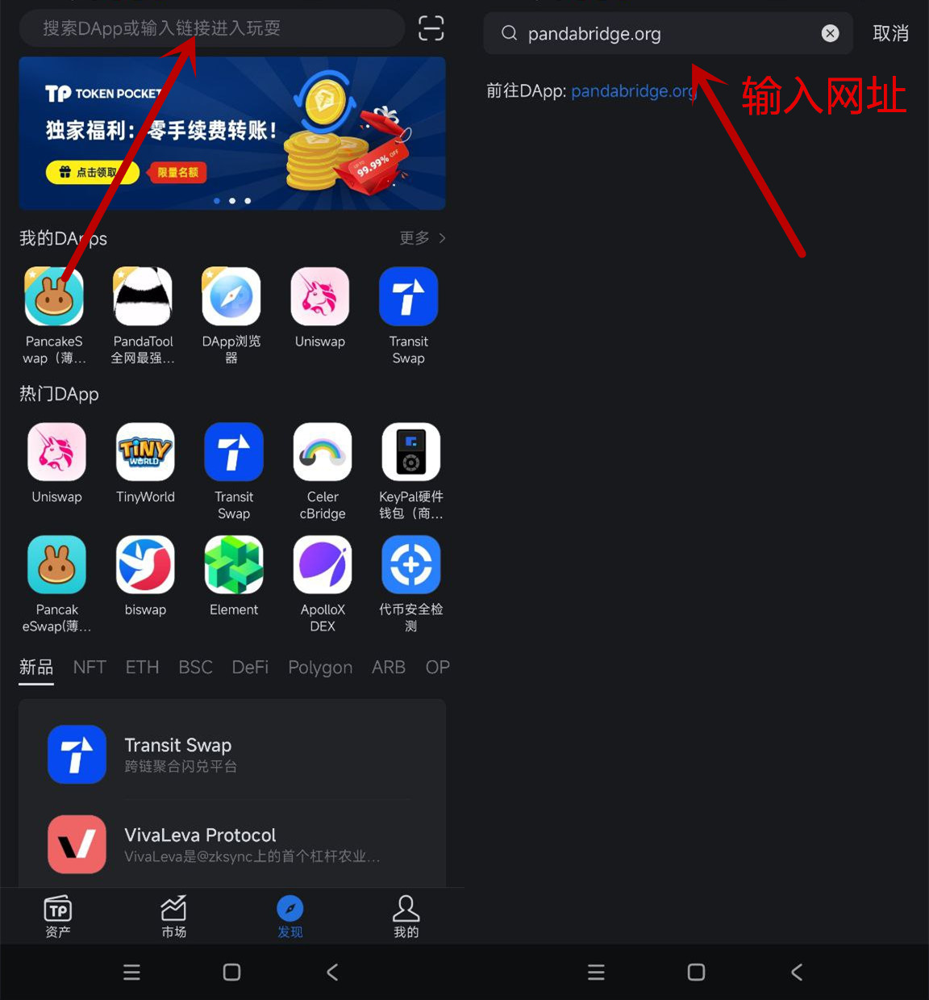
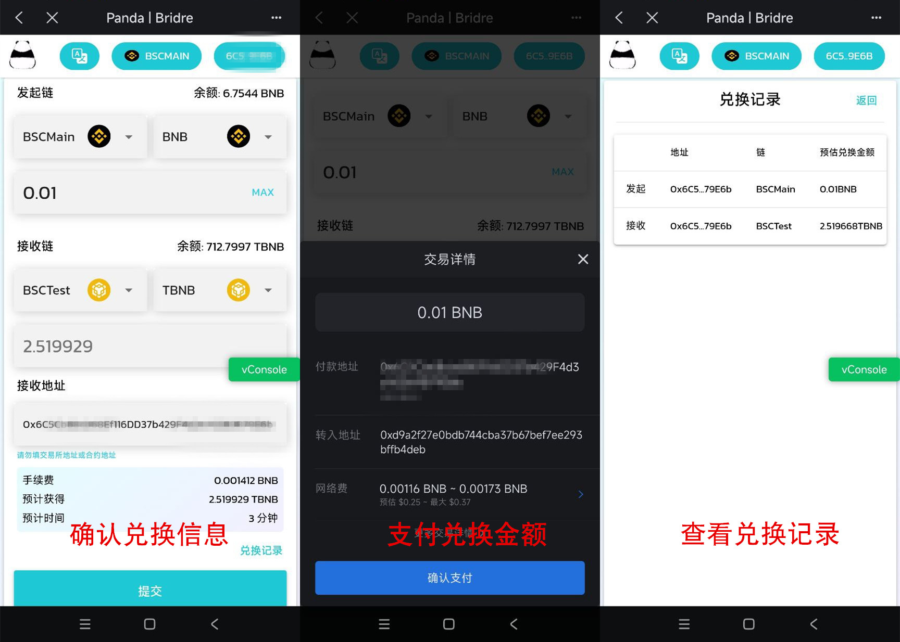

# 使用教程

### 一、电脑使用教程

兑换不同链的代币需要手动切换到 MetaMask 里不同的链，MetaMask 里默认只有ETH 链，如需关联其他链则需自行填写链的信息进行添加。

#### 1、钱包连接

在Metamask配置并切换链之后，进入官网[https://pandabridge.org/#/](https://pandabridge.org/#/)右上角链接钱包。如果链接成功，将能看到你的钱包地址，以及所属的链

<figure><figcaption>
连接钱包前
</figcaption></figure>

<figure><figcaption>
连接钱包后
</figcaption></figure>

#### 2、选择代币并输入数量

在`发起链`那里，选择要支出的代币，并输入数量。同时在接收链那里，选择你要到账的代币以及所属的链。例如，我要用0.01个主网BNB兑换测试网tBNB，那么在`发起链`那里选择BSCMain，并输入0.01，此时`接收链`那里会自动看到你能获得的tBNB数量

<figure><figcaption></figcaption></figure>

同时，默认的`接收地址`是你发起交易的钱包地址，你还可以自定义接收地址。注意，不要填写交易所地址，或者合约地址。

#### 3、提交并等待

当你确认数量无误之后，点击提交。然后通过小狐狸支付，就算完成交易了，之后等待1分钟左右，代币就会到账，你可以通过“兑换记录”查询交易状态。

### 二、手机使用教程

#### 1、进入官网

可以使用TP钱包、BK钱包、麦子钱包、欧易Web3钱包等，该教程以TP钱包为例

首先将TP钱包切换到币安智能链，TP钱包浏览器页面，输入网址[https://pandabridge.org/#/](https://pandabridge.org/#/)跨链页面，并自动连接钱包

<figure><figcaption>
TP钱包进入官网
</figcaption></figure>

#### 2、确认交易细节

输入你要兑换的BNB数量、确定目标链以及目标代币，点击提交，即可在1分钟内完成交易

<figure><figcaption>
TP钱包交易
</figcaption></figure>

### 三、常见问题

#### 1、兑换价格和比例是固定的吗？

不是，价格和比例是根据跨链资金池流动性决定的，当然，我们也会定期注入流动资金，确保价格不会偏差过大。

#### 2、各个链都代表什么意思？

* BSCMain：币安智能链（主网，BNB）
* BSCTest：币安测试链（测试网，tBNB）
* Goerli：以太坊Goerli测试链（Geth）

#### 3、兑换没到账是什么情况？

有时候遇到卡顿，可能会延迟，但是最多3分钟内，跨链就会完成。您可以先通过“兑换记录”查询状态，如果状态显示完成，但是依然没有收到代币，可以进入电报群联系志愿者处理

* 电报客服群：[https://t.me/pandatool](https://t.me/pandatool)

#### 4、跨链桥需要实名认证或者登录吗？

完全不需要，PandaTool Bridge具有很高的匿名性，用户只需链接钱包就能使用，无需登录

#### 5、接收地址可以是其他地址吗？

可以。您兑换的代币，可以选择使用另外一个钱包地址接受，这样也是为了保护用户隐私

#### 6、跨链桥是开源的吗？

当然，我们的智能合约是在链上完全开源的，您可以在各个链的浏览器上查询我们的合约代码，或者通过我们的Github查询

* Github主页：[https://github.com/pandatoolcode/PandaBridge](https://github.com/pandatoolcode/PandaBridge)

### 四、找到我们

如果您有任何问题，可以通过以下方式找到我们：

* Telegram: [https://t.me/pandatool](https://t.me/pandatool)
* Twitter: [https://twitter.com/PandaTool](https://twitter.com/PandaTool)
* Email：contactpandatool@gmail.com

