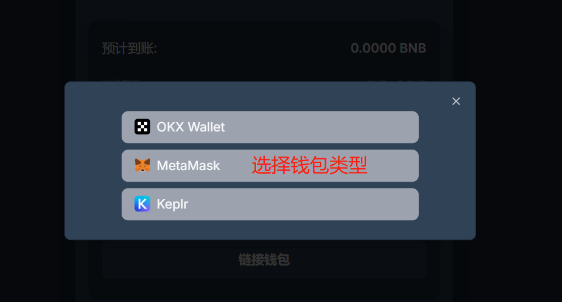
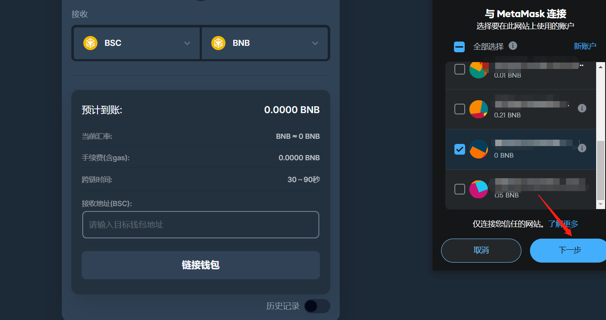
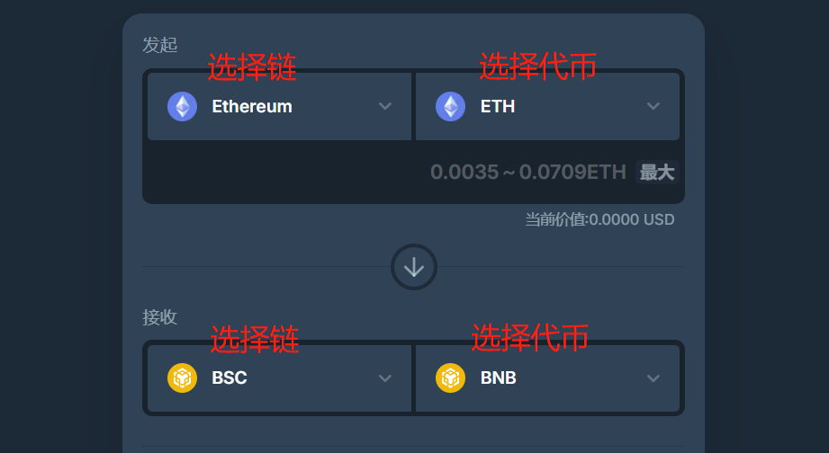
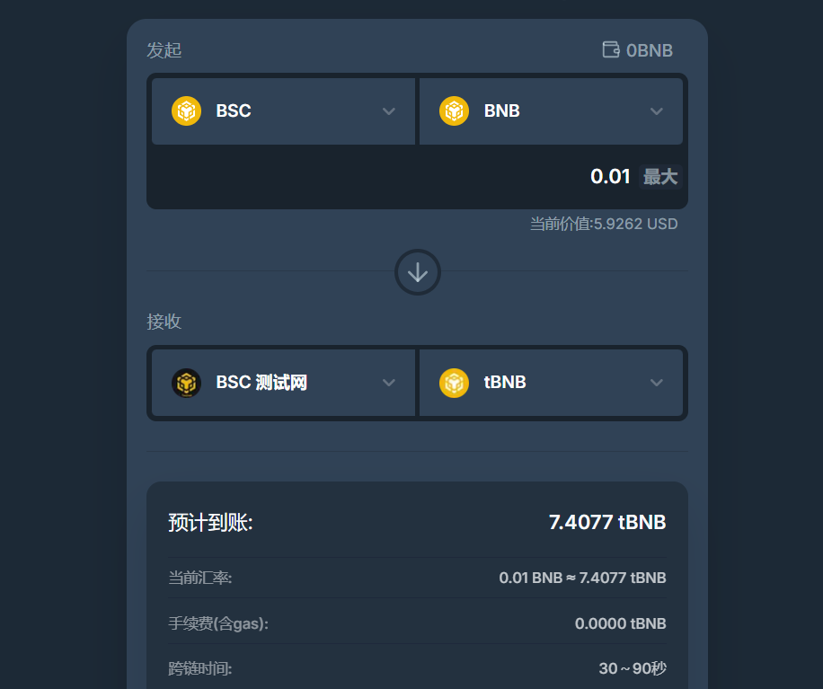
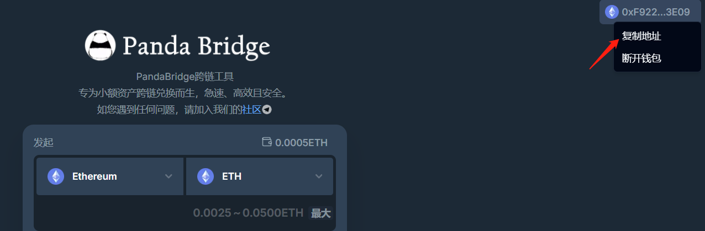
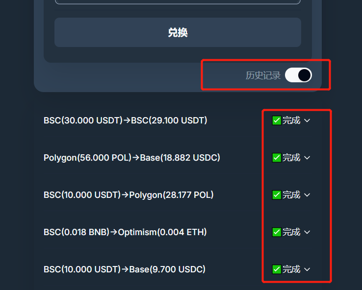
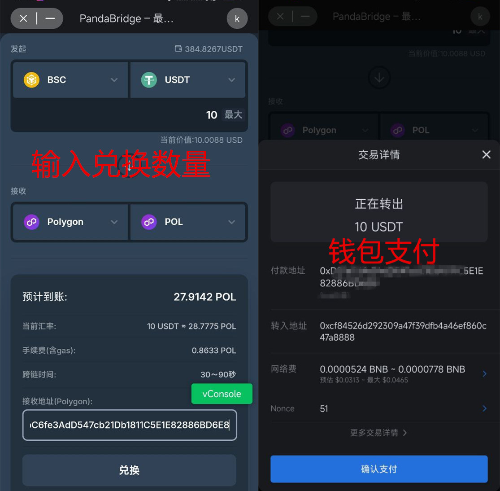
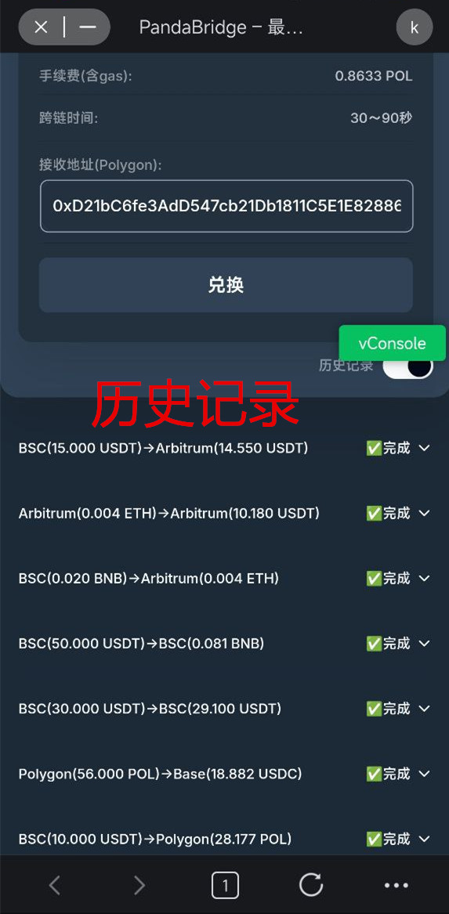

# PandaBridge使用教程

### 一、电脑使用教程

兑换不同链的代币需要手动切换到 MetaMask 里不同的链，MetaMask 里默认只有ETH 链，如需关联其他链则需自行填写链的信息进行添加。

#### 1、链接钱包

首先，我们进入到跨链桥的官网 [https://bridge.pandatool.org/](https://bridge.pandatool.org/)  ，页面往下拉，点击链接钱包，并选择你要连接的钱包类型

<figure><figcaption>
连接钱包
</figcaption></figure>

<figure><figcaption></figcaption></figure>

例如我们选择小狐狸，此时浏览器会自动弹出小狐狸，并提示你进行连接

<figure><figcaption></figcaption></figure>

连接成功后，会在右上角那里看到自己的钱包地址

<figure><figcaption></figcaption></figure>

#### 2、选择链与代币

在`发起链`那里，选择要支出的代币，并输入数量。同时在接收链那里，选择你要到账的代币以及所属的链。

<figure><figcaption></figcaption></figure>

例如，我要用0.01个主网BNB兑换测试网tBNB，那么在`发起链`那里选择BSC，并输入0.01，此时`接收链`那里选择BSC测试网，就能自动看到你能获得的tBNB数量

<figure><figcaption></figcaption></figure>

然后您可以填写接收的其他钱包地址，或者直接复制自己的钱包地址填入也可以

<figure><figcaption></figcaption></figure>

#### 3、兑换并等待

当你确认数量无误之后，点击**兑换**按钮。然后通过小狐狸或者欧易支付，就算完成交易了，之后等待1分钟左右，代币就会到账，你可以通过“历史记录”查询交易状态。

<figure><figcaption></figcaption></figure>

### 二、TP钱包使用教程

#### 1、进入官网

以TP钱包为例，教大家进行跨链兑换。

首先将TP钱包切换到所需的链，如BSC。然后TP钱包浏览器页面，输入网址[https://bridge.pandatool.org/](https://bridge.pandatool.org/)   跨链页面，并自动连接钱包

<figure><figcaption></figcaption></figure>

#### 2、确认交易细节

输入你要兑换的BNB数量、确定目标链以及目标代币，点击兑换，即可在1分钟内完成交易

<figure><figcaption></figcaption></figure>

#### 3、查看交易状态

钱包确认支付后，等待30\~90秒，基本上就可以看到交易状态。我们**刷新页面**后，在历史记录里可以看到这笔订单是否完成

<figure><figcaption></figcaption></figure>

### 三、欧易Web3钱包使用教程

### 四、常见问题

**1、兑换价格和比例是固定的吗？**

* 答：不是，价格和比例是根据Chainlink预言机获取的实时市场行情

**2、兑换没到账是什么情况？**

* 答：如果状态显示完成，但是依然没有收到代币，可以进入电报群联系志愿者处理
* 电报志愿者群：[https://t.me/pandatool](https://t.me/pandatool)

**3、为什么我的订单一直在处理中？**

* 答：订单基本上会在1分钟左右完成确认。如果订单显示在处理中，应该是有缓存，可以刷新页面后再查看订单状态。或者查看相关钱包，加密资产应该也会到账

**4、跨链桥需要实名认证或者登录吗？**

* 答：完全不需要，PandaBridge具有很高的匿名性，用户只需链接钱包就能使用，无需登录

**5、接收地址可以是其他地址吗？**

* 答：可以。您兑换的代币，可以选择使用另外一个钱包地址接受，这样也是为了保护用户隐私

**6、PandaBridge如何保证兑换记录不被追踪？**

* 答：我们的接受地址与发送地址具有一定的隔离效应，在跨链情况下，链上记录最多只能追踪到我们的跨链桥地址，很难继续向下查询

**7、单笔兑换有金额限制吗？**

* 答：是的，PandaBirdge专注于小额加密资产兑换，单笔兑换金额在10\~200U之间

### 五、找到我们

如果您有任何问题，可以通过以下方式找到我们：

* Telegram: [https://t.me/pandatool](https://t.me/pandatool)
* Twitter: [https://twitter.com/PandaTool](https://twitter.com/PandaTool)
* Email：contactpandatool@gmail.com
