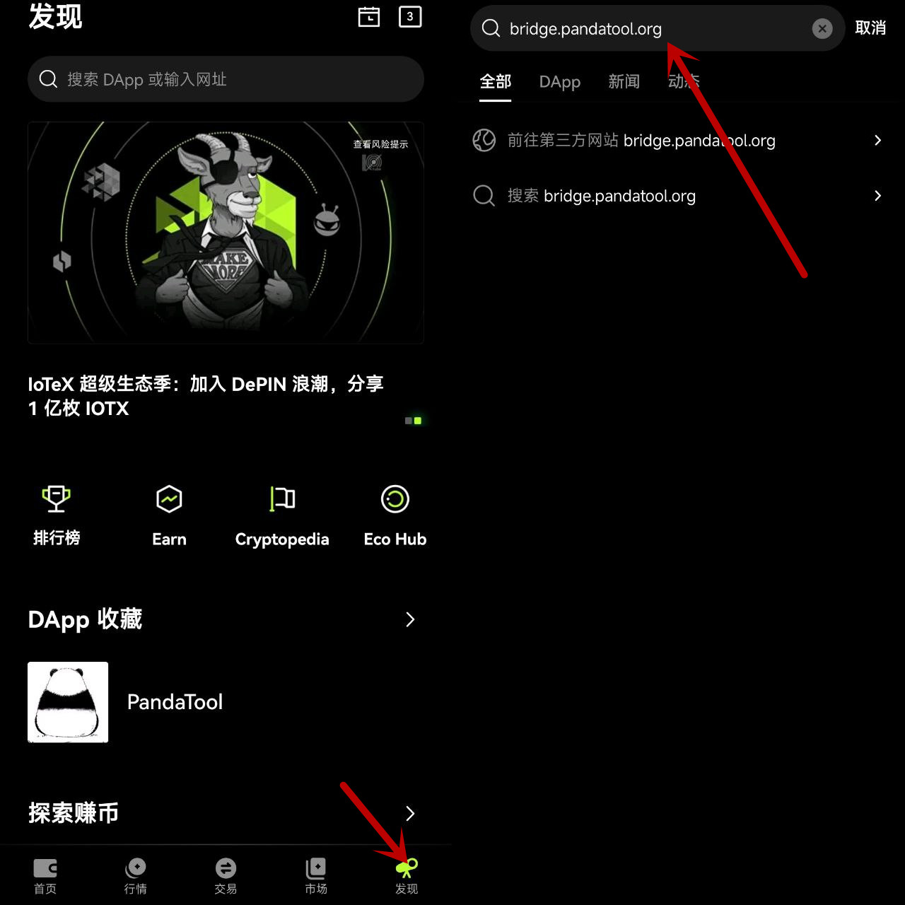
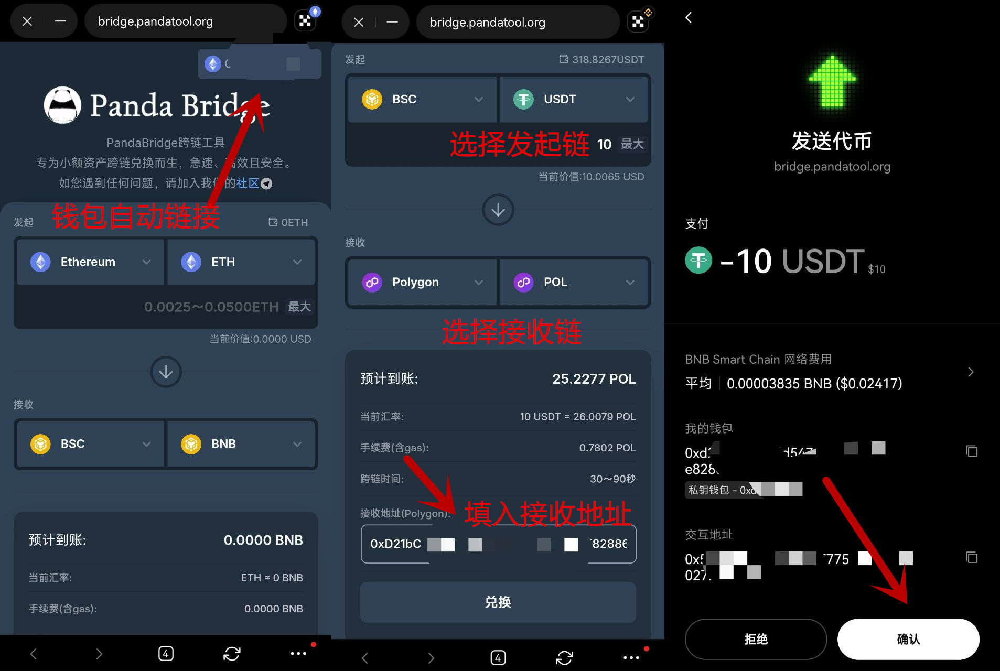
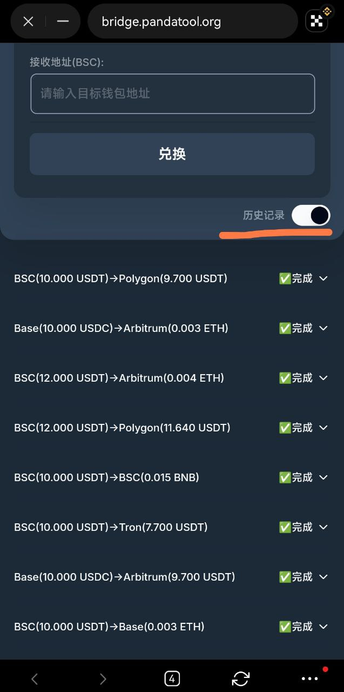

# 欧易Web3钱包PandaBridge跨链教程

&#x20;欧易 Web3 钱包是一款非托管、去中心化的多链钱包，在加密圈广受欢迎。其用户体验、知名度、丝滑度均处于领先地位。这篇教程，主要是教大家如何通过手机端的OKX Web3钱包进行跨链兑换。

当然，如果您想通过其他钱包设备操作PandaBridge，也可以参考以下教程

* 电脑端跨链教程：
* TP钱包跨链教程：

### 一、欧易Web3钱包跨链教程

#### 1、进入PandaBridge官网

跨链第一步，先进入PandaBrdige跨链工具官网。目前我们可以有两种方式进入，第一种是直接在欧易的【发现】板块，在DAPP浏览器搜索框输入跨链桥官网：[https://bridge.pandatool.org/](https://bridge.pandatool.org/)

<figure><figcaption></figcaption></figure>

#### 2、确认兑换数量与细节

进入官网之后，我们可以随意将钱包切换至不同的链。然后选择要跨链的代币、并输入数量，同时选择接受链的代币种类。

<figure><figcaption></figcaption></figure>

填入接收代币的钱包地址，确认无误后点击兑换按钮，钱包发起交易，确认即可

**3、查看交易状态**

钱包确认支付后，等待30\~90秒，基本上就可以看到交易状态。我们**刷新页面**后，在历史记录里可以看到这笔订单是否完成

<figure><figcaption></figcaption></figure>

### 二、常见问题

**1、兑换价格和比例是固定的吗？**

* 答：不是，价格和比例是根据Chainlink预言机获取的实时市场行情

**2、兑换没到账是什么情况？**

* 答：如果状态显示完成，但是依然没有收到代币，可以进入电报群联系志愿者处理
* 电报志愿者群：[https://t.me/pandatool](https://t.me/pandatool)

**3、为什么我的订单一直在处理中？**

* 答：订单基本上会在1分钟左右完成确认。如果订单显示在处理中，应该是有缓存，可以刷新页面后再查看订单状态。或者查看相关钱包，加密资产应该也会到账

**4、跨链桥需要实名认证或者登录吗？**

* 答：完全不需要，PandaBridge具有很高的匿名性，用户只需链接钱包就能使用，无需登录

**5、接收地址可以是其他地址吗？**

* 答：可以。您兑换的代币，可以选择使用另外一个钱包地址接受，这样也是为了保护用户隐私

**6、PandaBridge如何保证兑换记录不被追踪？**

* 答：我们的接受地址与发送地址具有一定的隔离效应，在跨链情况下，链上记录最多只能追踪到我们的跨链桥地址，很难继续向下查询

**7、单笔兑换有金额限制吗？**

* 答：是的，PandaBirdge专注于小额加密资产兑换，单笔兑换金额在10\~200U之间

**8、PandaBridge会拿用户的钱包授权吗？**

* 答：绝对不会，PandaBridge采用的是转账方式，不会获取任何授权

**9、为什么我看不到以前的历史兑换记录了？**

* 答：历史记录默认会显示最近的30笔兑换记录，比较久的就不显示了

如何您还有其他问题，或者操作上有不清楚、不明白的地方，可以加入我们的飞机群，群里的志愿者会给你解答的： [https://t.me/pandatool](https://t.me/pandatool)
