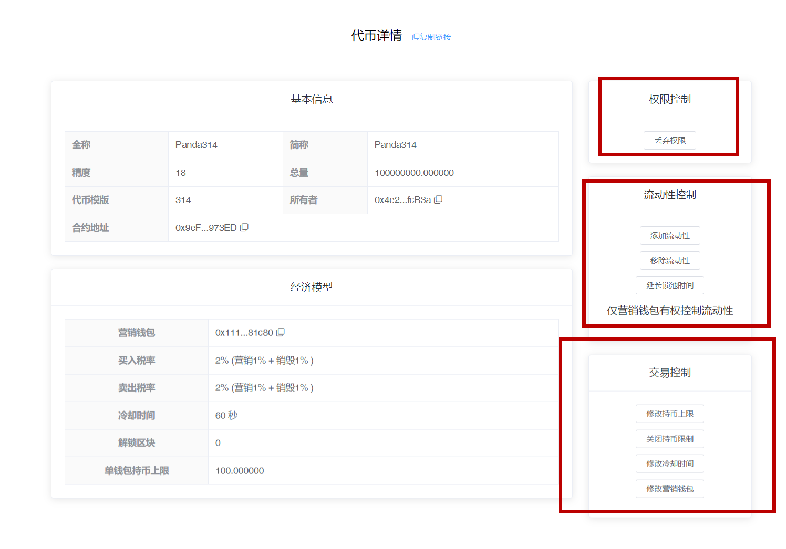
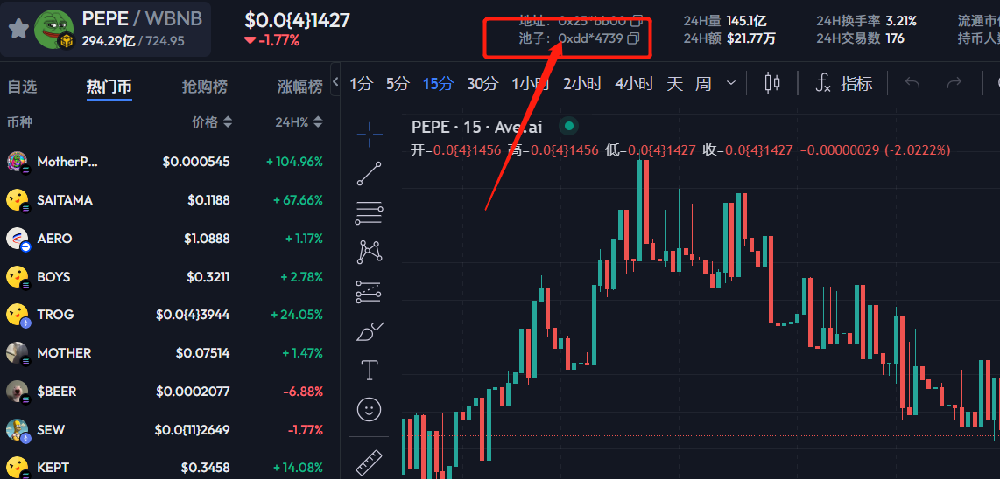
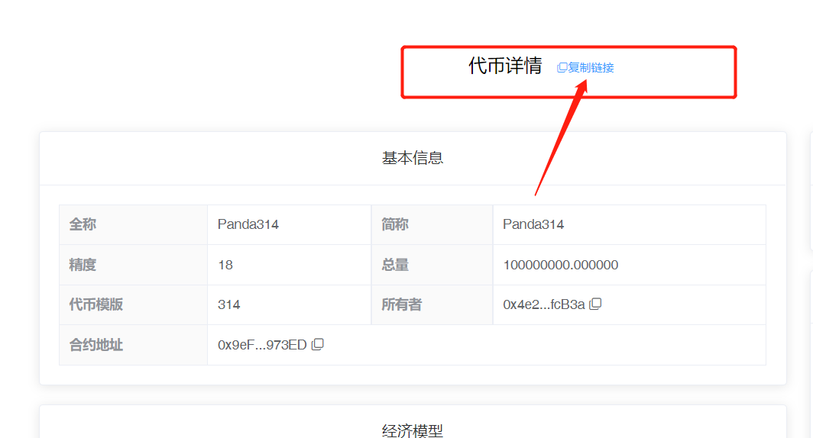

# 314协议发币教程

**注1：**请提前下载好小狐狸钱包插件或欧易Web3钱包插件，小狐狸MetaMask安装教程：[https://help.pandatool.org/practical-information/metamask](https://help.pandatool.org/practical-information/metamask)

**注2：**支持批量转账、支持加Pancake V2资金池（但不建议，限制很多）、不支持持币分红等


314协议发币视频教程


### 1、功能解释

314协议是一种新的实验性代币标准，该协议旨在降低用户交易时高昂的交易费用与繁琐的授权流程。和传统的Swap不同，314协议实现了“转账即交易”的新型功效。

* **买币：**用户将BNB转入合约地址，即可获得代币
* **卖币：**用户将代币转入合约地址，即可获得BNB
* **交易冷却：**在设定的时间范围内，`整个市场`只能有一笔买单，`每个地址`只能有一笔卖单
* **锁池：**在设定的区块范围内，项目方无法撤池子

**特别提醒！！！特别提醒！！！特别提醒！！！特别提醒！！！**

* 314协议刚刚推出不久，并没有经过长时间的市场考验与技术验证。尽管我们已经尽可能的优化了代码中存在的逻辑漏洞，但仍可能存在一些未知的问题，建议大家谨慎操作
* 权限用处很大，不要随便乱丢权限，确认没问题后再丢

### 2、连接钱包（老手忽略该操作） 

首先，在小狐狸钱包里选择自己要发行代币的链，并切换到所在链。例如我要在币安链发行代币，就切换到币安链上，如下图所示

<figure><figcaption></figcaption></figure>

如果要在Base发币，就切换到Base链。要在以太坊发币，就切换到ETH链，这里就不演示了。

链切换好之后，打开发币页面：[https://pandatool.org/#/coinrelease/LPReflection](https://pandatool.org/#/coinrelease/LPReflection)点击右上角连接钱包

<figure><figcaption></figcaption></figure>

之后会弹出小狐狸让你确认要连接的钱包地址。点击下一步并确认之后，就会连接成功了。在发币页面的右上角，会看到你的`链名称`和`钱包地址`，这就算完成了

<figure><figcaption></figcaption></figure>

### 3、参数说明 

成功连接钱包后，我们在发币页面填写相应的参数[https://pandatool.org/#/coinrelease/314](https://pandatool.org/#/coinrelease/314)：

<figure><figcaption>
314协议参数填写
</figcaption></figure>

* [x] **代币全称** : 代币的名称信息，如Panda314
* [x] **代币符号** : 也就是代币简称，如314。通常就是`看K软件` `薄饼` `钱包`中显示的那个名称
* [x] **发行量** : 代币发行的总供应量,无法增发,固定发行
* [x] **精度** : 代表币的小数位数，如：0.000001代表精度为6，默认是18，无法更改
* [x] **314设置**
  * **流动性占比：**发行的代币总量里，有多少用来加池子做流动性，该部分代币会自动转入合约地址
  * **冷却时间：**交易冷却时间，最少1秒、最多60秒。买单方面，冷却时间内**全网**只允许有**1笔**买单。一个人买了，其他人不能再买。卖单方面，每个地址在冷却时间内只能**卖出1笔**。
* [x] **买入税率** (不需要的部分填0）
  * **营销税率** : 用户交易时支出的`BNB`会直接扣除一部分发送到你的营销钱包地址
  * **销毁税率** : 每笔买入都会扣除对应比例代币送进`黑洞地址`,达到销毁的目的
  * **注意：**如果在薄饼PancakeSwap加池子交易，是没有税率的，相当于标准币
* [x] **卖出税率** (不需要的部分不能填空，必须填0）
  * 这部分跟买入税率解释一样
* [x] **营销钱包**
  * 仅营销钱包有权添加流动性、撤出流动性、延长锁池时间，建议用**当前发币钱包**作为营销钱包
* [x] **最大持币量**
  * 每个钱包最多应该持有多少代币，该设置一旦关闭就无法打开。
  * 如果使用了这个功能，批量转账之前，请把**转账合约**加入到白名单
  * 如果使用了这个功能，PancakeSwap加池子不要超过这个数量

### 4、控制台说明 

当我们成功发行代币后，可进入控制台，对代币的各项功能进行管理。我们连接钱包之后，打开[https://pandatool.org/#/coinrelease/console](https://pandatool.org/#/coinrelease/console)，修改下列功能：

<figure><figcaption></figcaption></figure>

* [x] **权限控制**
  * **丢弃权限 :** 将`交易控制`权限丢至黑洞，永远不能拿回。（如果营销钱包与权限钱包为同一个，在丢弃权限后，依然可以加池子/撤池子，功能不收影响）
* [x] **流动性控制（仅营销钱包可操作）**
  * **添加流动性：**将BNB添加到合约里，与合约里面的代币组成交易对
  * **注意：**加池子/添加流动性只能加一次，后期不支持添加流动性
  * **解锁区块：**确定池子解锁的区块高度。BSC链大概1个区块3秒左右，如果你打算锁48小时，大概就是48x60=2880秒，换算成区块就是2880÷3=960个区块。用当下的区块数+960=你应该填入的区块数
  * **代币价格：**用初始加池的BNB数量÷流动池内的代币数量，就能得到初始上线价格

<figure><figcaption></figcaption></figure>

* **移除流动性 :** 在不锁池或者过了锁池时间的情况下，将合约里面的BNB移除
* **延长锁池时间：**在解锁时间到来之前，仍然可以延长锁池的时间BSC链大概1个区块3秒左右，如果你打算延长48小时，大概就是48x60=2880秒，换算成区块就是2880÷3=960个区块。用当下的区块数+960=你应该填入的区块数

<!---->

* [x] **交易控制**

<figure><figcaption></figcaption></figure>

* **修改持币上限：**调高或者降低每个地址持币的限制
* **关闭持币限制 :**  每个地址的持币数量为无限大
* **设置持币白名单：**设置的地址将不受持币限制
* **修改冷却时间：**在1秒\~60秒之间内修改，不得高于60秒
* **设置冷却白名单：**白名单地址将不受冷却时间限制
* **修改营销钱包：**为了方便操作，建议将营销钱包改为发币钱包

### 5、关于薄饼Pancake交易 

首先我们不推荐大家去薄饼做池子交易，因为有很多限制，而且也没有税率，会导致转账那边交易受到影响。同时，一个币就会形成两个池子（薄饼一个，转账一个）、两个价格，可能会被人搬砖套利，请注意风险。

但你如果一定要去Pancake上交易做池子，请严格阅读以下说明

* [x] **薄饼交易与转账交易有什么区别？**
  * 通过薄饼交易，该代币就变成了标准币，没有税率和滑点
  * 通过薄饼交易，仍然有冷却时间限制。且薄饼交易后，转账那边也不能交易了，必须过了冷却时间才可以。同理，转账那边交易了，薄饼这边就不能交易了
  * 通过薄饼交易，Ave会显示价格K线图，但仅仅是薄饼的价格K线，不是转账的
* [x] **薄饼加池子怎么失败？**
  * 不要加V3的池子，只能加Pancake V2的池子
  * 如果开启了持币限制，那么加池子的数量必须要低于这个限制才可以。假设你的设置的最大持仓是10000枚，那么加池子的时候也不能多于10000。
  * 怎么解决这个问题？在加了池子后，将`池子地址`/lp地址加入到持币白名单才可以
  * 怎么找到池子地址？在`电脑`上打开`Ave`，搜索代币合约，他会给出你的池子地址，如图

<figure><figcaption></figcaption></figure>

* [x] **为什么薄饼交易失败？**
  * 假设你没有给池子地址加持币白名单，在卖出的时候，你卖出的代币数量+池子原有的代币数量超出持币限制，就会失败
  * 如果你设置了冷却时间，在这个时间内有人通过转账交易，那么池子这边是没有办法交易了。
  * 最好的解决办法，就是同时给池子地址和路由地址，分别加上：冷却白名单和持币白名单
  * 池子地址：这个上面给大家演示了，去电脑版本的AVE就能找到
  * Pancake V2路由地址：0x10ED43C718714eb63d5aA57B78B54704E256024E
  * Pancake V2测试网路由地址：0xB6BA90af76D139AB3170c7df0139636dB6120F7e

### 6、其他注意事项 

* [x] **为什么批量转账失败？**
  * 批量转账之前，必须将批量转账的**合约地址**（转账合约）加入到**`交易冷却白名单`**和**`持币白名单`**（如果有持币限制的话），才能够实现批量转账
  * 币安BSC批量转账合约地址：0x07A9a91ff664dD0d02C8675fbfD8AECe29792389
  * BSC测试链批量转账合约地址：0x5Bf632738adc5Ffc20DA85a471ff6a60310C0c0E
* [x] **营销钱包怎么进入控制台？**
  * 假设你的权限地址和营销钱包不是一个地址，要进入控制台的话，需要先复制控制台的网址，然后使用营销钱包打开控制台网址，就可以进入了

<figure><figcaption>
复制控制台地址
</figcaption></figure>

* [x] **权限丢弃后，营销钱包功能还在吗？**
  * 假设营销钱包和权限钱包是同一个，在你丢弃了权限之后，并不影响营销钱包功能的使用，同样可以加池子、撤池子、控制流动性
* [x] **怎么计算初始代币价格？**
  * 在发币的时候需要预留流动性占比，假设你发行量为2亿，流动性占比为50%，那就有1亿的代币默认进入合约地址。然后添加流动性时加入10个BNB，那么你的初始价格就是：10÷100000000=0.0000001BNB。假设BNB价格为535U，那你的代币初始价格就是：0.0000001x535=0.0000535U
* [x] **314协议可以用USDT或者wBNB交易或配对吗？**
  * 不支持，314协议交易只能通过BNB进行
* [x] **怎么计算解锁区块/锁池时间？**
  * 解锁区块怎么填？需要先进行`锁池时间`与`区块高度`的换算。BSC链一个区块3秒左右，假设当前区块数为100，你想锁池1年，也就是1x365x24x60=525600秒。换算成区块数就是：525600÷3=175200个区块。然后现在的区块高度是100+175200=175300区块。在解锁区块那里填入这个数量，就意味着锁池一年了

如有不明白或者不清楚的地方，请加入官方电报群：[@PandaTool](https://t.me/PandaTool)
