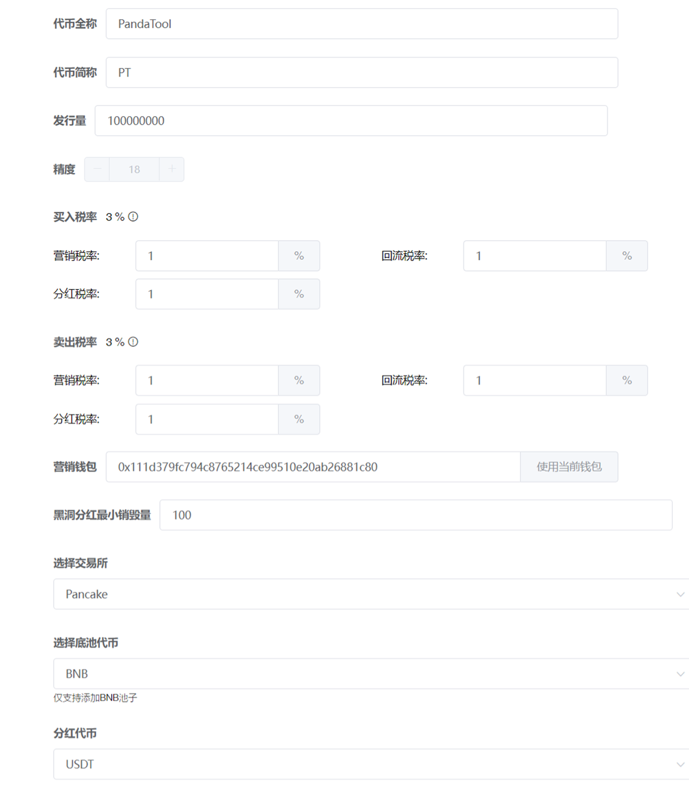
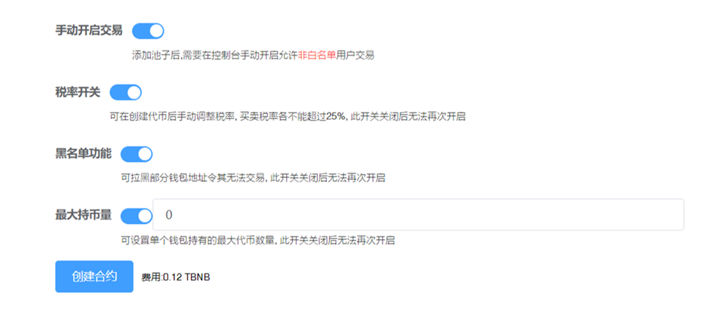
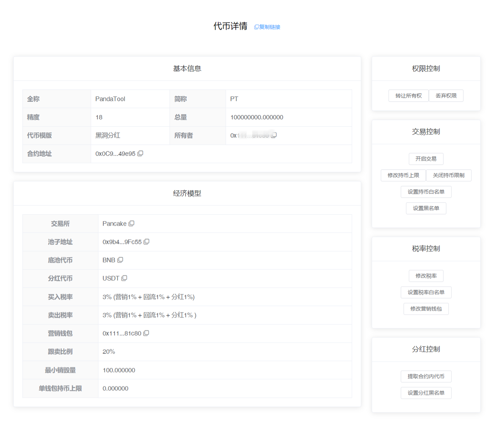

# 黑洞分红教程

注1：请提前下载好小狐狸钱包插件或欧易Web3钱包插件，小狐狸MetaMask安装教程：[https://help.pandatool.org/practical-information/metamask](https://help.pandatool.org/practical-information/metamask)

注2：黑洞分红代币可能存在被机器人/夹子恶意套利的风险，如不能接受，可发行标准币

### 1、功能解释 

黑洞分红指的是，用户将持有的代币转入黑洞地址后，才能获得分红资格。具体分红哪种代币，可以在创建合约的时候填写，主流币合约地址参照：[主流币合约地址](https://help.pandatool.org/practical-information/smart-contract)

**黑洞地址：**0x000000000000000000000000000000000000dEaD

### 2、连接钱包（老手忽略该操作） 

首先，在小狐狸钱包里选择自己要发行代币的链，并切换到所在链。例如我要在币安链发行代币，就切换到币安链上，如下图所示

如果要在Base发币，就切换到Base链。要在以太坊发币，就切换到ETH链，这里就不演示了。

链切换好之后，打开发币页面：[http://pandatool.org/#/coinrelease/blackHole](http://pandatool.org/#/coinrelease/blackHole)  点击右上角连接钱包，弹出小狐狸确认就可以了

### 3、参数说明 

成功连接钱包后，我们在发币页面填写相应的参数[http://pandatool.org/#/coinrelease/blackHole](http://pandatool.org/#/coinrelease/blackHole)：

<figure><figcaption></figcaption></figure>

* [x] **代币全称** : 代币的名称信息，如PandaTool
* [x] **代币符号** : 也就是代币简称，如PT。通常就是`看K软件` `薄饼` `钱包`中显示的那个名称
* [x] **发行量 :** 代币发行的总供应量,无法增发,固定发行。如果总量过多的话,需要降低精度
* [x] **精度** : 代表币的小数位数如：0.000001代表精度为6。这里只能填18
* [x] **分红代币** : 自行选择要分红的代币，将该代币合约地址填入即可。注意，选择的分红代币必须在有足够的流动性，可以正常买卖的。如果该代币流动性过低，很可能无法分红。因此，一般建议选择流动性好的主流币。
* [x] **买入税率** (不需要的填0/营销税除外，总比例必须小于25%)
  * **营销税率** : 每笔买入都会扣除对应比例代币送进`合约地址`,在**触发阈值**时会自动**卖出**换成`wBNB`发送到你的营销钱包地址
  * **分红税率** : 每笔买入都会扣除对应比例代币送进`合约地址`,在**触发阈值**时会自动**卖出**成`USDT`(取决于你的分红代币)发放给符合资格的用户
  * **回流税率** : 每笔买入都会扣除对应比例代币送进`合约地址`,在**触发阈值**时会自动添加流动性,使池子更厚，加池子获得的LP默认给到营销钱包
* [x] **卖出税率** (不需要的部分不能填空，必须填0，营销税除外，总比例必须小于25%)
  * 这部分跟买入税率解释一样
* [x] **营销钱包**
  * 用来接收营销税率的钱包，营销税默认是wBNB
* [x] **黑洞分红最小销毁量**
  * 即销毁阈值，指的是**销毁**多少代币才能获得分红资格(第一次转入黑洞的地址必须大于这个数值，否则不能获得分红）
  * 合约创建完成后，该数值**不可修改！不可修改！不可修改！**
* [x] **选择交易所**
  * 不同的链会有不同的交易平台（如ETH链有uniswap,BSC链有pancakeSwap 等）。选择什么交易所，就去那里添加流动性。搞错了会导致机制无法执行，请注意
* [x] **选择底池代币**&#x20;
  * 只支持BNB池子

### 4、开关说明 

下面是对代币功能开关的说明与解释：

<figure><figcaption></figcaption></figure>

* [x] **手动开启交易**
  * **选它** : 需要在控制台打开交易开关,才能够交易,并且打开后**无法重新关闭**
  * **不选** : 加池子后立即可以交易
* [x] **税率开关**
  * **选它** : 创建代币后手动调整税率, 买卖税率必须低于25%
  * **不选** : 创建代币后无法再修改滑点，后期也不能再开启该功能
* [x] **黑名单功能**
  * **选它** : 能够`添加`和`解除`黑名单。被拉入黑名单的地址将无法卖出代币，也不能转账，该功能慎用
  * **不选** : 无法设置和解除黑名单
* [x] **最大持币量**
  * **选它** : 可设置单个钱包最大的持有代币数量
  * **不选** : 无法使用该功能，且后期也不能再开启该功能

### 5、控制台使用说明 

当我们成功发行代币后，可进入控制台，对代币的各项功能进行管理。我们打开[https://pandatool.org/#/coinrelease/console](https://pandatool.org/#/coinrelease/console)修改下列功能：

<figure><figcaption></figcaption></figure>

* [x] **权限控制**
  * **转让所有权** : 将合约权限转让给其他人（转移权限之前，记得复制控制台链接。新的权限地址必须通过控制台链接，才能进入控制台操作）
  * **丢弃权限** : 将合约权限丢至黑洞，永远不能拿回
* [x] **交易控制**
  * **开启交易** : 打开后，用户才能交易，开启后不能关闭
  * **修改持币上限：**提高或降低持币数量限制
  * **关闭持币限制：**放弃使用该功能
  * **设置持币白名单：**设置后，该白名单地址没有持币限制，白名单也可以移除
  * **设置黑名单：**可以批量添加或者移除黑名单
* [x] **税率控制**
  * **修改税率**：可分别修改回流、营销、分红税率，相加必须小于25%
  * **设置税率白名单：**白名单交易没有税率，且可以提前买入，可批量添加或移除
  * **修改营销钱包：**更改合约的营销钱包地址
* [x] **分红控制**
  * **提取合约分红代币** : 将合约地址内遗留的未分发的分红代币提出
  * **设置分红黑名单** : 设置后该地址将无法获得黑洞分红，且该功能不支持移除。一旦拉黑，就是永久性拉黑

### 6、疑问解答 

* [x] **两个黑洞地址都支持分红吗？**
  * 不是的，目前只支持1个黑洞地址，即：0x000000000000000000000000000000000000dE，另一个黑洞地址是不支持的，不要往里面转币
* [x] **为什么交易了很多笔还是没有分红？**
  * 不要使用白名单地址交易，如发币地址、营销钱包地址交易都是没有用的
  * 不要只买，必须有卖单，才能分红。没有卖单，分红发不出去的
  * 请确保具有分红资格，例如转入黑洞的代币要大于设置的阈值
* [x] **转入黑洞后地址需要激活吗？**
  * 不需要，将代币转入黑洞之后，等着就行
* [x] **为什么营销钱包没有收到BNB？**
  * 因为营销钱包分的是wBNB，wBNB与BNB是1:1兑换的
* [x] **转入黑洞的分红阈值还能修改吗？**
  * 注意，该数值不支持修改，有权限也不行，所以创建合约的时候一定要控制好
* [x] **转入黑洞的币有来源限制或者时间限制？**
  * 没有，不管是别人转给你的币还是自己买来的币，都支持转入黑洞获得分红。此外，不管是开启交易后转入，还是开启交易前转入，都没有限制
* [x] **合约地址能够获得分红吗？**
  * 为了防止科学家通过合约操盘，黑洞分红不支持任何合约地址分，包括本币合约与其他夹子合约
* [x] **权限转移后，新地址怎么进入控制台？**
  * 转移权限之前，需要先复制控制台链接（在控制台上方能看到`复制链接`的按钮）。当权限转移后，新的权限地址使用控制台链接，就可以进入控制台操作

<figure><figcaption>
复制控制台链接
</figcaption></figure>

*   **测试网的问题**

    如果您选择在BSC测试网发币，请进入以下测试swap，并按照PandaTool要求的测试币做池子。具体参数如下：

    * 测试网薄饼：[https://pancakeswap.finance/swap?chain=bscTestnet](https://pancakeswap.finance/swap?chain=bscTestnet)
    * 测试网USDT：0x66e972502a34a625828c544a1914e8d8cc2a9de5

如有不明白或者不清楚的地方，请加入官方电报群：[@PandaTool](https://t.me/PandaTool)

