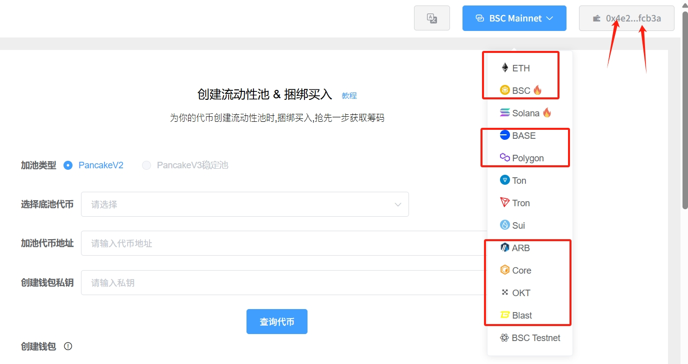
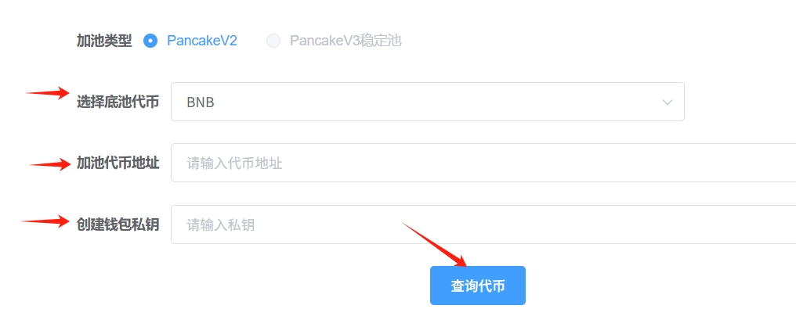
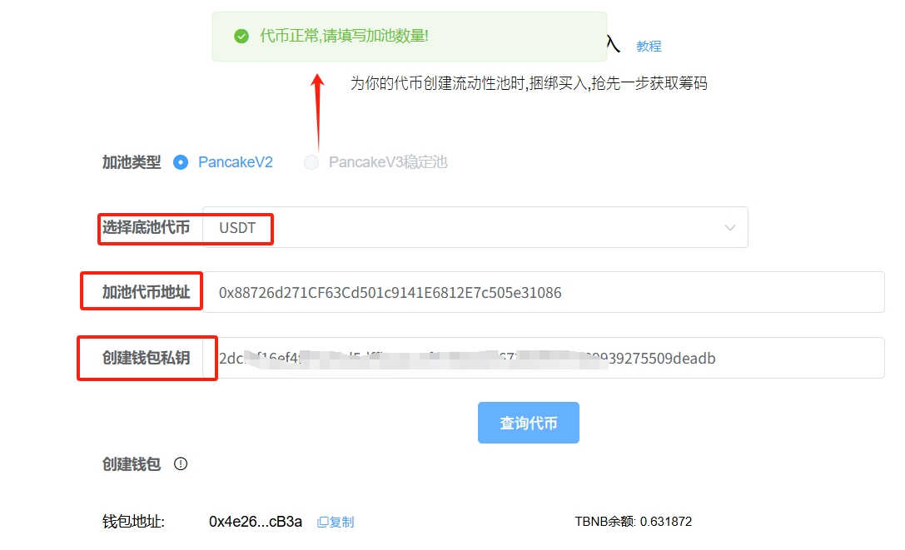
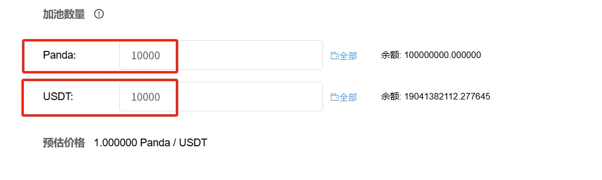
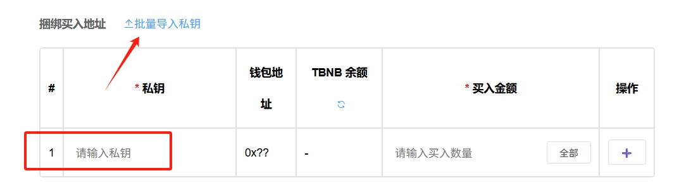
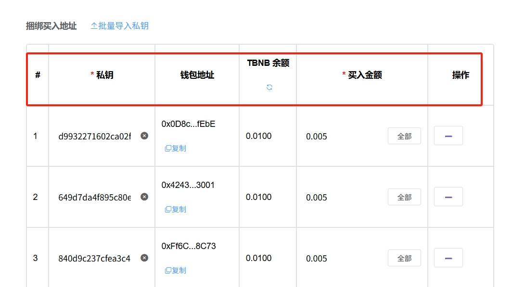
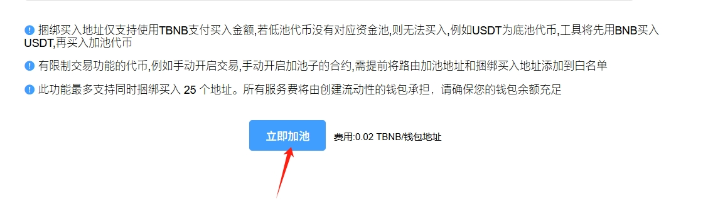
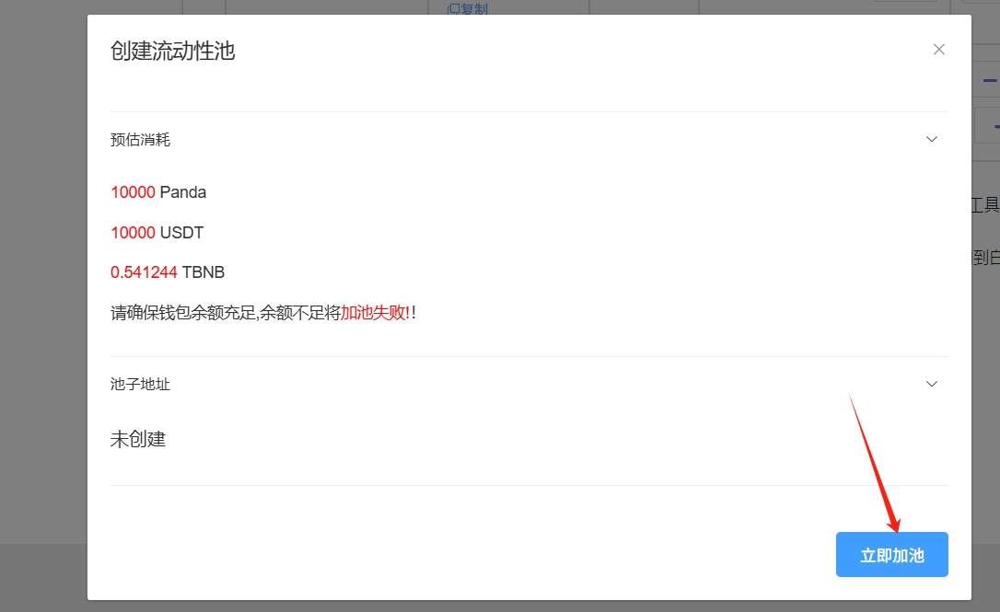
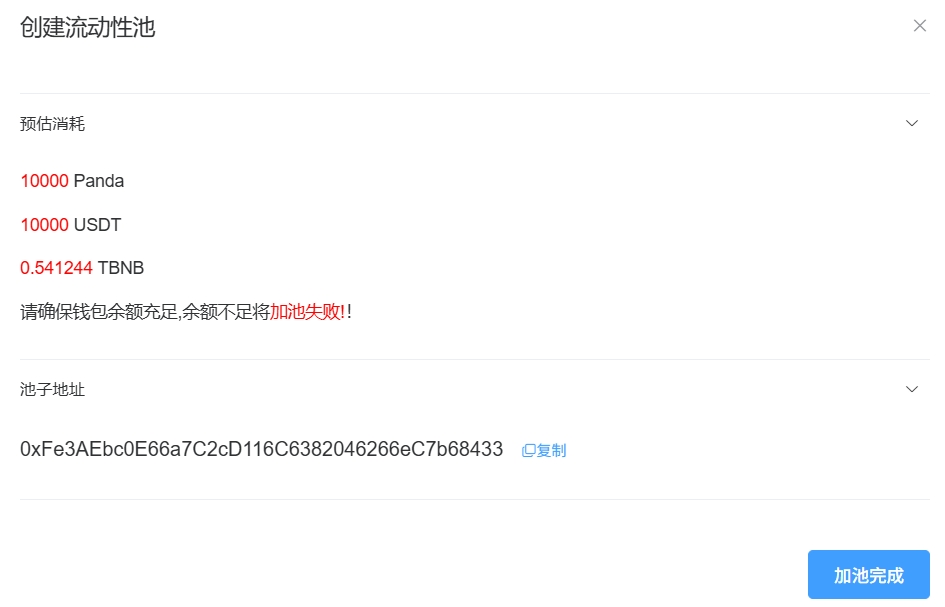

# 加池开盘并捆绑买入教程

## **视频教程**



## **一、加池捆绑买入概念解读**

### **1、加池捆绑买入是什么意思？**

项目开盘，第一次为代币创建资金池的时候，可以捆绑多个地址立即买入代币，以最低的价格获得代币筹码。买入与加池这两个动作是捆绑在一起同步进行的，所以称之为捆绑买入。

### **2、为什么需要捆绑买入？**

* **低价获得代币：**&#x9879;目方可以用最低的价格获得代币，该方式比手动买入更加快、成功率更高
* **实现公平发射：**&#x76F8;对于预留代币来说，通过买入获得代币，可以更加公平、用户更加信任
* **收割机器人：**&#x7531;于是在加池的一瞬间买入代币，所以会比机器人更快、价格比机器人更低

<figure><figcaption></figcaption></figure>

## **二、加池捆绑买入注意事项**

### **1、给路由合约加白名单**

如果代币有特殊的功能，如果手动开盘、持仓限制等，请先将PandaTool的路由合约加到白名单里面，才开始创建。

* **PandaRouter路由合约地址：**`0x615Cd625a73B3475eA28F3603337163fDBd7282b`

### **2、给捆绑地址加入白名单**

如果您的代币拥有手动开启交易功能、持仓限制、交易数量限制、杀机器人等功能，请将在加池前给捆绑买入的地址加入白名单，否则地址无法买进

### **3、确保BNB余额足够** 

创建资金池的费用和捆绑买入的手续费用，统一由加池的地址支付。这也就意味着，加池的地址内必须有足够的BNB用来支付费用。

### **4、注意私钥问题** 

捆绑买入需要导入私钥才可以，请注意妥善保管私钥。PandaTool绝对不会获取您的私钥，一切运行全部基于您的电脑网页完成。但电脑有可能中毒、手机粘贴板有可能被读取，所以请**谨慎保管私钥**。

## **三、加池并捆绑买入流程** 

**步骤1：**&#x8FDB;入PandaTool、连接钱包并切换至对应的区块链

**步骤2：**&#x9009;择加池的两种代币

**步骤3：**&#x586B;写加池的代币数量

**步骤4：**&#x5BFC;入捆绑地址

**步骤5：**&#x7ACB;即创建资金池

### **1、连接钱包** 

不管我们是创建代币、创建资金池，还是交易兑换、批量转账，第一步都是要**连接钱包**。连接钱包是所有DAPP必要的操作，希望大家都能养成这个习惯。不连接钱包，什么都做不了。

此时我们进入到PandaTool加池并捆绑买入工具的网页：[https://www.pandatool.org/#/createliquiditybuy?lang=zh-CN](https://www.pandatool.org/#/createliquiditybuy?lang=zh-CN) 然后在右上角点击连接钱包

<figure><figcaption></figcaption></figure>

此时会跳出Metamask或者OKX Web3钱包，点击确认，即可完成连接。钱包连接成功后，会在右上角看到你的钱包地址。

<figure><figcaption></figcaption></figure>

如果你希望在BSC链创建资金池，就将区块链切换到BSC。如果是希望在以太坊上创建资金池，就将区块链切换到ETH即可

#### **2、选择代币** 

连接钱包后，我们需要选择加池类型、代币，以及导入私钥

<figure><figcaption></figcaption></figure>

* **加池类型：**&#x9ED8;认用V2，稳定池加V3
* **底池代币：**&#x4EA4;易对价值代币，如USDT、BNB等
* **代币地址：**&#x60A8;创建的代币合约地址
* **创建钱包私钥：**&#x60A8;要加池的钱包私钥

填写好之后，点&#x51FB;**`查询代币`** ，正常来说会提示你：**代币正常，请填写加池数量**

<figure><figcaption></figcaption></figure>

### **3、填写加池数量** 

确定好两种代币后，接下来就是填写代币数量了（加池数量不能超过自己钱包里的数量）

<figure><figcaption></figcaption></figure>

* **Panda：**&#x6211;创建的代币，填写10000枚，表示将10000个Panda代币放入资金池中
* **USDT：**&#x6211;选择的价值嗲比，填写10000，表示将10000个USDT放入资金池中

**预估价格：**&#x50;anda代币的初始价格是1USDT（用10000除以10000得到价格是1）。如果Panda放1000个，USDT放10000个，那么预估初始价格就是10U，以此类推

### **4、导入捆绑地址私钥** 

为了实现捆绑买入的效果，必须要导入捆绑地址的私钥才可以完成。如果您无法确保自己的私钥不被泄露，请不要使用该功能。

<figure><figcaption></figcaption></figure>

<figure><figcaption></figcaption></figure>

您可以手动导入私钥，也可以批量导入私钥，目前捆绑买入支持最少25个地址。如下图

<figure><figcaption></figcaption></figure>

导入私钥后，您要做的是填写买入金额。每个钱包最低买入0.005BNB的代币，低于这个金额将无法买入。


**最低金额：**&#x6BCF;个捆绑地址，钱包内最少要有**0.01个BNB**（包括0.05 gas+最低0.05买入金额），如果钱包内低于这个金额，将无法创建


### **5、点击立即加池** 

一切准备就绪后，我们点击立即加池

<figure><figcaption></figcaption></figure>

<figure><figcaption></figcaption></figure>

等待几秒钟后，会提示您加池完成

<figure><figcaption></figcaption></figure>

## **四、疑问解答** 

**1、标准代币为什么加池会失败？**

* **答：**&#x8BF7;确保钱包内余额足够。余额不够，可能导致失败。
  * 捆绑钱包，每个钱包不少于0.01BNB
  * 加池钱包，需要有充足的BNB用来支付捆绑费用。每个地址0.02BNB，10个地址就是0.2BNB

**2、功能性代币为什么加池会失败？**

* **答：**&#x6240;谓功能性代币，就是带有各种限制的代币，如手动开启交易、持仓限制等。如果您加池失败，请先检查以下情况
  * 是否将路由地址加入白名单？**PandaRouter路由合约地址：**`0x615Cd625a73B3475eA28F3603337163fDBd7282b`
  * 是否将捆绑买入地址加入白名单？最好全部加上
  * 是否开启手动交易限制？
  * 是否开启持仓限制？

**3、捆绑买入会被当做机器人杀掉吗？**

* **答：**&#x5982;果合约内带有“开盘杀机器人”的功能，那么捆绑买入的地址就会被杀掉，请提前设置白名单

**4、创建BNB交易对的池子，用户可以用USDT买币吗？**

* **答：**&#x5F53;然可以。创建USDT的资金池，用户也能用BNB购买代币，都是相通的。

**5、对于加池数量有要求吗？**

* **答：**&#x6CA1;有要求。可以根据你的代币经济学和价格需求，添加适当比例的代币。一般来说，我们要求池子尽量大于300U或1个BNB。

**6、预估价格会变吗？**

* **答：**&#x9884;估价格只是你的代币初始价格，即上线价格。后续随着不断交易，价格会不断变化。

**7、V2和V3有什么区别？**

* **答：**&#x5E26;功能/机制的币，只能加V2。目前V3的池子只支持标准币（主要做稳定池），大家不要加错了

如果您有任何关于捆绑买入的问题，均可以在Telegram群里咨询我们的志愿者：[https://t.me/pandatool](https://t.me/pandatool)
