# IDO预售DAPP创建教程

本教程主要是帮助用户在PandaTool平台创建IDO预售DAPP，以便为代币在上市之前实现预售或募资，从而达到提前回笼资金的目的。

## 一、IDO概念解读

### **1.什么是IDO？**

**IDO**是“**Initial DEX Offering**”的缩写，指的是在去中心化交易所（DEX）首次发行代币的方式。简单来说，就是代币在上市交易之前，项目方募集资金进行预售的一种方式。

### 2.为什么要创建IDO？

项目方创建代币之后，需要为代币创建流动性加池子，才能交易。但是这个步骤需要资金，资金怎么来呢？就可以先进行公募预售，将一部分代币以较低的价格先卖出去，回笼资金后，再通过这些资金去创建流动性、去营销。

那用户为什么要参与IDO呢？主要就是为了可以低价拿到代币。之后等代币正式上线，再高点抛售，从而获取差价利润。



### 3.IDO和Mint预售有什么不同

IDO与Mint是完全不同的运作方式，主要体现在以下几个方面

* 参与方式：IDO是网站预售，Mint是钱包转账
* 邀请奖励：IDO可以邀请上下级，Mint不支持
* 页面展示：IDO有精美的页面信息，Mint没有
* 钱包授权：用户或投资者需授权参与IDO，Mint不用

总的来说，IDO需要用户登录网站，连接钱包，授权后才能参与。Mint通过直接转账的方式，即可完成。但IDO的页面比较精美、信息介绍丰富，更有利于营销宣传

## 二、如何创建IDO

在创建IDO之前，大家必须先保证自己**已经创建了代币**，有了合约地址，否则无法进行IDO。接下来是创建IDO的教程

### 1、IDO创建步骤

整个IDO的创建过程，分为以下5个步骤

* 第一步：打开PandaTool的IDO创建页面
* 第二步：设置IDO的时间、价格等
* 第三步：钱包确认并创建IDO
* 第四步：进入IDO控制台存入代币
* 第五步：修改IDO信息

### 2、IDO创建详细教程

#### 第一步：打开PandaTool的IDO创建页面

首先，我们需要打开IDO创建的工具页面：[https://www.pandatool.org/zh-CN/ido/create](https://www.pandatool.org/zh-CN/ido/create)    然后点击右上角连接钱包

<figure><figcaption></figcaption></figure>

之后会跳出小狐狸或者OKX钱包插件，连接上就可以。这一步其实没什么好说的，如果大家在PandaTool创建过代币，应该都会搞。

#### 第二步：设置IDO信息

接下来，我们按照要求设置IDO的参数信息。需要填写的内容比较多，我们一个个讲解

**1）基本信息**

<figure>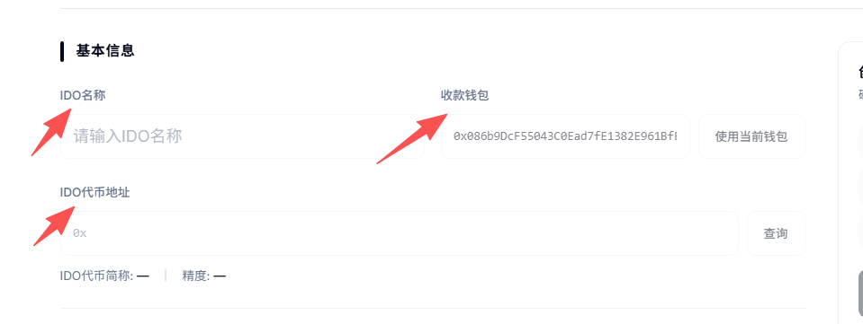<figcaption></figcaption></figure>

* **IDO名称：**&#x968F;便起一个就行，无实际意义。支持中文、英文以及中英融合
* **收款钱包：**&#x7528;户参与预售并支付后，BNB/USDT给到哪个地址
* **IDO代币地址：**&#x521B;建IDO之前，必须**已经创建了代币。**&#x800C;且注意合约地址千万别填错了，不然无法成功创建IDO。填写之后，点击**查询**

**2）交易参数**

<figure>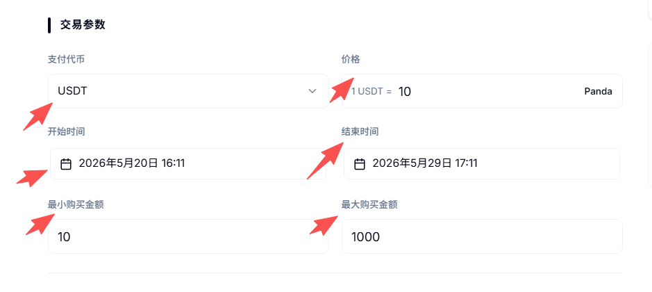<figcaption></figcaption></figure>

* **支付代币：**&#x5C31;是用户参与IDO，用什么代币预售。在BSC链，支持**BNB和USDT**两种
* **价格：**&#x49;DO预售的价格，如1USDT=1Token、1USDT=1000Token
* **开始时间：**&#x49;DO开始的时间，以您的电脑时间为准
* **结束时间：**&#x49;DO结束的时间，以您的电脑时间为准
* **最小购买金额：**&#x7528;户参与IDO，**单次**最少要买多少U/BNB
* **最大购买金融：**&#x7528;户参与IDO，**单次**最多能买多少U/BNB

**3）奖励与发放**

<figure>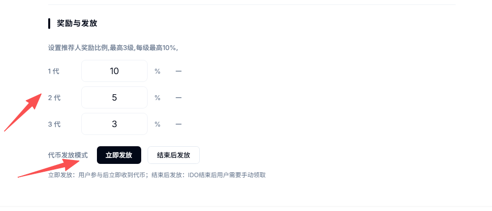<figcaption></figcaption></figure>

* **推荐奖励设置：**&#x49;DO可以邀请下级来，一共可以邀请三代，每一代都可以单独设置推荐比例，最高设置10%的推荐奖励
* 假设A推荐B，B推荐C，C推荐D，一共三级，每一级推荐奖励都是10%。那么D购买100U的话，A、B和C都分别获得10U
* **代币发放模式：**&#x4E00;共有两种，立即发放或结束后发放
* &#x20;          立即发放：指的是用户支付后，代币立即进入它的地址
* &#x20;          结束后发放：指的是整个IDO预售结束后，用户登录IDO网站手动领取


推荐奖励有前提条件：用户的地址必须参与IDO，才能获得邀请资格。如果地址没有参与记录，那么它的邀请链接是失效的，没有用处


#### 第三步：钱包确认并创建IDO

所有信息设置完成后，我们点击创建IDO，然后钱包会跳出进行确认

<figure>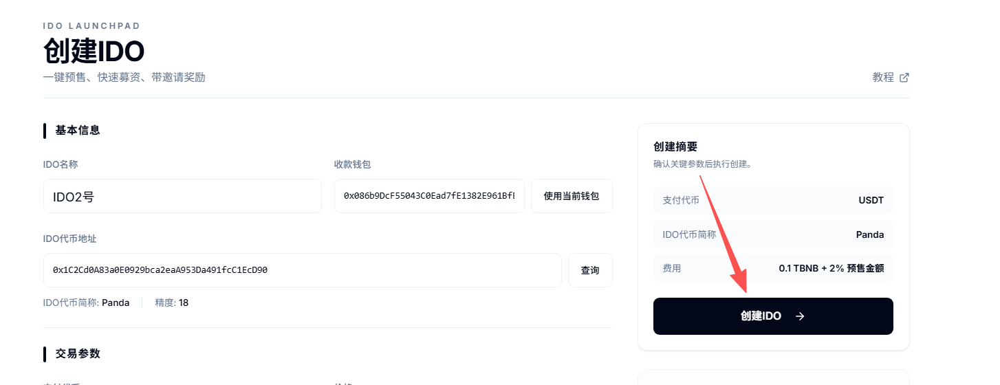<figcaption></figcaption></figure>

创建成功之后，我们就可以根据提示进入控制台

<figure>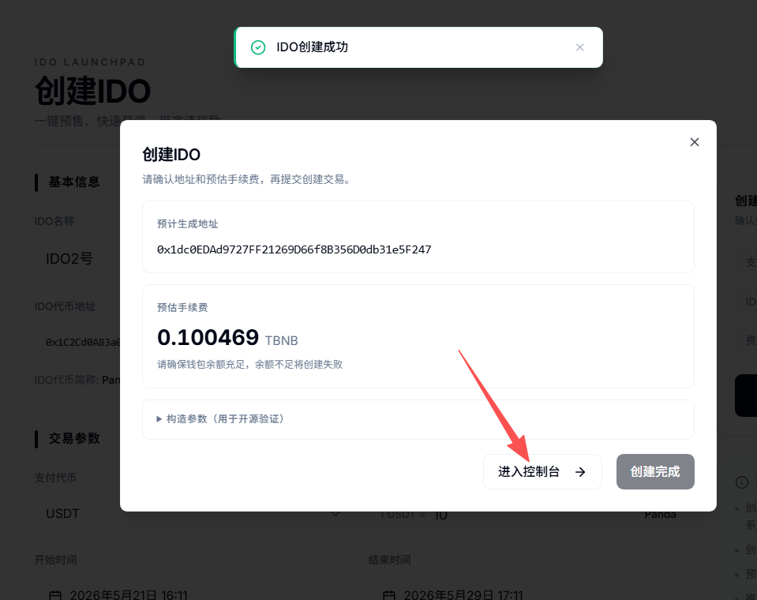<figcaption></figcaption></figure>

#### 第四步：存入代币并开始预售

注意，IDO创建成功后还不能开始，因为此时IDO合约里还没有代币，我们进入[IDO控制台](https://www.pandatool.org/zh-CN/ido/list)，将钱包内的代币存入合约里才可以。

<figure>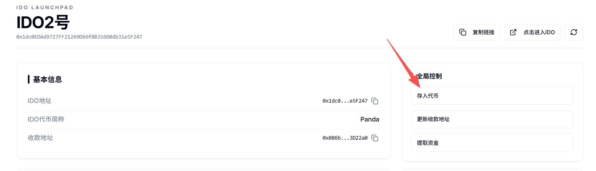<figcaption></figcaption></figure>

点开该按钮之后，确定自己要存入的代币数量（根据你的代币经济学，大概准备多少代币进行IDO，那就输入多少），然后点击确认，钱包确认即可

<figure>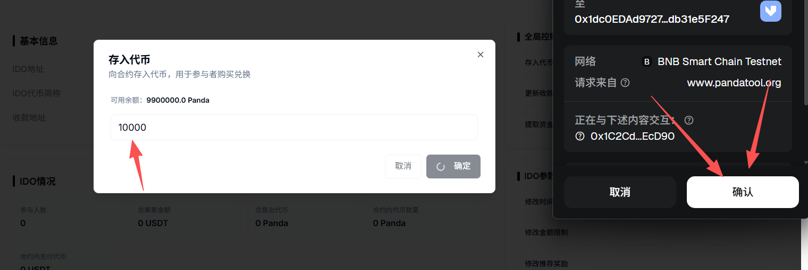<figcaption></figcaption></figure>

存入代币成功后，就能在控制台看到合约里面的代币数量了

<figure>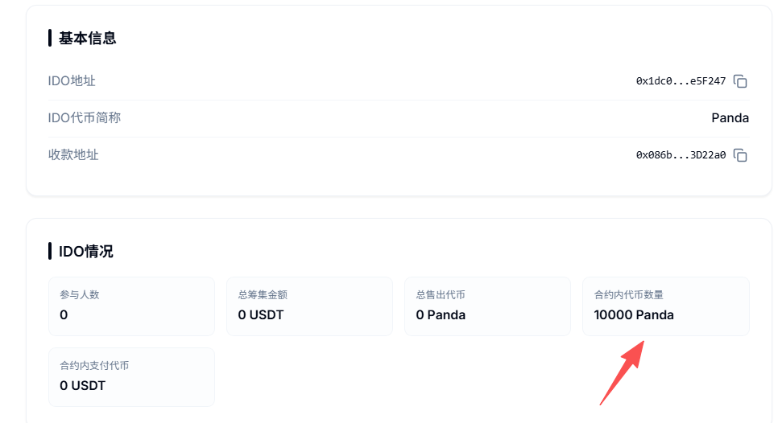<figcaption></figcaption></figure>

这个时候就已经具备预售的条件，但用户在哪里参与呢？控制台有一个入口，我们点击进入，即可跳转到IDO页面

<figure>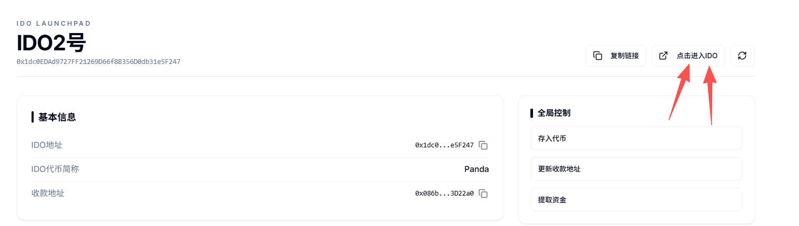<figcaption></figcaption></figure>

进入之后，我们在右上角连接钱包，然后就能进行参与。案例链接：[https://unicrypto.vercel.app/ido?contract=0x6Cb6fdB11aeff78C601fa9978e036066667d6b32\&chainid=97](https://unicrypto.vercel.app/ido?contract=0x6Cb6fdB11aeff78C601fa9978e036066667d6b32\&chainid=97)

<figure><figcaption></figcaption></figure>

在网站输入要购买的代币数量，点击参与，钱包确认即可

<figure><figcaption></figcaption></figure>

如果你想邀请好友或者下级来参与IDO，在您自己购买之后，直接复制推荐链接给别人。别人打开这个链接后，连接钱包进行参与，你就可以获得推荐奖励（以USDT/BNB进行奖励发放，奖励实时到账）

<figure><figcaption></figcaption></figure>

到这一步你可能会问：这个网站的基础信息可以修改吗？IDO的收款钱包地址、价格、时间可以修改吗？当然都是可以的。我们需要回到控制台进行修改

#### 第五步：修改IDO信息

整个IDO控制台有三个板块，分别是：全局控制、IDO参数控制和页面信息控制，我们一一说明

**1、全局控制**

<figure>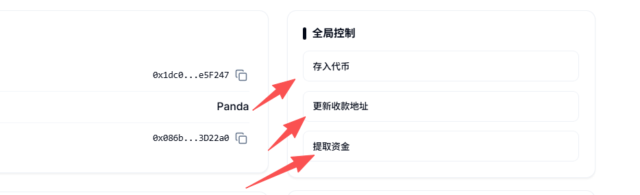<figcaption></figcaption></figure>

* **存入代币：**&#x8FD9;个功能前面已经介绍，目的是将代币存入IDO合约，以便开启预售
* **更新收款地址：**&#x6295;资者或用户参与IDO，支付的BNB/USDT，需要给到一个地址。通过此功能，可以修改之前设置的收款地址
* **提取资金：**&#x5982;果预售已经结束，但是IDO合约里仍然有代币，那么就可以通过该功能将其提取出来

**2、IDO参数控制**

<figure>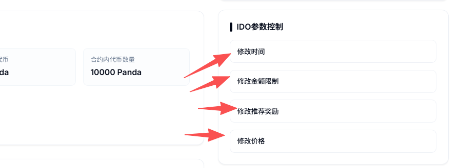<figcaption></figcaption></figure>

* **修改时间：**&#x4FEE;改IDO的开始时间与结束时间
* **修改金额限制：**&#x4FEE;改单个钱包地址的最小购买金额和最大购买金额限制
* **修改推荐奖励：**&#x4E3B;要是修改每一代推荐奖励的比例
* **修改价格：**&#x53EF;以修改IDO预售的价格

**3、页面信息控制**

这一步主要指的是，修改IDO网站页面的基本信息。注意，所有的修改都必要要钱包确认才可以

<figure>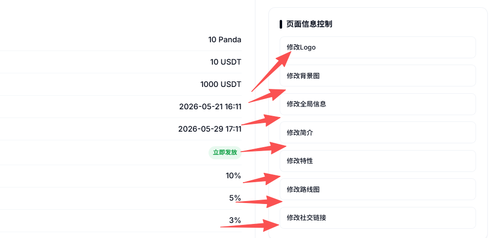<figcaption></figcaption></figure>

**修改logo：**&#x53EF;以采用上传图片、填写图片url的方式。如果对logo不满意，也可以退回到默认选项

<figure>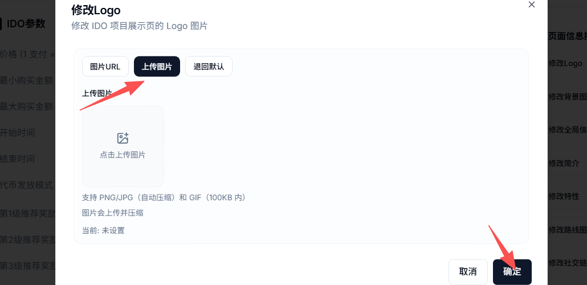<figcaption></figcaption></figure>

修改的logo主要体现在网站左上角和左下角的头像，位置如下图

<figure><figcaption></figcaption></figure> <figure><figcaption></figcaption></figure>

**修改背景图：**&#x5C31;是修改整个网站的背景图片。首先，我们不建议大家修改这个选项，因为如果背景图不好看，整个网站就会变得非常丑。如果要用背景图，建议使用深色背景。如果最后还是觉得不好看，可以直接**退回默认**

**修改全局信息：**&#x8BE5;部分主要是4个方面

* 修改首页信息：一句话总结你的项目，网站首页、代币名称下面的文案

<figure><figcaption></figcaption></figure>

* 修改白皮书链接：当前的白皮书链接是默认的，如果没有就不填
* 修改页脚信息：网站左下角位置的文案

<figure><figcaption></figcaption></figure>

* 修改网站语言：中文和英文可以选择一种。确定后，网站语言会自动切换

**修改简介：**&#x5C31;是项目的介绍，分别是修改简介的标题和详情

<figure><figcaption></figcaption></figure>

**修改特性：**&#x5C31;是代币的特点，一共四大特性，每个特性又有标题和详情两个部分

<figure><figcaption></figcaption></figure>

**修改路线图：**&#x6309;照给出的四个发展阶段，可以分别阐述

<figure>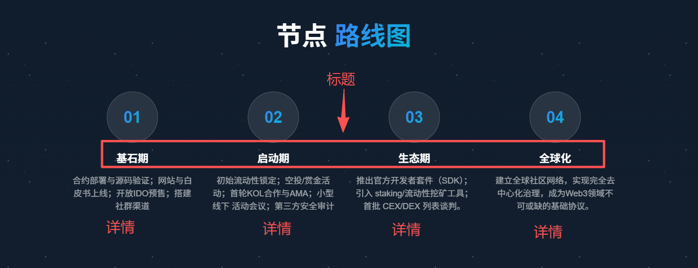<figcaption></figcaption></figure>

**修改社交链接：**&#x5C31;像您项目的官方链接，在网站右下角可以体现，包括：X（推特）、电报Telegram、Discord、Github

<figure>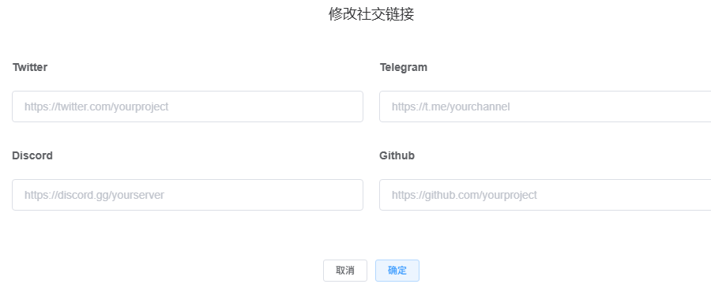<figcaption></figcaption></figure> <figure>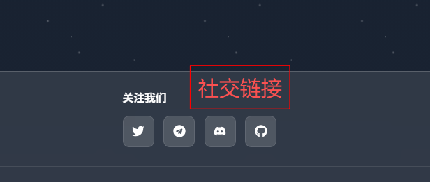<figcaption></figcaption></figure>

至此，关于IDO的创建就已经结束了。接下来，解答一些用户可能关心的问题

## 三、创建IDO疑问解答

**1、IDO的钱是直接到项目方钱包地址还是需要通过PandaTool中转？**

* **答：**&#x7528;户参与IDO的费用是直接到项目方钱包地址的，当然，这是在扣除推荐奖励和PandaTool的服务费用之后。

**2、PandaTool是怎么收费的？**

* **答：**&#x50;andaTool的收费方式是固定费用+抽成比例。除此之外，再无其他费用
* **固定费用：**&#x9879;目方创建IDO，支付0.1BNB的固定费用
* **抽成比例：**&#x6BCF;一笔IDO购买费用，PandaTool抽成2%

**3、IDO网站可以更换域名/网址吗？**

* **答：**&#x53EF;以，但是需要额外付费。具体这方面，得咨询PandaTool的商务：[**@btc6560**](http://t.me/btc6560)

**4、为什么有的推荐奖励没有生效？**

* **答：**&#x6709;一个关键的前提，上级要想推荐下级，必须自己先参与IDO，否则推荐链接是无效的

**5、可以设置单钱包的IDO次数限制吗？**

* **答：**&#x76EE;前无法设置，我们认为这种限制的意义不大

**6、网站里面的代币经济学可以修改吗？**

* 答：这部分目前是自动生成的，暂时无法修改

**7、IDO预售的网站模版还有其他类型吗？**

* 答：当前就这一个，后续我们会增加更多精美模版

**8、网站语言可以设置中英文自动切换吗？**

* 答：当前可以实现的是，根据您的设置，将网站及文案自动切换到某一种语言，如英文或者中文。两种语言无法同时存在。如果要实现这种效果，还是得联系商务：[**@btc6560**](http://t.me/btc6560)

当然，如果您在创建IDO的过程中还有其他的问题，可以进入我们的telegram社区群，我们的志愿者会免费为您解答：[https://t.me/pandatool](https://t.me/pandatool)
