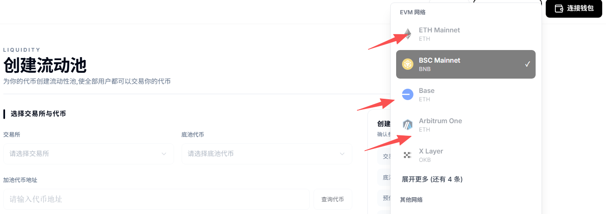
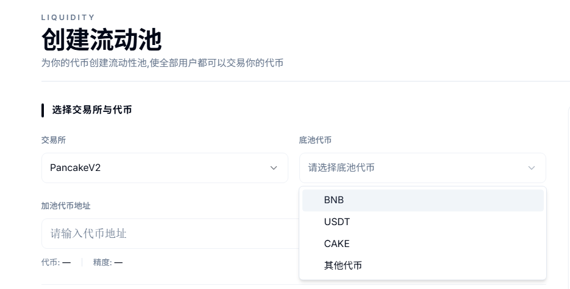
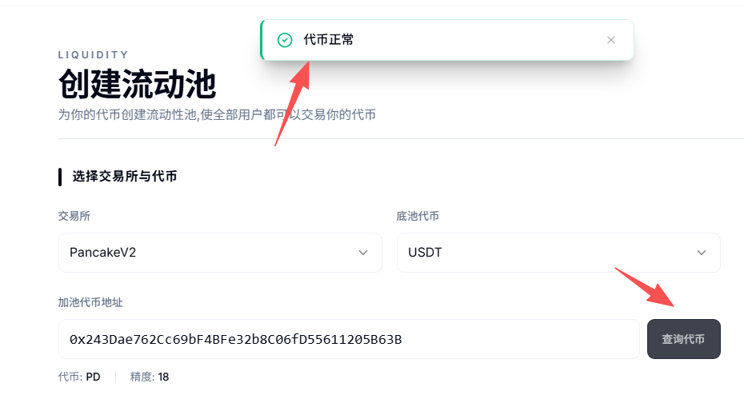
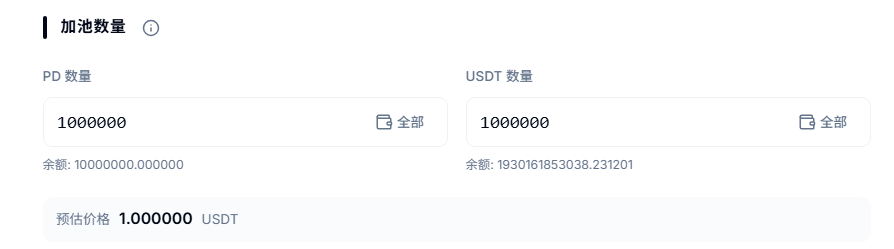
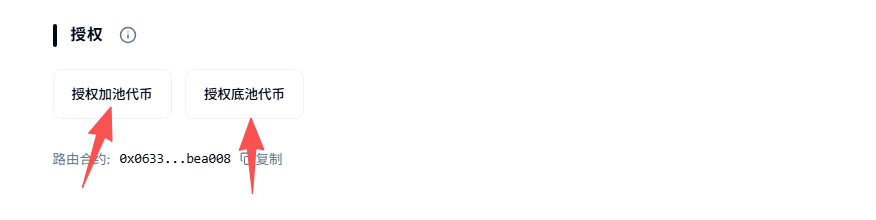
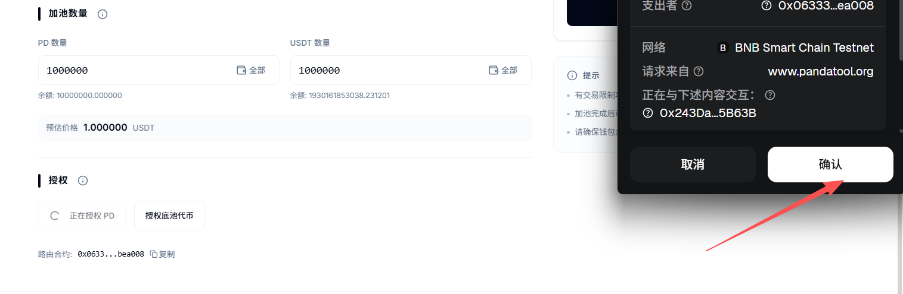
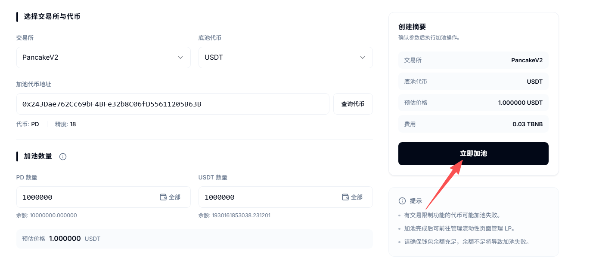
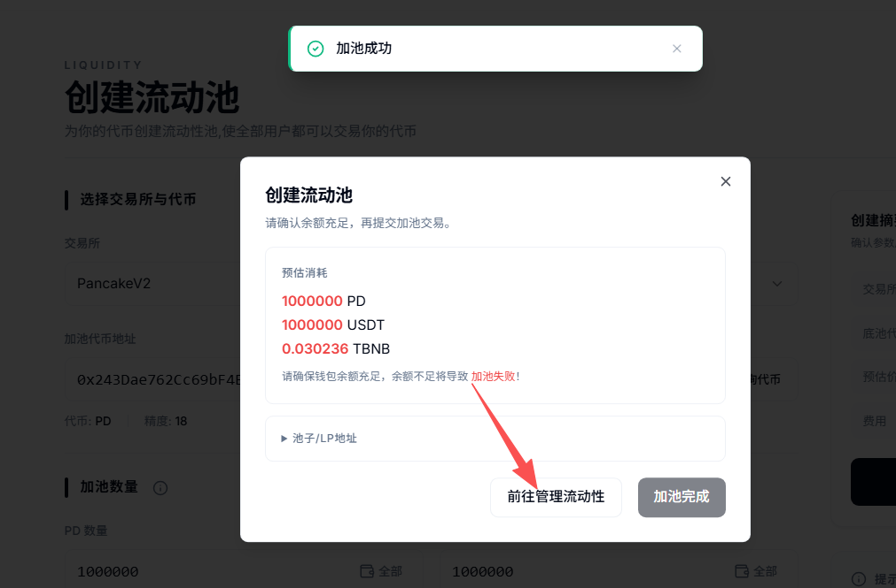
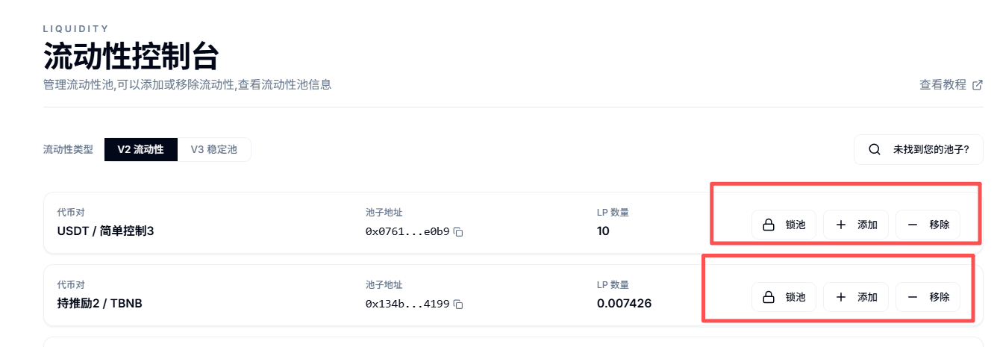

# 创建流动性资金池教程

## **视频教程**



## **一、资金池概念解读**

流动性资金池，俗语称之为：底池、池子，英文简称LP，是区块链上用来进行兑换交易的代币池。通常来说，就是按照一定的比例将两种代币放到一起组成的池子。

那为什么要创建底池？很简单：**没有池子，不能交易；有了池子，才能实时兑换。**

如果你想学习更多资金池相关的知识，可以阅读以下文章：

* ✅**流动性资金池概念解读：**[https://academy.pandatool.org/kn/1056](https://academy.pandatool.org/kn/1056)
* ✅**流动性池资金运作逻辑：**[https://academy.pandatool.org/zh\_CN/kn/805](https://academy.pandatool.org/zh_CN/kn/805)

<figure><figcaption></figcaption></figure>

## **二、创建资金池注意事项**

### **1、给路由合约加白名单**

如果代币有特殊的功能，如果手动开盘、持仓限制等，请先将PandaTool的路由合约加到白名单里面，才开始创建。

* **PandaRouter路由合约地址：**`0x60c8E6DAAfD4D24fEa43E01CE1EC1ecDa3eE1143`
* X Layer路由地址：`0x6ADCc1B97d84a2F566b443a6215ea0b01D40EBA4`

### **2、确保余额足够**

不管是创建什么类型的资金池，请确钱包内至少有**0.032个BNB**（BSC链的情况下）用于支付创建费用

### **3、V2和V3的区别**

PancakeSwap、Uniswap都有V2和V3两个协议，其实很好区分

* **V2：**&#x9002;用所有类型的代币（标准ERC20、分红/销毁等复杂功能等），默认用V2就可以了
* **V3：**&#x4EC5;适用于标准代币（无功能代币），且PandaTool仅支持通过V3创建稳定池

## **三、创建资金池流程**

**步骤1：**&#x8FDB;入PandaTool、连接钱包并切换至对应的区块链

**步骤2：**&#x9009;择加池的两种代币

**步骤3：**&#x586B;写加池的代币数量

**步骤4：**&#x6388;权代币

**步骤5：**&#x7ACB;即创建资金池

### **1、连接钱包**

不管我们是创建代币、创建资金池，还是交易兑换、批量转账，第一步都是要连接钱包。连接钱包是所有DAPP必要的操作，希望大家都能养成这个习惯。不连接钱包，什么都做不了。

此时我们进入到PandaTool创建资金池工具的网页：[https://www.pandatool.org/zh-CN/liquidity/createv2](https://www.pandatool.org/zh-CN/liquidity/createv2)  然后在右上角点击连接钱包

<figure><figcaption></figcaption></figure>

此时会跳出Metamask或者OKX Web3钱包，点击确认，即可完成连接。钱包连接成功后，会在右上角看到你的钱包地址。

如果你希望在BSC链创建资金池，就将区块链切换到BSC。如果是希望在以太坊上创建资金池，就将区块链切换到ETH即可

<figure><figcaption></figcaption></figure>

### **2、选择代币**

连接钱包后，我们需要选择选择交易所与代币

<figure><figcaption></figcaption></figure>

* **交易所：**&#x42;SC链就算PancakeV2、ETH/BASE链就是UniswapV2
* **底池代币：**&#x5C31;是价值代币，像BNB、ETH、USDT、USDC这种
* **加池代币地址：**&#x60A8;创建的代币合约地址

填写好之后，点&#x51FB;**`查询代币`** ，正常来说会提示你：**代币正常**

<figure><figcaption></figcaption></figure>

### **3、填写加池数量** 

确定好两种代币后，接下来就是填写代币数量了（加池数量不能超过自己钱包里的数量）

<figure><figcaption></figcaption></figure>

* **PD：**&#x6211;创建的代币，填写1000000枚，表示将1000000个PD代币放入资金池中
* **USDT：**&#x6211;选择的价值嗲比，填写10000，表示将10000个USDT放入资金池中

**预估价格：**&#x50;D代币的初始价格是1USDT（用1000000除以1000000得到价格是1）。如果PD放1000个，USDT放10000个，那么预估初始价格就是10U，以此类推

### **4、代币授权** 

当我们确定好加池的代币和数量之后，就需要钱包授权了。也就是说，你要将代币授权给路由合约，然后路由合约会帮助你完成加池操作。

<figure><figcaption></figcaption></figure>

我们需要分别对两种代币进行授权（如果是BNB或者ETH，则无需授权），此时会跳出钱包进行确认

<figure><figcaption></figcaption></figure>

当两种代币都授权成功后，会看到以下提示

<figure><figcaption></figcaption></figure>

#### **5、创建资金池** 

代币授权完成后，就是创建资金池了。确认信息无误后，点击“立即加池”按钮，跳出钱包进行确认

<figure><figcaption></figcaption></figure>

钱包确认后等待几秒钟，即可完成创建资金池的操作，然后会提示你进入管理后台

<figure><figcaption></figcaption></figure>

当然，如果你没有来得及点击按钮，后期也可以通过流动性控制台来查看创建的资金池：[https://www.pandatool.org/zh-CN/liquidity/lpmanage](https://www.pandatool.org/zh-CN/liquidity/lpmanage)

<figure><figcaption></figcaption></figure>

## **四、疑问解答**

**1、为什么加池会失败？**

* **答：**&#x4E24;个原因。首先确认一下自己钱包内的BNB/ETH数量是否足够，BSC链加池至少需要0.03个BNB。如果余额充足，那么再看下有没有**将路由地址加入白名单**。
* 路由地址：`0x60c8E6DAAfD4D24fEa43E01CE1EC1ecDa3eE1143`

**2、创建BNB交易对的池子，用户可以用USDT买币吗？**

* **答：**&#x5F53;然可以。创建USDT的资金池，用户也能用BNB购买代币，都是相通的。

**3、对于加池数量有要求吗？**

* **答：**&#x6CA1;有要求。可以根据你的代币经济学和价格需求，添加适当比例的代币。一般来说，我们要求池子尽量大于300U或1个BNB。

**4、预估价格会变吗？**

* **答：**&#x9884;估价格只是你的代币初始价格，即上线价格。后续随着不断交易，价格会不断变化。

**5、V2和V3有什么区别？**

* **答：**&#x5E26;功能/机制的币，只能加V2。目前V3的池子只支持标准币（主要做稳定池），大家不要加错了

如果您有任何关于创建资金池的问题，均可以在Telegram群里咨询我们的志愿者：[https://t.me/pandatool](https://t.me/pandatool)
