# 创建锁池或锁仓教程

## **一、概念解读**

### **1、什么是锁池？什么是锁仓？**

* **锁仓：**&#x4E5F;叫锁币，就是将自己钱包里面的代币锁在某个地方不能动，以减少市场流通
* **锁池：**&#x5C31;是项目方将流动性资金池的凭证代币LP锁在某个地方，从而无法撤池子跑路

### **2、什么是LP代币？** 

* 即流动性资金池 (Liquidity Pool, LP) 代币。当您提供两种代币 (A 和 B) 作为流动性时，您得到是 LP 代币作为收据凭证。有了这个LP，才能撤池子。LP锁住了，池子就撤不了了。

### **3、池子有权限吗？** 

* 池子是没有权限这个概念的，因为资金池是所有人共有的，任何一个添加流动性的人，都拥有相应比例的份额。例如一个池子只有一个人加流动性，那么他就掌握了所有池子。如果一个池子有100人加流动性，那么每个人按照比例掌握相应的份额。



## **二、代币锁仓流程**

1、打开PandaTool连接钱包

2、填写锁仓信息（代币地址、数量等）

3、授权代币

4、确认锁仓

5、查看锁仓信息

好的，接下来我们详细看一下该如何操作

### **1、连接钱包**

首先，我们要打开锁仓页面：[https://www.pandatool.org/#/createLock?lang=zh-CN](https://www.pandatool.org/#/createLock?lang=zh-CN) ，右上角连接钱包

<figure><figcaption></figcaption></figure>

连钱包需要注意两点：

* 1、**钱包插件：**&#x6B27;易OKX、小狐狸Metamask、Phantom都可以，但是只能保留一个。其他的钱包插件，最好都关闭掉
* 2、**钱包地址：**&#x6CE8;意切换到钱包地址和链，如果错误，可能识别不出来

### **2、填写锁仓信息**

连接钱包后，我们需要填写正确的代币信息和锁的信息

<figure>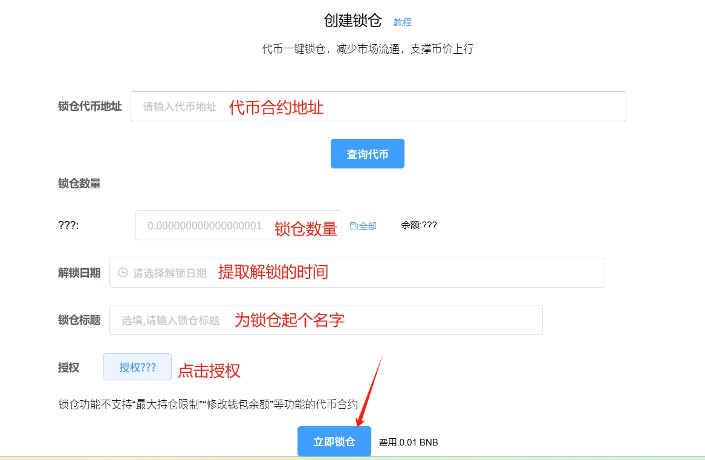<figcaption></figcaption></figure>

* **锁仓代币地址：**&#x586B;写要锁的代币合约地址（如果是填写池子地址，那就是锁池了）
* **锁仓数量：**&#x6839;据查询的代币填写要锁的数量，要锁多少就填多少
* **解锁日期：**&#x9009;择要解锁的日期（到期之前无法提前解锁，时间为您的本地时间）
* **锁仓标题：**&#x8FD9;个标题随便写一个就是，就是为这个锁起个名字
* **授权：**&#x5C06;代币授权给路由合约


锁仓代币地址可以填写池子地址（即：LP代币地址）。如果您填写**池子地址，就是锁池**。如果您填写**代币地址，就是锁币**。


例如我填写的内容如下

<figure>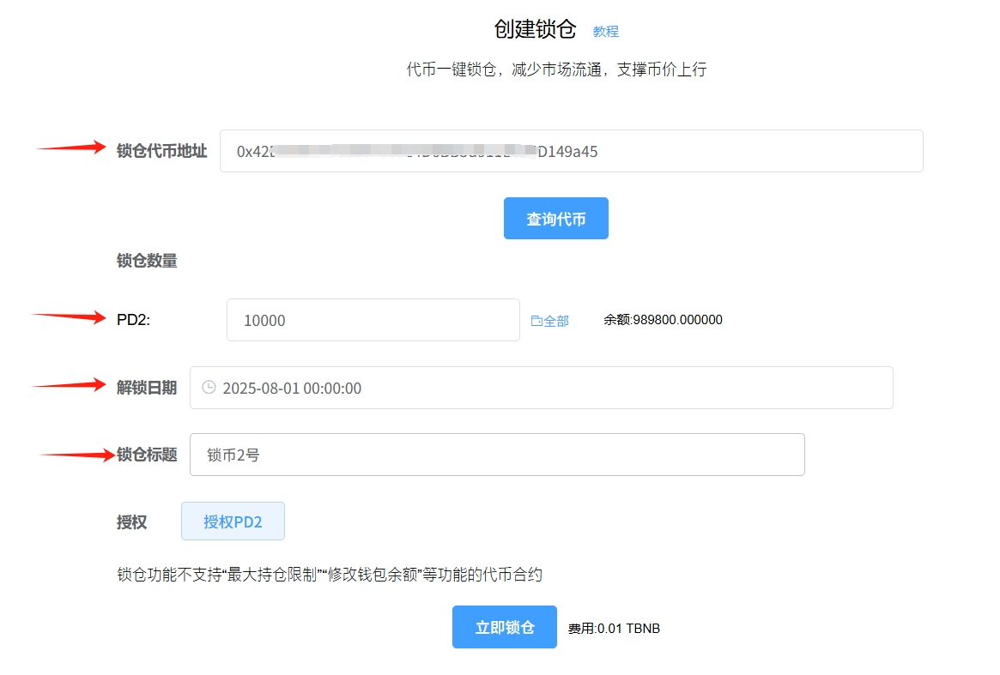<figcaption></figcaption></figure>


**注意：**&#x5E26;有最大持仓限制或者修改钱包余额的代币，是不支持锁的


### **3、授权代币**

确定填写的信息无误之后，点击授权，钱包确认后会提示授权成功

<figure>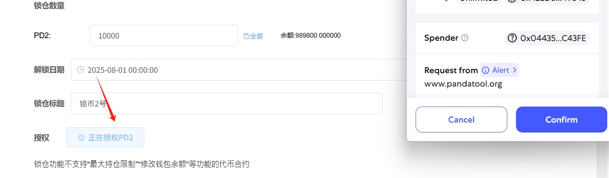<figcaption></figcaption></figure>

<figure>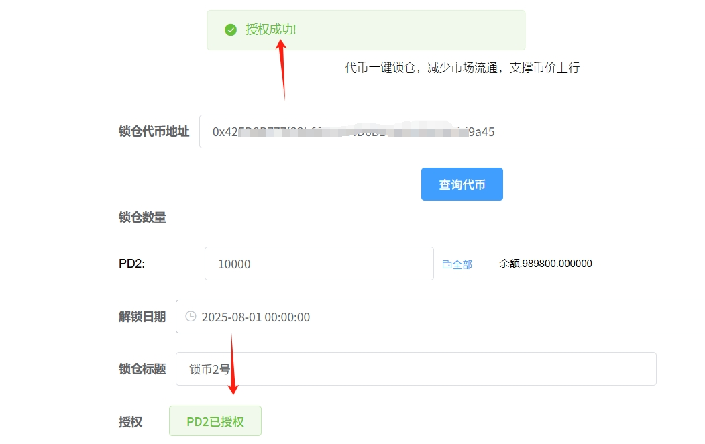<figcaption></figcaption></figure>

### **4、立即锁仓**

授权代币后，我们再核对一下填写的日期、数量是否无误。确认无误后，点击‘立即锁仓’的按钮，此时钱包会弹出确认

<figure>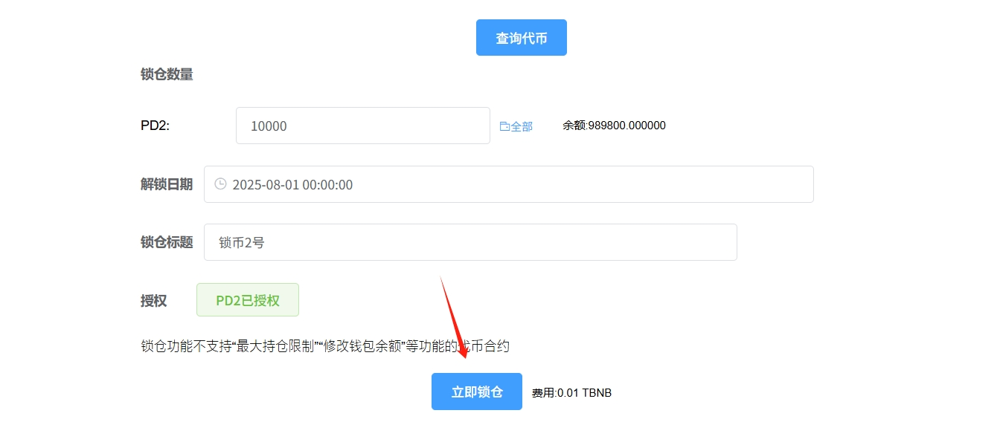<figcaption></figcaption></figure>

钱包确认后等待几秒钟，即可完成锁仓

<figure>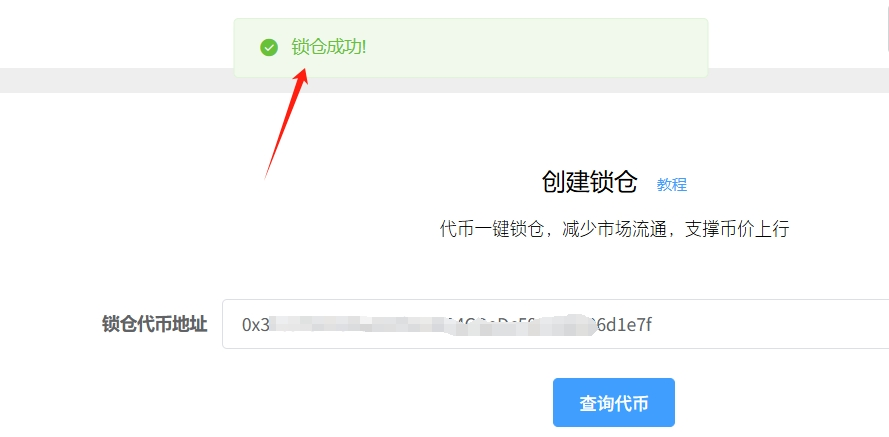<figcaption></figcaption></figure>

### **5、查看锁仓信息**

锁仓之后，我们怎么查看自己的锁仓信息呢？时间到了，我要去哪里解锁呢？为此，PandaTool开发了锁仓控制台，可以让大家查询并解锁。

我们点击进入锁仓控制台：[https://www.pandatool.org/#/lockList?lang=zh-CN](https://www.pandatool.org/#/lockList?lang=zh-CN) 就能看到所有的锁仓与锁币信息了

<figure>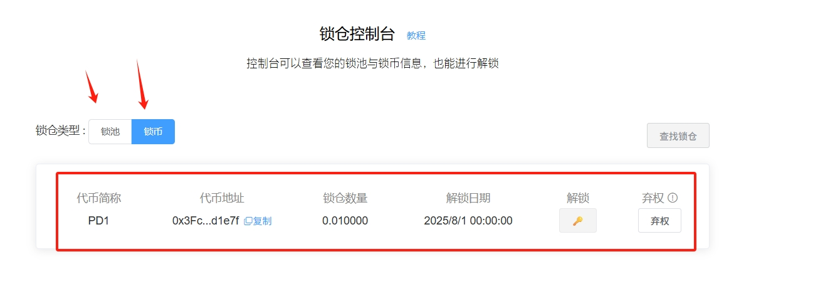<figcaption></figcaption></figure>

时间到了之后，您就可以在这里进行解锁。

如果您想将锁仓时间改成永远，该怎么做呢？正常情况下是不支持修改时间的，但是你也可以点&#x51FB;**`弃权`**&#x6309;钮，即可变成**永远锁仓**，那么就永久拿不回来了。&#x20;

<figure>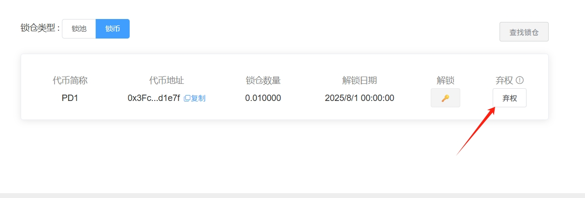<figcaption></figcaption></figure>

## **三、流动性锁池教程**

锁仓的讲完了，那么锁池该怎么操作呢？锁池有两种方法：

* **第一种：**&#x5728;锁仓页面输入池子地址，将LP代币锁住
* **第二种：**&#x901A;过流动性控制台直接锁池

### **1、第一种锁池：锁仓操作**

这种锁池方法，与锁仓/锁币是大同小异的，我们只需要在代币地址哪里，填入池子地址（也就是LP地址），其他流程一样，即可完成锁池

<figure>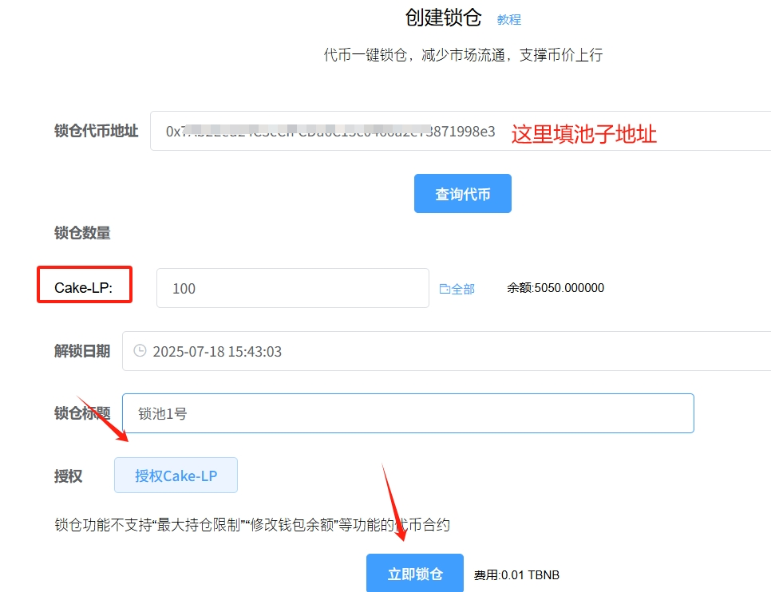<figcaption></figcaption></figure>

可以说，除了填写的地址从代币地址换成资金池地址外，其他都是一模一样的，操作起来很方便。那么，如何获得池子地址呢？可以在[流动性控制台](https://www.pandatool.org/#/LPmanage?lang=zh-CN)查询，并复制→[https://www.pandatool.org/#/LPmanage?lang=zh-CN](https://www.pandatool.org/#/LPmanage?lang=zh-CN)

<figure>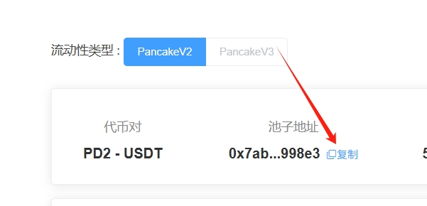<figcaption></figcaption></figure>

### **2、第二种锁池：流动性控制台锁**

如果您已经创建了流动性，可以在我们的[流动性控制台](https://www.pandatool.org/#/LPmanage?lang=zh-CN)查询到您的资金池，那么就可以直接点击锁池。我们进入流动性控制台→[https://www.pandatool.org/#/LPmanage?lang=zh-CN](https://www.pandatool.org/#/LPmanage?lang=zh-CN)

<figure>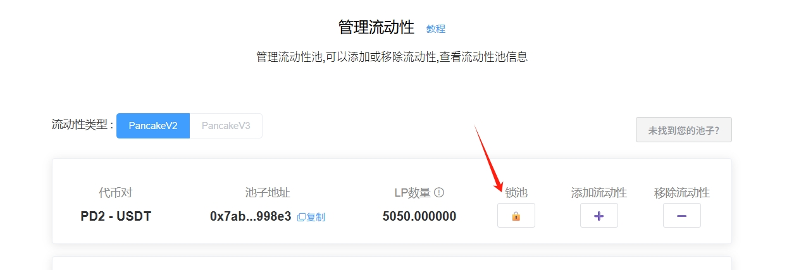<figcaption></figcaption></figure>

点击锁池按钮，然后输入相关的信息

<figure><figcaption></figcaption></figure>

* **锁池百分比**：这个百分比指的是您占有的池子比例的百分比，而非所有流动性的百分比
* **锁池数量：**&#x7531;百分比自动计算出LP的数量
* **解锁日期：**&#x6839;据您当地的时区来设定解锁日期，到期前不可取出LP
* **锁池标题：**&#x968F;便起个名字就行，不是必须要填的
* **LP代币授权：**&#x5728;撤池前需要进行授权


**关于百分比：**&#x5047;设池子都是您一个人加的， 那么这个百分比=池子的百分比。如果池子是多个人加的，就需要另外算的。比如，您本身占有池子份额的20%。那么您即便选择100%，整个池子也只是锁了20%的流动性而已。如果您选择20%，那么整个池子也就是锁了4%的流动性。


LP授权之后，点击确认锁池，等待几秒钟，就可以完成了

<figure><figcaption></figcaption></figure>

锁池之后，我们去哪里看呢？可以在[锁仓控制台](https://www.pandatool.org/#/lockList?lang=zh-CN)里查询我们的锁信息。进入锁仓控制台 → [https://www.pandatool.org/#/lockList?lang=zh-CN](https://www.pandatool.org/#/lockList?lang=zh-CN) 

<figure><figcaption></figcaption></figure>

至此，整个锁池与锁仓的教程就到这里了。下面，就一些重点问题做一些解答

## **四、疑问解答**

**1、为什么提示锁仓失败？**

* 答：首先需要排查，您的代币合约是否有`持仓限制`等功能，这种带限制是没办法锁的。如果确定这个没有问题，请再看一下钱包内的BNB数量是否大于0.01个。余额不足可能导致锁仓失败。

**2、锁仓/锁池需要收费吗？大概多少钱？**

* 答：是的要收费，在BSC链，每次锁池/锁仓，均需要支付`0.01BNB`的费用

**3、有没有办法可以提前解锁？**

* 答：没有任何办法，智能合约的运作不以人的意志为转移。一旦锁住，不到时间是`无法解锁`的

**4、这个解锁时间，是什么时区的？**

* 答：这个时间不用额外设置时区，所有的时间默认是您所在地区的时间

如果您有任何关于锁池或者锁仓的问题，均可以在Telegram群里咨询我们的志愿者：[https://t.me/pandatool](https://t.me/pandatool)
