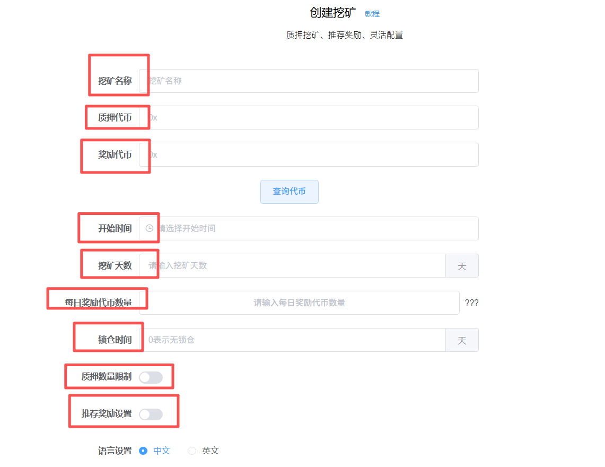
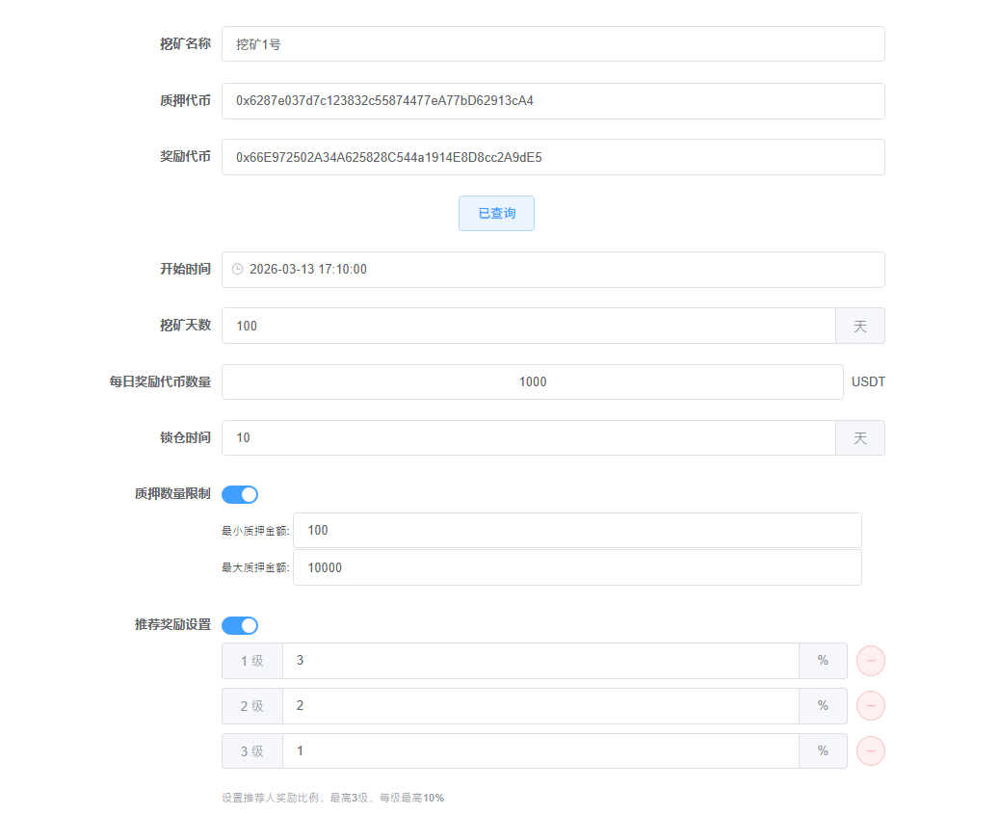
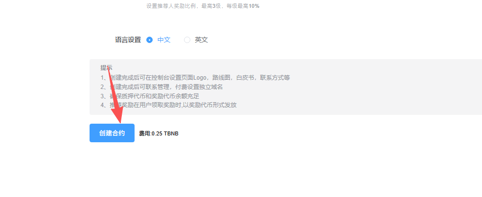
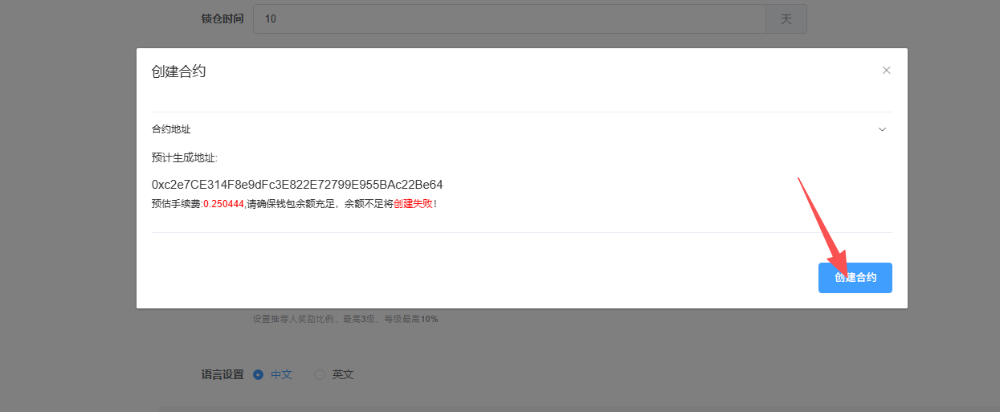
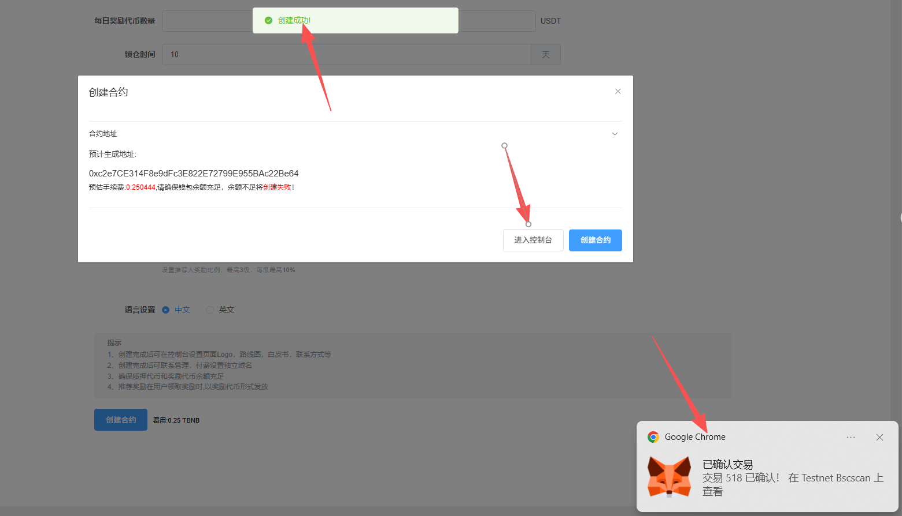

# 质押挖矿创建教程

本教程主要是帮助用户在PandaTool平台创建质押挖矿官网，通过质押获得挖矿奖励的方式，来减少市场上的代币流通量，从而降低卖盘来提升代币价格，形成“用户买币→参与质押→价格上涨”的正向机制。

### 一、质押挖矿概念解读 

#### **1.什么是质押挖矿？** 

将某种代币或LP通过官网质押到合约里暂时无法取出，从而获得另一代币奖励的机制，就是质押挖矿。

* **质押：**&#x5C06;代币或者LP存入挖矿合约无法取出，等到锁仓结束才能拿回
* **挖矿：**&#x901A;过质押来获得奖励的行为，就是挖矿

#### 2.为什么要创建质押挖矿？ 

项目方创建代币之后，用户可以随意购买，同时也会随意卖出，同时也加池子/撤池子。但是卖币和撤池子的行为，事实上对于项目会起到不利的因素。因此，通过质押挖矿的形式，暂时锁住用户的筹码或LP，可以减少代币崩盘的风险。

* **创建代币挖矿**：减少代币流通，让用户不要买了就卖
* **创建LP挖矿**：减少撤池风险，让投资者不要随便撤池子

### 二、如何创建质押挖矿呢 

在创建挖矿之前，大家必须先保证自己**已经创建了代币**，有了合约地址，否则无法挖矿。接下来是创建质押挖矿的教程

#### 1、挖矿创建步骤 

质押挖矿的创建过程，分为以下5个步骤

* 第一步：打开PandaTool的挖矿创建页面
* 第二步：设置质押代币、奖励代币、挖矿周期等
* 第三步：钱包确认并创建挖矿
* 第四步：进入挖矿控制台存入奖励代币
* 第五步：修改挖矿权限
* 第六步：修改官网信息

**第一步：打开PandaTool的IDO创建页面**

首先，我们需要打开挖矿创建的工具页面：[https://pandatool.org/#/mine/createMine?lang=zh-CN](https://pandatool.org/#/mine/createMine?lang=zh-CN)  然后点击右上角连接钱包

<figure><figcaption></figcaption></figure>

之后会跳出小狐狸或者OKX钱包插件，连接上就可以。这一步其实没什么好说的，如果大家在PandaTool创建过代币，应该都会搞。

**第二步：设置挖矿信息**

接下来，我们按照要求设置质押挖矿的参数信息。需要填写的内容比较多，我们一个个讲解

<figure><figcaption></figcaption></figure>

* **挖矿名称：**&#x968F;便起一个就行，无实际意义。支持中文、英文以及中英融合
* **质押代币：**&#x586B;入该代币的合约地址。用户需要将这个代币质押到矿池合约里面。如果是LP挖矿，就填入LP的合约地址。（不知道LP地址的话，可以进群让志愿者查一下：[https://t.me/pandatool](https://t.me/pandatool)）
* **奖励代币：**&#x586B;入奖励代币的合约地址，一般为USDT或者USDC的合约地址，也可以是其他任意代币合约
* **查询代币：**&#x8F93;入好地址后，一定要点击**查询代币**按钮，确保代币没有问题
* **开始时间：**&#x5F00;始挖矿的具体时间（时区以您电脑/手机上显示的为准）
* **挖矿天数：**&#x5177;体要挖矿挖多少天，可以自行设置
* **每日奖励代币数量：**&#x6BCF;天挖矿会产出多少代币，这个数字后期可以修改（注意：奖励**每秒**都会产出）
* **锁仓时间：**&#x7528;户质押后，是否要锁仓？不锁仓，就填0。锁仓的话，就意味着暂时取不了，不能解押。要锁多少天，就填多少（1天就是24小时，意味着用户质押后，需24小时后才能解锁。）
* **质押数量限制：**&#x53EF;以设置最小和最大质押数量，该数值后期也可以修改
* **推荐奖励设置：**&#x6316;矿可以邀请下级来参与，一共可以邀请三代，每一代都可以单独设置推荐比例。（推荐奖励给的是奖励代币，下级在领取奖励的时候，会自动将一部分奖励按照比例给到上级 ）
* **注意：**&#x53EA;有**先参与挖矿，才有资格推荐别人**，否则邀请链接是没有用处的。
* **语言设置：**&#x6316;矿网站可以设置为中文或者英文（只能设置单语言，不可同时设置两种语言）

以下就是我填写的挖矿详细信息了

<figure><figcaption></figcaption></figure>

通过上述信息可以看到，我给挖矿随便起了一个名字叫挖矿1号，质押和奖励代币的合约地址已经输入好了，且点击了查询按钮，挖矿天数是100天，最小质押100枚，最大质押10000枚，奖励的代币是USDT，每天奖励1000枚、然后还设置了三级邀请奖励，第一级3%，第二级2%，第三级1%。


注意：奖励是**按秒计算**的，只要质押了代币参与了挖矿，那么每秒都会获得奖励。该奖励需要自己用钱包手动领取。


**第三步：创建挖矿**

所有信息确认无误后，点击创建挖矿按钮

<figure><figcaption></figcaption></figure>

<figure><figcaption></figcaption></figure>

此时会跳出钱包确认，并支付费用

<figure><figcaption></figcaption></figure>

等待几秒钟，就会提示创建成功，然后进入点击按钮，进入控制台就行

<figure><figcaption></figcaption></figure>

**第四步：存入奖励代币**

现在我们已经创建好了挖矿合约了，但此时合约里还没有奖励代币，是无法发放奖励的，所以我们需要进入控制台，存入奖励代币

