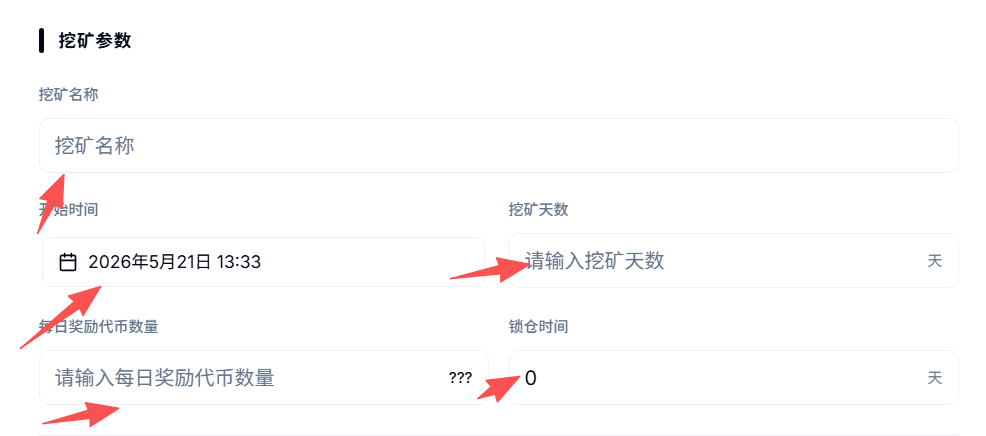
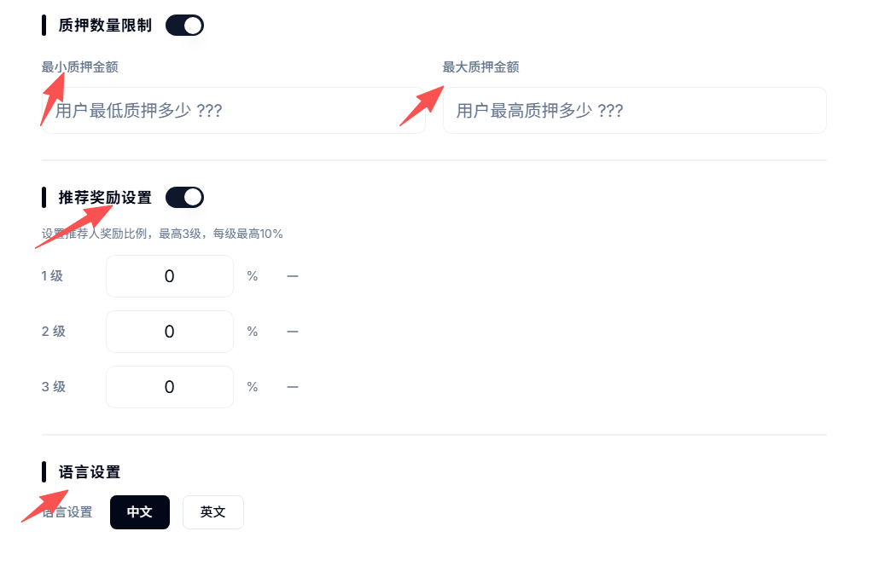
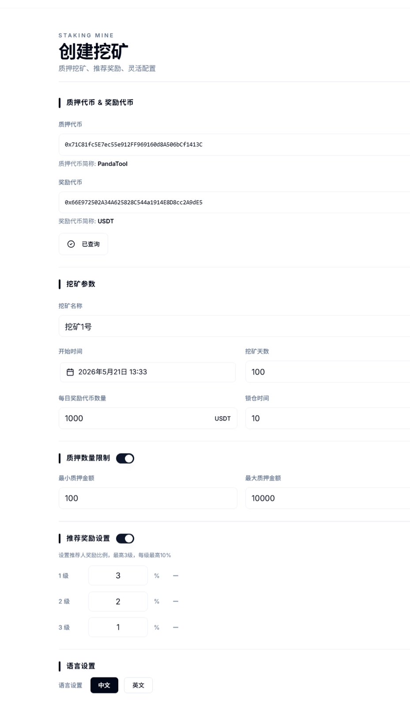
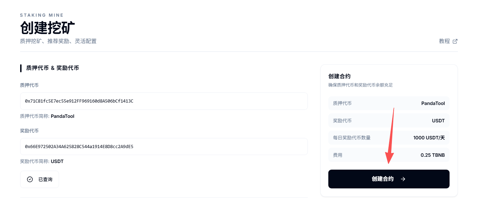
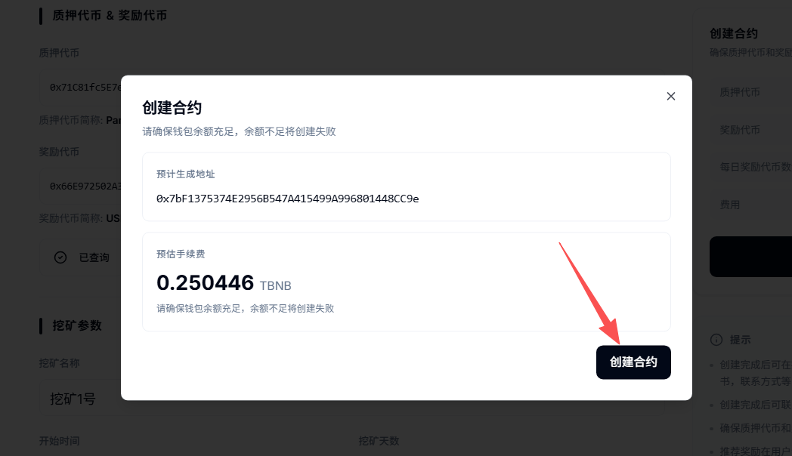
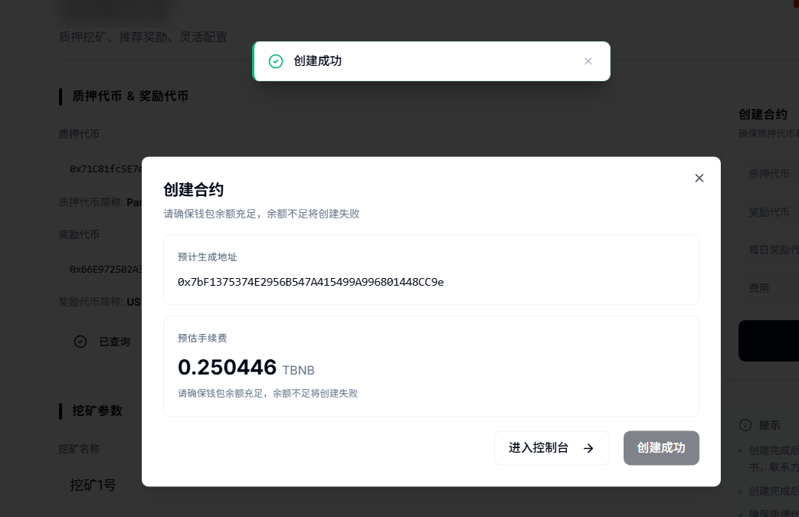
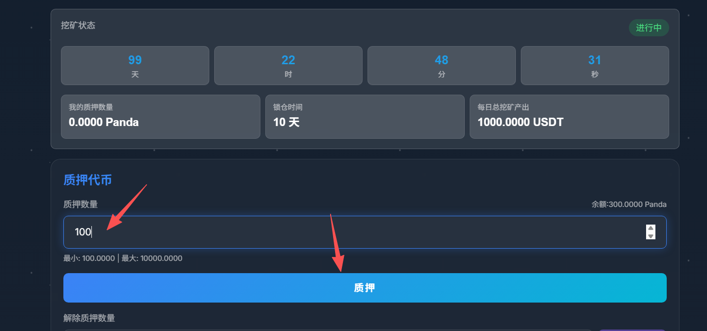
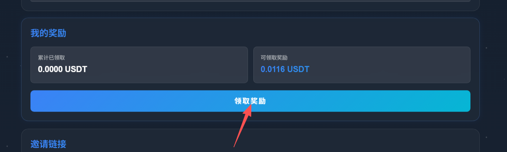
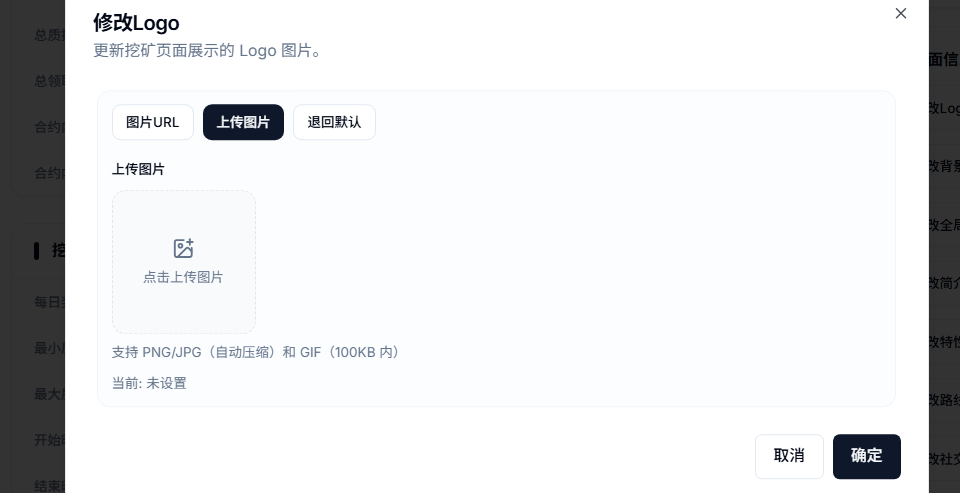
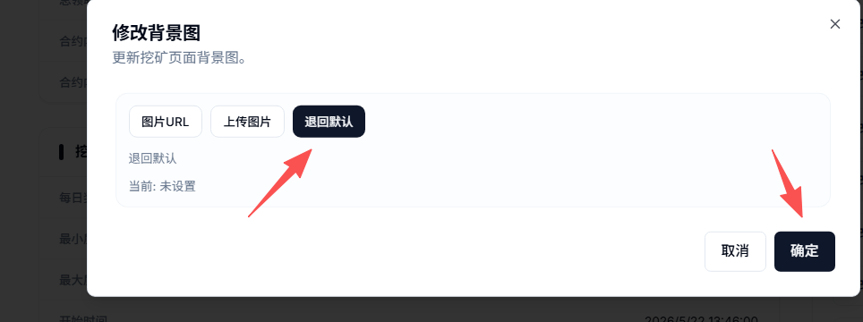

# 质押挖矿DAPP创建教程

本教程主要是帮助用户在PandaTool平台创建质押挖矿官网，通过质押获得挖矿奖励的方式，来减少市场上的代币流通量，从而降低卖盘来提升代币价格，形成“用户买币→参与质押→价格上涨”的正向机制。

<figure><figcaption></figcaption></figure>

### 一、质押挖矿概念解读 

#### **1.什么是质押挖矿？** 

将某种代币或LP通过官网质押到合约里暂时无法取出，从而获得另一代币奖励的机制，就是质押挖矿。

* **质押：**&#x5C06;代币或者LP存入挖矿合约无法取出，等到锁仓结束才能拿回
* **挖矿：**&#x901A;过质押来获得奖励的行为，就是挖矿

#### 2.为什么要创建质押挖矿？ 

项目方创建代币之后，用户可以随意购买，同时也会随意卖出，同时也加池子/撤池子。但是卖币和撤池子的行为，事实上对于项目会起到不利的因素。因此，通过质押挖矿的形式，暂时锁住用户的筹码或LP，可以减少代币崩盘的风险。

* **创建代币挖矿**：减少代币流通，让用户不要买了就卖
* **创建LP挖矿**：减少撤池风险，让投资者不要随便撤池子

### 二、如何创建质押挖矿 

在创建挖矿之前，大家必须先保证自己**已经创建了代币**，有了合约地址，否则无法挖矿。接下来是创建质押挖矿的教程

#### 1、挖矿创建流程 

质押挖矿的创建过程，分为以下5个步骤

* 第一步：打开PandaTool的挖矿创建页面
* 第二步：设置质押代币、奖励代币、挖矿周期等
* 第三步：钱包确认并创建挖矿
* 第四步：进入挖矿控制台存入奖励代币
* 第五步：修改挖矿权限
* 第六步：修改官网信息

#### 2、挖矿创建详细步骤 

**第一步：打开PandaTool的IDO创建页面**

首先，我们需要打开挖矿创建的工具页面：[https://www.pandatool.org/zh-CN/mine/create](https://www.pandatool.org/zh-CN/mine/create)  然后点击右上角连接钱包

<figure><figcaption></figcaption></figure>

之后会跳出小狐狸或者OKX钱包插件，连接上就可以。这一步其实没什么好说的，如果大家在PandaTool创建过代币，应该都会搞。

**第二步：设置挖矿信息**

接下来，我们按照要求设置质押挖矿的参数信息。需要填写的内容比较多，我们一个个讲解

<figure><figcaption></figcaption></figure>

* **质押代币：**&#x586B;入该代币的合约地址。用户需要将这个代币质押到矿池合约里面。如果是LP挖矿，就填入LP的合约地址。（不知道LP地址的话，可以进群让志愿者查一下：[https://t.me/pandatool](https://t.me/pandatool)）
* **奖励代币：**&#x586B;入奖励代币的合约地址，一般为USDT或者USDC的合约地址，也可以是其他任意代币合约
* **查询代币：**&#x8F93;入好地址后，一定要点击**查询代币**按钮，确保代币没有问题

<figure><figcaption></figcaption></figure>

* **挖矿名称：**&#x968F;便起一个就行，无实际意义。支持中文、英文以及中英融合
* **开始时间：**&#x5F00;始挖矿的具体时间（时区以您电脑/手机上显示的为准）
* **挖矿天数：**&#x5177;体要挖矿挖多少天，可以自行设置
* **每日奖励代币数量：**&#x6BCF;天挖矿会产出多少代币，这个数字后期可以修改（注意：奖励**每秒**都会产出）

> 假设您设置每日奖励代币数量为1000，那么每天就会固定产出1000枚代币给到所有质押的人。
>
> 假设只有1个人质押，不管质押多少，这1个人都独享1000奖励
>
> 假设有2个人质押，那**根据每个人的质押份额瓜分这1000奖励**：甲质押10枚，乙质押20枚。由于乙的质押数量是甲的2倍，乙的奖励也是甲的2倍，即乙每天获得666枚，甲每天获得333枚，。如果还有第三个人丙，那看丙质押多少，再确定每个人的份额比例进行分配

* **锁仓时间：**&#x7528;户质押后，是否要锁仓？不锁仓，就填0。锁仓的话，就意味着暂时取不了，不能解押。要锁多少天，就填多少（1天就是24小时，意味着用户质押后，需24小时后才能解锁。）

<figure><figcaption></figcaption></figure>

* **质押数量限制：**&#x53EF;以设置最小和最大质押数量，该数值后期也可以修改
* **推荐奖励设置：**&#x6316;矿可以邀请下级来参与，一共可以邀请三代，每一代都可以单独设置推荐比例。（推荐奖励给的是奖励代币，下级在领取奖励的时候，会自动将一部分奖励按照比例给到上级 ）
* **注意：**&#x53EA;有**先参与挖矿，才有资格推荐别人**，否则邀请链接是没有用处的。
* **语言设置：**&#x6316;矿网站可以设置为中文或者英文（只能设置单语言，不可同时设置两种语言）

以下就是我填写的挖矿详细信息了

<figure><figcaption></figcaption></figure>

通过上述信息可以看到，我给挖矿随便起了一个名字叫挖矿1号，质押和奖励代币的合约地址已经输入好了，且点击了查询按钮，挖矿天数是100天，最小质押100枚，最大质押10000枚，奖励的代币是USDT，每天奖励1000枚、然后还设置了三级邀请奖励，第一级3%，第二级2%，第三级1%。


注意：奖励是**按秒计算**的，只要质押了代币参与了挖矿，那么每秒都会获得奖励。该奖励需要自己用钱包手动领取。


**第三步：创建挖矿**

所有信息确认无误后，点击创建挖矿按钮

<figure><figcaption></figcaption></figure>

此时会跳出钱包确认，并支付费用

<figure><figcaption></figcaption></figure>

等待几秒钟，就会提示创建成功，然后进入点击按钮，进入控制台就行

<figure><figcaption></figcaption></figure>

**第四步：存入奖励代币**

现在我们已经创建好了挖矿合约了，但此时合约里还没有奖励代币，是无法发放奖励的，所以我们需要进入控制台，存入奖励代币。

在控制台右边的`全局控制`板块，有一个`存入代币`的按钮，点击之后输入您要存入的奖励代币数量

<figure><figcaption></figcaption></figure>

确定之后，会跳出钱包进行确认，确认完成即可将代币存入合约。注意，如果代币奖励不够发的，就需要你继续存入了。

如果挖矿结束多了，还可以点击提取资金按钮，将多余的代币取出。

<figure><figcaption></figcaption></figure>

具体能提多少，到时候就看挖矿合约里还剩多少了。

代币存入之后，就已经具备挖矿的条件了，但用户在哪里参与呢？控制台有一个入口，我们点击进入，即可跳转到质押挖矿页面

<figure><figcaption></figcaption></figure>

进入之后，用户在右上角连接钱包，输入质押数量，点击质押按钮，就能参与质押挖矿了。案例链接：[https://unicrypto.vercel.app/mine?contract=0xc2e7CE314F8e9dFc3E822E72799E955BAc22Be64\&chainid=97](https://unicrypto.vercel.app/mine?contract=0xc2e7CE314F8e9dFc3E822E72799E955BAc22Be64\&chainid=97)

<figure><figcaption></figcaption></figure>

质押成功后，每一秒钟都会看到自己的奖励。如果你想取出奖励，只需要点击领取，即可完成。

<figure><figcaption></figcaption></figure>

当然，用户质押的代币暂时还不能解除，等到锁仓结束，才可以。

此时你可能要问了：这个奖励的数量、锁仓的时间可以修改吗？答案是当然可以的，我们回到控制台操作。

**第五步：修改挖矿参数**

我们在控制台找到挖矿参数控制，然后逐一进行修改

<figure><figcaption></figcaption></figure>

* **修改时间：**&#x8FD9;里修改的是挖矿的时间周期，比如30天、100天、300天等等
* **修改质押限制：**&#x8FD9;里修改的是最小质押数量和最大质押数量限制
* **修改推荐奖励：**&#x4E3B;要是修改每一层级的推荐奖励的比例
* **修改每日奖励：**&#x662F;要修改每日挖矿产出的奖励代币数量
* **修改锁仓时间：**&#x7528;户质押后应该要锁仓多久，这个时间可以改

总的来说，控制台的权限还是非常大，基本上可以修改大多数挖矿的参数。

既然挖矿可以修改，那么官网文案能不能改呢？当然也是可以的。

**第六步：修改官网资料**

控制台右下方有一个页面信息控制，可以让您修改官网的文案以及图片

<figure><figcaption></figcaption></figure>

**修改logo：**&#x53EF;以采用上传图片、填写图片url的方式。如果对logo不满意，也可以退回到默认选项

<figure><figcaption></figcaption></figure>

修改的logo主要体现在网站左上角和左下角的头像，位置如下图

**修改背景图：**&#x5C31;是修改整个网站的背景图片。首先，我们不建议大家修改这个选项，因为如果背景图不好看，整个网站就会变得非常丑。如果要用背景图，建议使用深色背景。如果最后还是觉得不好看，可以直接**退回默认**

<figure><figcaption></figcaption></figure>

**修改全局信息：**&#x8BE5;部分主要是4个方面

* 修改首页信息：一句话总结你的项目，网站首页、代币名称下面的文案

<figure><figcaption></figcaption></figure>

* 修改白皮书链接：当前的白皮书链接是默认的，如果没有就不填
* 修改页脚信息：网站左下角位置的文案

<figure><figcaption></figcaption></figure>

* 修改网站语言：中文和英文可以选择一种。确定后，网站语言会自动切换

**修改简介：**&#x5C31;是项目的介绍，分别是修改简介的标题和详情

<figure><figcaption></figcaption></figure>

**修改特性：**&#x5C31;是代币的特点，一共四大特性，每个特性又有标题和详情两个部分

<figure><figcaption></figcaption></figure>

**修改路线图：**&#x6309;照给出的四个发展阶段，可以分别阐述

<figure><figcaption></figcaption></figure>

**修改社交链接：**&#x5C31;像您项目的官方链接，在网站右下角可以体现，包括：X（推特）、电报Telegram、Discord、Github

<figure><figcaption></figcaption></figure>

<figure><figcaption></figcaption></figure>

至此，关于质押挖矿的全部工作就已经结束了。项目方基本上可以不用管了，他会自己运行。接下来，解答一些大家可能关心的问题

### 三、质押挖矿疑问问答 

**1、PandaTool是怎么收费的？**

* **答：**&#x50;andaTool的收费方式是一次性收取固定费用，不同区块链的收费不同
* BSC链：0.25BNB
* ETH/BASE/Arb链：0.12ETH
* X Layer链：1OKB
* Polygon链：1200POL

**2、为什么推荐奖励没有生效？**

* **答：**&#x53EA;有参与质押的地址，才有资格推荐别人。否认推荐链接是没有用的，无法推荐下级

**3、用户多次质押，解锁时间是怎么算的？**

* **答：**&#x5982;果用户多次质押，那么以最后一次质押时间为准。按照最后一次质押的时间+锁仓周期，就是它解锁的时间了，

**4、质押奖励是怎么发放的？到了时间直接给它吗？**

* **答：**&#x5956;励每秒都会累计在它的账户里，质押用户需要手动点击领取，才能将奖励拿到自己钱包。领取奖励没有限制，随时都能可以。但无法分批提取，只能一次性领取现有的全部奖励。

**5、用户有没有办法提前解除质押？**

* **答：**&#x7528;户没有任何办法，除非你作为项目方，修改质押时间，将时间改为0，那么用户就可以提了。

**6、我想让用户质押LP参与挖矿可以吗？**

* **答：**&#x5F53;然可以，在创建挖矿的时候，将LP的合约地址输入到质押代币那一栏里即可。如果不知道自己代币的LP地址，可以在群里咨询志愿者

7、质押挖矿的网站域名可以修改吗？

* 答：这个也是可以的，但需要联系我们的志愿者付费解决：[https://t.me/btc6560](https://t.me/btc6560)

PandaTool在Telegram的官方交流群：[https://t.me/pandatool](https://t.me/pandatool)   如果您有任何其他问题，均可以随时咨询。
