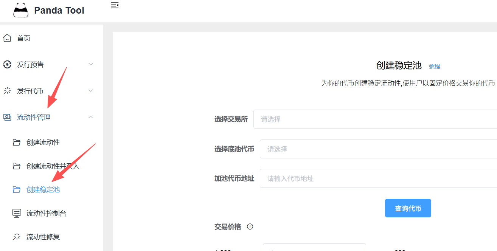
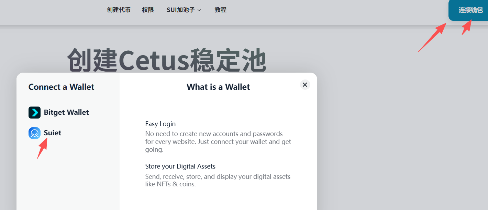
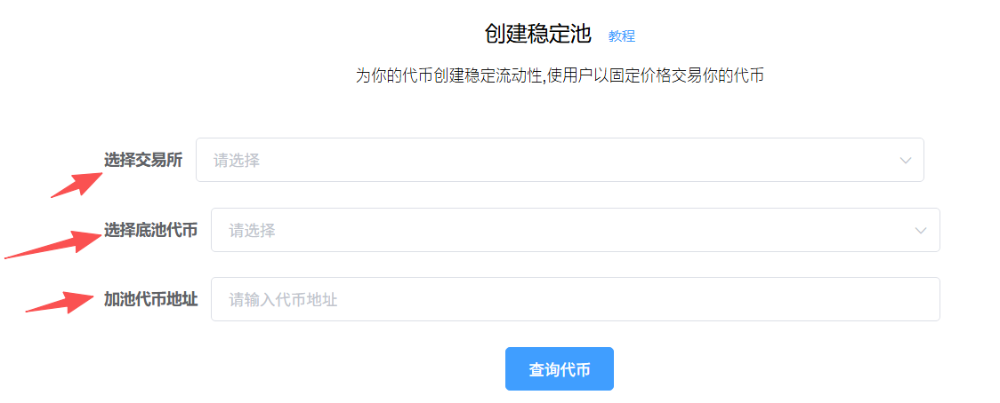
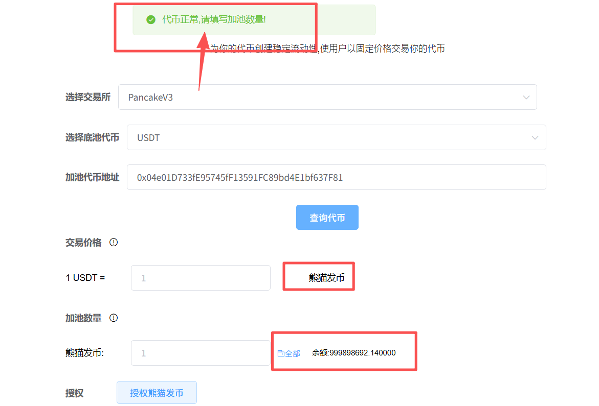
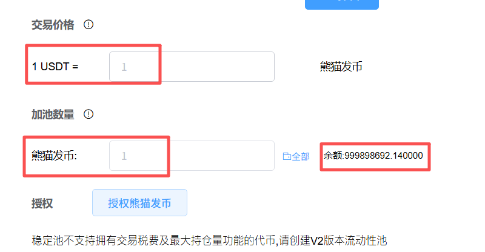
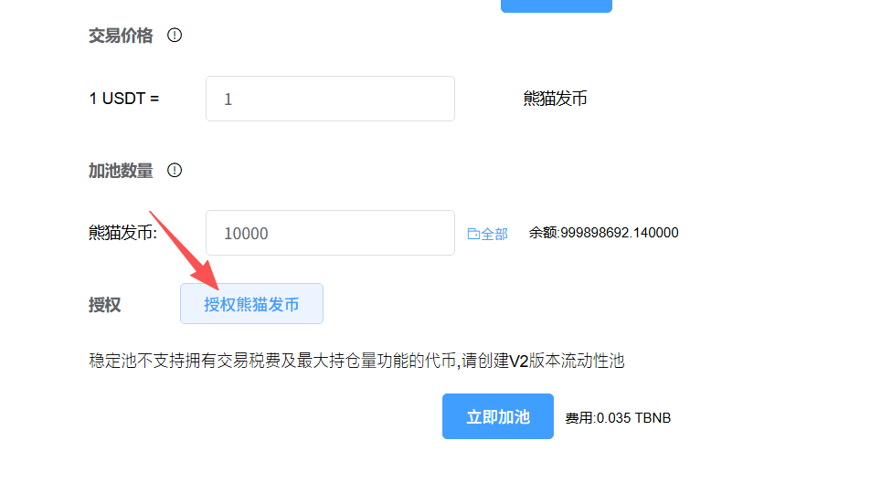
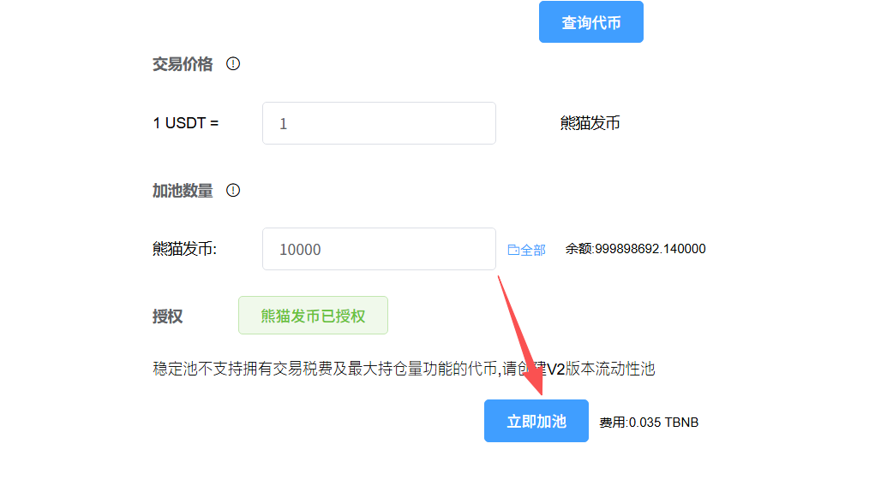
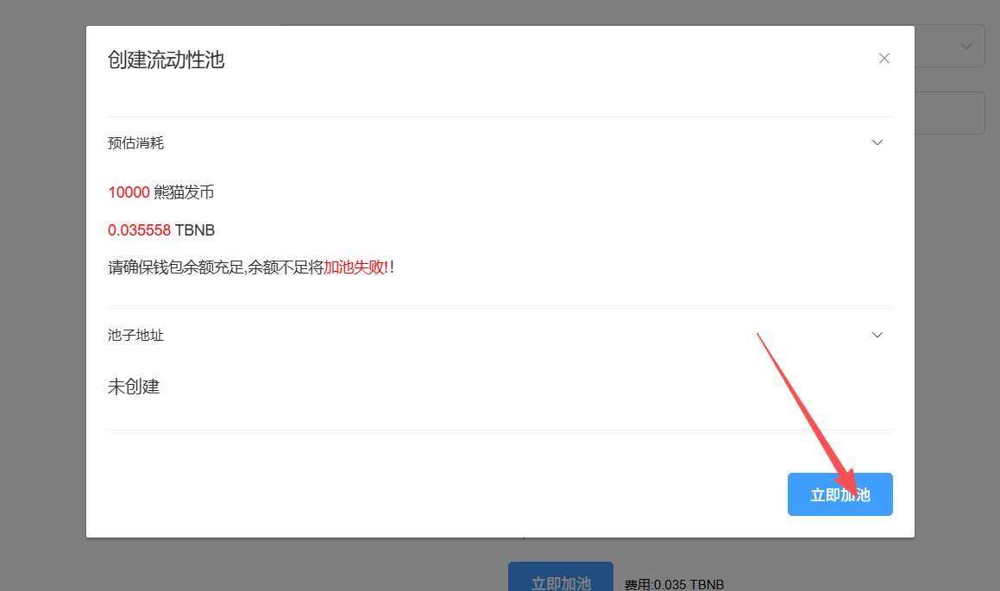

# 创建稳定币流动池教程

### 一、什么是稳定币池？ 

稳定币池，就是稳定币流动性池。如果你想在币安(BSC)链、以太坊(ETH)链上面创建一个稳定币，那么就可以加这种池子。具体原理是这样的：

**1、什么是稳定币？**

所谓稳定币，就是交易价格始终相对稳定的代币。原生稳定币USDT、USDC等是锚定美元的，而我们现在说的稳定币，是锚定USDT/USDC的。

**2、如何才能让币价稳定？**

稳定币并不是创建出来的，是通过流动性池锚定出来的。简单来说：我们通过创建一个稳定币池，将你的代币和USDT的兑换比例固定，比如就固定 1代币=1USDT。不管兑换多少，都是这个比例。这样的话，你的币价就稳定了。


本教程针对的是BSC、以太坊等区块链的稳定池，如果是其他区块链的稳定池，可以参考如下教程：

Solana稳定池创建：[https://help.pandatool.org/sol/clmm](https://help.pandatool.org/sol/clmm)

Sui稳定池创建：[https://help.pandatool.org/sui/pool](https://help.pandatool.org/sui/pool)


### 二、如何创建稳定币池 

创建稳定币流动性池，需要遵循以下的步骤：

1.发行一个标准币

2.找到创建稳定池页面

3.输入代币信息并查询

4.填写交易价格与加池数量

5.授权并创建

接下来，PandaTool给大家详细说明一下这个稳定币池的创建过程

#### **1、发行一个标准币**

在创建稳定池之前，我们首先需要有一个代币。需要注意的是，这个币不能有交易税率，不能有持仓限制。因此，我们建议大家创建标准代币或者多功能代币，这两种是没有税率的。

* 标准代币创建：[https://pandatool.org/#/coinrelease/stardand?lang=zh-CN](https://pandatool.org/#/coinrelease/stardand?lang=zh-CN)
* 多功能代币创建：[https://pandatool.org/#/coinrelease/simpleControl?lang=zh-CN](https://pandatool.org/#/coinrelease/simpleControl?lang=zh-CN)

#### **2、进入创建稳定池页面**

代币有了之后，我们就进入到稳定币创建页面：[https://pandatool.org/#/createV3?lang=zh-CN](https://pandatool.org/#/createV3?lang=zh-CN)

除了通过链接进入，大家也可以在PandaTool的官网首页找到这个工具

<figure><figcaption></figcaption></figure>

进入之后呢，我们需要在右上角链接钱包，并选择好对应的区块链

<figure><figcaption></figcaption></figure>

#### **3、输入代币信息并查询**

接下来我们按照要求输入相关信息

<figure><figcaption></figcaption></figure>

* **选择交易所：**&#x5982;果是在BSC链，默认选择的就是Pancake V3
* **选择底池代币：**&#x4E00;般来说就USDT
* **加池代币地址：**&#x5C31;是输入您发行的代币的合约地址

确认无误后，点击查询代币。如果没有任何问题，会提示您查询成功

<figure><figcaption></figcaption></figure>

#### **4、确认交易价格与加池数量**

当查询到代币之后，你就需要填写交易价格与数量了。

<figure><figcaption></figcaption></figure>

* **交易价格：**&#x5373;代币需要稳定在某个价位。一旦确定，那么买入和卖出，都会按照该价格执行
* **加池数量：**&#x60A8;要往池子里加入多少发行的代币，就填多少


稳定币流动池，采用的是**单币加池模式**。意思是说，只需要往池子里放入发行的代币即可，USDT、USDC等价值代币，无需入池。


#### **5、授权并创建**

当你确定好价格和数量后，点击授权代币，授权过程会弹出钱包进行确认

<figure><figcaption></figcaption></figure>

授权完成后，会提示您已经授权。然后点击“立即加池”按钮

<figure><figcaption></figcaption></figure>

之后会让您进行二次确认，确认后会弹出钱包，确认即可

<figure><figcaption></figcaption></figure>

创建成功后，我们就能去交易了

### 三、相关问答 

**1、为什么查不到代币？**

* 答：请先确保代币合约地址、所示链是否链接错误。如果确认没错，可能是网络问题，可以切换网络后刷新重试。

**2、代币价格能确保稳定吗？**

* 答：当然，一旦创建成功，那么不管是买入还是卖出，价格都是固定的，所以才叫稳定池，

**3、池子里没有放U，那么怎么卖？**

* 答：是的，由于您加的是单币池，没有USDT是无法卖出代币的。只能先通过买入代币的方式，向池子里存U。池子里有了U之后，才能卖出。

**4、当我创建了稳定池之后，还能加其他类型的池子吗？**

* 答：不行了，稳定池的目的是为了让价格稳定。一旦加了其他池子，价格就变了，到时候容易乱

**5、我可以在后期修改价格吗？**

* 答：无法修改，价格一旦创建就固定了，不能调整。

**6、池子开始交易后，可以在钱包里显示价格吗？**

* 答：不一定，钱包对于代币价格的显示有一定要求。每个钱包，对每个类型的代币，显示的逻辑都不一样，这方面具体要咨询钱包才可以

如果您对于创建稳定币流动池还有其他问题，可以进入我们的Telegram群咨询，会有志愿者予以解答：[https://t.me/pandatool](https://t.me/pandatool)

