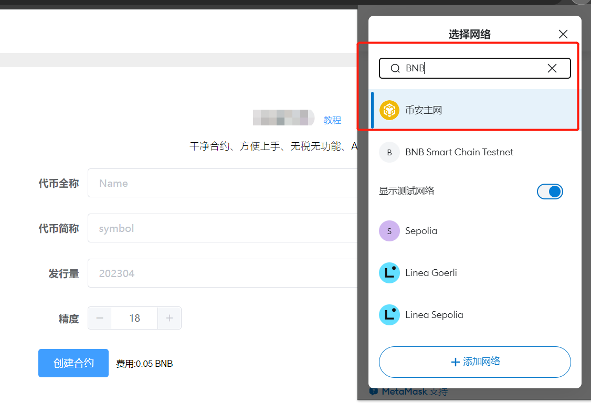
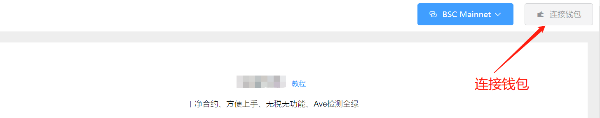
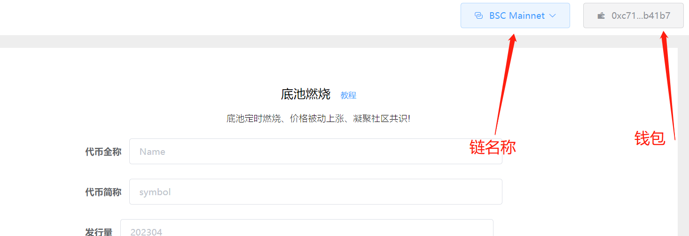
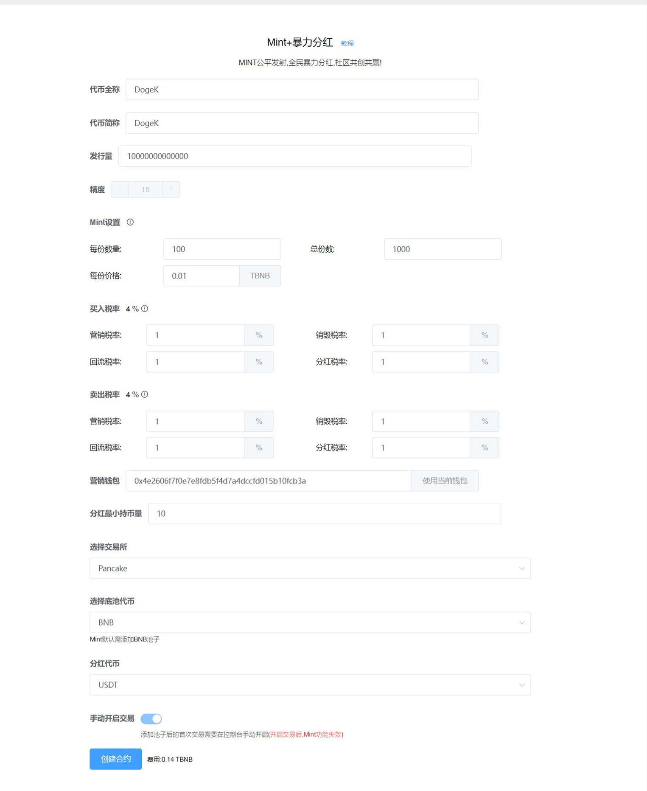
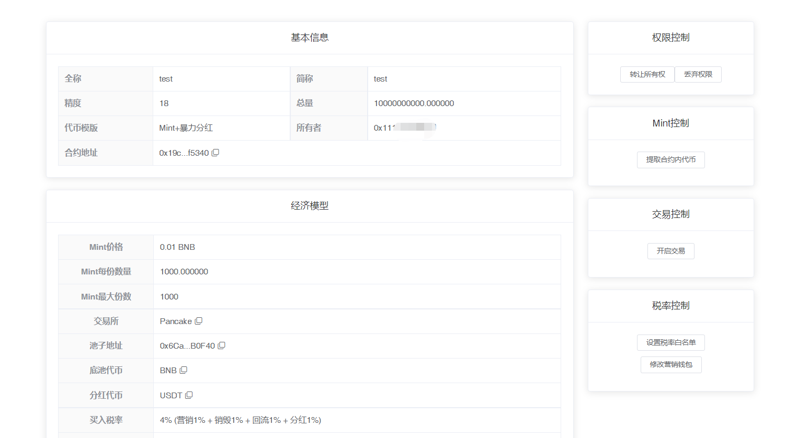
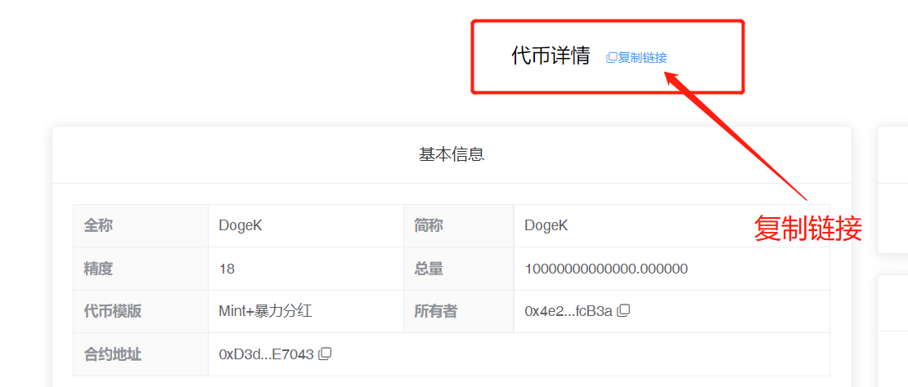

# Mint+持币暴力分红

**注1：**请提前下载好小狐狸钱包插件或欧易Web3钱包插件，小狐狸MetaMask安装教程：[https://help.pandatool.org/practical-information/metamask](https://help.pandatool.org/practical-information/metamask)

**注2：**合约权限很重要，不要随便丢弃！！不要随便丢弃！！不要随便丢弃！！不要随便丢弃！！

**注3：**暴力分红类型的代币可能存在被机器人/夹子恶意套利的风险，如不能接受，可发行标准币

### 1、功能解释 

* [x] **暴力分红解读**
  * 就是`持币分红`的意思，持有你发行的代币，就可以分红其他代币，例如分USDT、分Doge、分ETH等等
* [x] **Mint解读**
  * **Mint概念：**用户将BNB给到合约地址，合约地址按照设定好的比例给用户返币，从而让项目方在开盘前达到私募的目的
  * **Mint怎么开始：**项目方发币之后，将一定数量的代币转入合约地址，用户就能往合约里转BNB开始Mint了
  * **Mint怎么结束：**当项目方加了池子，并且手动开盘交易之后，Mint就会结束。或者Mint份数达到总份数，也会自动结束
  * **Mint的BNB怎么取出：**在控制台有个功能叫“提取合约内代币”，权限地址通过此方法提取BNB

### 2、连接钱包（老手忽略该操作） 

首先，在小狐狸钱包里选择自己要发行代币的链，并切换到所在链。例如我要在币安链发行代币，就切换到币安链上，如下图所示

<figure><figcaption></figcaption></figure>

如果要在Base发币，就切换到Base链。要在以太坊发币，就切换到ETH链，这里就不演示了。

链切换好之后，打开发币页面：[https://www.pandatool.org/#/coinrelease/HoldRefOthers](https://www.pandatool.org/#/coinrelease/HoldRefOthers)，点击右上角连接钱包

<figure><figcaption></figcaption></figure>

之后会弹出小狐狸让你确认要连接的钱包地址

<figure><figcaption></figcaption></figure>

点击下一步并确认之后，就会连接成功了。在发币页面的右上角，会看到你的`链名称`和`钱包地址`，这就算完成了

<figure><figcaption></figcaption></figure>

### 3、参数说明 

连接好钱包后，我们在PandaTool发币页面：[https://www.pandatool.org/#/coinrelease/HoldRefOthers](https://www.pandatool.org/#/coinrelease/HoldRefOthers)，填写相应的参数：

<figure><figcaption></figcaption></figure>

* [x] **代币全称** : 代币的名称信息，如Ethereum
* [x] **代币符号** : 也就是代币简称，如ETH。通常就是`看K软件` `薄饼` `钱包`中显示的那个名称
* [x] **发行量** : 代币发行的总供应量,无法增发,固定发行,如果总量过多的话,需要降低精度
* [x] **精度** : 代表币的小数位数，如：0.000001代表精度为6，一般默认是18
* [x] **Mint设置（不要Mint功能，随便填参数，不能填0）**
  * Mint参数确保设置准备，控制台**不支持**修改
  * **每份数量：**Mint一份可以获得多少代币（单个地址不限次数和份数）
  * **总份数 :** 需要拿出多少份出来供用户Mint（总份数x每份数量≤发行量）
  * **每份价格：**Mint一份需要多少BNB（按照最大整数倍发币，多余的BNB退还）
  * **不要Mint：**随便填参数，发币之后不要往合约地址里转币，直接加池开盘，就不会Mint
* [x] **买入税率** (不需要的部分填0/营销税除外，总比例要小于25%)
  * **营销税率** : 每笔买入都会扣除对应比例代币送进`合约地址`,在**触发阈值**时会自动卖出换成`USDT`(这取决于池子类型，底池是什么币营销钱包就进什么) 发送到你的营销钱包地址
  * **销毁税率** : 每笔买入都会扣除对应比例代币送进`黑洞地址`,达到销毁的目的
  * **回流税率** : 每笔买入都会扣除对应比例代币送进`合约地址`,在**触发阈值**时会自动添加流动性,使池子更厚，加池所得LP默认给到营销钱包
  * **分红税率：**每笔买入都会扣除对应比例代币送进`合约地址`,在**触发阈值**时会自动**卖出**换成USDT(取决于你的分红代币)发放给持币达到`最低分红标准`的用户
* [x] **卖出税率** (不需要的部分不能填空，必须填0，营销税除外，总比例应该小于25%)
  * 这部分跟买入税率解释一样
* [x] **营销钱包：**
  * 如果底池是BNB池子，就获得BNB
* [x] **分红最小持币量：**
  * 一个`持币门槛`限制，最少持币达到某个数量，才能获得分红。该数量不能为0，必须大于0
* [x] **选择交易所：**
  * 不同的链会有不同的交易平台，BSC一般选择薄饼Pancake。选择什么交易所，就必须去那里添加流动性。搞错了会导致机制无法执行，请注意
* [x] **选择底池代币** :
  * 只能现在`BNB`做池子

#### 4、控制台说明（Mint参数不支持修改） 

当我们成功发行代币后，可进入控制台，对代币的各项功能进行管理。我们连接钱包之后，找到控制台，修改下列功能：

<figure><figcaption></figcaption></figure>

* [x] **权限控制**
  * **转让所有权** : 将合约权限转让给其他人（转移权限之前，记得复制`控制台链接`。新的权限地址必须通过控制台链接，才能进入控制台操作）
  * **放弃所有权** : 将合约权限丢至黑洞，永远不能拿回
* [x] **交易控制**
  * **开启交易** : 没打开之前，用户不可加池子，不能交易。打开后，用户才能交易，开启后不能关闭。注意，没开启交易之前，**不要丢弃权限**
* [x] **税率控制**
  * **设置税率白名单：**白名单交易没有税率，可批量添加或移除
  * **修改营销钱包：**更改合约的营销钱包地址
* [x] **合约跟卖20%**
  * 用户买卖时会按照税率要求扣除本币到合约地址，之后合约会将累积的税率本币卖出换成分红币，给到符合分红资格的用户以及营销钱包

### 5、疑问解答 

* [x] **合约权限能不能丢？**
  * 先不要急着丢。等到你提取了Mint的BNB，然后加了池子，开盘交易之后，确定交易税率都没问题，才考虑丢权限的事情
* [x] **Mint怎么开始？怎么结束？**
  * 项目方在发币之后，将一定数量（最好是大于设置的Mint总量）的代币转到`合约地址`，就可以开始Mint。等到加池子，`手动开盘`之后，Mint就会自动结束
* [x] **不想要Mint怎么办？**
  * 发币的时候随便填一些参数，后面不要往合约里面转币，就不会开始Mint，之后直接加池，点击开盘就行
* [x] **为什么暴力分红的控制权这么少？**
  * 传统的暴力分红合约，可以修改税率，添加黑名单，杀机器人等。但是这些功能导致Ave审核无法通过，基于审核考虑，我们仅保留了`白名单`功能，多余的功能全部去除，从而让合约变得更加干净，对用户更友好
* [x] **Mint失败是什么原因？**
  * 价格问题：用户转账的BNB数量低于每份价格，就会失败，BNB原路返还
  * Ga问题：如果gas费设置的太低，就有可能会导致Mint失败
  * 合约总量问题：如果合约地址内已经没有足够的代币用于Mint，那用户自然无法Mint
* [x] **批量Mint与实际发放份数问题**
  * 整倍数Mint：假设1份100个币，每份价格0.03BNB。用户转账0.06BNB，发放200个；用户转账0.09BNB，发放300个币，以此类推
  * 非整倍数Mint：同样是1份100个币，价格0.03BNB。假设用户转账0.04个BNB，则会发放100个币，并退回多余的0.01BNB。如果用户转账0.05BNB，则会发放100个币+退回0.02BNB。假设用户转账0.07BNB，则会发放200个币+退回0.01BNB。合约会自动按照最大倍数发放，多余退还
* [x] **可以用wBNB或者USDT进行Mint吗？**
  * 不支持，目前只支持BNB。如果用户将USDT或者其他代币转入合约地址，将无法取出，请注意
* [x] **为什么钱包里会多出一个PandaTracker的代币？**
  * PandaTracker是一个用于记录分红的代币，以便合约进行分红权重和地址的识别。该代币不可转账，不然会造成分红混乱。
* [x] **权限转移后，新地址怎么进入控制台？**
  * 转移权限之前，需要先复制控制台链接（在控制台上方能看到`复制链接`的按钮）。当权限转移后，新的权限地址使用控制台链接，就可以进入控制台操作

<figure><figcaption>
复制控制台链接
</figcaption></figure>

* [x] **测试网做池子**
  * 如果您是在测试网发币做池子，需严格按照以下参数操作
  * 测试网薄饼：[https://pancakeswap.finance/swap?chain=bscTestnet](https://pancakeswap.finance/swap?chain=bscTestnet)
*   [x] **加/撤池子的税率问题**

    默认加/撤池子是不收手续费的，但是需要满足一定的前提条件才可以：

    * 如果是用BNB做底池，用户必须使用wBNB加池子，且方向一致，才能不收手续费、撤池子同理
* [x] **V2和V3流动性**
  * 在薄饼第一次添加流动性的时候，必须做V2的池子，不能做V3的池子。V3不支持任何机制，所以只能在V2做，请注意

如有不明白或者不清楚的地方，请加入官方电报群：[https://t.me/PandaTool](https://t.me/PandaTool)

