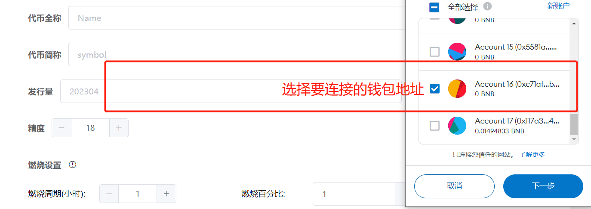
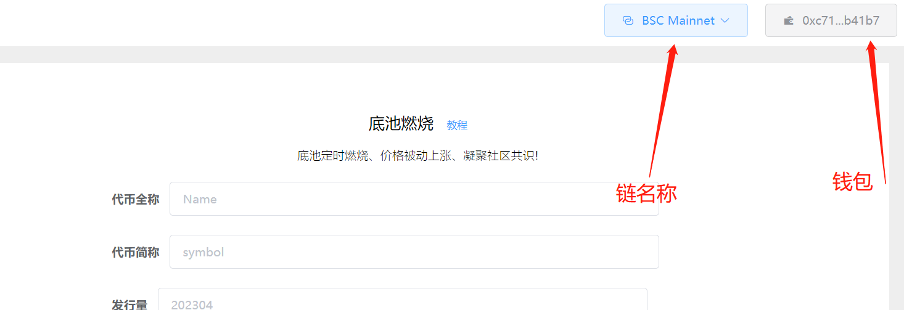
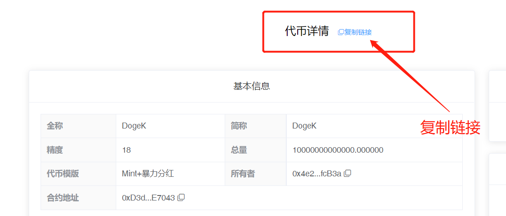

# 持币暴力分红

**注1：**&#x8BF7;提前下载好小狐狸钱包插件或欧易Web3钱包插件，小狐狸MetaMask安装教程：[https://help.pandatool.org/practical-information/metamask](https://help.pandatool.org/practical-information/metamask)

**注2：**&#x5408;约权限很重要，不要随便丢弃！！不要随便丢弃！！不要随便丢弃！！不要随便丢弃！！

### 1、功能解释 

* [x] **持币暴力分红解读**
  * 就是`持币分红`的意思，持有你发行的代币，就可以分红其他代币，例如分USDT、分Doge、分ETH等等
  * 每个钱包获得的分红，取决于该钱包的持仓量。持仓越大，分的越多

### 2、连接钱包（老手忽略该操作） 

首先，在小狐狸钱包里选择自己要发行代币的链，并切换到所在链。例如我要在币安链发行代币，就切换到币安链上，如下图所示

<figure><figcaption></figcaption></figure>

如果要在Base发币，就切换到Base链。要在以太坊发币，就切换到ETH链，这里就不演示了。

链切换好之后，打开发币页面：[https://www.pandatool.org/#/coinrelease/HoldRefOthers](https://www.pandatool.org/#/coinrelease/HoldRefOthers)，点击右上角连接钱包

<figure><figcaption></figcaption></figure>

之后会弹出小狐狸让你确认要连接的钱包地址

<figure><figcaption></figcaption></figure>

点击下一步并确认之后，就会连接成功了。在发币页面的右上角，会看到你的`链名称`和`钱包地址`，这就算完成了

<figure><figcaption></figcaption></figure>

### 3、参数说明 

连接好钱包后，我们在PandaTool发币页面：[https://www.pandatool.org/#/coinrelease/HoldRefOthers](https://www.pandatool.org/#/coinrelease/HoldRefOthers)，填写相应的参数：

<figure><figcaption></figcaption></figure>

* [x] **代币全称** : 代币的名称信息，如Ethereum（支持中文、英文以及中英混合文字）
* [x] **代币符号** : 也就是代币简称，如ETH。通常就是`看K软件` `薄饼` `钱包`中显示的那个名称
* [x] **发行量** : 代币发行的总供应量,无法增发,固定发行,如果总量过多的话,需要降低精度
* [x] **精度** : 代表币的小数位数，如：0.000001代表精度为6，只能是18
* [x] **收币地址：**&#x4EE3;币创建成功后接受代币的地址（该地址默认是白名单）
* [x] **买入税率** (不需要的部分填0/总比例要小于25%)
  * **营销税率** : 每笔买入都会扣除对应比例代币送进`合约地址`,在**触发阈值**时会自动卖出换成`USDT`(这取决于池子类型，底池是什么币营销钱包就进什么) 发送到你的营销钱包地址
  * **销毁税率** : 每笔买入都会扣除对应比例代币送进`黑洞地址`,达到销毁的目的
  * **回流税率** : 每笔买入都会扣除对应比例代币送进`合约地址`,在**触发阈值**时会自动添加流动性,使池子更厚，加池所得LP默认给到营销钱包
  * **分红税率：**&#x6BCF;笔买入都会扣除对应比例代币送进`合约地址`,在有卖单的时候，合约会自动将存储的代币**卖出**换成USDT(取决于你的分红代币)发放给持币达到`最低分红标准`的用户
* [x] **卖出税率** (不需要的部分不能填空，必须填0，营销税除外，总比例应该小于25%)
  * 这部分跟买入税率解释一样
* [x] **营销钱包：**
  * 白名单地址，可以获得营销税和回流LP。如果底池是BNB池子，就获得BNB。如果底池是USDT，就获得USDT
* [x] **分红最小持币量：**
  * 一个`持币门槛`限制，最少持币达到某个数量，才能获得分红。该数量不能为0，必须大于0。该功能**设置后不可修改**，所以请确保设置的符合预期。
* [x] **选择交易所：**
  * 不同的链会有不同的交易平台，BSC一般选择薄饼Pancake。选择什么交易所，就必须去那里添加流动性。搞错了会导致机制无法执行，请注意
* [x] **选择底池代币** :
  * 支持USDT、BNB等交易对
* [x] **选择分红代币**
  * 自行选择要分红的代币，将该代币合约地址填入即可。注意，**选择的分红代币必须有BNB的交易对**，可以正常买卖的。如果该代币流动性过低或者没有BNB交易对，很可能无法分红。因此，一般建议选择流动性好的主流币。

### 4、开关说明 

下面是对代币功能开关的说明与解释：

<figure><figcaption></figcaption></figure>

* [x] **手动开启交易**
  * **必须选它** : 需要在控制台打开交易开关,才能够交易（与加池子）,并且打开后无法重新关闭
  * 开启交易前：只有白名单可以交易与加池子。开启交易后，任何人都可以
* [x] **税率开关**
  * **必须选它** : 创建代币后手动修改税率, 买卖税率各小于25%
* [x] **黑名单功能**
  * **必须选它** : 能够`添加`和`解除`黑名单。被拉入黑名单的地址将无法卖出代币，也不能转账，该功能慎用

#### 5、控制台说明 

当我们成功发行代币后，可进入控制台，对代币的各项功能进行管理。我们连接钱包之后，找到控制台，修改下列功能：

<figure><figcaption></figcaption></figure>

* [x] **权限控制**
  * **转让所有权** : 将合约权限转让给其他人（转移权限之前，记得复制`控制台链接`。新的权限地址必须通过控制台链接，才能进入控制台操作）
  * **放弃所有权** : 将合约权限丢至黑洞，永远不能拿回
* [x] **交易控制**
  * **开启交易** : 没打开之前，用户不可加池子，不能交易。打开后，用户才能交易，开启后不能关闭。注意，没开启交易之前，**不要丢弃权限**
  * **提取合约分红代币** : 将合约地址内遗留的未分发的分红代币提出，给到权限地址
  * **设置黑名单：**&#x53EF;以批量添加或者移除黑名单，黑名单地址能进不能出（无法转账或卖币）
* [x] **税率控制**
  * **修改税率：**&#x53EF;分别修改回流、营销、分红、销毁税率，相加小于25%
  * **设置税率白名单：**&#x767D;名单交易没有税率，可批量添加或移除
  * **修改营销钱包：**&#x66F4;改合约的营销钱包地址
  * **设置分红黑名单**：被拉入黑名单的地址，将无法获得持币分红

### 5、疑问解答 

* [x] **合约权限能不能丢？**
  * 先不要急着丢。等你加了池子，开盘交易之后，确定交易税率都没问题，才考虑丢权限的事情
* [x] **黑洞地址、合约地址会参与分红吗？**
  * 不会，默认的黑洞地址（0x00000.....dead）、代币合约地址、流动性资金池地址，均被排除在分红之外
* [x] **为什么钱包里会多出一个Tracker的代币？**
  * Tracker是一个用于记录分红的代币，以便合约进行分红权重和地址的识别。该代币不可转账，不然会造成分红混乱。
* [x] **加池子、撤池子税率的问题**
  * 默认情况下，加池子、撤池子是没税率的。但不同类型的池子，又有区别
  * 如果是BNB的池子，按照BNB加池，有卖税。按照BNB撤池，有买税。按照wBNB加池/撤池，无税（必须方向正确，前面是BNB，后面是代币）
  * 如果是USDT的池子，只要方向正确（前面是USDT，后面是代币），那就没有税
* [x] **权限转移后，新地址怎么进入控制台？**
  * 转移权限之前，需要先复制控制台链接（在控制台上方能看到`复制链接`的按钮）。当权限转移后，新的权限地址使用控制台链接，就可以进入控制台操作

<figure><figcaption>
复制控制台链接
</figcaption></figure>

* [x] **测试网做池子**
  * 如果您是在测试网发币做池子，需严格按照以下参数操作
  * 测试网薄饼：[https://pancakeswap.finance/swap?chain=bscTestnet](https://pancakeswap.finance/swap?chain=bscTestnet)
* [x] **V2和V3流动性**
  * 在薄饼第一次添加流动性的时候，必须做V2的池子，不能做V3的池子。V3不支持任何机制，所以只能在V2做，请注意

如有不明白或者不清楚的地方，请加入官方电报群：[https://t.me/PandaTool](https://t.me/PandaTool)
