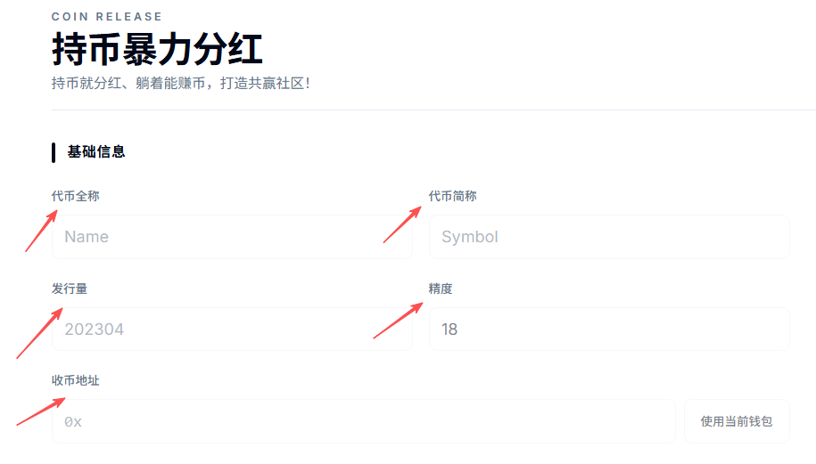
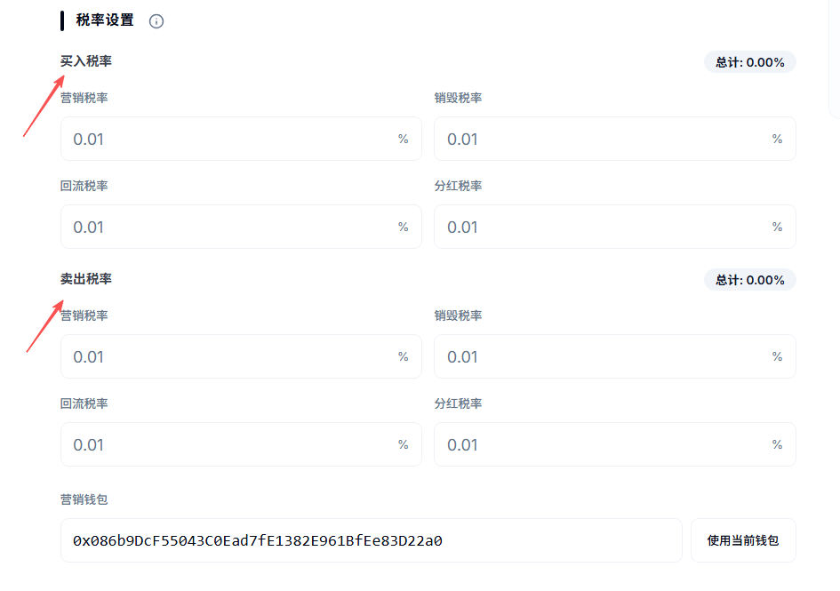

# 分红本币创建教程

## 分红本币一键发币视频教程：


YouTub教程


注1：请提前下载好小狐狸钱包插件或欧易Web3钱包插件，小狐狸MetaMask安装教程：[https://help.pandatool.org/practical-information/metamask](https://help.pandatool.org/practical-information/metamask)


**检测风险提醒：**&#x8BE5;类型的代币创建后安全检测可能**存在风险**，如果您特别在意检测结果，可以选择创建标准代币，标准币没有任何风险。如果您最终决定创建此类型的代币，则说明您**可以接受代币检测风险**


## 1、功能解释

分红本币，指的是持币分本币（所谓本币，就是**你发行的代币**）。用户从每一笔交易中，按照分红税率扣除一定的代币给到所有持币人。每个持币人所能分到的奖励，和它所拥有的代币数额有关系。持仓越大，分到的奖励越多。

注意：该代币合约机制在发币完成后，**默认丢弃权限，不可进行任何修改**，也没有白名单、黑名单、杀机器人、交易开关等功能，是一个相对干净的合约

## 2、连接钱包（老手忽略该操作）

首先，在小狐狸钱包里选择自己要发行代币的链，并切换到所在链。例如我要在币安链发行代币，就切换到币安链上，如下图所示

<figure><figcaption></figcaption></figure>

如果要在Base发币，就切换到Base链。要在以太坊发币，就切换到ETH链，这里就不演示了。

链切换好之后，打开发币页面：[https://www.pandatool.org/zh-CN/coinrelease/holdreflection](https://www.pandatool.org/zh-CN/coinrelease/holdreflection) 点击右上角连接钱包

<figure><figcaption></figcaption></figure>

钱包连接成功后，在发币页面的右上角，会看到你的`链名称`和`钱包地址`，这就算完成了

<figure><figcaption></figcaption></figure>

## 3、参数说明

成功连接钱包后，我们在发币页面填写相应的参数 [https://www.pandatool.org/zh-CN/coinrelease/holdrefothers](https://www.pandatool.org/zh-CN/coinrelease/holdrefothers)：

### **1）基础信息**

<figure><figcaption></figcaption></figure>

* [x] **代币全称** : 代币的名称信息，如Ethereum（支持中文、英文以及中英混合文字）
* [x] **代币符号** : 也就是代币简称，如ETH。通常就是`看K软件` `薄饼` `钱包`中显示的那个名称
* [x] **发行量 :** 代币发行的总供应量,无法增发,固定发行,如果总量过多的话,需要降低精度
* [x] **精度** : 代表币的小数位数如：0.000001代表精度为6。一般默认是18
* [x] **收币地址：**&#x4EE3;币创建成功后，给到哪个地址（接收代币的地址）

### **2）交易设置**

<figure><figcaption></figcaption></figure>

* [x] **交易所 :** BSC链默认是PancakeSwap、ETH/Base默认是Uniswap
* [x] **配对币种：**&#x7528;于做底池的代币，通常是BNB、ETH、USDT、USDC等主流价值币

### **3）**&#x7A0E;率设置

<figure><figcaption></figcaption></figure>

* [x] **买入税率** (不需要的部分填0，总比例小于25%)
  * **营销税率** : 每笔买入都会扣除对应比例本币发送到你的`营销钱包`地址
  * **分红税率** : 每笔买入都会扣除对应比例的本币分给所有`持币地址`
  * **销毁税率** : 每笔买入都会扣除对应比例代币送进`黑洞地址`,达到销毁的目的
  * **回流税率** : 每笔买入都会扣除对应比例代币送进`资金池`
* [x] **卖出税率** (不需要的部分填0)
  * **营销税率** : 每笔卖入都会扣除对应比例本币发送到你的`营销钱包`地址
  * **分红税率** : 每笔卖入都会扣除对应比例的本币分给所有`持币地址`
  * **销毁税率** : 每笔卖入都会扣除对应比例代币送进`黑洞地址`,达到销毁的目的
  * **回流税率** : 每笔卖入都会扣除对应比例代币送进`资金池`
* [x] **营销钱包：**
  * 用来接收营销税率的钱包，接受的是本币

## 4、注意事项

* [x] **黑洞地址会不会参与分红？**
  * 黑洞地址如果持有代币，同样会参与分红
* [x] **权限与修改问题**
  * 合约创建完成后默认丢弃权限，无法再通过控制台对合约进行任何形式的修改
* [x] **测试网问题**
  * 如果您是在BSC测试网发币做池子，需严格按照以下参数操作
  * 测试网薄饼：[https://pancakeswap.finance/swap?chain=bscTestnet](https://pancakeswap.finance/swap?chain=bscTestnet)
  * 测试网USDT：0x66e972502a34a625828c544a1914e8d8cc2a9de5
* [x] **V2和V3流动性**
  * 在薄饼第一次添加流动性的时候，必须做V2的池子，不能做V3的池子。V3不支持任何机制，所以只能在V2做，请注意

如果您有任何关于发币的问题，均可以在Telegram群里咨询我们的志愿者：[https://t.me/pandatool](https://t.me/pandatool)
