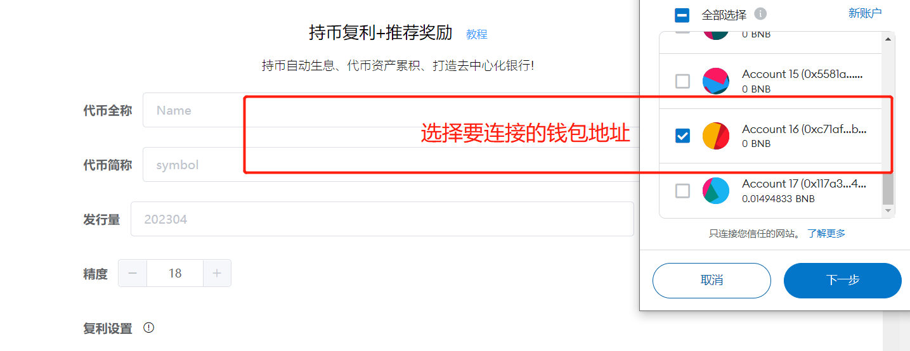
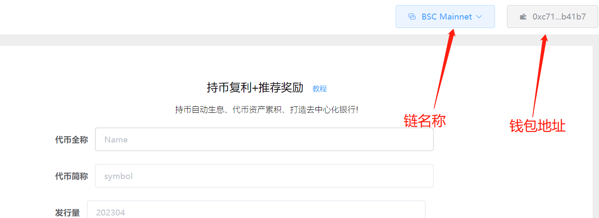
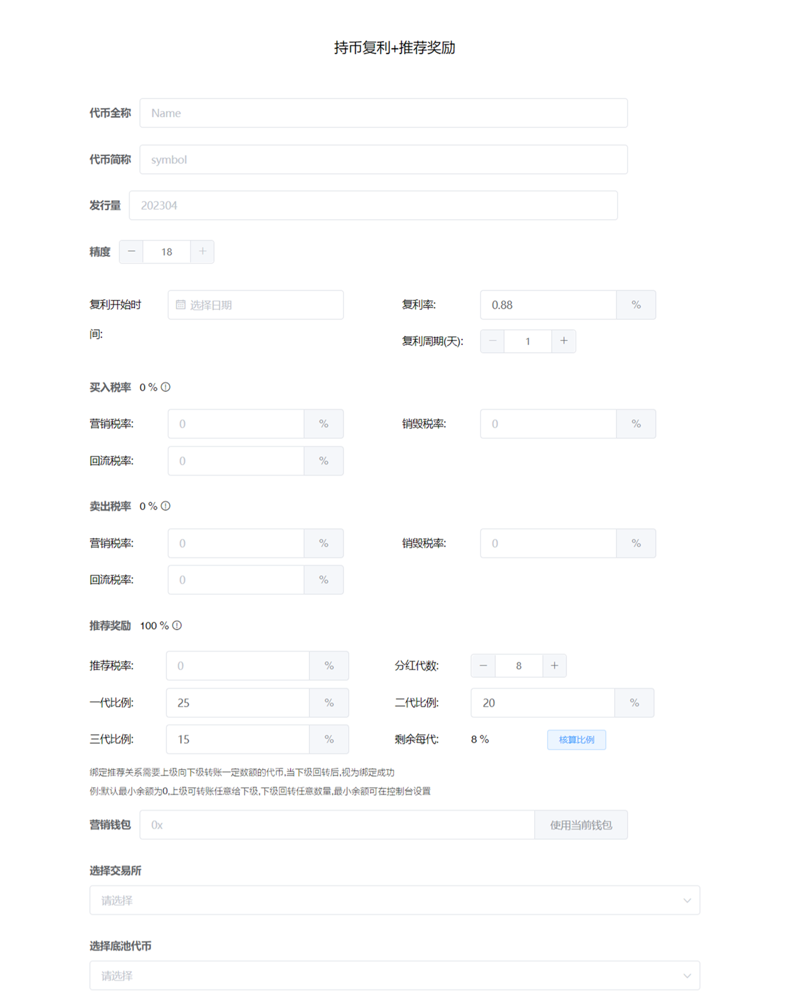
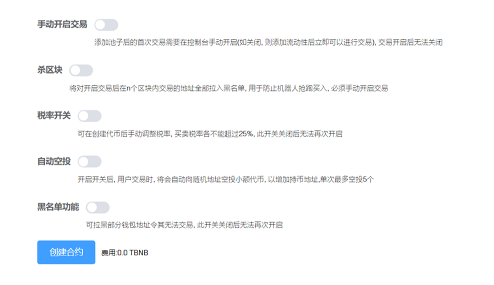
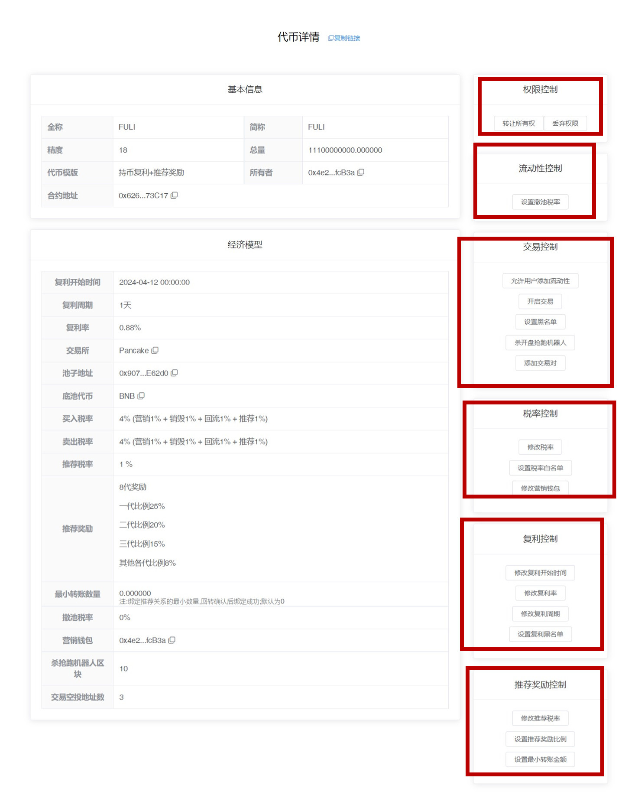

# 持币复利+推荐奖励

### 持币复利+推荐奖励一键发币视频教程


视频操作教程


**注1：**请提前下载好小狐狸钱包插件或欧易Web3钱包插件，小狐狸MetaMask安装教程：[https://help.pandatool.org/practical-information/metamask](https://help.pandatool.org/practical-information/metamask)

**注2：**持币复利的代币可能存在被机器人/夹子恶意套利的风险，如不能接受，可发行标准币

### 1、功能解释

* [x] **持币复利**
  * 钱包内持有代币，即可自动复利生息，代币资产越来越多
* [x] **推荐奖励**
  * 上级通过一定方式绑定下级，可以获得下级交易手续费的本币奖励
  * 为防机器人，上下级关系的绑定方式较为复杂，必须完成一次回转才可以
  * 默认情况下，上级向下级空投任意数量的代币，下级必须回转任意数量的代币，才视为关系绑定成功。如果要修改空投/回转数量，可在`控制台`设定
* [x] **注意**
  * 持币生息获得是本币，上下级奖励的也是本币
  * 如果一个地址已经有了下级，将不能再绑定上级

### 2、连接钱包（老手忽略该操作） 

首先，在小狐狸钱包里选择自己要发行代币的链，并切换到所在链。例如我要在币安链发行代币，就切换到币安链上，如下图所示

<figure><figcaption></figcaption></figure>

如果要在Base发币，就切换到Base链。要在以太坊发币，就切换到ETH链，这里就不演示了。

链切换好之后，打开发币页面：[https://www.pandatool.org/#/coinrelease/holdWithInviter](https://www.pandatool.org/#/coinrelease/holdWithInviter)点击右上角连接钱包

<figure><figcaption></figcaption></figure>

之后会弹出小狐狸让你确认要连接的钱包地址

<figure><figcaption></figcaption></figure>

点击下一步并确认之后，就会连接成功了。在发币页面的右上角，会看到你的`链名称`和`钱包地址`，这就算完成了

<figure><figcaption></figcaption></figure>

### 3、参数说明

连接钱包成功后，我们通过PandaTool可视化页面开启创建，打开[https://pandatool.org/#/coinrelease/holdWithInviter](https://pandatool.org/#/coinrelease/holdWithInviter)，填写相应的参数：

<figure><figcaption></figcaption></figure>

* [x] **代币全称** : 代币的名称信息，如Ethereum
* [x] **代币符号** : 也就是代币简称，如ETH。通常就是`看K软件` `薄饼` `钱包`中显示的那个名称
* [x] **发行量** : 代币发行的总供应量,无法增发,固定发行,如果总量过多的话,需要降低精度
* [x] **精度** : 代表币的小数位数如：0.000001代表精度为6。一般默认是18
* [x] **复利开始时间**
  * 设定复利开始日期，具体时间默认为凌晨零点。如果您选择10月1日，则开始日期是10月1日凌晨00：00分。如果您选择10月2日，则开始日期是10月2日凌晨00：00分
* [x] **复利率**
  * 在一定周期内，你的持币生息利率，和银行的活期存款率是一个意思
* [x] **复利周期**
  * 多久复利一次的意思。假设你设定的复利周期是1天，复利率是1%，那么用户持有100个代币，在1天之后，可获得1个代币，总持仓数量就达到101枚。该周期只能以“天”作为时间单位，无法精确到小时/分钟
* [x] **买入税率** (不需要的部分填0/营销税除外，总比例小于25%)
  * **营销税率** : 每笔买入都会扣除对应比例代币送进`合约地址`,在**触发阈值**时会自动兑换成`USDT`(这取决于池子类型，底池是什么币营销钱包就进什么) 发送到你的营销钱包地址
  * **销毁税率** : 每笔买入都会扣除对应比例代币送进`黑洞地址`,达到销毁的目的
  * **回流税率** : 每笔买入都会扣除对应比例代币送进`合约地址`,在**触发阈值**时会自动加池子,使池子更厚
* [x] **卖出税率** (不需要的部分不能填空，必须填0，营销税除外，总比例小于25%)
  * 这部分跟买入税率解释一样
* [x] **推荐奖励**（比例总和需100%）
  * **推荐税率** : 用于总推荐奖励的手续费。例如设置2%，意思是从每笔交易中扣除2%的代币用于分发所有上级的奖励
  * **分红代数** : 可以有多少代的下级，目前最多可以设置16代
  * **一代比例** : 直推的第一代交易时，上级可以获得多大比例的奖励。假如设置20%，那这个20%就是总推荐2%里面的20%，即总占总交易比例的0.4%。
  * **二代比例：**第二代下级交易时，作为上上级可以获得多大比例的奖励
  * **三代比例：**第三代下级交易时，作为上上上级可以获得多大比例的奖励
  * **剩余每代：**以上设置完成后，点击`核算比例`即可获得剩余每代的奖励比例
  * **注意事项：**所有代数比例相加**100%**，才视为设置成功。如果不会计算，可直接点击`核算比例`，帮你自动核算成功。
* [x] **营销钱包**
  * 用来接收营销税率的钱包，如果底池是USDT池子，就获得USDT。如果底池是BNB池子，就获得BNB
* [x] **选择交易所**
  * 不同的链会有不同的交易平台（如ETH链有UniSwap,BSC链有PancakeSwap 等）。选择什么交易所，就去那里添加流动性。搞错了会导致机制无法执行，请注意
* [x] **选择底池代币**&#x20;
  * 支持选择`BNB` `USDT`等池子，多样化选择

## 4、开关说明

下面是对该模式代币功能开关的说明与解释：

<figure><figcaption></figcaption></figure>

* [x] **手动开启交易**
  * **选它** : 需要在控制台打开交易开关,才能够交易,并且打开后无法重新关闭
  * **不选** : 加池子后立即可以交易
* [x] **杀区块**
  * **选它** : 用于防止机器人抢跑买入,杀3区块意思就是前3区块(bsc大概9秒)买入的地址自动拉黑
  * **不选** : 无法使用该功能，后期也不能再开启该功能
* [x] **税率开关**
  * **选它** : 创建代币后手动调整税率, 买卖税率必须要小于25%
  * **不选** : 创建代币后无法再修改滑点，后期也不能再开启该功能
* [x] **自动空投**
  * **选它** : 每笔交易或转账都会自动向随机地址空投小额代币,以增加持币效果,最多可空投5个地址
  * **不选** : 无法使用该功能
  * 该功能开启后**不可关闭、不可修改**
* [x] **黑名单功能**
  * **选它** : 能够`添加`和`解除`黑名单。被拉入黑名单的地址将无法卖出代币，也不能转账，该功能慎用
  * **不选** : 无法设置和解除黑名单

## 5、控制台使用说明

当我们成功发行代币后，可进入控制台，对代币的各项功能进行管理。我们打开[https://pandatool.org/#/coinrelease/console](https://pandatool.org/#/coinrelease/console)，修改下列功能：

<figure><figcaption></figcaption></figure>

* [x] **权限控制**
  * **转让所有权** : 将合约权限转让给其他人（转移权限之前，记得复制控制台链接。新的权限地址必须通过控制台链接，才能进入控制台操作）
  * **放弃所有权** : 将合约权限丢至黑洞，永远不能拿回
* [x] **流动性控制**
  * **设置撤池税率** : 用户撤池子默认不收手续费，可以手动设置最高必须小于25%的手续费
* [x] **交易控制**
  * **允许用户添加流动性** : 该功能打开之前，非白名单地址不能加池子
  * **开启交易** : 打开后，用户才能交易，开启后不能关闭
  * **设置黑名单：**可以批量添加或者移除黑名单，被加入黑名单的地址无法卖出代币或者转账
  * **杀开盘抢跑机器人：**主要是修改抢跑区块，适用于未开盘项目
  * **添加交易对：**如果您的代币在不同的交易所上架, 或存在不同的交易对, 请将对应的流动池地址添加进来, 否则税率等机制将在其他交易对上不起作用
* [x] **税率控制**
  * **修改税率**：可分别修改回流、营销、销毁税率，和推荐税率相加要小于25%
  * **设置税率白名单：**白名单交易没有税率，可批量添加或移除
  * **修改营销钱包：**更改合约的营销钱包地址
* [x] **复利控制**
  * **修改复利开始时间:** 该功能只在复利开始前有效，且修改时间必须大于当前时间
  * **修改复利率 :** 修改用户持币生息的比例
  * **修改复利周期：**以“天”为单位进行修改
  * **设置复利黑名单：**被加入黑名单的地址，将无法获得复利收益
* [x] **推荐奖励控制**
  * **修改推荐税率 :** 买卖同时修改，和其他税率相加最大要小于25%
  * **设置推荐奖励比例** : 操作方法和前面一样，如不会计算，可直接点击`核算比例`，自动计算
  * **设置最小转账数量：**如果设定最小转账数量为0.1，理论上，上级需转账至少0.1给下级，下级至少回转0.1，即可绑定推荐关系。

## 6、注意事项

* [x] **持币生息排除地址**
  * 合约权限地址、合约地址、资金池地址均被排除，不会进行持币生息
* [x] **复利如何实现？复利的代币从哪里来？**
  * 增发而来，代币复利以`增发`的形式实现
* [x] **最小转账金额**
  * 最小转账金额不止应用在推荐关系的绑定上，也应用在日常转账和买卖方面。如果购买或者转账的数量低于最小转账金额，则不会发生转账，你购买的代币也不会到账。
* [x] **权限转移后，新地址怎么进入控制台？**
  * 转移权限之前，需要先复制控制台链接（在控制台上方能看到`复制链接`的按钮）。当权限转移后，新的权限地址使用控制台链接，就可以进入控制台操作

<figure><figcaption>
复制控制台地址
</figcaption></figure>

* [x] **测试网做池子**
  * 如果您是在测试网发币做池子，需严格按照以下参数操作
  * 测试网薄饼：[https://pancakeswap.finance/swap?chain=bscTestnet](https://pancakeswap.finance/swap?chain=bscTestnet)
  * 测试网USDT：0x66e972502a34a625828c544a1914e8d8cc2a9de5
*   [x] **加/撤池子的税率问题**

    默认加/撤池子是不收手续费的，但是需要满足一定的前提条件才可以：

    * 如果是用USDT`做底池`，用户加池子的`方向`需要和初始加池子的方向保持一致。所谓“方向”，就是USDT和代币哪个在前，哪个在后的问题。如果方向不一致，加池仍然要收手续费
    * 如果是用BNB做底池，用户必须使用wBNB加池子，且方向一致，才能不收手续费、撤池子同理
* [x] **V2和V3流动性**
  * 在薄饼第一次添加流动性的时候，必须做V2的池子，不能做V3的池子。V3不支持任何机制，所以只能在V2做，请注意

如有不明白或者不清楚的地方，请加入官方电报群：[@PandaTool](https://t.me/PandaTool)
