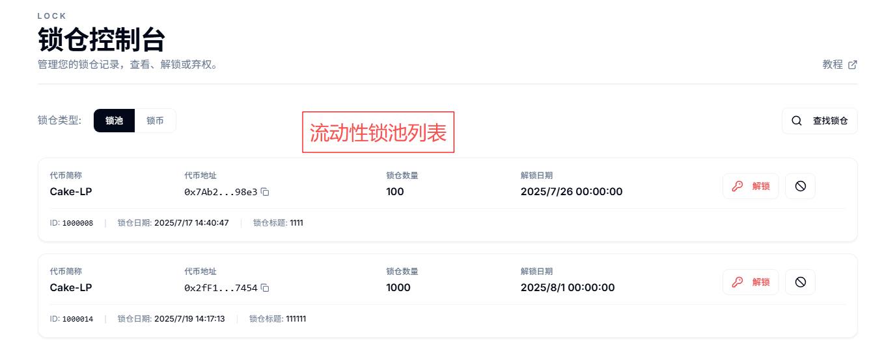
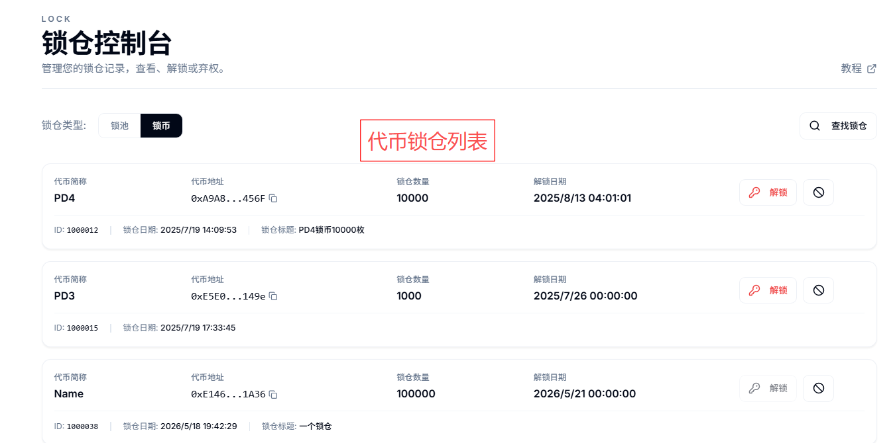
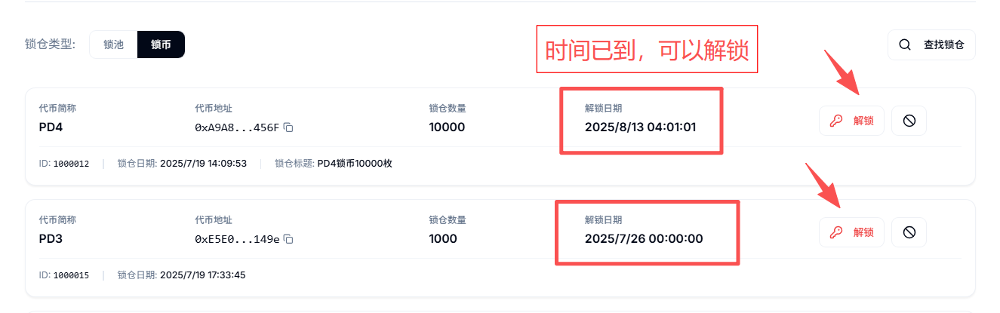
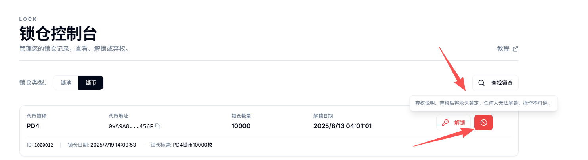

# 解锁池子或代币教程

如果您到这里，说明您已经成功创建了一次锁仓。不管是锁币还是锁池，都算是对我们平台的使用有了了解。这个教程，主要是教大家进行`解锁`，以及`永久锁`。

## **一、概念解读**

### **1、什么是解锁？**

* 所谓解锁，就是将锁在智能合约里面的代币提取出来，使其从新进入到市场流通。想要解锁，必须在到期以后才能实现，解锁时间未到来之前无法操作。

### **2、什么是永久锁？**

* 永久锁指的将代币永久放在智能合约里，谁也无法取出。这种永久性的行为是不可逆的，一旦操作，任何人将永远不能解锁，直到区块链消失。

## **二、操作流程**

我们进入PandaTool的锁仓控制台：[https://www.pandatool.org/zh-CN/lock/list](https://www.pandatool.org/zh-CN/lock/list) ，右上角连接钱包后，就能看到该钱包地址内的所有锁仓信息：**左边是锁池信息，右边是锁币信息**

<figure><figcaption></figcaption></figure>

<figure><figcaption></figcaption></figure>

### **1、点击解锁**

如果您的锁时间已经到了，那么点击解锁，钱包确认，即可将代币取回

<figure><figcaption></figcaption></figure>

### **2、点击弃权**

所谓的弃权，就是永久锁的意思。弃权，就是您主动放弃取回代币的权限，即：您将永远无法取回代币。

<figure><figcaption></figcaption></figure>

注意，此操作不可逆，一旦确认，将无法找回。

## **三、疑问解答**

**1、我不是在PandaTool创建的锁，也可以解锁吗？**

* 答：这个得分情况。如果您是在Pinksale粉红创建的锁，可以在PandaTool查看并解锁。如果不是，则无法解锁。

**2、解锁或者弃权需要收费吗？**

* 答：目前使用解锁或者弃权工具，是不收取任何费用的，我们只是在创建锁的时候收取少量的服务费。

**3、创建锁之后，Ave能显示吗？**

* 答：完全可以，不管是创建锁仓还是锁池，Ave查询都可以正常显示

如果您有任何其他的问题，均可以在Telegram群里咨询我们的志愿者：[https://t.me/pandatool](https://t.me/pandatool)
