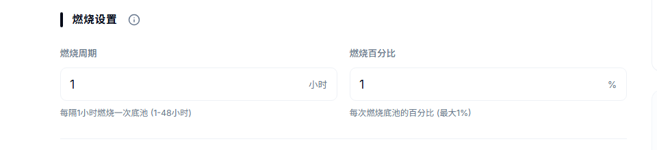
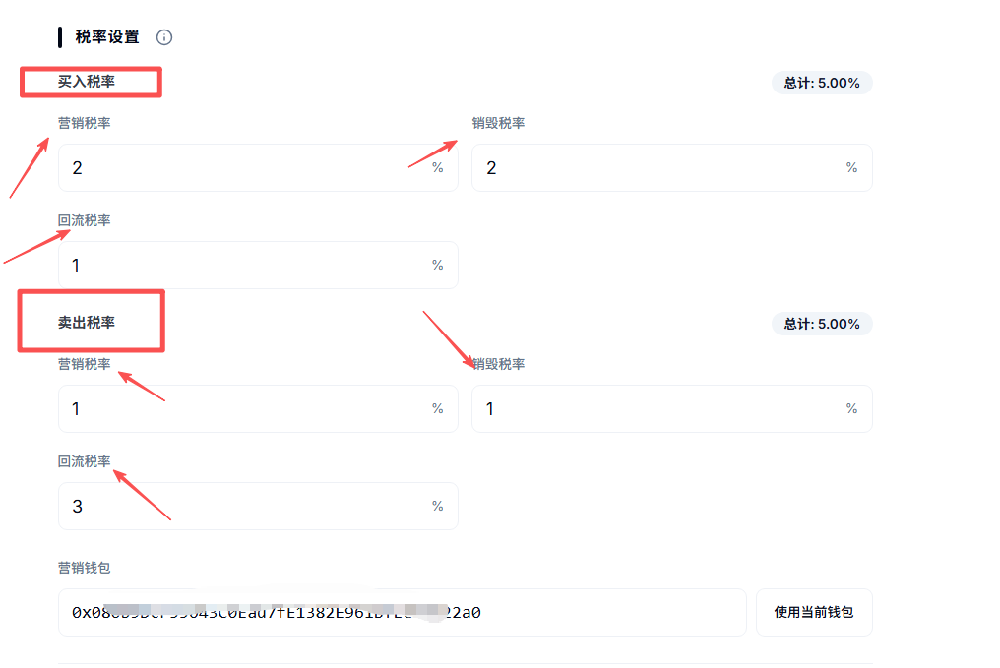
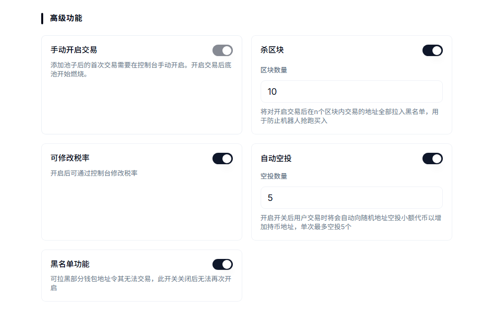
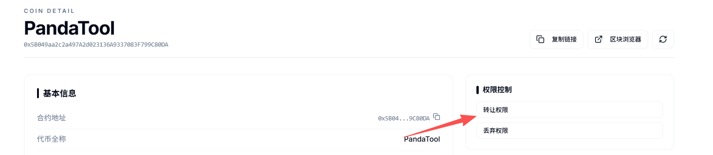
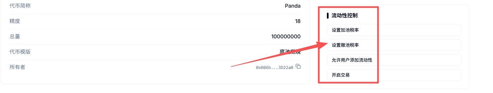
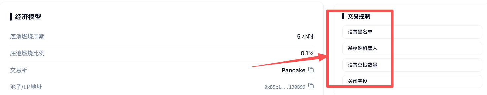
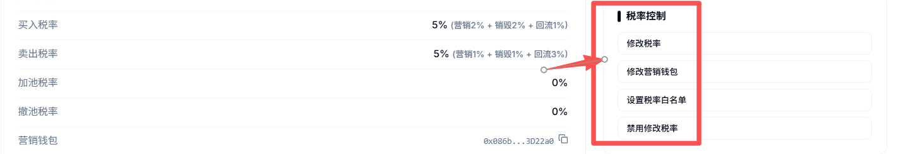
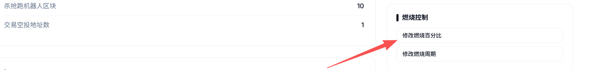
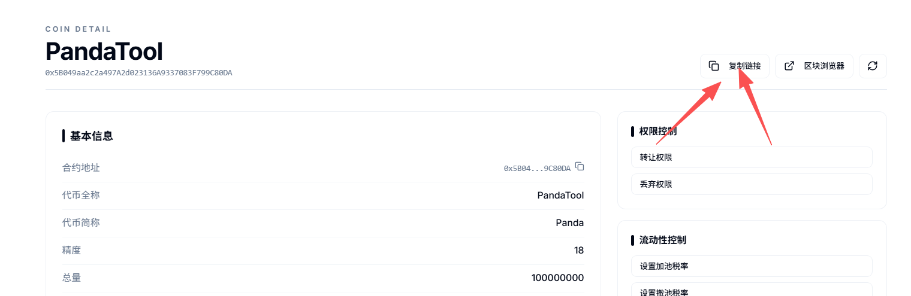

# 底池燃烧代币创建教程

**注1：**&#x8BF7;提前下载好小狐狸钱包插件或欧易Web3钱包插件，小狐狸MetaMask安装教程：[https://help.pandatool.org/practical-information/metamask](https://help.pandatool.org/practical-information/metamask)

**注2：**&#x5408;约权限很重要，不要随便丢弃！！不要随便丢弃！！不要随便丢弃！！不要随便丢弃！！


**检测风险提醒**：该类型的代币创建后安全检测可能**存在风险**，如果您特别在意检测结果，可以选择创建标准代币，标准币没有任何风险。如果您最终决定创建此类型的代币，则说明您**可以接受代币检测风险**


### 1、功能解释 

* [x] **燃烧概念**
  * 项目方加池子后，底池内代币（自己发行的币）可以按照固定周期进行燃烧/销毁。当底池内的代币减少，而USDT或BNB不变的情况下，你的代币价格就会被动上涨
* [x] **燃烧解读**
  * **燃烧周期：**&#x53EF;以设置每1小时燃烧一次，也可以设置每24小时一次
  * **燃烧率：**&#x6BCF;个周期内最小燃烧率为0.01%，最大为1%
  * **燃烧条件：**&#x6BCF;个周期内必须有卖单（非白名单的卖单），才能燃烧
  * **燃烧停止：**&#x5F53;底池内剩余100个本币时，将自动停止燃烧

### 2、连接钱包（老手忽略该操作） 

首先，在小狐狸钱包里选择自己要发行代币的链，并切换到所在链。例如我要在币安链发行代币，就切换到币安链上，如下图所示

<figure><figcaption></figcaption></figure>

如果要在Base发币，就切换到Base链。要在以太坊发币，就切换到ETH链，这里就不演示了。

链切换好之后，打开发币页面：[https://www.pandatool.org/zh-CN/coinrelease/lpburn](https://www.pandatool.org/zh-CN/coinrelease/lpburn) 点击右上角连接钱包

<figure><figcaption></figcaption></figure>

之后会弹出小狐狸让你确认要连接的钱包地址，点击下一步并确认之后，就会连接成功了。在发币页面的右上角，会看到你的`链名称`和`钱包地址`，这就算完成了

<figure><figcaption></figcaption></figure>

### 3、参数说明 

老规矩，我们在PandaTool发币页面：[https://www.pandatool.org/zh-CN/coinrelease/lpburn](https://www.pandatool.org/zh-CN/coinrelease/lpburn)，填写相应的参数：

#### **1）基础信息**

<figure><figcaption></figcaption></figure>

* [x] **代币全称** : 代币的名称信息，如PandaTool（支持中文、英文以及中英混合文字）
* [x] **代币符号** : 也就是代币简称，如PT。通常就是`看K软件` `薄饼` `钱包`中显示的那个名称
* [x] **发行量 :** 代币发行的总供应量,无法增发,固定发行。如果总量过多的话,需要降低精度
* [x] **精度** : 代表币的小数位数如：0.000001代表精度为6。这里只能填18
* [x] **收币地址：**&#x7528;来接受代币的地址（该地址默认白名单）

####

<figure><figcaption></figcaption></figure>

* [x] **燃烧设置**
  * **燃烧周期(小时)：**&#x591A;久燃烧一次，最大可设置48小时
  * **燃烧百分比** : 即`燃烧率`，每个周期内燃烧多少比例的代币。最小为0.01%，最大为1%

#### **3）交易设置**

<figure><figcaption></figcaption></figure>

* [x] **交易所 :** BSC链默认是PancakeSwap、ETH/Base默认是Uniswap
* [x] **配对币种：**&#x7528;于做底池的代币，通常是BNB、ETH、USDT、USDC等主流价值币

#### **4）税率设置**

<figure><figcaption></figcaption></figure>

* [x] **买入税率** (不需要的部分填0/总比例要小于25%)
  * **营销税率** : 每笔买入都会扣除对应比例代币送进`合约地址`,在**触发阈值**时会自动**卖出**换成`USDT`(这取决于池子类型，底池是什么币营销钱包就进什么) 发送到你的营销钱包地址
  * **销毁税率** : 每笔买入都会扣除对应比例代币送进`黑洞地址`,达到销毁的目的
  * **回流税率** : 每笔买入都会扣除对应比例代币送进`合约地址`,在**触发阈值**时会自动添加流动性,使池子更厚，加池所得LP默认给到营销钱包
* [x] **卖出税率** (不需要的部分不能填空，必须填0，总比例要小于25%)
  * 这部分跟买入税率解释一样
* [x] **营销钱包：**
  * 用来接收营销税率钱包，如果底池是USDT池子，就获得USDT。如果底池是BNB池子，就获得BNB
  * 用来接收回流LP的钱包，且是白名单

### 4、高级功能 

下面是对该模式高级代币功能的说明与解释：

<figure><figcaption></figcaption></figure>

* [x] **手动开启交易**
  * **必须选它** : 该功能机制必须选择手动开启交易
  * 开启交易之前，一般的散户不能交易与加池子，只有税率白名单可以
* [x] **杀区块**
  * **选它** : 用于防止机器人抢跑买入,杀3区块意思就是前3区块(BSC上单个区块3秒左右)买入的地址自动拉黑
  * **不选** : 无法使用该功能，后期也不能再开启该功能
* [x] **可修改税率**
  * **选它** : 创建代币后手动调整税率, 买卖、税率各小于25%（该功能谨慎使用）
  * **不选** : 创建代币后无法再修改税率，后期也不能再开启该功能
* [x] **自动空投**
  * **选它** : 每笔交易都会自动向随机地址空投小额代币,以增加持币效果,最多可空投5个地址（转账不空投、白名单不空投）
  * **不选** : 无法使用该功能
* [x] **黑名单功能**
  * **选它** : 能够`添加`和`解除`黑名单。被拉入黑名单的地址将无法卖出代币，也不能转账，该功能慎用
  * **不选** : 无法设置和解除黑名单

### 5、控制台说明 

当我们成功发行代币后，可进入控制台，对代币的各项功能进行管理。我们连接钱包之后，打开[https://www.pandatool.org/zh-CN/coinrelease/console](https://www.pandatool.org/zh-CN/coinrelease/console)，修改下列功能：

<figure><figcaption></figcaption></figure>

* [x] **权限控制**
  * **转让所有权** : 将合约权限转让给其他人（转移权限之前，记得复制`控制台链接`。新的权限地址必须通过控制台链接，才能进入控制台操作）
  * **放弃所有权** : 将合约权限丢至黑洞，永远不能拿回，该操作**谨慎使用**

<figure><figcaption></figcaption></figure>

* [x] **流动性控制**
  * **设置加池税率**: 用户加池子默认不收手续费，可以手动设置最高小于25%的手续费。注意，_**如果选择BNB底池，则需用WBNB加池子，方可没有手续费**_**（**&#x52A0;池子的税率会给&#x5230;**`合约地址`）**
  * **设置撤池税率** : 用户撤池子默认不收手续费，可以手动设置**最高100%**&#x7684;手续费。注意，_**如果选择BNB底池，则需用wBNB撤池子，方可没有手续费。**_**（**&#x64A4;池子的税率&#x4F1A;**`直接销毁`）**
  * **方向问题：**&#x4E0D;管是USDT池子还是BNB池子，不管是加池子还是撤池子，**方向都要正确**，即：BNB/USDT在前面或上面，代币在后面或者下面。如果方向不正确，税率可能不生效
  * **允许用户添加流动性：**&#x5F00;启后，非白名单地址可以加池，但不能撤池
  * **开启交易** : 打开后，非白名单用户才能交易、加池子撤池子，开启后不能关闭

<figure><figcaption></figcaption></figure>

* [x] **交易控制**
  * **设置黑名单：**&#x53EF;以批量添加或者移除黑名单
  * **杀开盘抢跑机器人：**&#x4E3B;要是修改抢跑区块，适用于未开盘项目
  * **设置空投数量：**&#x53EF;以修改每笔交易/转账的随机空投地址数，保持在1\~5
  * **关闭空投：**&#x70B9;击该功能按钮后，空投功能就会失效

<figure><figcaption></figcaption></figure>

* [x] **税率控制**
  * **修改税率**：可分别修改回流、营销、分红、销毁税率，相加小于25%
  * **修改营销钱包：**&#x66F4;改合约的营销钱包地址，该地址默认白名单
  * **设置税率白名单：**&#x767D;名单交易没有税率；可以开盘前进行交易/加撤池，且交易不会产生空投
  * **禁用修改税率：**&#x8BE5;功能点击后，将无法再修改税率

<figure><figcaption></figcaption></figure>

* [x] **燃烧控制**
  * **修改燃烧百分百：**&#x4FEE;改每个周期内代币燃烧的比例，最大为1%，最小为0.01%
  * **修改燃烧周期** : 修改每次燃烧的周期时间
* [x] **代币控制**
  * **提取合约分红代币** : 将合约地址内遗留的未分发的分红代币提出，提取的代币给到权限地址

### 6、疑问解答 

* [x] **合约权限能不能丢？**
  * 先不要急着丢。等开盘交易之后，确定交易税率都没问题，才考虑丢权限的事情
* [x] **为什么没有燃烧？**
  * 可能没到时间：第一次燃烧的时间为开启交易后的第一个周期内的第一笔卖单的时间。例如，你设置的燃烧周期是1小时，你在晚上9点开启交易，那么等到晚上10点之后，有了第一笔卖单，才会燃烧
  * 可能没有卖单：如果一个周期内都没有卖单，那这个周期也是没有燃烧产生的
  * 可能卖单是项目方：项目方地址大多是白名单地址，白名单地址卖单是没用的，这个要注意
* [x] **权限转移后，新地址怎么进入控制台？**
  * 转移权限之前，需要先复制控制台链接（在控制台上方能看到`复制链接`的按钮）。当权限转移后，新的权限地址使用控制台链接，就可以进入控制台操作

<figure><figcaption></figcaption></figure>

* [x] **测试网做池子**
  * 如果您是在测试网发币做池子，需严格按照以下参数操作
  * 测试网薄饼：[https://pancakeswap.finance/swap?chain=bscTestnet](https://pancakeswap.finance/swap?chain=bscTestnet)
  * 测试网USDT：0x66e972502a34a625828c544a1914e8d8cc2a9de5
*   [x] **加/撤池子的税率问题**

    默认加/撤池子是不收手续费的，但是需要满足一定的前提条件才可以：

    * 如果是用USDT做底池，必须保证方向正确，即：USDT在前面/上面，代币在下面/后面，才可以。
    * 如果是用BNB做底池，用户必须使用wBNB加池子，且方向一致，才能不收手续费
    * 撤池子的税率&#x4F1A;**`直接销毁`**
    * 撤池子税率最大可以到**100%**
* [x] **V2和V3流动性**
  * 在薄饼第一次添加流动性的时候，必须做V2的池子，不能做V3的池子。V3不支持任何机制，所以只能在V2做，请注意

如有不明白或者不清楚的地方，请加入官方电报群：[https://t.me/PandaTool](https://t.me/PandaTool)
