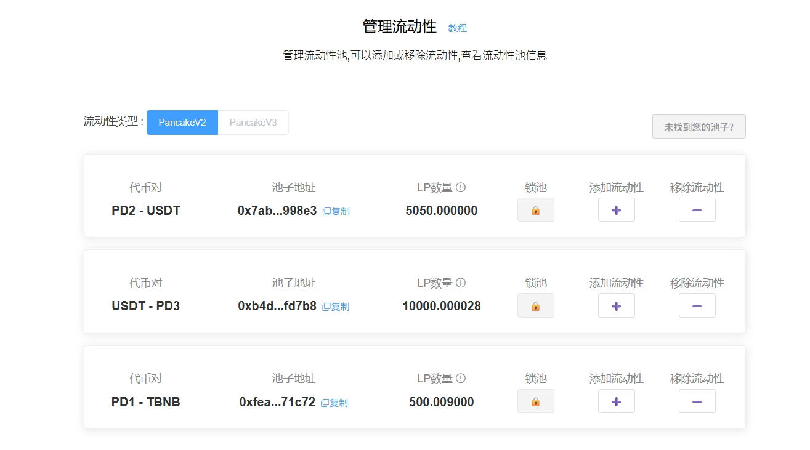
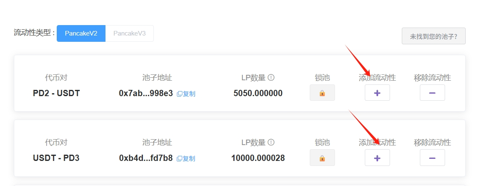
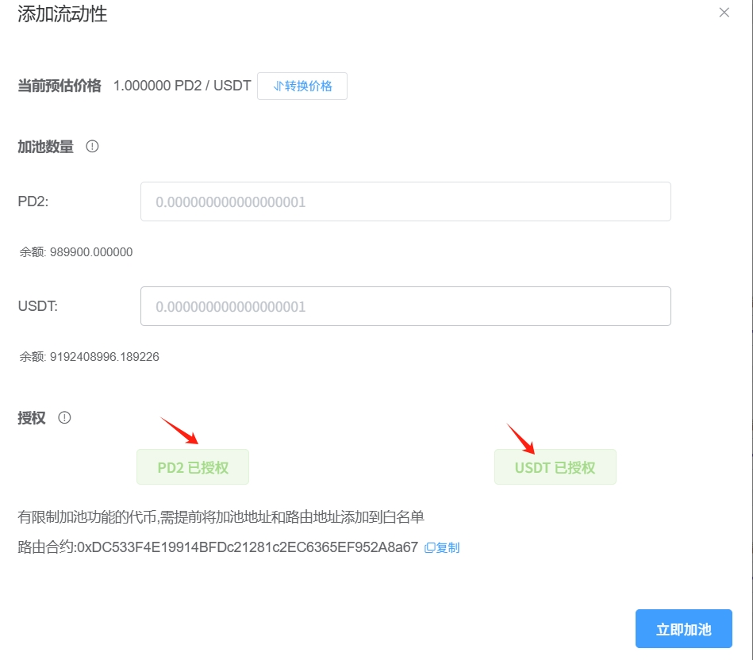
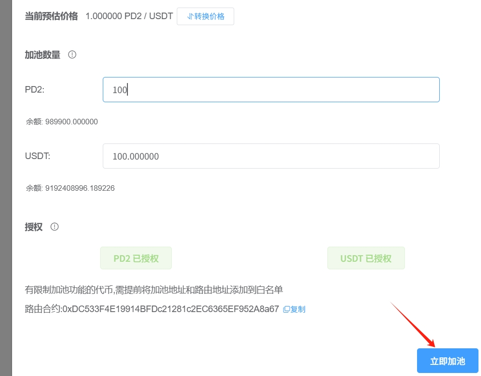
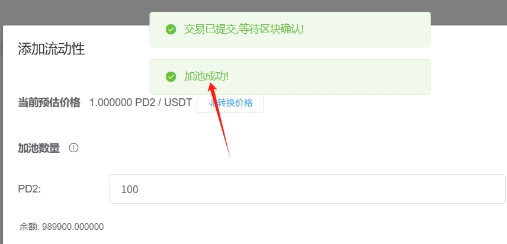
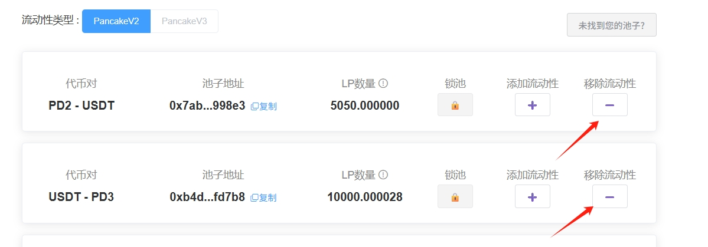
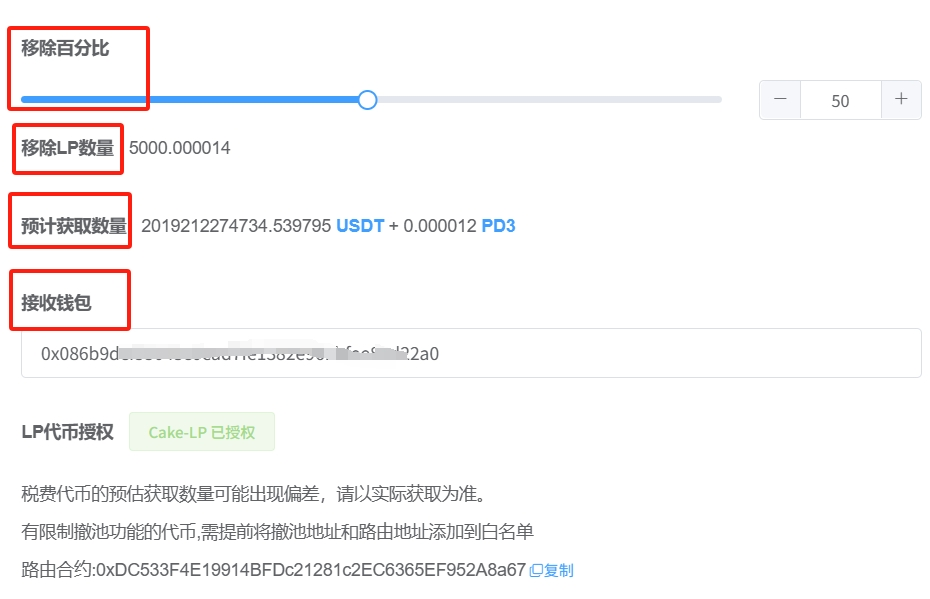
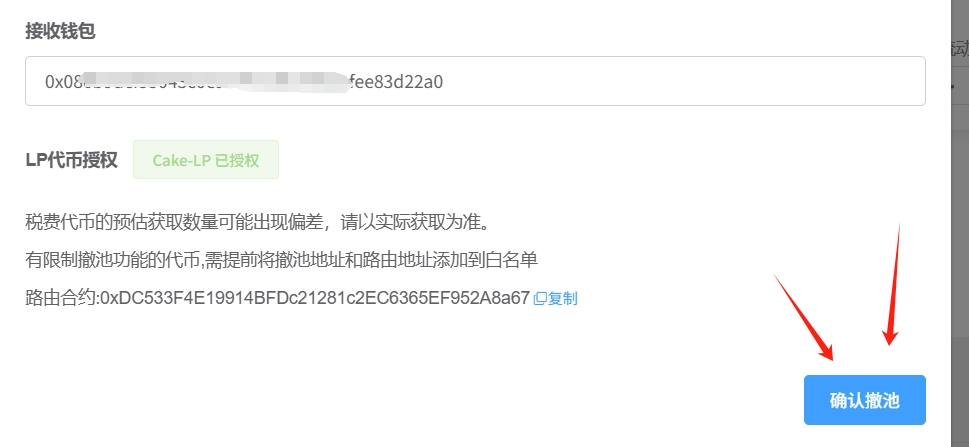
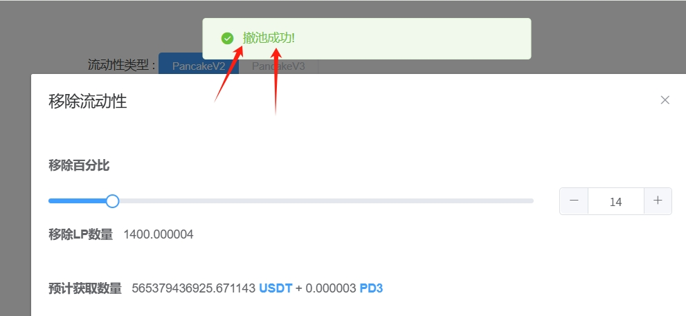

# 增加/移除流动性资金池教程

如果您已经在Pancake薄饼或者Uniswap创建了一个流动性资金池，该如何看到自己的池子呢？通过我们的[流动性控制台](https://www.pandatool.org/#/LPmanage?lang=zh-CN)查看，如下图所示：

<figure><figcaption></figcaption></figure>

接下来可以有两个操作：添加流动性和移除流动性。

* **添加流动性：**&#x7EE7;续向底池内添加代币，让池子越来越大
* **移除流动性：**&#x5C06;池子资金取出，使交易无法继续进行

不管是添加流动性，亦或者移除流动性，都是在对已经有的流动性资金池进行管理。这个管理，主要是基于PandaTool开发的流动性控制台实现。

如果您想了解该如何添加或者移除流动性池，可以阅读下面的教程：

### **1、打开andaTool并连接钱包**

首先，我们进入PandaTool的流动性控制台 [https://www.pandatool.org/#/LPmanage?lang=zh-CN](https://www.pandatool.org/#/LPmanage?lang=zh-CN)   ，然后右上角连接钱包，并选择对应的区块链

<figure><figcaption></figcaption></figure>

成功链接钱包后，刷新一下，就会自动查询到当前钱包的流动性情况，如下图

<figure><figcaption></figcaption></figure>

### **2、添加流动性**

添加流动性，我们也可以称之为：增加流动性。指的是，当您创建流动性资金池之后，觉得池子太小，可供交易的金额不大，此时通过增加流动性功能，将更多的代币注入池子中，从而加大资金池

<figure><figcaption></figcaption></figure>

我们点击`添加流动性`按钮后，可以进入到具体的添加页面

<figure><figcaption></figcaption></figure>

* **加池数量：**&#x586B;入您要注入资金池的代币数量（基础代币与报价代币）
* **授权：**&#x5206;别授权基础代币和报价代币，点击授权并钱包确认
* **立即加池：**&#x786E;认好入池数量和授权后，点击`立即加池`按钮

<figure><figcaption></figcaption></figure>

如果加池成功，网站会有相关提示

<figure><figcaption></figcaption></figure>

### **3、移除流动性**

移除流动性，我们也称之为：撤池子，就是将流动性资金池内的代币撤出。撤出可以分比例撤出，也可以全部撤出。如果将流动性全部撤出，意味着该代币将无法交易。撤出的代币归操作钱包所有，即谁撤的归谁。

<figure><figcaption></figcaption></figure>

点击撤出流动性的按钮后，我们可以看到具体的详情

<figure><figcaption></figcaption></figure>

* **移除百分比：**&#x9009;择您要撤出的流动性比例，从0\~100%
* **移除LP数量：**&#x8FD9;些LP数量将会被销毁掉，数量是自动计算的
* **预计获取数量：**&#x60A8;预计可以获得的代币数量（包括基础代币与报价代币）
* **接收钱包：**&#x63A5;收代币的钱包，默认这个钱包是操作钱包，当然也可以选择其他钱包
* **Lp代币授权：**&#x79FB;除流动性前需要将Lp授权给路由合约，以便其进行撤池操作

确定好移除比例和接收钱包后，我们点`击确认撤池`按钮，此时会跳出钱包进行确认

<figure><figcaption></figcaption></figure>

等待几秒钟，会提示您撤池成功

<figure><figcaption></figcaption></figure>

至此，整个关于添加流动性和移除的教程就算是结束了。和创建流动性相比，增加或者撤出池子的流程还是比较简单的。

接下来，我们看一些疑问

### **4、疑问解答**

**为什么加池/撤池会失败？**

* 答：主要是两个原因。第一，确认一下钱包是否有足够的原生代币。如果是在BSC链，钱包内至少有**0.011BNB**才可以成功。如果余额没有问题，我们再看第二个原因，确认一下是否将路由地址加入白名单。特别是功能性代币（如带有交易限制、持仓限制等），需要将路由地址加入白名单才可以完成添加或移除流动性的操作
* BSC链路由地址：`0xa52B2899C3B33C8e16eFd8399d23E9b36d41F7Fd`

如何您还有其他问题，都可以进入Telegram电报群找志愿者解答： [https://t.me/pandatool](https://t.me/pandatool)
