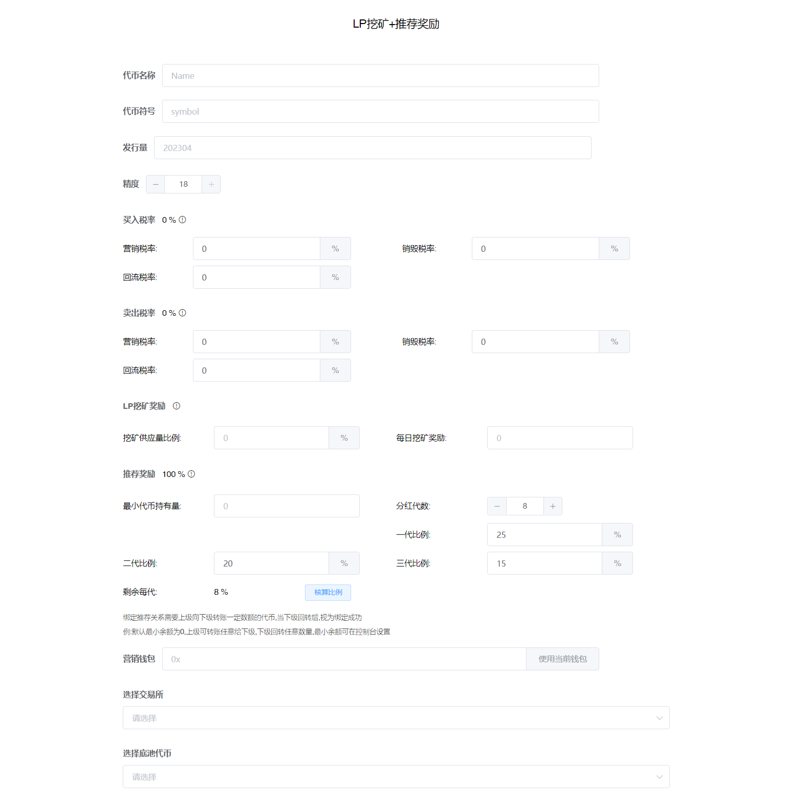
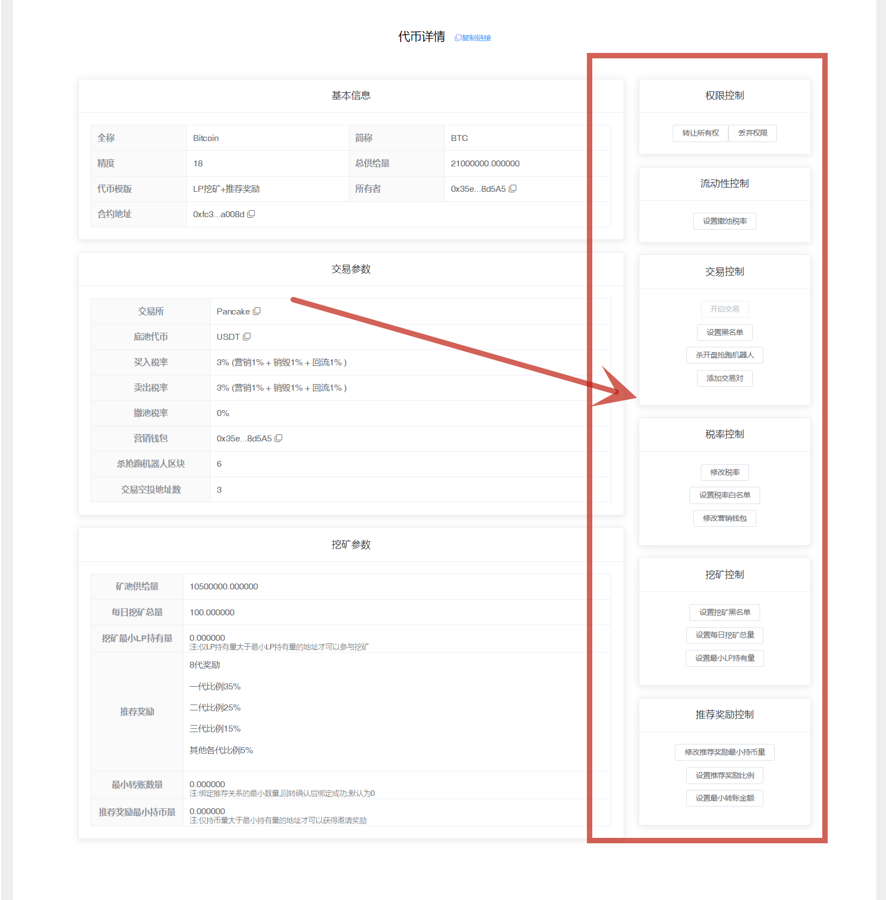
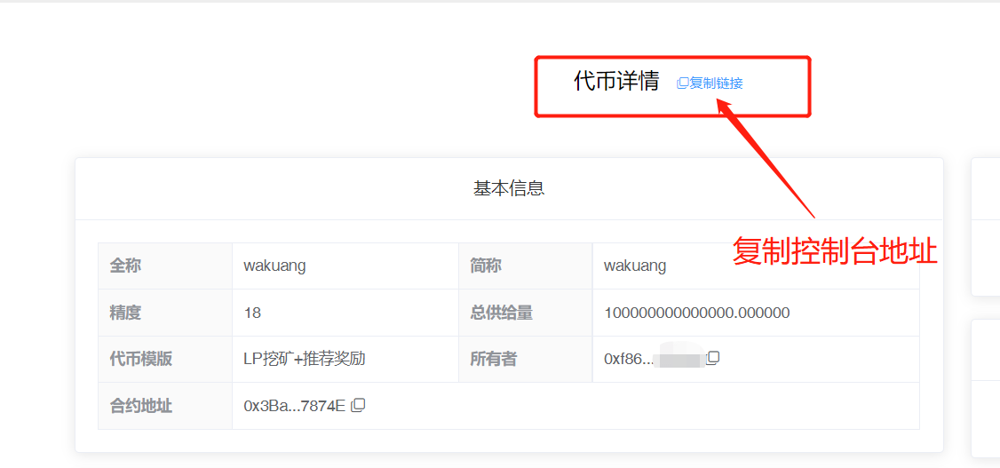

# LP挖矿+推荐奖励

LP分红+推荐奖励一键发币视频教程：



**注1：**请提前下载好小狐狸钱包插件或欧易Web3钱包插件，小狐狸MetaMask安装教程：[https://help.pandatool.org/practical-information/metamask](https://help.pandatool.org/practical-information/metamask)

**注2：**LP挖矿代币可能存在被机器人/夹子恶意套利的风险，如不能接受，可发行标准币

## 1、功能解释

* [x] **LP挖矿**
  * 用户加池子成为LP后，即可参与挖矿。挖矿合约每天固定（在交易量充足的前提下）产出一定数量的`本币`给到LP持有者，每个LP获得的奖励根据本身持有的`LP比例`确定
* [x] **推荐关系绑定**
  * 上级向下级转账任意数量的代币（你发行的代币），下级回转任意数量的代币，即可确定上下级关系的绑定。注意，不回转是不能绑定，且下级之前没有从swap购买过代币才可以
* [x] **推荐奖励**
  * 上级成功绑定一个下级之后，下级获得多少LP挖矿奖励，就会额外给（所有）上级奖励同等数额的代币。具体有几代上级，或者每一代上级拿多少比例的代币，可自行设置。（如果不需要推荐奖励，可以将`最小代币持有量`这个参数设置为`最大供应量`，这样该功能就不会生效）
* [x] **注意**
  * 不管是挖矿奖励还是推荐奖励，都是以`本币`的形式结算
  * 如果一个地址已经成功绑定了下级，就不能再有上级了

## 2、连接钱包（老手忽略该操作） 

首先，在小狐狸钱包里选择自己要发行代币的链，并切换到所在链。例如我要在币安链发行代币，就切换到币安链上，如下图所示

<figure><figcaption></figcaption></figure>

如果要在Base发币，就切换到Base链。要在以太坊发币，就切换到ETH链，这里就不演示了。

链切换好之后，打开发币页面：[https://www.pandatool.org/#/coinrelease/LPMine](https://www.pandatool.org/#/coinrelease/LPMine)点击右上角连接钱包

<figure><figcaption></figcaption></figure>

之后会弹出小狐狸让你确认要连接的钱包地址

<figure><figcaption></figcaption></figure>

点击下一步并确认之后，就会连接成功了。在发币页面的右上角，会看到你的`链名称`和`钱包地址`，这就算完成了

<figure><figcaption></figcaption></figure>

## 3、参数说明

钱包连接成功后，我们通过PandaTool可视化页面开启创建，打开[https://pandatool.org/#/coinrelease/LPMine](https://pandatool.org/#/coinrelease/LPMine)，填写相应的参数：

<figure><figcaption></figcaption></figure>

* [x] **代币全称** : 代币的名称信息，如Ethereum
* [x] **代币符号** : 也就是代币简称，如ETH。通常就是`看K软件` `薄饼` `钱包`中显示的那个名称
* [x] **发行量** : 代币发行的总供应量,无法增发,固定发行,如果总量过多的话,需要降低精度
* [x] **精度** : 代表币的小数位数，如：0.000001代表精度为6。一般默认是18
* [x] **买入税率** (不需要的部分填0/营销税除外，总比例应该小于25%)
  * **营销税率** : 每笔买入都会扣除对应比例代币送进`合约地址`,在**触发阈值**时会自动**卖出**换成`USDT`(这取决于池子类型，底池是什么币营销钱包就进什么) 发送到你的营销钱包地址
  * **销毁税率** : 每笔买入都会扣除对应比例代币送进`黑洞地址`,达到销毁的目的
  * **回流税率** : 每笔买入都会扣除对应比例代币送进`合约地址`,在**触发阈值**时会自动添加流动性,使池子更厚，加池子获得的LP默认给到营销钱包
* [x] **卖出税率**  (不需要的部分不能填空，必须填0，营销税除外，总比例应该小于25%)
  * 这部分跟买入税率解释一样
* [x] **LP挖矿奖励**:
  * **挖矿供应量比例** : 挖矿产出的代币占总代币数量的比例。例如代币总量10000枚，挖矿产出5000枚，那这个比例就应该是50%。在创建合约的时候，会有5000枚的代币直接进入挖矿合约，任何人无法取出。
  * **每日挖矿奖励:** : 每日固定产出多少代币，直接填数量即可
* [x] **推荐奖励**（比例总和需100%）
  * **最小代币持有量** : 在进行上下级关系绑定的时候，最少持有多少代币，才算是有效上级，从而获得下级的奖励（如果不需要推荐奖励，可将该参数设置为最大供应量）
  * **分红代数** : 可以有多少代的下级，目前最多可以设置16代
  * **一代比例** : 直推的第一代获得挖矿奖励时，上级可以获得多大比例的奖励。假如设置20%，那么假如下级一天获得10个代币的分红，直推上级理论上可以额外获得2个代币的奖励
  * **二代比例：**第二代下级获得挖矿奖励时，作为上上级可以获得多大比例的奖励
  * **三代比例：**第三代下级的挖矿奖励里，作为上上上级可以获得多大比例的奖励
  * **剩余每代：**以上设置完成后，点击`核算比例`即可获得剩余每代的奖励比例
  * **注意事项：**所有代数比例相加**100%**，才视为设置成功。如果不会计算，可直接点击`核算比例`，帮你自动核算成功。
* [x] **营销钱包：**
  * 用来接收营销税率的钱包，如果底池是USDT池子，就获得USDT。如果底池是BNB池子，就获得BNB
* [x] **选择交易所：**
  * 不同的链会有不同的交易平台（如ETH链有UniSwap,BSC链有PancakeSwap 等）。选择什么交易所，就去那里添加流动性。搞错了会导致机制无法执行，请注意
* [x] **选择底池代币** :
  * 支持选择`BNB` `USDT`等池子，多样化选择

## 3、开关说明

下面是对该模式代币功能开关的说明与解释：

<figure><figcaption>
交易开关
</figcaption></figure>

* [x] **手动开启交易**
  * **选它** : 需要在控制台打开交易开关,才能够交易,并且打开后无法重新关闭
  * **不选** : 加池子后立即可以交易
* [x] **杀区块**
  * **选它** : 用于防止机器人抢跑买入,杀3区块意思就是前3区块(bsc大概9秒)买入的地址自动拉黑
  * **不选** : 无法使用该功能，后期也不能再开启该功能
* [x] **税率开关**
  * **选它** : 创建代币后手动调整税率, 买卖税率各小于25%
  * **不选** : 创建代币后无法再修改滑点，后期也不能再开启该功能
* [x] **自动空投**
  * **选它** : 每笔交易都会自动向随机地址空投小额代币,以增加持币效果,最多可空投5个地址
  * **不选** : 无法使用该功能
  * 该功能开启后**不可关闭、不可修改**
* [x] **黑名单功能**
  * **选它** : 能够`添加`和`解除`黑名单。被拉入黑名单的地址将无法卖出代币，也不能转账，该功能慎用
  * **不选** : 无法设置和解除黑名单

## 4、控制台说明

当我们成功发行代币后，可进入控制台，对代币的各项功能进行管理。我们连接钱包之后，打开[https://pandatool.org/#/coinrelease/console](https://pandatool.org/#/coinrelease/console)，修改下列功能：

<figure><figcaption></figcaption></figure>

* [x] **权限控制**
  * **转让所有权** : 将合约权限转让给其他人（转移权限之前，记得复制`控制台链接`。新的权限地址必须通过控制台链接，才能进入控制台操作）
  * **放弃所有权** : 将合约权限丢至黑洞，永远不能拿回
* [x] **流动性控制**
  * **设置撤池税率** : 用户撤池子默认不收手续费，可以手动设置最高小于25%的手续费
* [x] **交易控制**
  * **开启交易** : 打开后，用户才能交易，开启后不能关闭
  * **设置黑名单：**可以批量添加或者移除黑名单
  * **杀开盘抢跑机器人：**主要是修改抢跑区块数量，适用于未开盘项目
  * **添加交易对：**如果您的分红代币在不同的交易所上架, 或存在不同的交易对, 请将对应的流动池地址添加进来, 否则税率、分红等机制将在其他交易对上不起作用
* [x] **税率控制**
  * **修改税率**：可分别修改回流、营销、分红、销毁税率，相加应该小于25%
  * **设置税率白名单：**白名单交易没有税率，可批量添加或移除
  * **修改营销钱包：**更改合约的营销钱包地址
* [x] **挖矿控制**
  * **设置挖矿黑名单** : 被拉入黑名单的地址将无法获得挖矿奖励
  * **设置每日挖矿总量** : 每天从挖矿合约中固定产出多少代币
  * **设置最小LP持有量：**即LP Token持有量，也是挖矿的门槛。当用户加池之后，去中心化交易所会给予用户地址一个加池凭证，即LPToken。用户持有一定数量的LP Token，才能参与挖矿。这个门槛默认是0，如果不需要，不用改。
* [x] **推荐奖励控制**
  * **推荐奖励最小持币量 :** 绑定上下级关系的门槛之一，即必须持有多少代币的上级才能获得下级的推荐奖励。如果上级持币量不达标，将不会发放奖励
  * **设置推荐奖励比例 :** 下级获得的LP挖矿奖励，每一代可以获得多少？如不会计算，可直接点击`核算比例`，自动计算
  * **设置最小转账金额：**绑定上下级关系的门槛之一。如果设定最小转账数量为0.1，理论上，上级需转账至少0.1给下级，下级至少回转0.1，即可绑定推荐关系。（该数值最好设定为0.1以下）

## 5、注意事项

* [x] **LP不要频繁操作，非常重要！！！！**
  * 当你加池获得LP之后，不要转给别人，转账的LP不支持挖矿，不会获得任何挖矿奖励。且别人拿到你的LP之后，也无法撤池子。注意，不要乱转LP
  * 不要频繁加池子、撤池子，不然有可能会被池子拉黑导致无法撤出
* [x] **锁池后还能参与挖矿吗？**
  * &#x20;锁池的那个人是没有办法参与挖矿的，其他没锁的人依然挖矿，互不影响
* [x] **“最小转账金额”的设置对交易会产生影响**
  * 假设最小转账金额设置的是100，那么就意味着，任何人在进行任何转账、交易的时候，都必须在100个以上。如果是100以下，就会变成0个
* [x] **为什么没有挖矿奖励？**
  * 1、用户添加LP之后，必须要转账或者交易一次，以此激活地址，否则不能获得奖励
  * 2、用户多次添加LP，以最后一次的时间为准，往后推24小时之后，才能获得挖矿奖励
  * 3、如果用户添加LP且过了24小时，但是整个代币没有交易，也是不能挖矿的。纯链上挖矿，必须有人交易出Gas费才可以。这个交易的人不一定是添加LP的人，其他新人买卖也算。如果没有代币交易不活跃，就很可能出现没有挖矿奖励
  * 4、用户每次获得挖矿奖励时间，都要与上一次奖励发放的时间间隔超过24小时才行。假设用户天晚上10点加了LP，那第二天10点后才能获得挖矿奖励。假设用户是第二天晚上11点获得挖矿奖励，那么等到第三天11点之后才能获得奖励。以此类推，用户获得挖矿奖励之后超过24小时，且在全网有交易的情况下，才能继续获得奖励。不到24小时，是没有奖励的
* [x] **用户加池撤池子的问题**
  * 开启交易之前，用户可以加池子，但是不能撤池子。开启交易后，用户可以加池子，也能撤池子。对于发币地址/权限地址/白名单地址，无论是否开启交易，都能加池子和撤池子
* [x] **推荐奖励确立条件**
  * 在拥有了下级之后，并不一定能获得下级的推荐奖励。上级的持币量必须达到设定的值，才能获得下级的挖矿奖励。如果达不到，下级的奖励会存在矿池

<figure><figcaption>
复制控制台链接
</figcaption></figure>

* [x] **测试网做池子**
  * 如果您是在测试网发币做池子，需严格按照以下参数操作
  * 测试网薄饼：[https://pancakeswap.finance/swap?chain=bscTestnet](https://pancakeswap.finance/swap?chain=bscTestnet)
  * 测试网USDT：0x66e972502a34a625828c544a1914e8d8cc2a9de5
*   [x] **加/撤池子的税率问题**

    默认加/撤池子是不收手续费的，但是需要满足一定的前提条件才可以：

    * 如果是用USDT`做底池`，用户加池子的`方向`需要和初始加池子的方向保持一致。所谓“方向”，就是USDT和代币哪个在前，哪个在后的问题。如果方向不一致，加池仍然要收手续费
    * 如果是用BNB做底池，用户必须使用wBNB加池子，且方向一致，才能不收手续费。撤池子同理。
*   [x] **V2和V3流动性**

    * 在薄饼第一次添加流动性的时候，必须做V2的池子，不能做V3的池子。V3不支持任何机制，所以只能在V2做，请注意

    <figure><figcaption></figcaption></figure>

如有不明白或者不清楚的地方，请加入官方电报群：[@PandaTool](https://t.me/PandaTool)
