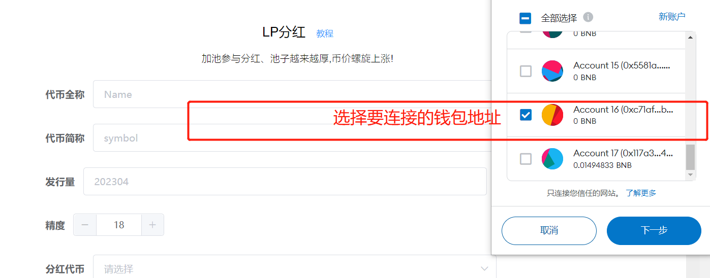
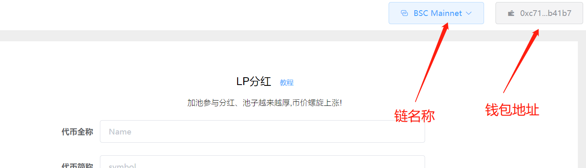
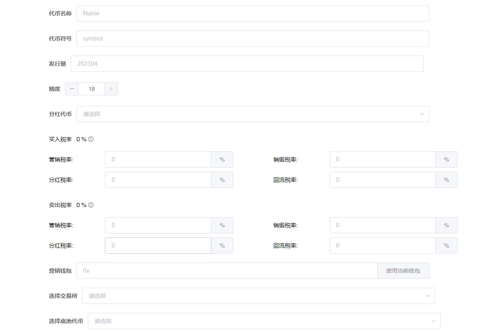
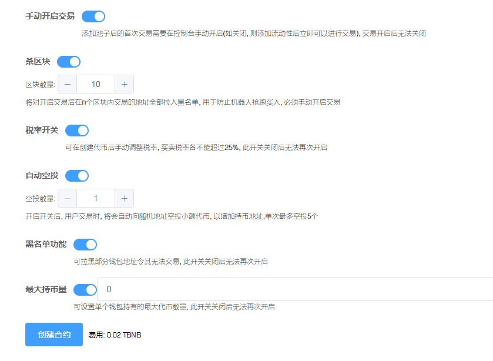
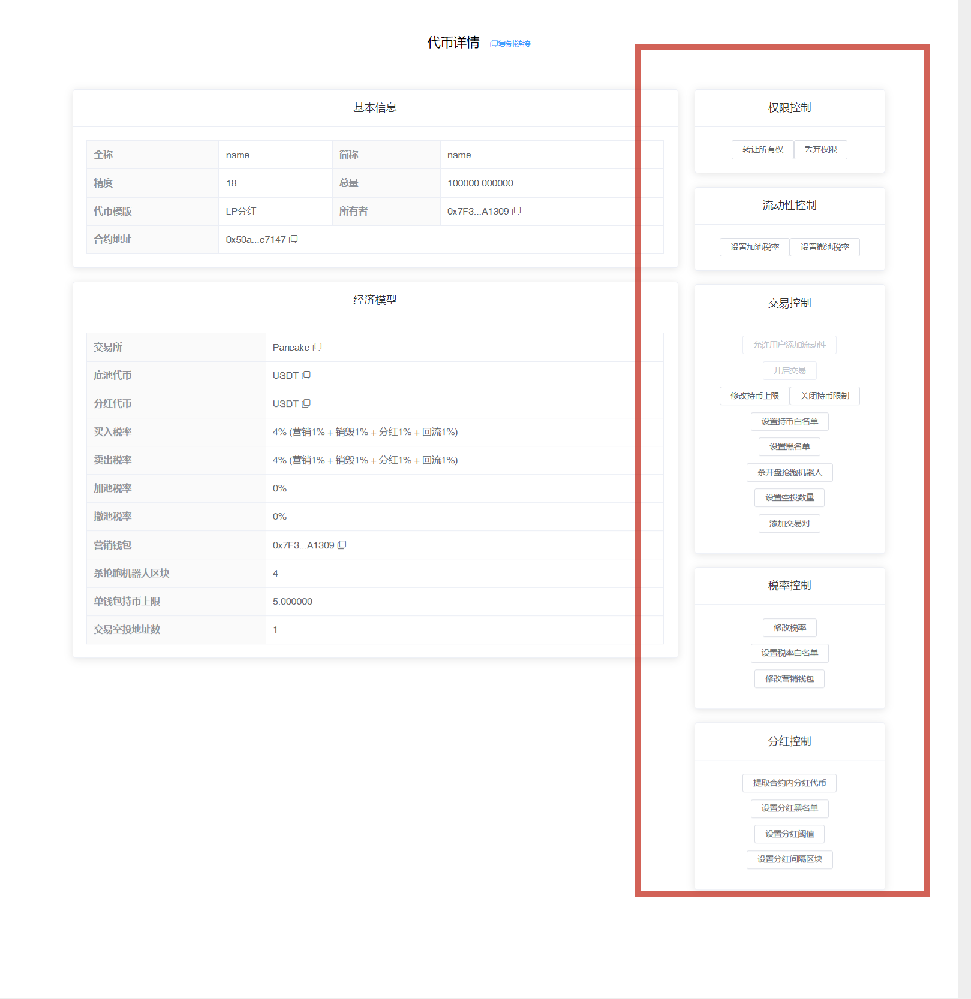
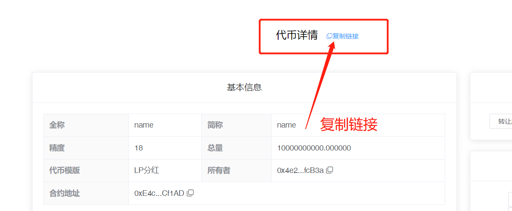

# LP分红代币

LP分红代币一键发币视频教程：



注1：请提前下载好小狐狸钱包插件或欧易Web3钱包插件，小狐狸MetaMask安装教程：[https://help.pandatool.org/practical-information/metamask](https://help.pandatool.org/practical-information/metamask)

注2：LP分红代币可能存在被机器人/夹子恶意套利的风险，如不能接受，可发行标准币

## 1、功能解释

LP分红指的是，用户在去中心化交易所（如薄饼swap）添加流动性之后，除了可以获得流动性奖励外，可以获得额外的代币分红。该代币分红，是直接分发到LP地址的。

具体分红哪种币，可以在创建合约时选择，一般为主流币，如wBNB、USDT、USDC、Doge等等。

各主流币合约地址，可以参照：[主流币合约地址](https://help.pandatool.org/practical-information/smart-contract)

## 2、连接钱包（老手忽略该操作） 

首先，在小狐狸钱包里选择自己要发行代币的链，并切换到所在链。例如我要在币安链发行代币，就切换到币安链上，如下图所示

<figure><figcaption>
选择链
</figcaption></figure>

如果要在Base发币，就切换到Base链。要在以太坊发币，就切换到ETH链，这里就不演示了。

链切换好之后，打开发币页面：[https://pandatool.org/#/coinrelease/LPReflection](https://pandatool.org/#/coinrelease/LPReflection)点击右上角连接钱包

<figure><figcaption>
选择钱包
</figcaption></figure>

之后会弹出小狐狸让你确认要连接的钱包地址

<figure><figcaption>
选择钱包地址
</figcaption></figure>

点击下一步并确认之后，就会连接成功了。在发币页面的右上角，会看到你的`链名称`和`钱包地址`，这就算完成了

<figure><figcaption></figcaption></figure>

## 3、参数说明

成功连接钱包后，我们在发币页面填写相应的参数[https://pandatool.org/#/coinrelease/LPReflection](https://pandatool.org/#/coinrelease/LPReflection)：

<figure><figcaption></figcaption></figure>

* [x] **代币全称** : 代币的名称信息，如Ethereum
* [x] **代币符号** : 也就是代币简称，如ETH。通常就是`看K软件` `薄饼` `钱包`中显示的那个名称
* [x] **发行量 :** 代币发行的总供应量,无法增发,固定发行,如果总量过多的话,需要降低精度
* [x] **精度** : 代表币的小数位数如：0.000001代表精度为6。一般默认是18
* [x] **分红代币** : 自行选择要分红的代币，将该代币合约地址填入即可。注意，选择的分红代币必须在有足够的流动性，可以正常买卖的。如果该代币流动性过低，很可能无法分红。因此，一般建议选择流动性好的主流币。
* [x] **买入税率** (不需要的填0/营销税除外，总比例小于25%):
  * **营销税率** : 每笔买入都会扣除对应比例代币送进`合约地址`,在**触发阈值**时会自动**卖出**换成`USDT`(这取决于池子类型，底池是什么币营销钱包就进什么) 发送到你的营销钱包地址
  * **分红税率** : 每笔买入都会扣除对应比例代币送进`合约地址`,在**触发阈值**时会自动**卖出**成`USDT`(取决于你的分红代币)发放给持有LP的用户
  * **销毁税率** : 每笔买入都会扣除对应比例代币送进`黑洞地址`,达到销毁的目的
  * **回流税率** : 每笔买入都会扣除对应比例代币送进`合约地址`,在**触发阈值**时会自动添加流动性,使池子更厚，加池子获得的LP默认给到营销钱包
* [x] **卖出税率** (不需要的部分不能填空，必须填0，营销税除外，总比例小于25%)
  * 这部分跟买入税率解释一样
* [x] **营销钱包：**
  * 用来接收营销税率的钱包，如果底池是USDT池子，就获得USDT。如果底池是BNB池子，就获得BNB
* [x] **选择交易所：**
  * 不同的链会有不同的交易平台（如ETH链有uniswap,BSC链有pancakeSwap 等）。选择什么交易所，就去那里添加流动性。搞错了会导致机制无法执行，请注意
* [x] **选择底池代币** :
  * 支持选择`BNB` `USDT`等池子，多样化选择

## 4、开关说明

下面是对代币功能开关的说明与解释：

<figure><figcaption>
交易开关
</figcaption></figure>

* [x] **手动开启交易**
  * **选它** : 需要在控制台打开交易开关,才能够交易,并且打开后无法重新关闭
  * **不选** : 加池子后立即可以交易
* [x] **杀区块**
  * **选它** : 用于防止机器人抢跑买入,杀3区块意思就是前3区块(bsc大概9秒)买入的地址自动拉黑
  * **不选** : 无法使用该功能，后期也不能再开启该功能
* [x] **税率开关**
  * **选它** : 创建代币后手动调整税率, 买卖税率各小于25%
  * **不选** : 创建代币后无法再修改滑点，后期也不能再开启该功能
* [x] **自动空投**
  * **选它** : 每笔交易都会自动向随机地址空投小额代币,以增加持币效果,最多可空投5个地址
  * **不选** : 无法使用该功能
  * 该功能开启后**不可关闭、不可修改**
* [x] **黑名单功能**
  * **选它** : 能够`添加`和`解除`黑名单。被拉入黑名单的地址将无法卖出代币，也不能转账，该功能慎用
  * **不选** : 无法设置和解除黑名单
* [x] **最大持币量**
  * **选它** : 可设置单个钱包最大的持有代币数量
  * **不选** : 无法使用该功能，且后期也不能再开启该功能

## 5、控制台使用说明

当我们成功发行代币后，可进入控制台，对代币的各项功能进行管理。我们打开[https://pandatool.org/#/coinrelease/console](https://pandatool.org/#/coinrelease/console)修改下列功能：

<figure><figcaption></figcaption></figure>

* [x] **权限控制**
  * **转让所有权** : 将合约权限转让给其他人（转移权限之前，记得复制控制台链接。新的权限地址必须通过控制台链接，才能进入控制台操作）
  * **放弃所有权** : 将合约权限丢至黑洞，永远不能拿回
* [x] **流动性控制**
  * **设置加池税率**: 用户加池子默认不收手续费，可以手动设置最高小于25%的手续费。注意，_**如果选择BNB底池，则需用WBNB加池子，方可没有手续费**_
  * **设置撤池税率** : 用户撤池子默认不收手续费，可以手动设置最高100%的手续费。注意，_**如果选择BNB底池，则需用WBNB撤池子，方可没有手续费**_
* [x] **交易控制**
  * **开启交易** : 打开后，用户才能交易，开启后不能关闭
  * **修改持币限制：**提高或降低持币数量限制
  * **关闭持币限制：**放弃使用该功能
  * **设置持币白名单：**设置后，该白名单地址没有持币限制，白名单也可以移除
  * **设置黑名单：**可以批量添加或者移除黑名单
  * **杀开盘抢跑机器人：**主要是修改抢跑区块，适用于未开盘项目
  * **设置空投数量：**每笔交易空投地址数，最大为5
  * **添加交易对：**如果您的分红代币在不同的交易所上架, 或存在不同的交易对, 请将对应的流动池地址添加进来, 否则税率、分红等机制将在其他交易对上不起作用
* [x] **税率控制**
  * **修改税率**：可分别修改回流、营销、分红、销毁税率，相加小于25%
  * **设置税率白名单：**白名单交易没有税率，可批量添加或移除
  * **修改营销钱包：**更改合约的营销钱包地址
* [x] **分红控制**
  * **提取合约分红代币** : 将合约地址内遗留的未分发的分红代币提出
  * **设置分红黑名单** : 设置后该地址将无法获得LP分红
  * **设置分红阈值：**当分红钱包内的分红代币数量超过该值时, 开始分红, 默认为0.1个分红代币, 设置的过高可能会导致长时间无分红, 强烈建议新用户不要修改此选项

## 6、注意事项

* [x] **他人LP的地址，必须交易才能激活**
  * 如果用户的LP不是自己加池子获得了，而是别人转账给他的。那么这个地址必须在交易一笔（买卖各一笔）之后，才能激活，获得分红。否则合约无法识别到该地址，是没有分红的
* [x] **为什么交易了很多笔还是没有分红？**
  * 不要使用白名单地址交易，如发币地址、营销钱包地址交易都是没有用的
  * 不要只买，必须有卖单，才能分红。没有卖单，分红发不出去的
* [x] **锁池后还有分红吗？**
  * 锁池的那个人是没有分红的，其他没锁的人依然参与分红，互不影响。此外，可以通过控制台将锁池地址排除在分红之外。
* [x] **权限转移后，新地址怎么进入控制台？**
  * 转移权限之前，需要先复制控制台链接（在控制台上方能看到`复制链接`的按钮）。当权限转移后，新的权限地址使用控制台链接，就可以进入控制台操作

<figure><figcaption>
复制控制台链接
</figcaption></figure>

*   [x] **加/撤池子手续费问题**

    默认加/撤池子是不收手续费的，但是需要满足一定的前提条件才可以：

    * 如果是用USDT做底池，用户加池子的`方向`需要和初始加池子的方向保持一致。所谓“方向”，就是USDT和代币哪个在前，哪个在后的问题。如果方向不一致，加池仍然要收手续费
    * 如果是用BNB做底池，用户必须使用wBNB加池子，且方向一致，才能不收手续费
*   [x] **测试网的问题**

    如果您选择在BSC测试网发币，请进入以下测试swap，并按照PandaTool要求的测试币做池子。具体参数如下：

    * 测试网薄饼：[https://pancakeswap.finance/swap?chain=bscTestnet](https://pancakeswap.finance/swap?chain=bscTestnet)
    * 测试网USDT：0x66e972502a34a625828c544a1914e8d8cc2a9de5

如有不明白或者不清楚的地方，请加入官方电报群：[@PandaTool](https://t.me/PandaTool)
