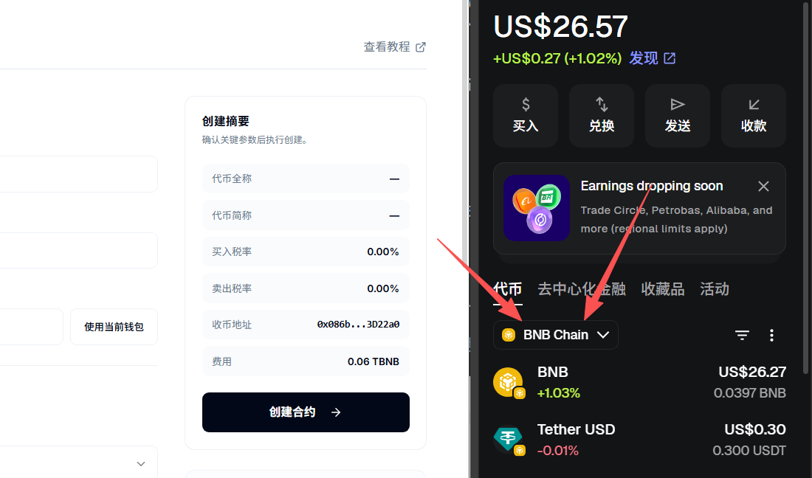
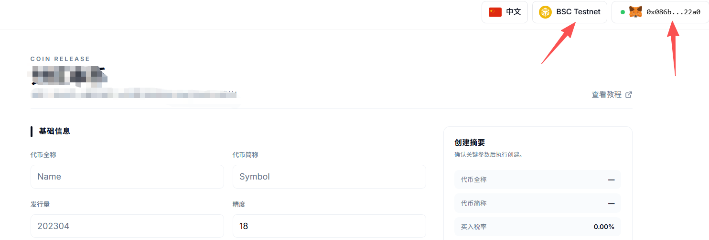
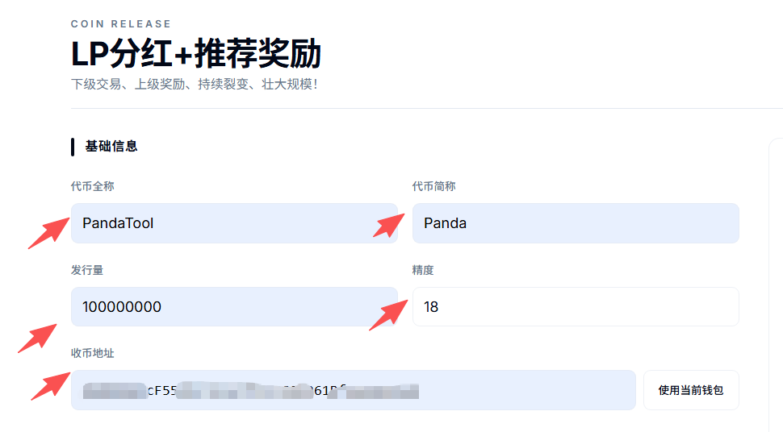
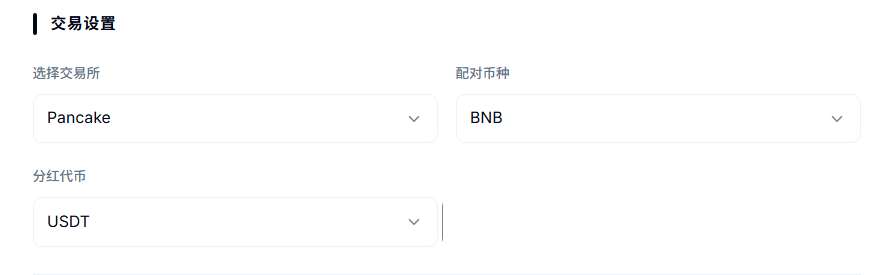
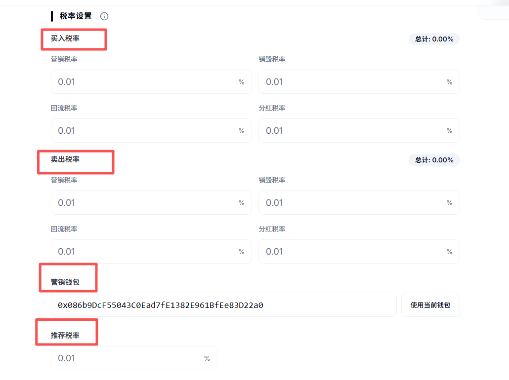
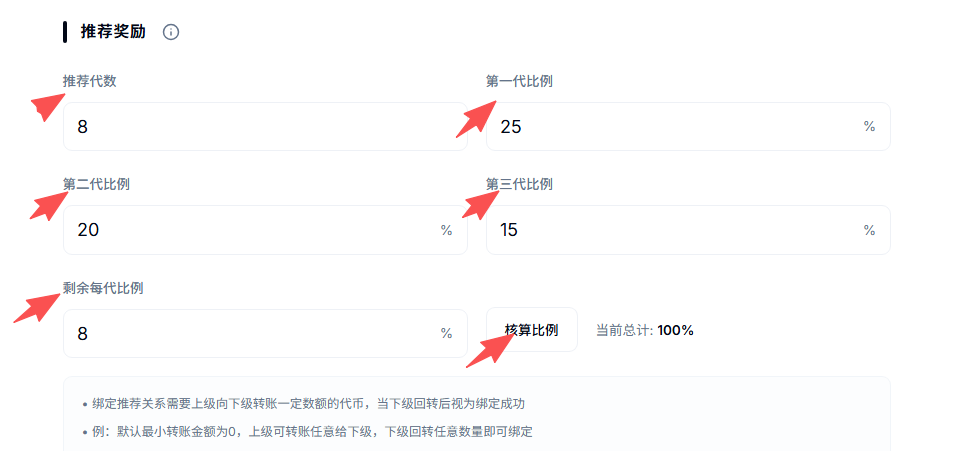
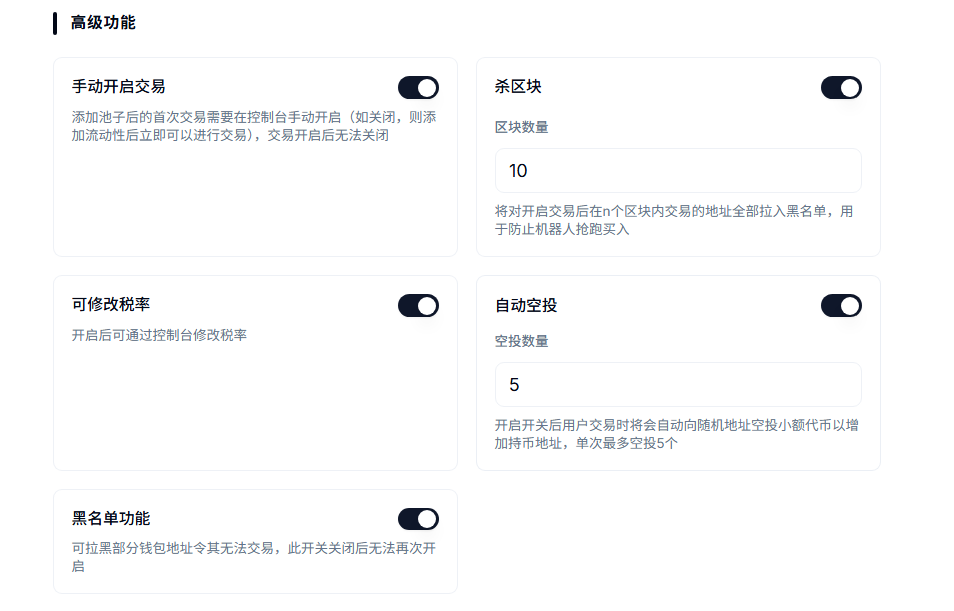
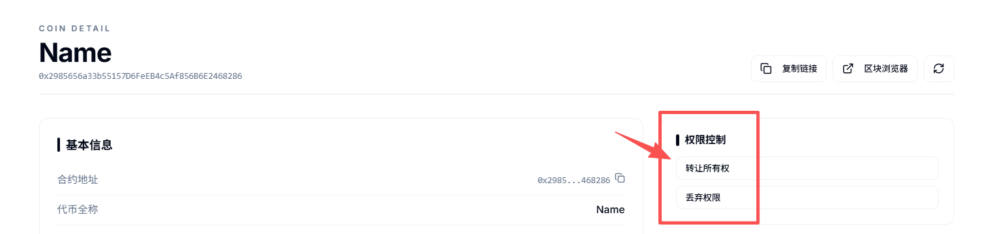
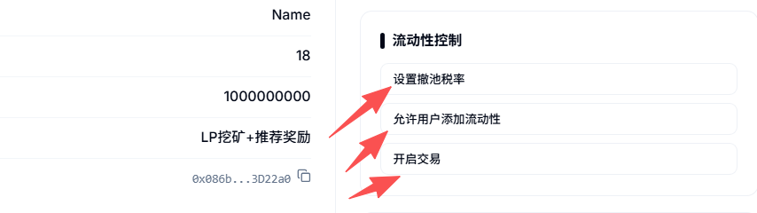
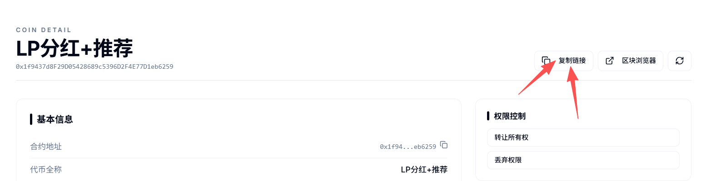

# LP分红+推荐奖励

LP分红+推荐奖励一键发币视频教程：



**注1：**&#x8BF7;提前下载好小狐狸钱包插件或欧易Web3钱包插件，小狐狸MetaMask安装教程：[https://help.pandatool.org/practical-information/metamask](https://help.pandatool.org/practical-information/metamask)

**注2：**&#x8F6C;账获得的LP需要加池一笔激活才能获得分红，自己加池获得的LP不用


**检测风险提醒**：该类型的代币创建后安全检测可能**存在风险**，如果您特别在意检测结果，可以选择创建标准代币，标准币没有任何风险。如果您最终决定创建此类型的代币，则说明您**可以接受代币检测风险**


## 1、功能解释

* [x] **LP分红**
  * 也叫加池分红，添加资金池做市的用户地址被称为LP，可以直接获得分红代币奖励
* [x] **推荐奖励**
  * 上级通过一定方式绑定下级，可以获得下级交易手续费的本币奖励
  * 为防机器人，上下级关系的绑定方式较为复杂，必须完成一次回转才可以
  * 默认情况下，上级向下级空投任意数量的代币，下级必须回转任意数量的代币，才视为关系绑定成功。
* [x] **注意**
  * LP地址获得是分红币（USDT/wBNB等），上下级奖励的是本币（自己发行的币）
  * 如果一个地址已经有了下级，就不能再绑定上级了

## 2、连接钱包（老手忽略该操作） 

首先，在小狐狸钱包里选择自己要发行代币的链，并切换到所在链。例如我要在币安链发行代币，就切换到币安链上，如下图所示

<figure><figcaption></figcaption></figure>

如果要在Base发币，就切换到Base链。要在以太坊发币，就切换到ETH链，这里就不演示了。

链切换好之后，打开发币页面：[https://www.pandatool.org/zh-CN/coinrelease/lpwithinviter](https://www.pandatool.org/zh-CN/coinrelease/lpwithinviter) 点击右上角连接钱包

<figure><figcaption></figcaption></figure>

之后会弹出小狐狸让你确认要连接的钱包地址，点击下一步并确认之后，就会连接成功了。在发币页面的右上角，会看到你的`链名称`和`钱包地址`，这就算完成了

<figure><figcaption></figcaption></figure>

## 3、参数说明

钱包连接成功后，我们通过PandaTool可视化页面开启创建，打开[https://www.pandatool.org/#/coinrelease/LPwithInviter](https://www.pandatool.org/#/coinrelease/LPwithInviter)，填写相应的参数：

### **1）基础信息**

<figure><figcaption></figcaption></figure>

* [x] **代币全称** : 代币的名称信息，如Ethereum（支持中文、英文以及中英混合文字）
* [x] **代币简称**: 也就是代币符号，如ETH。通常就是`看K软件` `薄饼` `钱包`中显示的那个名称
* [x] **发行量** : 代币发行的总供应量,无法增发,固定发行,如果总量过多的话,需要降低精度
* [x] **精度** : 代表币的小数位数如：0.000001代表精度为6。一般默认是18
* [x] **收币地址：**&#x7528;来接受代币的地址（该地址默认白名单）

### **2）交易设置**

<figure><figcaption></figcaption></figure>

* [x] **选择交易所：**
  * 不同的链会有不同的交易平台（如ETH链有uniswap,BSC链有pancakeSwap 等）。选择什么交易所，就去那里添加流动性。搞错了会导致机制无法执行，请注意
* [x] **配对币种** :
  * 支持选择`BNB` `USDT`等池子，多样化选择
* [x] **分红代币** : 自行选择要分红的代币，将该代币合约地址填入即可。注意，**选择的分红代币必须在有BNB的交易对**，可以正常买卖的。如果该代币流动性过低或者没有BNB交易对，很可能无法分红。因此，一般建议选择流动性好的主流币。

### **3）税率设置**

<figure><figcaption></figcaption></figure>

* [x] **买入税率** (不需要的部分不能填空，必须填0/总比例小于25%):
  * **营销税率** : 每笔买入都会扣除对应比例代币送进`合约地址`,在**触发阈值**时会自动**卖出**换成`USDT`(这取决于池子类型，底池是什么币营销钱包就进什么) 发送到你的营销钱包地址
  * **分红税率** : 每笔买入都会扣除对应比例代币送进`合约地址`,在**触发阈值**时会自动**卖出**成`USDT`(取决于你的分红代币)发放给持有LP的用户
  * **销毁税率** : 每笔买入都会扣除对应比例代币送进`黑洞地址`,达到销毁的目的
  * **回流税率** : 每笔买入都会扣除对应比例代币送进`合约地址`,在**触发阈值**时会自动添加流动性,使池子更厚，加池子获得的LP默认给到营销钱包
* [x] **卖出税率** (不需要的部分不能填空，必须填0/总比例小于25%)
  * 这部分跟买入税率解释一样
* [x] **营销钱包**
  * 用来接收营销税率钱包，如果底池是USDT池子，就获得USDT。如果底池是BNB池子，就获得BNB
  * 用来接收回流LP的钱包，且是白名单
* [x] **推荐税率**（比例总和需100%）
  * 用于总推荐奖励的手续费。例如设置2%，意思是从每笔交易中扣除2%的代币用于分发所有上级的奖励

### **4）推荐奖励**

设置邀请层级数，以及每一层级的推荐比例

<figure><figcaption></figcaption></figure>

* [x] 推荐奖励设置
  * **推荐代数** : 可以有多少代的下级，目前最多可以设置16代
  * **第一代比例** : 直推的第一代交易时，上级可以获得多大比例的奖励。假如设置20%，那这个20%就是总推荐2%里面的20%，即总占总交易比例的0.4%。
  * **第二代比例：**&#x7B2C;二代下级交易时，作为上上级可以获得多大比例的奖励
  * **滴三代比例：**&#x7B2C;三代下级交易时，作为上上上级可以获得多大比例的奖励
  * **剩余每代：**&#x4EE5;上设置完成后，点击`核算比例`即可获得剩余每代的奖励比例
  * **注意事项：**&#x6240;有代数比例相加**100%**，才视为设置成功。如果不会计算，可直接点击`核算比例`，帮你自动核算成功。
  * 实际交易中，如果一个地址没有上级，或者上级数量不够，那么这部分的推荐奖励，会直接给到**营销钱包**

## 4、高级功能

下面是对该模式代币高级功能以及开关的说明与解释：

<figure><figcaption></figcaption></figure>

* [x] **手动开启交易**
  * **选它** : 需要在控制台打开交易开关,才能够交易（与加池子）,并且打开后无法重新关闭
  * **不选** : 加池子后立即可以交易
  * **开启交易前：**&#x53EA;有白名单可以交易与加池子。开启交易后，任何人都可以
* [x] **杀区块**
  * **选它** : 用于防止机器人抢跑买入,杀10区块意思就是前10区块买入的地址自动拉黑
  * **不选** : 无法使用该功能，后期也不能再开启该功能
* [x] **可修改税率（税率开关）**
  * **选它** : 创建代币后手动调整税率, 买卖税率各小于25%
  * **不选** : 创建代币后无法再修改税率，后期也不能再开启该功能
* [x] **自动空投**
  * **选它** : 每笔交易都会自动向随机地址空投小额代币,以增加持币效果,最多可空投5个地址
  * **不选** : 无法使用该功能，该功能开启后**不可关闭**
  * 只有非白名单地址**交易**才能触发空投，转账不空投
* [x] **黑名单功能**
  * **选它** : 能够`添加`和`解除`黑名单。被拉入黑名单的地址将无法卖出代币，也不能转账，该功能慎用
  * **不选** : 无法设置和解除黑名单

## 5、控制台使用说明

当我们成功发行代币后，可进入控制台，对代币的各项功能进行管理。我们打开[https://www.pandatool.org/zh-CN/coinrelease/console](https://www.pandatool.org/zh-CN/coinrelease/console)，找到自己的代币，修改下列功能：

<figure><figcaption></figcaption></figure>

* [x] **权限控制**
  * **转让所有权** : 将合约权限转让给其他人（转移权限之前，记得复制控制台链接。新的权限地址必须通过控制台链接，才能进入控制台操作）
  * **放弃所有权** : 将合约权限丢至黑洞，永远不能拿回

<figure><figcaption></figcaption></figure>

* [x] **流动性控制**
  * **设置撤池税率** : 用户撤池子默认不收手续费，可以手动设置**最高100%**&#x7684;手续费。撤池子的税率会给到黑洞地址直接销毁。（无法设置加池税率，默认是0。）
  * 注意，_**如果选择BNB底池，则需用wBNB撤池子，才能实现撤池税率**_
  * **方向问题：**&#x4E0D;管是USDT池子还是BNB池子，不管是加池子还是撤池子，**方向都要正确**，即：BNB/USDT在前面或上面，代币在后面或者下面。如果方向不正确，税率可能不生效
  * **允许用户添加流动性**：打开该功能后，非白名单地址可以加池子，但是不能撤
  * **开启交易** : 打开后，非白名单用户才能交易与撤池子，开启后不能关闭

<figure><figcaption></figcaption></figure>

* [x] **交易控制**
  * **杀开盘抢跑机器人：**&#x4E3B;要是修改开抢跑区块，适用于未开盘项目
  * **设置黑名单：**&#x53EF;以批量添加或者移除黑名单，被加入黑名单的地址无法转账或卖出代币
  * **禁用空投：**&#x5173;闭功能后，代币转账或交易将不会进行空投
* [x] **税率控制**
  * **修改税率**：可分别修改回流、营销、分红、销毁税率，相加小于25%
  * **禁用修改税率：**&#x70B9;击此按钮后，将无法再修改代币的交易税率
  * **修改营销钱包：**&#x66F4;改合约的营销钱包地址
  * **设置税率白名单：**&#x767D;名单交易没有税率、不会进行空投、开盘前即可交易与加撤池
  * **设置分红黑名单：**&#x88AB;加入分红黑名单的地址，将无法获得LP分红奖励，但可以撤池子

<figure><figcaption></figcaption></figure>

* [x] **推荐奖励控制**
  * **修改推荐税率 :** 买卖同时修改，和其他税率相加必须小于25%
  * **设置推荐奖励比例** : 操作方法和前面一样，如不会计算，可直接点击`核算比例`，自动计算
* [x] **代币控制**
  * **提取合约分红代币** : 将合约地址内遗留的未分发的分红代币提出

## 6、注意事项

* [x] **锁池后是否还有分红？**
  * 锁池的那个人是没有分红的，其他没锁的人依然参与分红，互不影响。此外，可以通过控制台将锁池地址排除在分红之外。
* [x] **他人转账的LP，必须加池才能激活**
  * 如果用户的LP不是自己加池子获得了，而是别人转账给他的。那么这个地址必须在加池子之后，才能激活，获得分红。否则合约无法识别到该地址，是没有分红的
  * 加池要注意方向：USDT/BNB在前面或者上面，本币在后面/下面
* [x] **为什么交易了很多笔还是没有分红？**
  * 不要使用白名单地址交易，如发币地址、营销钱包地址交易都是没有用的
  * 不要只买，必须有卖单，才能分红。没有卖单，分红发不出去的
  * 转账获得的LP，没有激活是没有分红的
  * 分红的那个代币没有BNB交易对，或者池子很小
  * 如果该地址是metamask智能合约地址，是没有分红的
* [x] **不能设置加池税率**
  * 综合用户需求考虑，该机制模版默认加池没有手续费，无法修改，撤池税率可以修改
* [x] **推荐奖励为何不生效？**
  * 不要使用TP闪兑、OKX Web3交易，因为这些平台使用了中转路由合约，导致资金池无法识别交易地址，从而无法发放奖励
  * 不要使用智能钱包地址，有些小狐狸钱包地址是EIP-7702的地址，这些地址被抽象成智能合约，因此无法绑定上下级，所以无法获得推荐奖励
* [x] **权限转移后，新地址怎么进入控制台？**
  * 转移权限之前，需要先复制控制台链接（在控制台上方能看到`复制链接`的按钮）。当权限转移后，新的权限地址使用控制台链接，就可以进入控制台操作

<figure><figcaption></figcaption></figure>

* [x] **测试网做池子**
  * 如果您是在测试网发币做池子，需严格按照以下参数操作
  * 测试网薄饼：[https://pancakeswap.finance/swap?chain=bscTestnet](https://pancakeswap.finance/swap?chain=bscTestnet)
  * 测试网USDT：0x66e972502a34a625828c544a1914e8d8cc2a9de5
*   [x] **加/撤池子手续费问题**

    默认加/撤池子是不收手续费的，但是需要满足一定的前提条件才可以：

    * 如果是用USDT做底池，必须保证方向正确，即：USDT在前面/上面，代币在下面/后面，才可以。
    * 如果是用BNB做底池，用户必须使用wBNB加池子，且方向一致，才能不收手续费
    * 撤池子的税率&#x4F1A;**`直接销毁`**
    * 撤池子税率最大可以到**100%**
* [x] **V2和V3流动性**
  * 在薄饼第一次添加流动性的时候，必须做V2的池子，不能做V3的池子。V3不支持任何机制，所以只能在V2做，请注意

如果您在创建LP分红+推荐奖励代币的时候，有不明白或者不清楚的地方，请加入官方电报群：[@PandaTool](https://t.me/PandaTool)
