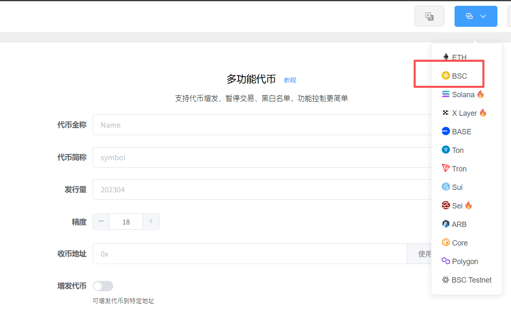
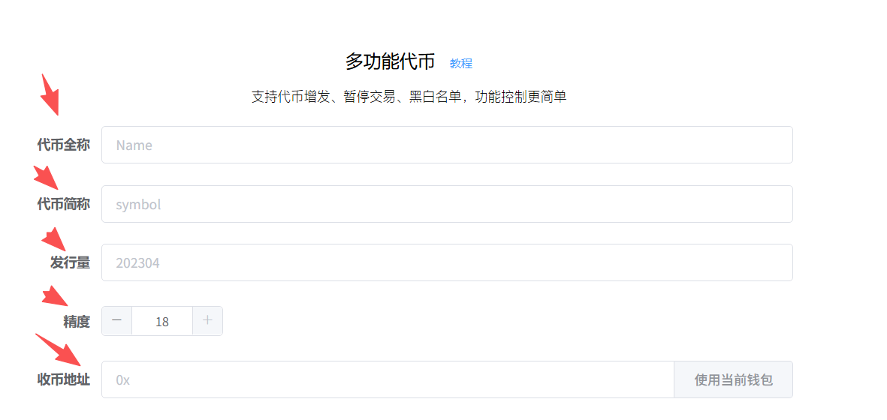
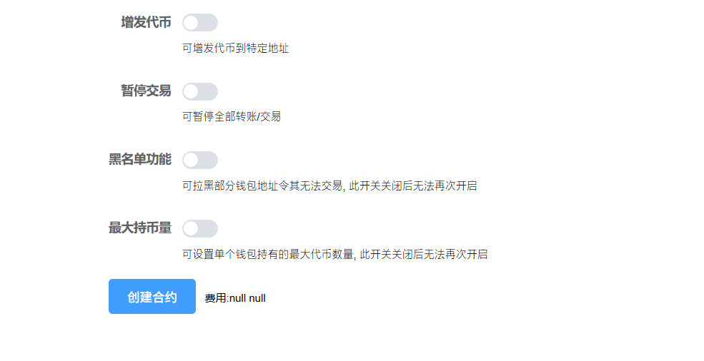
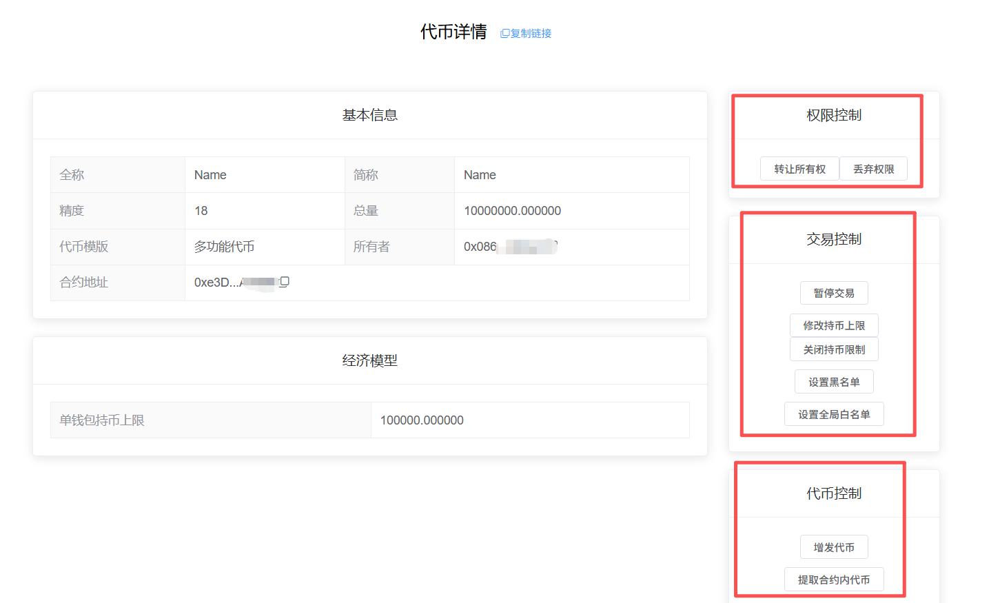

# 多功能代币创建教程

## 1、功能解释

所谓多功能代币，指的是有多种功能的智能合约集合体，包括代币增发、交易暂停、黑名单、最大持币量限制等功能。该合约给用户提供了较多的功能选择，方便大家去测试与使用。


该代币合约检测为高风险！

该代币合约检测为高风险！

该代币合约检测为高风险！


如果您创建该类型的代币，则表明您接受了高风险的检测结果。部分检测平台，可以在代币丢弃权限后进行复查，从而去掉风险。

### 2、连接钱包（老手忽略该操作） 

首先，在小狐狸钱包里选择自己要发行代币的链，并切换到所在链。例如我要在币安链发行代币，就切换到币安链上，如下图所示

如果要在Base发币，就切换到Base链。要在以太坊发币，就切换到ETH链，这里就不演示了。

链切换好之后，打开发币页面：[http://pandatool.org/#/coinrelease/blackHole](http://pandatool.org/#/coinrelease/blackHole)  点击右上角连接钱包，弹出小狐狸确认就可以了

<figure><figcaption></figcaption></figure>

## 3、参数说明

成功连接钱包后，我们在发币页面填写相应的参数 [https://pandatool.org/#/coinrelease/simpleControl?lang=zh-CN](https://pandatool.org/#/coinrelease/simpleControl?lang=zh-CN)：

<figure><figcaption></figcaption></figure>

* [x] **代币全称** : 代币的名称信息，如Ethereum（支持中文、英文以及中英混合文字）
* [x] **代币符号** : 也就是代币简称，如ETH。通常就是`看K软件` `薄饼` `钱包`中显示的那个名称
* [x] **发行量 :** 代币发行的总供应量,无法增发,固定发行,如果总量过多的话,需要降低精度
* [x] **精度** : 代表币的小数位数如：0.000001代表精度为6。一般默认是18
* [x] **收币地址：**&#x4EE3;币创建成功后，给到哪个地址（接收代币的地址）

## 4、功能开关

<figure><figcaption></figcaption></figure>

* [x] **增发代币**
  * **选它** : 可通过控制台对代币总量进行增发/铸造
  * **不选** : 无法使用增发功能，后期无法开启
  * 代币可以增发到指定地址
* [x] **暂停交易**
  * **选它** : 可实现代币的转账和交易暂停（可以手动暂停与开启）
  * **不选** : 无法使用该功能
* [x] **黑名单功能**
  * **选它** : 能够`添加`和`解除`黑名单。被拉入黑名单的地址将无法卖出代币，也不能转账，该功能慎用
  * **不选** : 无法设置和解除黑名单
* [x] **最大持币量**
  * **选它** : 可设置单个钱包最大的持有代币数量
  * **不选** : 无法使用该功能，且后期也不能再开启该功能

## 5、控制台使用说明 

当我们成功发行代币后，可进入控制台，对代币的各项功能进行管理。我们打开[https://pandatool.org/#/coinrelease/console](https://pandatool.org/#/coinrelease/console)修改下列功能：

<figure><figcaption></figcaption></figure>

* [x] **权限控制**
  * **转让所有权** : 将合约权限转让给其他人（转移权限之前，记得复制控制台链接。新的权限地址必须通过控制台链接，才能进入控制台操作）
  * **放弃所有权** : 将合约权限丢至黑洞，永远不能拿回。权限丢弃后，将无法使用任何功能
* [x] **交易控制**
  * **暂停交易** : 打开后，所有非白名单地址无法转账、无法买卖代币
  * **修改持币限制：**&#x63D0;高或降低持币数量限制
  * **关闭持币限制：**&#x653E;弃使用该功能，钱包持币没有任何限制
  * **设置黑名单：**&#x53EF;以批量添加或者移除黑名单
  * **设置全局白名单：**&#x8BBE;置后，该地址没有持币上限、不受交易暂停的限制
* [x] **代币控制**
  * **增发代币：**&#x53EF;以手动对代币进行增发
  * **提取合约内代币:** 可以将合约内存留的BNB和本币提出

## **6、注意事项**

**为什么无法创建流动性？**

* 如果您设置的钱包持币限制是100枚，而创建流动性时添加101枚代币，则无法创建，因为超过了持币限制。此时，您需要创建一个99枚的代币池，然后再将池子地址加入到白名单中，后续再增加池子。

**为什么暂停交易期间，白名单也不能买币？**

* 因为暂停交易期间，池子地址也无法转账，所以无法向任何地址转账。您需要将池子地址加入到白名单中，方可实现。

**为什么正常交易期间，用户依然无法卖币？**

* 因为池子地址内的代币数量已经达到了持仓上限，需要调高持仓上限或将其加入白名单，方可继续卖币

关于多功能代币，如您有不明白或者不清楚的地方，请加入官方电报群咨询志愿者：[@PandaTool](https://t.me/PandaTool)
