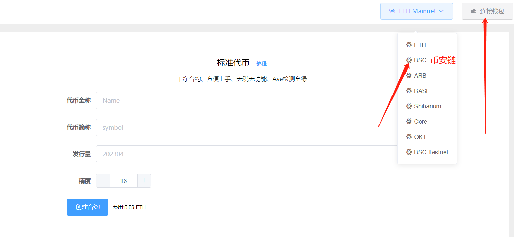
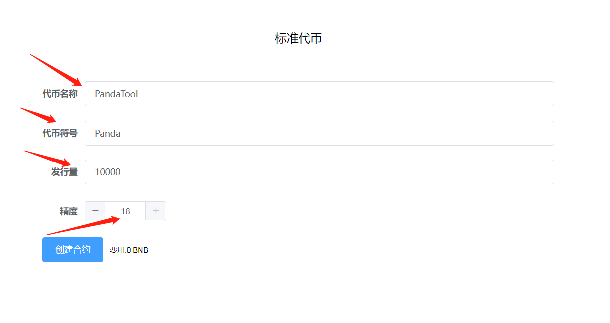
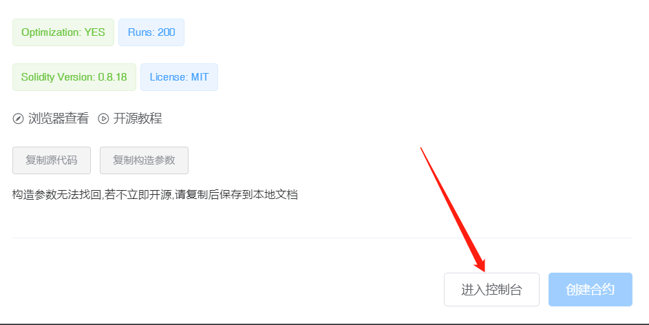
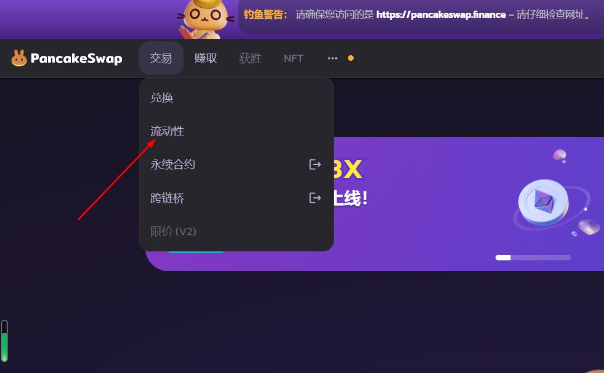
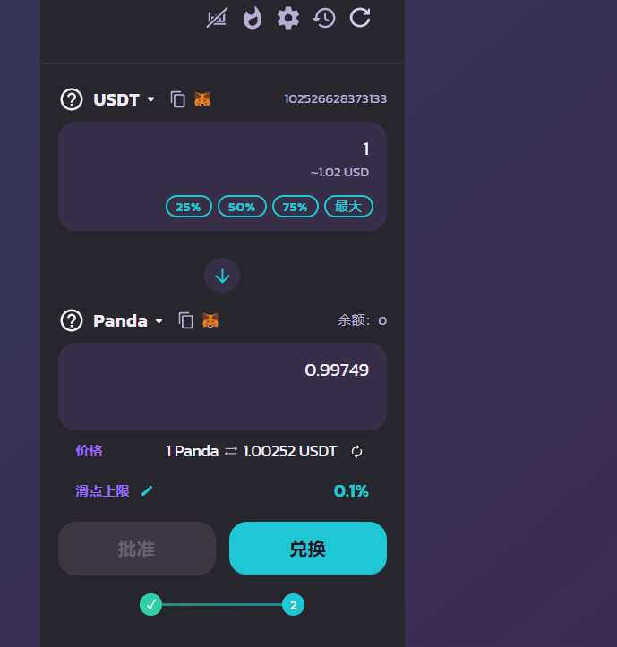

# 标准代币

标准代币开发视频教程：



## 1、功能解释

标准代币指的是**没有任何功能**、机制的代币合约，代币创建之后默认会丢弃权限，所以也没有任何权限，是一个纯粹的、干净的、标准的合约。

根据以下步骤，您可以在可支持的任意一条链上，创建一个标准合约代币。以BSC为例。

* 注意：没有安装小狐狸钱包的不能发币，请先安装小狐狸钱包插件，教程：[https://help.pandatool.org/practical-information/metamask](https://help.pandatool.org/practical-information/metamask)

## 2、连接钱包

使用浏览器或者钱包打开网址：[https://pandatool.org/#/coinrelease/stardand](https://pandatool.org/#/coinrelease/stardand)，点击右上角，将小狐狸钱包切换到币安主网（BSC）

<figure><figcaption></figcaption></figure>

## 3、填写代币参数

在打开的页面，依次填写代币信息。假设我们创建一个代币叫——“PandaTool”，应该进行如下填写：

* **代币名称：**PandaTool（代币全称）
* **代币符号：**Panda（代币简称）
* **发行量：**10000（代币数量）
* **精度：**18（小数点后的位数）

<figure><figcaption>
标准代币
</figcaption></figure>

## 4、创建合约

确认填写的参数无误后，点击“创建合约”。在打开的页面，将源代码和构造参数复制下来，以防万一：

<figure><figcaption>
开源参数复制
</figcaption></figure>

复制之后，再次点击“创建合约”。此时小狐狸钱包会要求你支gas费，点击确认，等待几十秒，合约就创建完成了。

此时，我们点击`控制台`，就能看到自己创建的合约了，代币也已经发送到创建者的钱包地址里。

<figure><figcaption>
进入控制台
</figcaption></figure>

## 5、添加流动性

代币创建完成之后，只能转账，还不能交易。要想使代币可以交易，需要前往PancakeSwap创建一个流动性资金池才可以。

我们打开测试链薄饼：[https://pancakeswap.finance/](https://pancakeswap.finance/?chain=bscTestnet)，找到“交易-流动性”：

<figure><figcaption></figcaption></figure>

打开之后，选择V2版本，然后点击增加流动性：

<figure><figcaption></figcaption></figure>

在左右两边分别输入两个代币，创建交易对。两种代币，一种是我们创建的Panda，另一种是USDT。并根据自己的需求，填写初始放入资金池的代币数量：

<figure><figcaption></figcaption></figure>

两种代币的数量比例，决定了代币上市的初始价格。例如上面，我们放入了100000个USDT和100000个Panda，就说明Panda的上市价格是1USDT。

之后，我们依次点击`批准代币`，再点击`添加`，创建币对和供应，即可流动性创建成功。

<figure><figcaption></figcaption></figure>

现在，我们回到交易页面，就能交易了：

<figure><figcaption>
交易代币
</figcaption></figure>

## 注意事项

* 代币创建完成后，默认是开源的，无需手动开源。
* 如果您要在测试网添加USDT交易对，请使用PandaTool官方发布的测试USDT做资金池，合约地址：0x66e972502a34a625828c544a1914e8d8cc2a9de5
