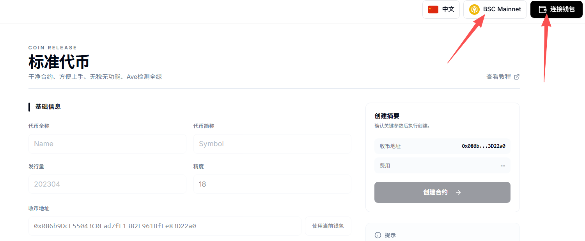
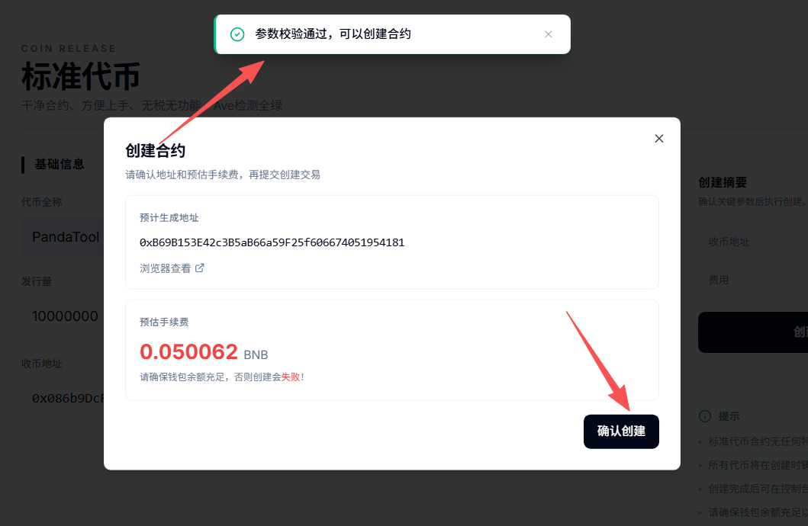
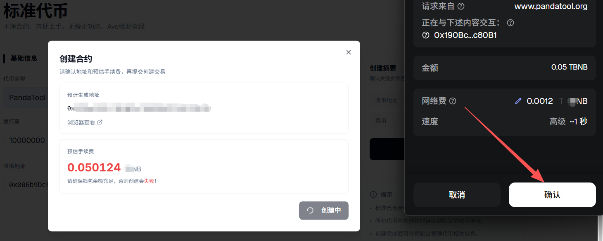
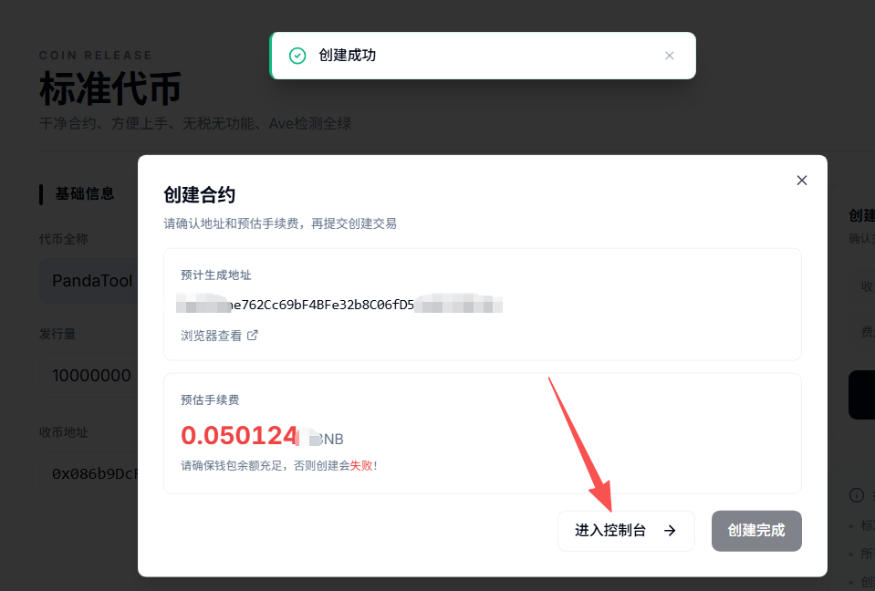
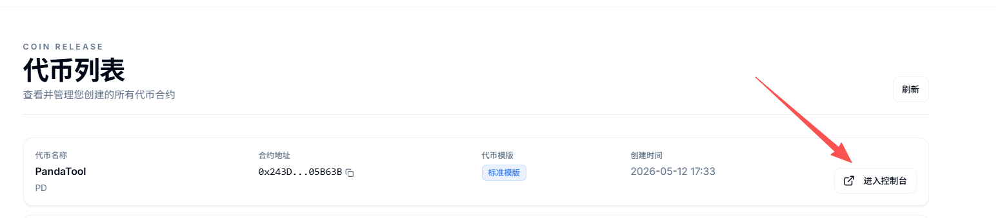
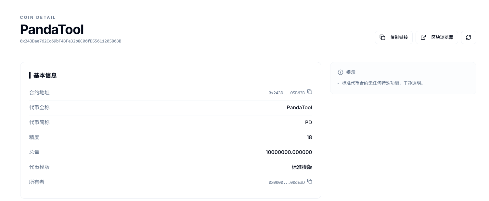
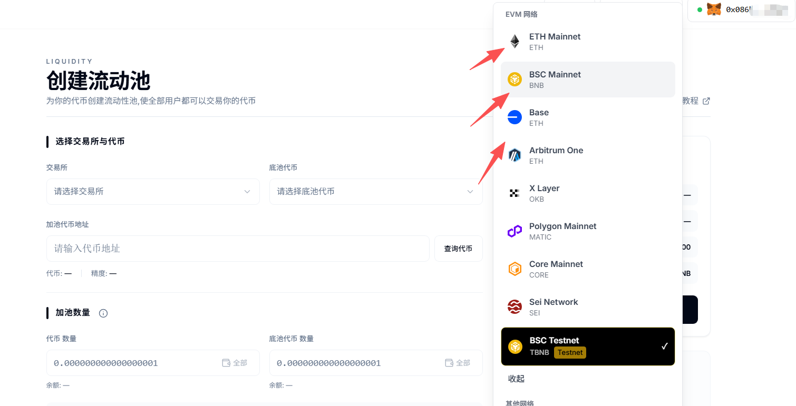

# 标准代币创建教程

BSC链代币创建教程视频



## 1、功能解释

标准代币指的是**没有任何功能**、机制的代币合约，代币创建之后默认会丢弃权限，所以也没有任何权限，是一个纯粹的、干净的、标准的合约。

根据以下步骤，您可以在可支持的任意一条链上，创建一个标准合约代币。以BSC为例。

* 注意：没有安装小狐狸钱包的不能发币，请先安装小狐狸钱包插件，教程：[https://help.pandatool.org/practical-information/metamask](https://help.pandatool.org/practical-information/metamask)

## 2、连接钱包

使用浏览器或者钱包打开网址：[https://www.pandatool.org/zh-CN/coinrelease/standard](https://www.pandatool.org/zh-CN/coinrelease/standard)，点击右上角，将小狐狸钱包切换到币安主网（BSC）

<figure><figcaption></figcaption></figure>

## 3、填写代币参数

在打开的页面，依次填写代币信息。假设我们创建一个代币叫——“PandaTool”，应该进行如下填写：

* **代币全称：**&#x50;andaTool（代币名称，支持中文、英文以及中英混合文字）
* **代币简称：**&#x50;anda（代币符号，支持中文、英文以及中英混合文字）
* **发行量：**&#x31;0000（代币数量）
* **精度：**&#x31;8（小数点后的位数）
* **收币地址：**&#x521B;建代币后接受代币的地址（代币给到谁）

<figure><figcaption></figcaption></figure>

## 4、创建合约

确认填写的参数无误后，点击“创建合约”。如果没有问题，会提示您“参数校验通过”，并给出预计生成的合约地址

<figure><figcaption></figcaption></figure>

这个时候，您需要确认钱包内是否有足够的代币作为手续费，如BNB/ETH等等。如果手续费不足，可能会导致创建失败。

一切信息无误后，我们点击“确认创建”，此时会弹出钱包让您支付费用。钱包确认后，就可以了

<figure><figcaption></figcaption></figure>

此时，我们点击`控制台`，就能看到自己创建的合约了，代币也已经发送到收币钱包地址里了。

<figure><figcaption></figcaption></figure>

如果现在不点击进入控制台，以后我该怎么找自己的合约呢？我们可以通过控制台列表进入：[https://www.pandatool.org/zh-CN/coinrelease/console](https://www.pandatool.org/zh-CN/coinrelease/console)

<figure><figcaption></figcaption></figure>

<figure><figcaption></figcaption></figure>

## 5、添加流动性

代币创建完成之后，只能转账，还不能交易。要想使代币可以交易，需要创建一个流动性资金池才可以。

### **1）进入PandaTool并连接钱包**

我们进入到PandaTool创建资金池工具的页面：  [https://www.pandatool.org/zh-CN/liquidity/createv2](https://www.pandatool.org/zh-CN/liquidity/createv2)  然后和发币一样，右上角选择钱包与区块链。

<figure><figcaption></figcaption></figure>

### **2）选择代币** 

连接钱包后，我们需要选择交易所与代币

<figure><figcaption></figcaption></figure>

* **交易所：**&#x42;SC链就算PancakeV2、ETH/BASE链就是UniswapV2
* **底池代币：**&#x5C31;是价值代币，像BNB、ETH、USDT、USDC这种
* **加池代币地址：**&#x60A8;创建的代币合约地址

填写好之后，点&#x51FB;**`查询代币`** ，正常来说会提示你：**代币正常**

<figure><figcaption></figcaption></figure>

### **3）填写加池数量** 

确定好两种代币后，接下来就是填写代币数量了（加池数量不能超过自己钱包里的数量）

<figure><figcaption></figcaption></figure>

* **PD：**&#x6211;创建的代币，填写1000000枚，表示将1000000个PD代币放入资金池中
* **USDT：**&#x6211;选择的价值嗲比，填写10000，表示将10000个USDT放入资金池中

**预估价格：**&#x50;D代币的初始价格是1USDT（用1000000除以1000000得到价格是1）。如果PD放1000个，USDT放10000个，那么预估初始价格就是10U，以此类推

### **4）代币授权** 

当我们确定好加池的代币和数量之后，就需要钱包授权了。也就是说，你要将代币授权给路由合约，然后路由合约会帮助你完成加池操作。

<figure><figcaption></figcaption></figure>

我们需要分别对两种代币进行授权（如果是BNB或者ETH，则无需授权），此时会跳出钱包进行确认

<figure><figcaption></figcaption></figure>

当两种代币都授权成功后，会看到以下提示

<figure><figcaption></figcaption></figure>

### **5）创建资金池** 

代币授权完成后，就是创建资金池了。确认信息无误后，点击“立即加池”按钮，跳出钱包进行确认

<figure><figcaption></figcaption></figure>

钱包确认后等待几秒钟，即可完成创建资金池的操作，然后会提示你进入管理后台

<figure><figcaption></figcaption></figure>

当然，如果你没有来得及点击按钮，后期也可以通过流动性控制台来查看创建的资金池：[https://www.pandatool.org/zh-CN/liquidity/lpmanage](https://www.pandatool.org/zh-CN/liquidity/lpmanage)

## 注意事项

* 代币创建完成后，默认是开源的，无需手动开源。
* 代币名称支持中文、英文以及中英混合文字
* 代币创建成功后，不可修改代币名称、数量等参数
* 如果您要在测试网添加USDT交易对，请使用PandaTool官方发布的测试USDT做资金池，合约地址：0x66e972502a34a625828c544a1914e8d8cc2a9de5

如果您有任何关于发币的问题，均可以在Telegram群里咨询我们的志愿者：[https://t.me/pandatool](https://t.me/pandatool)
