# 🔥 标准代币

BSC链代币发行视频教程



## 1、功能解释

标准代币指的是**没有任何功能**、机制的代币合约，代币创建之后默认会丢弃权限，所以也没有任何权限，是一个纯粹的、干净的、标准的合约。

根据以下步骤，您可以在可支持的任意一条链上，创建一个标准合约代币。以BSC为例。

* 注意：没有安装小狐狸钱包的不能发币，请先安装小狐狸钱包插件，教程：[https://help.pandatool.org/practical-information/metamask](https://help.pandatool.org/practical-information/metamask)

## 2、连接钱包

使用浏览器或者钱包打开网址：[https://pandatool.org/#/coinrelease/stardand](https://pandatool.org/#/coinrelease/stardand)，点击右上角，将小狐狸钱包切换到币安主网（BSC）

<figure>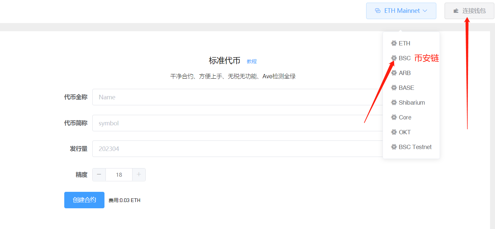<figcaption></figcaption></figure>

## 3、填写代币参数

在打开的页面，依次填写代币信息。假设我们创建一个代币叫——“PandaTool”，应该进行如下填写：

* **代币名称：**&#x50;andaTool（代币全称）
* **代币符号：**&#x50;anda（代币简称）
* **发行量：**&#x31;0000（代币数量）
* **精度：**&#x31;8（小数点后的位数）

<figure>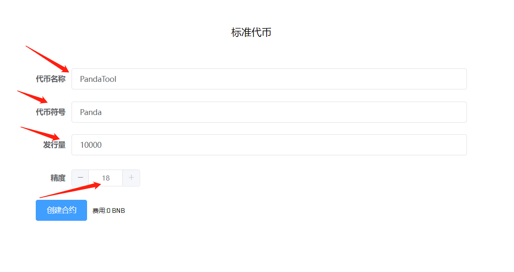<figcaption>
标准代币
</figcaption></figure>

## 4、创建合约

确认填写的参数无误后，点击“创建合约”。在打开的页面，将源代码和构造参数复制下来，以防万一：

<figure>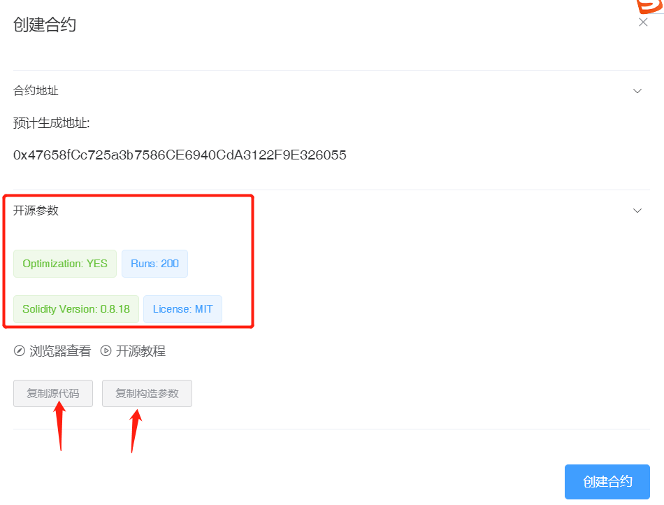<figcaption>
开源参数复制
</figcaption></figure>

复制之后，再次点击“创建合约”。此时小狐狸钱包会要求你支gas费，点击确认，等待几十秒，合约就创建完成了。

此时，我们点击`控制台`，就能看到自己创建的合约了，代币也已经发送到创建者的钱包地址里。

<figure>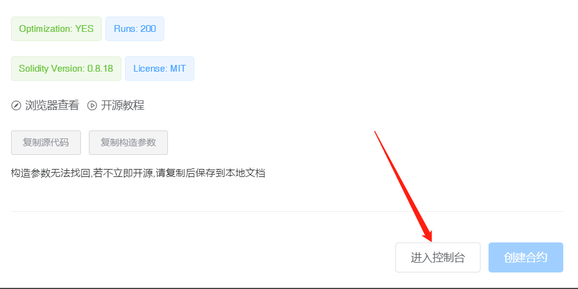<figcaption>
进入控制台
</figcaption></figure>

## 5、添加流动性

代币创建完成之后，只能转账，还不能交易。要想使代币可以交易，需要前往PancakeSwap创建一个流动性资金池才可以。

首先，我们打开薄饼的官网：[https://pancakeswap.finance/?chain=bsc](https://pancakeswap.finance/?chain=bsc) ,点击右上角连接钱包

<figure>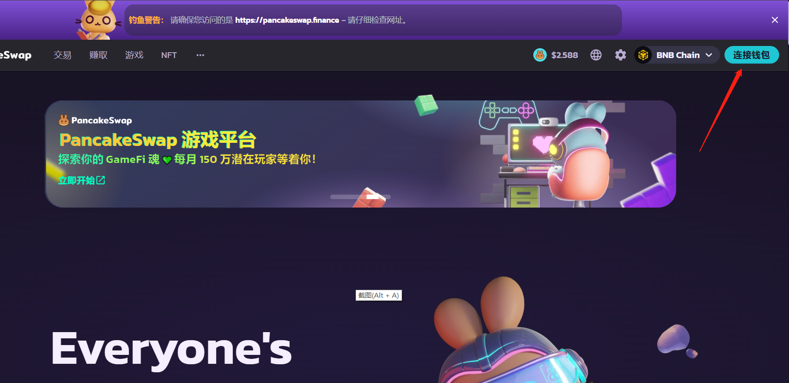<figcaption></figcaption></figure>

此时会跳出提示，让你选择钱包类似，电脑默认都是选择Metamask，之后小狐狸会提示让你确认

<figure>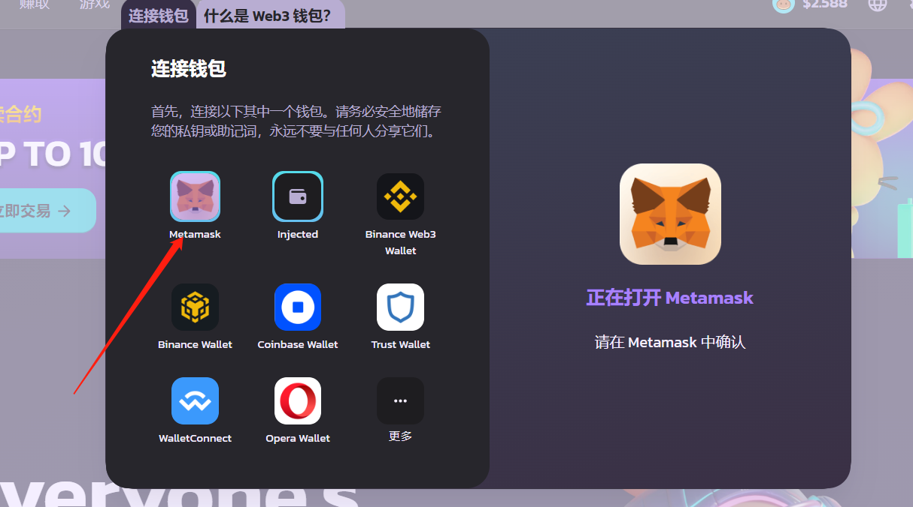<figcaption></figcaption></figure>

连接成功之后，右上角会出现你的钱包地址

<figure>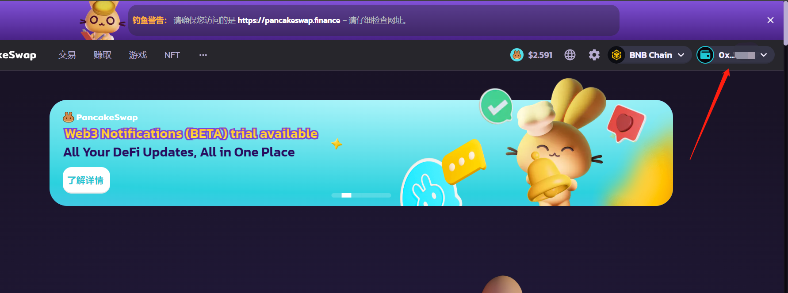<figcaption></figcaption></figure>

钱包链接成功之后，在上方菜单栏找到“赚取”，然后选择“农场/流动性”

<figure><figcaption></figcaption></figure>

在打开的新页面里，选择“我的持仓”（或者直接进入链接：[https://pancakeswap.finance/liquidity/positions](https://pancakeswap.finance/liquidity/positions)）

<figure>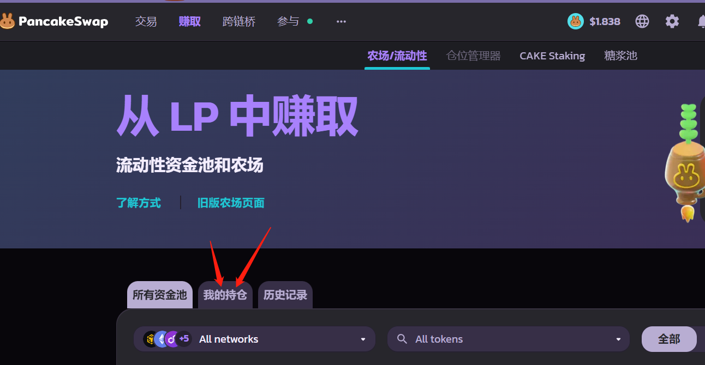<figcaption></figcaption></figure>

之后在右边可以看到添加流动性的按钮

<figure>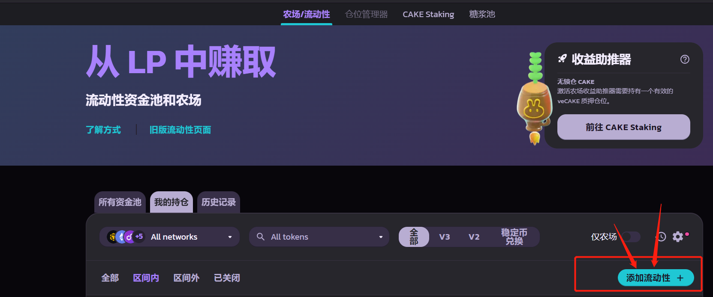<figcaption></figcaption></figure>

然后会看到两个代币对提示框，在两个选择您想要添加流动性的交易对中的两个代币

<figure><figcaption></figcaption></figure>

一般来说，左边选择BNB或者USDT，右边搜索选择你自己的代币

<figure>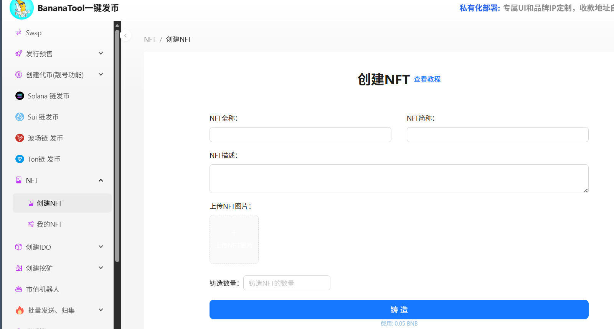<figcaption></figcaption></figure>

例如我选择的交易对：USDT-Panda。选择好交易对之后，记得选&#x62E9;**“添加V2流动性”**，这一步非常重要请谨记。V3流动性只适合标准币，除此之外，必须都加V2的流动性

<figure>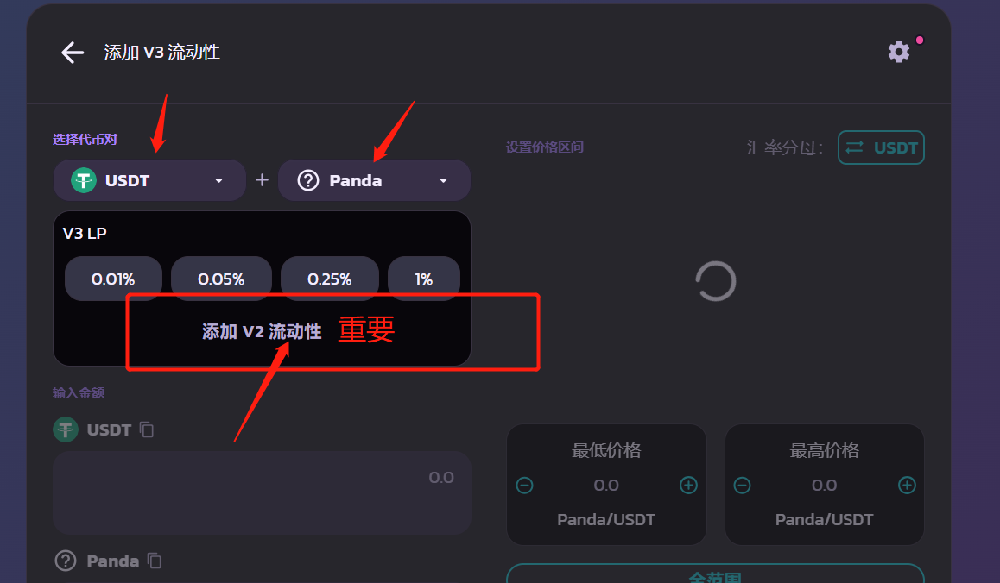<figcaption></figcaption></figure>

之后，我们根据自己的需求，填写注入流动性资金池的代币数量。两个代币数量的比例，决定了代币的初始价格。例如，我添加1000USDT和1000个Panda，说明代币的上线价格是1U

<figure>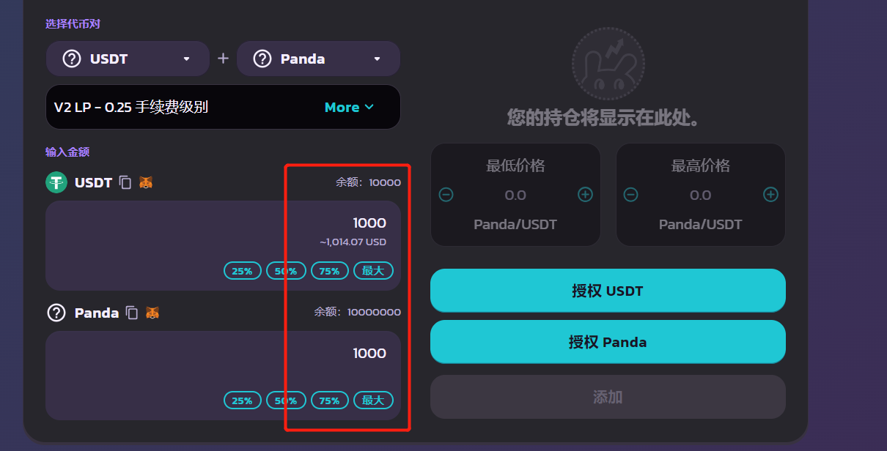<figcaption></figcaption></figure>

然后依次授权USDT和你自己发行的代币

<figure>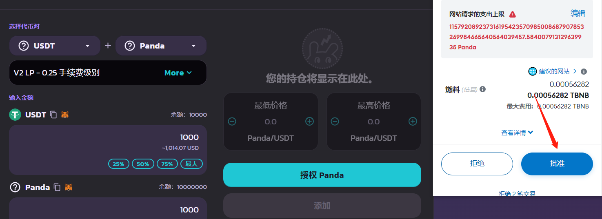<figcaption></figcaption></figure>

授权成功后点击“添加”，metamask钱包进行确认即可

<figure>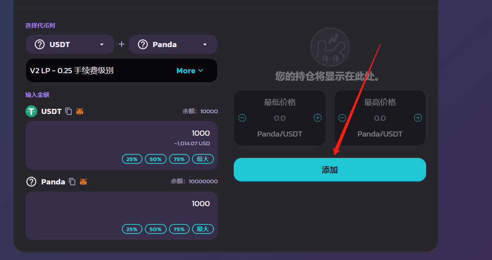<figcaption></figcaption></figure>

添加完成后，我们回到上一页，就能看到自己的池子信息了

<figure>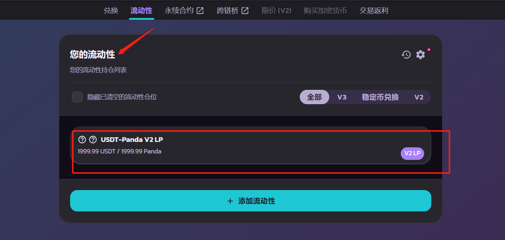<figcaption></figcaption></figure>

## 注意事项

* 代币创建完成后，默认是开源的，无需手动开源。
* 如果您要在测试网添加USDT交易对，请使用PandaTool官方发布的测试USDT做资金池，合约地址：0x66e972502a34a625828c544a1914e8d8cc2a9de5
