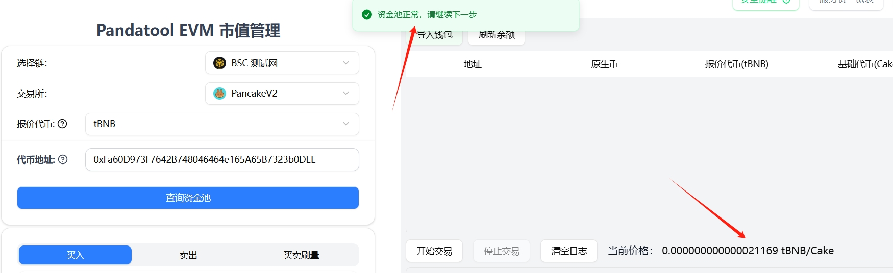
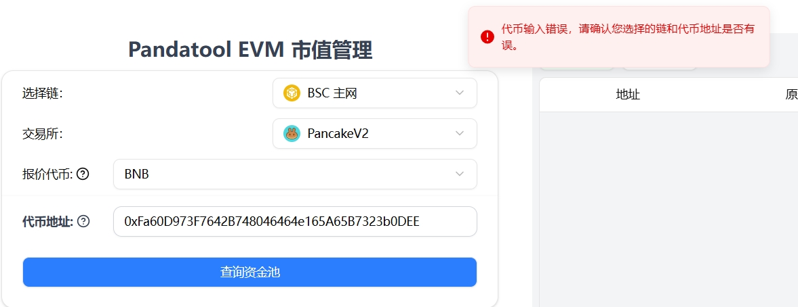
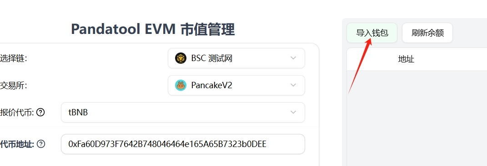
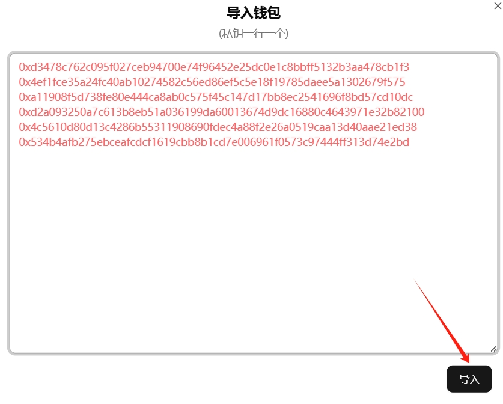
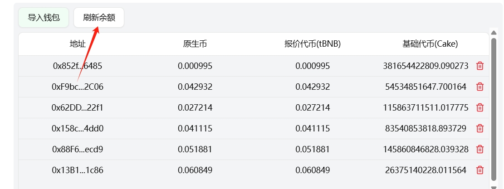
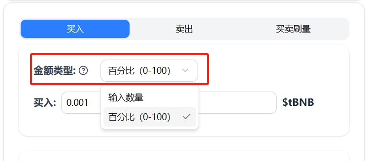
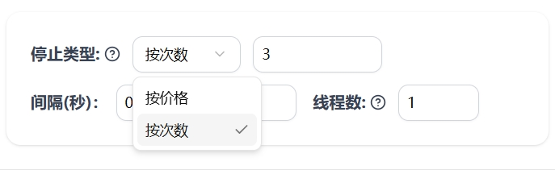
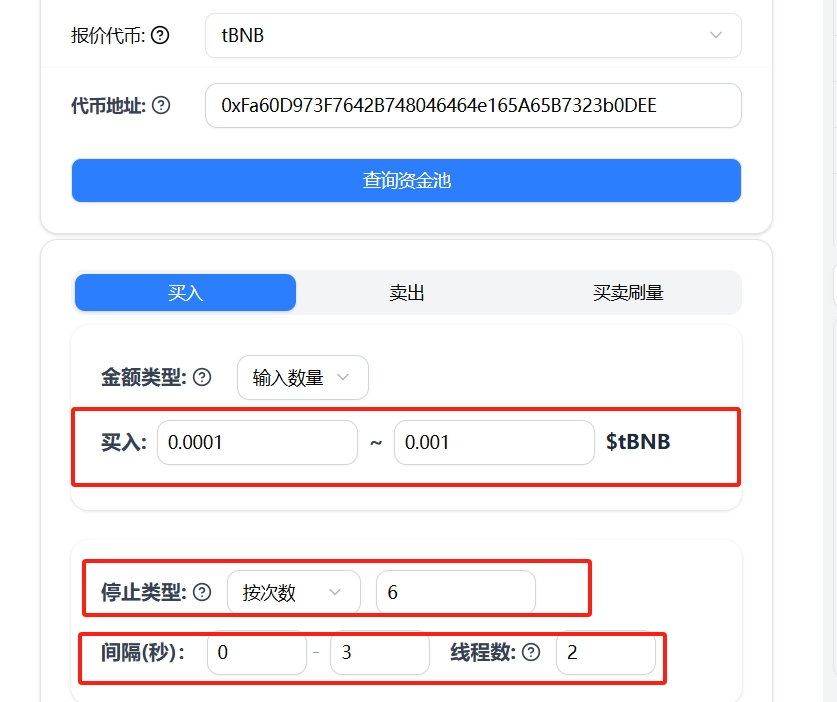
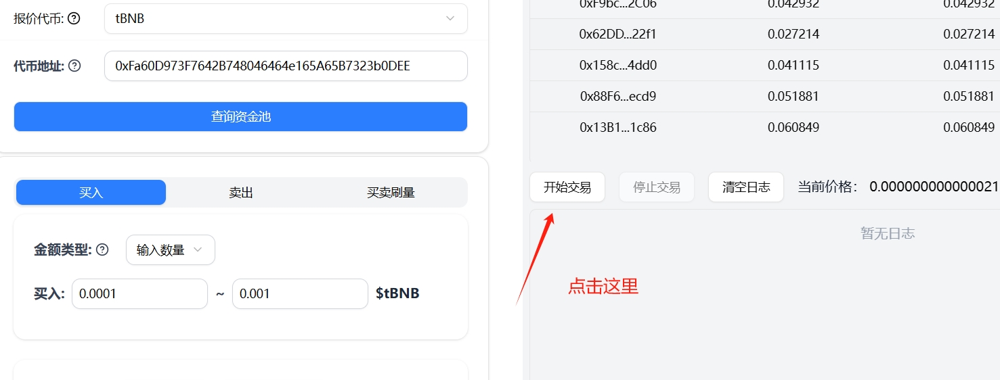
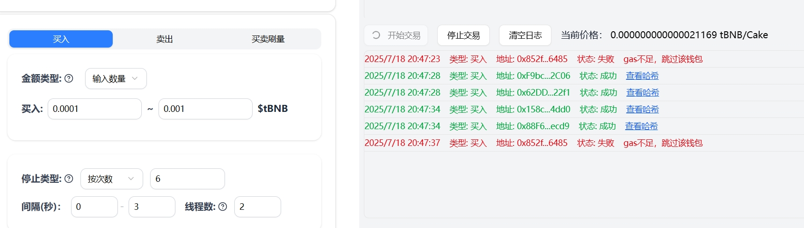

# 代币批量交易/市值管理教程

## **一、市值工具解读**

该工具是PandaTool开发、针对于以太坊兼容链的市值管理工具升级版，不仅支持了更多的链，工具速度、支持的资金池类型也有显著提示。

### **1、功能概念**

用户可以导入多个钱包地址，针对某一代币进行批量交易。通过设定交易次数、交易价格等要素，来实现交易的停止与启动。其目的在于解放双手，快速实现代币的大量交易。

### **2、支持类型**

该市值管理工具支持多条区块链、多个资金池类型，具体如下：

* **BNB Chain：**&#x50;ancakeSwap V2、PancakeSwap V3
* **Ethereum**：Uniswap V2、Uniswap V3
* **Avalanche：**&#x55;niswap V2、Uniswap V3
* **Polygon：**&#x55;niswap V2、Uniswap V3
* **Arbitrum、Optimsim：**&#x55;niswap V2、Uniswap V3

## **二、市值工具使用教程**

我们打开市值工具的操作页面：[https://evmswap.pandatool.org/](https://evmswap.pandatool.org/)   然后根据以下教程进行操作

### **1、查询资金池**

第一步，我们需要选择基础的信息，包括链、代币等：

<figure><figcaption></figcaption></figure>

* **选择链：**&#x9009;择您要交易的区块链，目标代币在哪条链，就选择哪条链
* **交易所：**&#x9009;择您创建的资金池类型，主要是V2和V3的区别
* **报价代币：**&#x5C31;是您的资金池代币，一般是BNB、ETH、USDT等，看下您的资金池交易对
* **代币地址：**&#x60A8;要交易的目标代币地址，直接填进来

确定好信息填写无误后，我们点击查询资金池：

* 如果查询没问题，则页面右边会出现代币i的价格，并提示您资金池正常

<figure><figcaption></figcaption></figure>

* 如果查询有问题，会提示您查询错误，您需要核对选择的区块链或者交易所是否正确

<figure><figcaption></figcaption></figure>

### **2、导入钱包**

查到资金池和价格后，我们点击右边的按钮导入钱包（私钥）

<figure><figcaption></figcaption></figure>

在弹出的页面输入钱包的私钥，一行一个，然后点击导入私钥。（一般导入几十个就可以了）

<figure><figcaption></figcaption></figure>

钱包导入之后，我们就能看到各个钱包地址了，然后点击**刷新余额**，确认一下钱包内的代币情况

<figure><figcaption></figcaption></figure>

余额刷新之后，我们进行下一步

### **3、买入与卖出交易设置**

目前代币的交易方式有三种，分别是：**买入交易、卖出交易和刷量交易，**&#x540C;时会选择不同的操作类型。现在我们了解一下买入和卖出的交易设置

#### **金额类型（使用买入和卖出同理）**

<figure><figcaption></figcaption></figure>

* **按照数量：**&#x8BBE;定每笔交易的买入数量，以报价代币计算（如USDT，BNB等）
* **按照比例：**&#x8BBE;定每笔交易钱包支出的余额比例
* **范围：**&#x8BBE;定交易数量或者比例的范围


**关于比例：**&#x8FD9;个比例是钱包余额的比例。如果您设置1%，钱包内1000U的话，那么第一笔交易就是10U。此时钱包内只有990U了，那么第二笔交易就是9.9U，以此类推


#### **停止类型（买入和卖出同理）**

<figure><figcaption></figcaption></figure>

* **按价格：**&#x5C31;是到了某个价格，停止交易
* **按次数：**&#x4EA4;易了多少次之后，就停止交易
* **间隔：**&#x6BCF;一笔交易的间隔时间，以秒为单位
* **线程数：**&#x540C;一秒发起多少笔交易，线程越大，交易频率越高（最大为6）

#### **设置案例**

例如我填写的代币交易设置是这样的：

<figure><figcaption></figcaption></figure>

这是一笔批量买入的交易，每次买入的金额是0.0001BNB到0.001BNB之间。一共交易6次就停止，没错交易间隔时间为0\~3秒，不固定，线程数是2.

<figure><figcaption></figcaption></figure>

设定完成后，我点击右边的开启交易按钮，即可开始交易

<figure><figcaption></figcaption></figure>

可以看到，如果钱包内gas不足，会直接跳过。一旦达到停止条件，会自动停止交易。

### **4、刷量交易设置**
