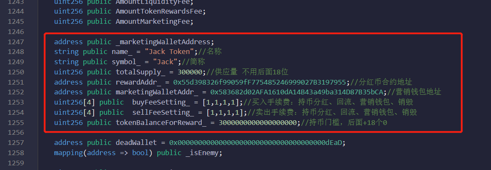
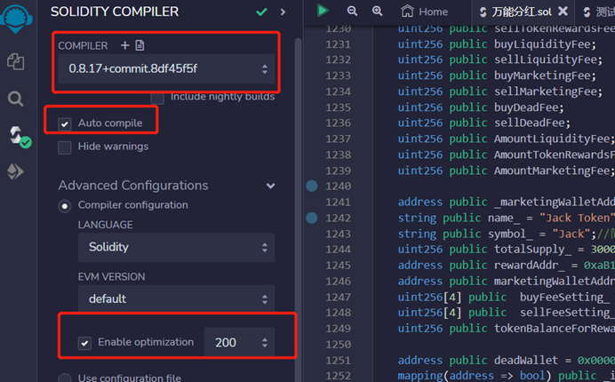
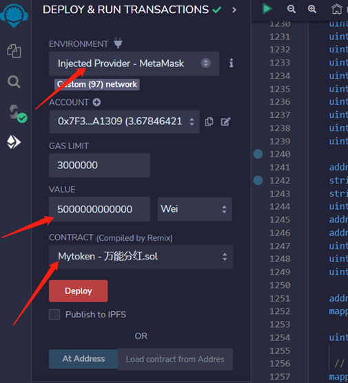
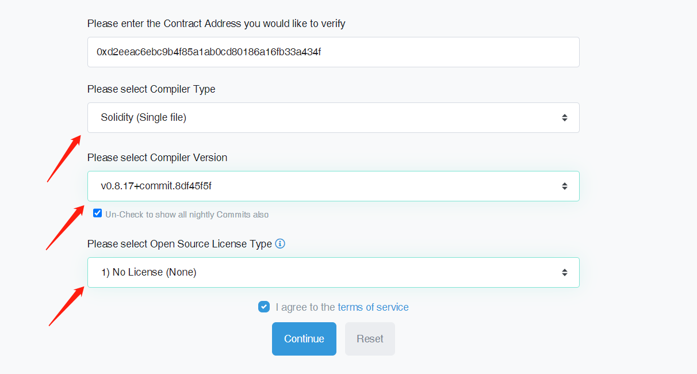
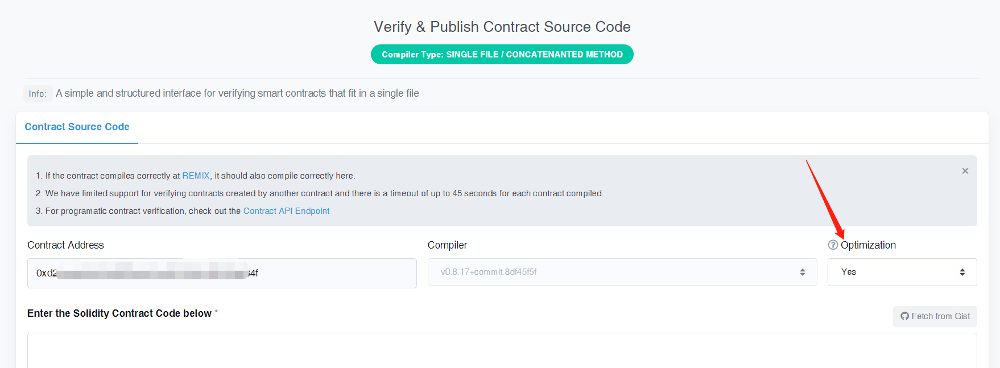
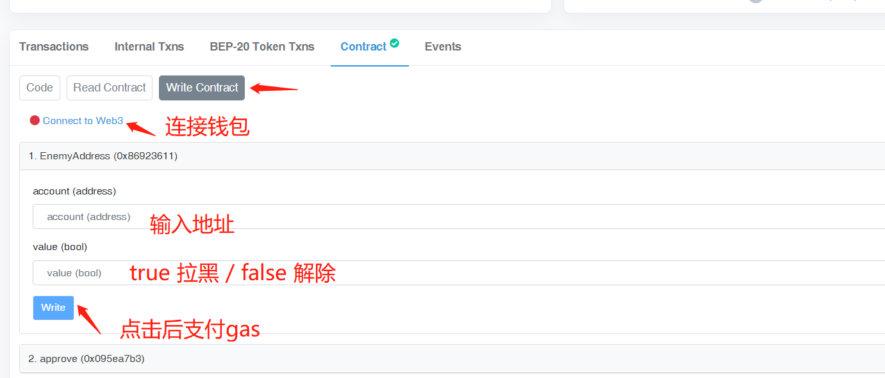
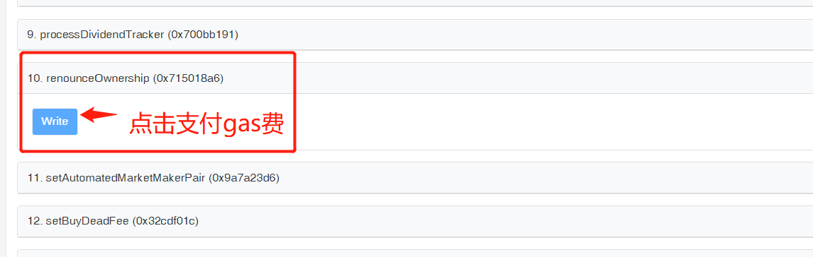
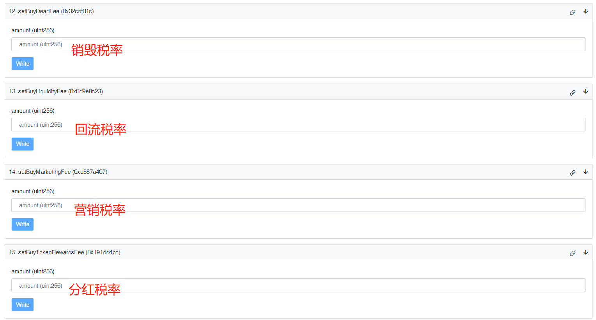
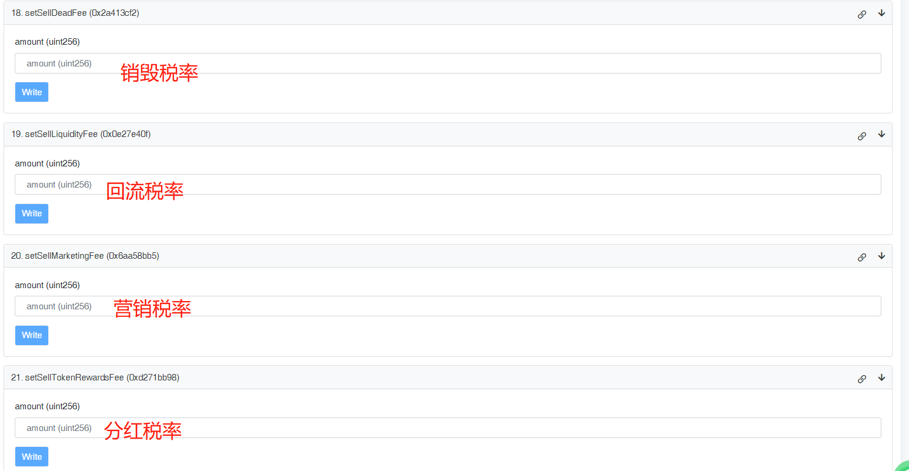
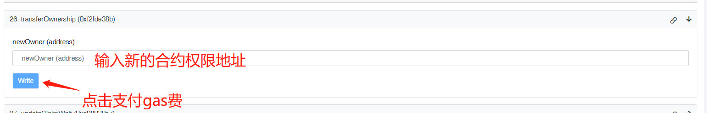

# 持币分红教程

币安链持币分红（万能分红）合约创建视频教程：


持币分红合约教程&#x20;


### 合约功能

1、有黑名单、白名单 、销毁、营销钱包等功能&#x20;

2、持币分其他币（USDT、USDC等），不支持分本币

3、持币分红可以设置门槛

4、发币之后，可以调整买卖税率&#x20;

5、电报交流群：https://t.me/pandatool

### 一、代码参数&#x20;

* name\_ = "Jack Token";//名称
* symbol\_ = "Jack";//简称
* totalSupply\_ = 300000;//供应量 不用后面 18 位&#x20;
* rewardAddr\_ = XXXXXXXX;//分红币合约地址&#x20;
* marketingWalletAddr\_ = XXXXXX;//营销钱包地址&#x20;
* buyFeeSetting\_ = \[1,1,1,1];//买入税：持币分红、回流、营销钱包、销毁&#x20;
* sellFeeSetting\_ = \[1,1,1,1];//卖出税：持币分红、回流、营销钱包、销毁&#x20;
* tokenBalanceForReward\_ = XXXX;//持币门槛，后面+18 个 0

<figure><figcaption>
代码修改
</figcaption></figure>

### 二、编译参数

* 版本号 COMPILER： v0.8.17+commit.e28d00a7.js&#x20;
* Enable optimization: 开启并使用默认值 200

<figure><figcaption>
合约编译
</figcaption></figure>

### 三、合约部署

* Environment：选择第三个Injected Provider Metamask
* GAS LIMIT：默认不用该
* Value：50000000000000000（5后面16个0）

<figure><figcaption>
合约部署
</figcaption></figure>

### 四、合约开源

* 选择文件类型：solidity（Single file）单文件&#x20;
* 选择版本号：v0.8.17+commit.e28d00a7.js&#x20;
* 选择开源许可证类型：No licernes

<figure><figcaption>
合约开源
</figcaption></figure>

Optimization是否优化：yes

<figure><figcaption>
是否优化
</figcaption></figure>

### 五、修改合约

在权限没放弃的情况下，可以在区块链浏览器找到代币合约的Write Cntact页面，在连上钱包之后，调用下列的函数进行修改：

1、EnemyAddress 设置黑名单

<figure><figcaption>
设置黑名单
</figcaption></figure>

10、renounceOwnership 放弃权限

<figure><figcaption></figcaption></figure>

12\~15 调整买入税率：销毁比例、流动性比例、营销钱包比例、分红比例

<figure><figcaption>
设置买入税率
</figcaption></figure>

17 修改营销钱包

<figure><figcaption>
设置新的营销钱包地址
</figcaption></figure>

18\~21调整卖出税率：销毁比例、流动性比例、营销钱包比例、分红比例

<figure><figcaption>
设置卖出税率
</figcaption></figure>

26 transferOwnership转让合约权限

<figure><figcaption>
转让合约权限
</figcaption></figure>

### 六、注意事项

1、合约代码仅能在BSC主网使用，若想在其他链使用，请自行修改

2、不能分BNB、wbnb这两个币

3、如果卖出税率出现异常，可以尝试提高滑点多卖几笔

4、如果资金池撤不出来，请选择Wbnb撤出

5、池子必须是BNB池子，且最好大于1BNB，不可以是USDT池子或者其他池子

6、博饼池子必须V2 的池子，不能加V3的池子

7、要分红的币，必须是此前就在博饼已经有了足够的BNB池子

### 七、合约代码下载

上述合约代码文件及相关教程下载链接：

* 百度网盘：[https://pan.baidu.com/s/1PXqB3Ggo7sKh-ffW54swTA?pwd=qzev ](https://pan.baidu.com/s/1PXqB3Ggo7sKh-ffW54swTA?pwd=qzev)
* Mega网盘：[https://mega.nz/folder/kHtHBayB#QXN6czytHkkdJCIRAwuU1g](https://mega.nz/folder/kHtHBayB#QXN6czytHkkdJCIRAwuU1g)
