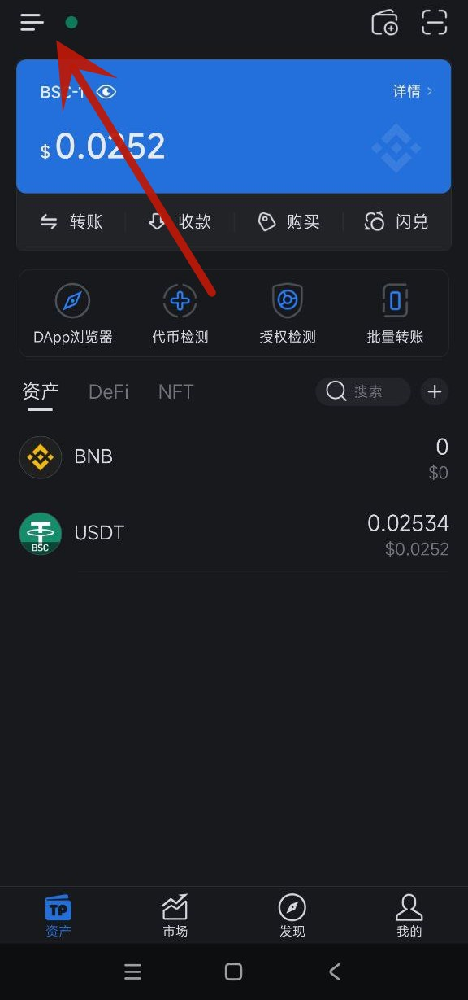
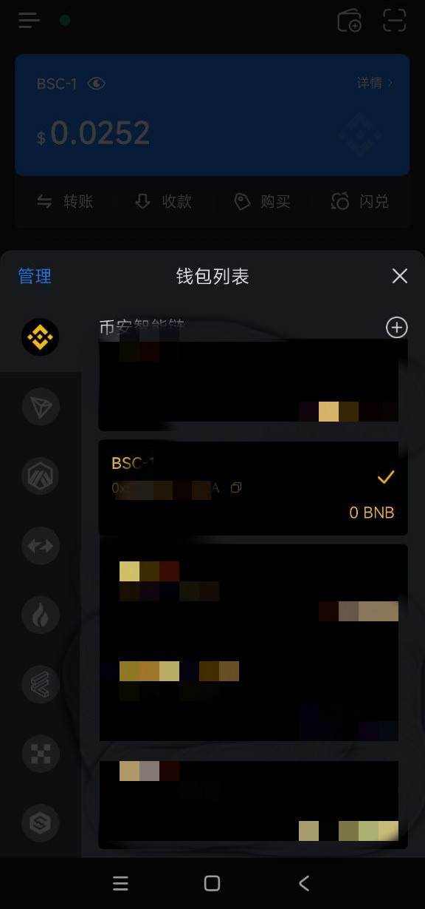
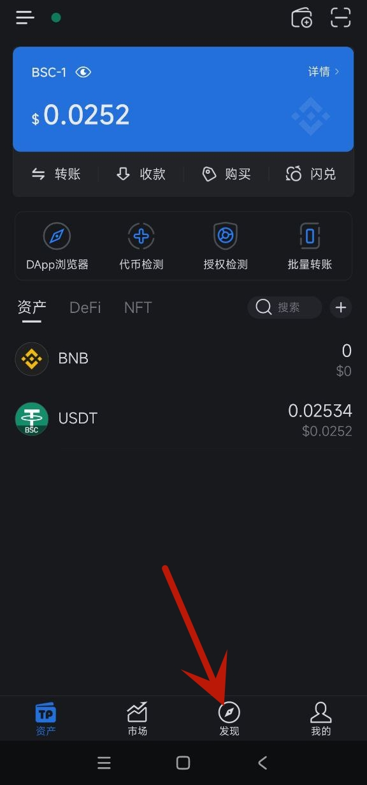
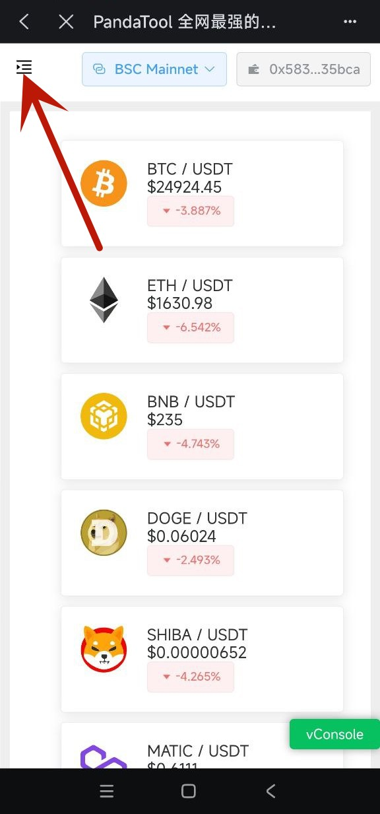
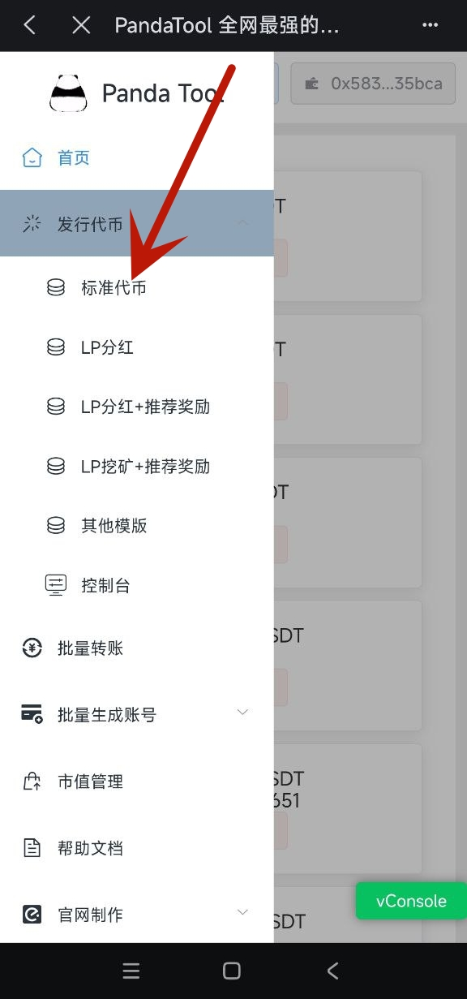
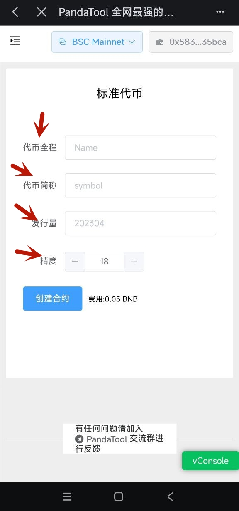
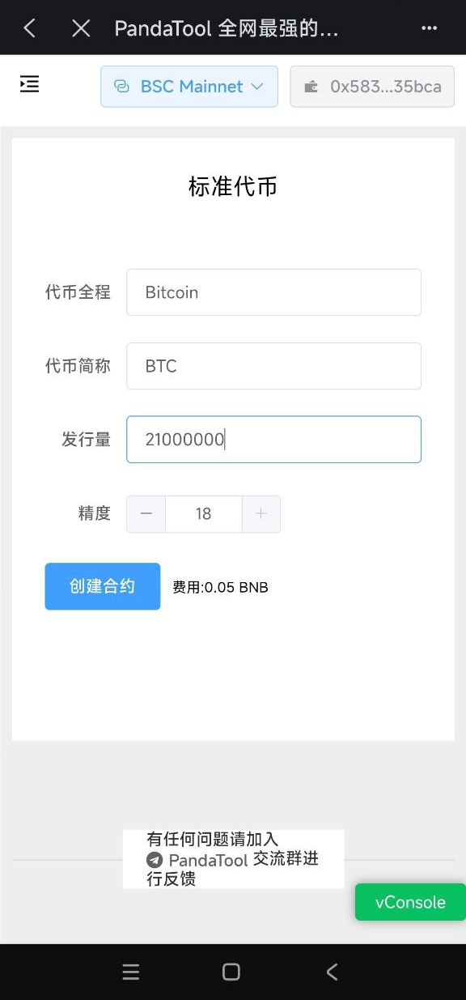
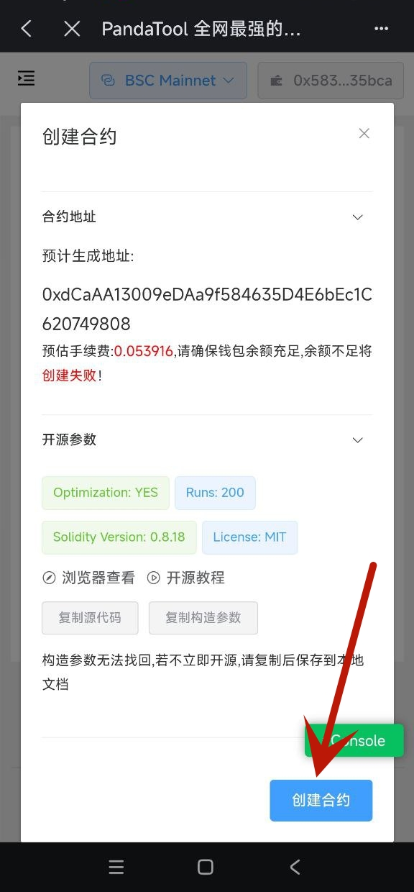
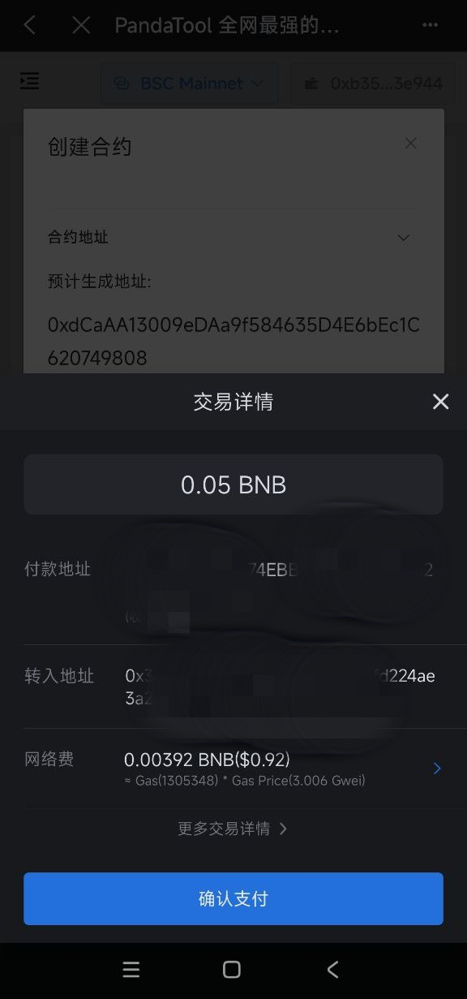

# 手机TP钱包发币教程

呼入鉴于很多小伙伴没有电脑，或者不太会用电脑一键发币，所以这篇教程是告诉大家，如何使用手机上的TP钱包进行一键发币：

第一步：在手机上打开`TP钱包`，点击左上角`切换网络`

<figure><figcaption>
TP钱包
</figcaption></figure>

第二步：选择你要创建合约的链以及钱包地址，这里以`币安链`为例

<figure><figcaption>
选择创建合约的钱包地址
</figcaption></figure>

第三步：点击下方第三个按钮`发现`，进入TP钱包内置浏览器

<figure><figcaption>
发现DAPP
</figcaption></figure>

<figure><figcaption>
进入钱包内置浏览器
</figcaption></figure>

第四步：输入`PandaTool`网址：pandatool.org

<figure><figcaption>
输入网站链接
</figcaption></figure>

第五步：进入PandaTool官网，选择左上角菜单，找到`发行代币`

<figure><figcaption>
找到官网菜单
</figcaption></figure>

<figure><figcaption>
发行代币
</figcaption></figure>

第六步：选择你要发行的代币类型，这里以`标准代币`为例

<figure><figcaption>
标准代币
</figcaption></figure>

第七步：按照提示填写`代币信息`

<figure><figcaption></figcaption></figure>

第八步：点击`创建合约`，进行二次确认

<figure><figcaption>
创建合约
</figcaption></figure>

<figure><figcaption>
二次确认
</figcaption></figure>

第九步：支付`Gas费`，创建完成

<figure><figcaption></figcaption></figure>

以上就是使用手机TP钱包发币的全部流程了，使用IMToken钱包、BK钱包也是同样的流程，区别不大。如有任何问题，欢迎加入我们的电报群交流反馈：[https://t.me/pandatool](https://t.me/pandatool)
