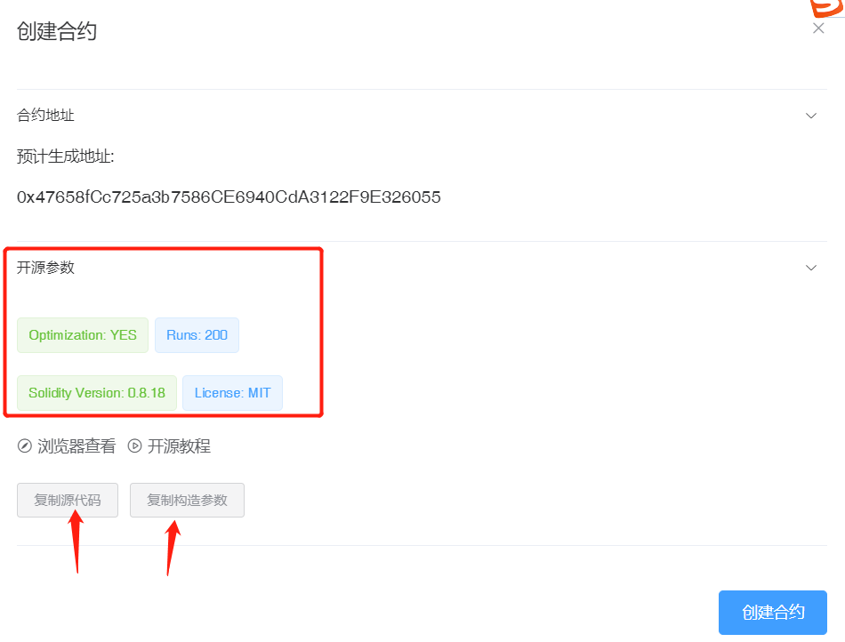
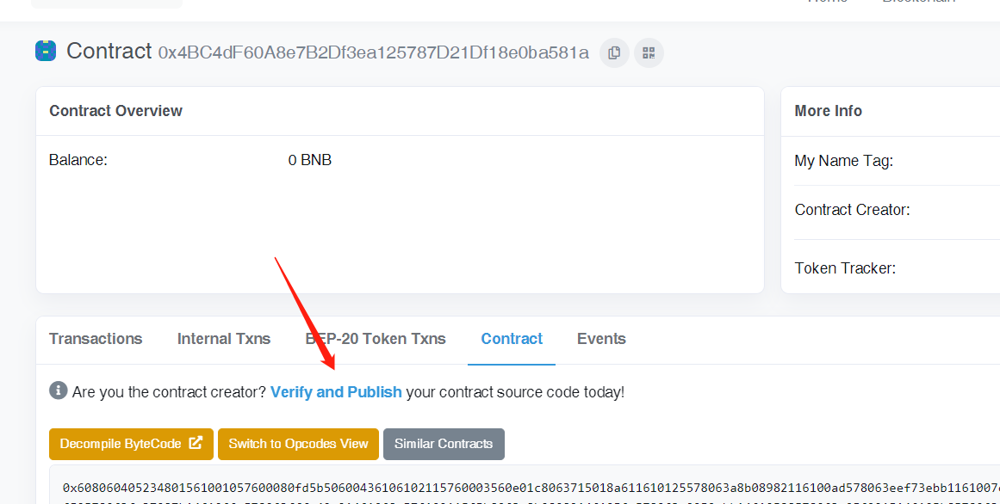
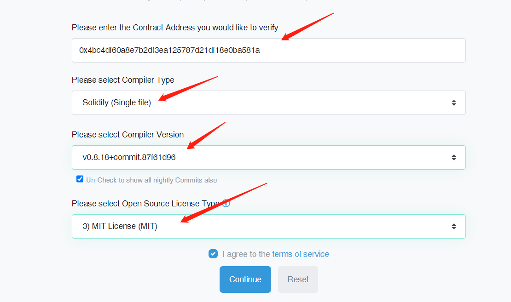
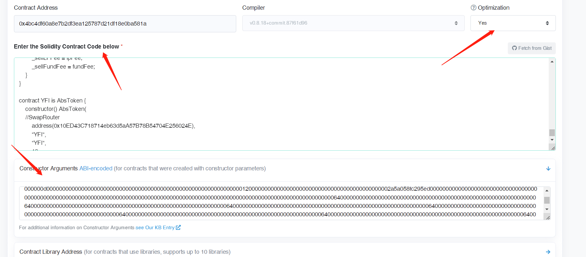
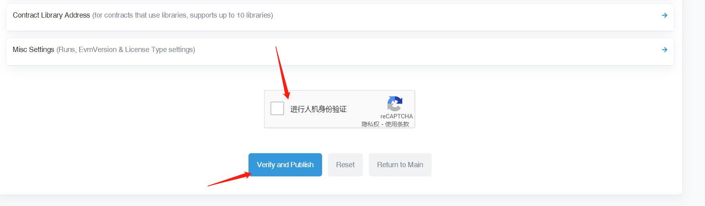

# 合约开源教程

通过PandaTool, 在`BSC`、`ETH`等基础设施完善的链上发行代币时, 合约会自动开源, 无需进行手动操作.

但是在Core等区块浏览器功能不完善的链上,或者因为一些无法预料的情况 无导致法自动开源时, 就需要用户在创建代币完成后, 进行手动开源

下面以BSC测试链为例, 详细描述开源流程

## 1. 复制开源参数 

在创建代币的确认页面, 将会显示 “开源参数” 选项卡, 点击后可展开信息, 标注了开源时需要用到的各种参数：

<figure><figcaption></figcaption></figure>

需要记住开源参数，并将`源代码`和`构造参数`复制到本地

## 2、区块浏览器验证

代币创建完成后, 点击页面中的 `浏览器查看` 按钮, 跳转至 `BSC测试链`的区块浏览器的代币页面。此外，也可以手动进入浏览器中, 在搜索框中搜索生成的代币合约

<figure><figcaption></figcaption></figure>

找到合约后，点击“Verify and Publish”（验证与发布合约），之后进入下一步

## 3、选择开源信息

根据刚刚创建页面中的合约参数, 选择开源信息

* `Compiler Type` 选择单一文件 `Single file`
* 编译器版本选择 `0.8.18`
* 开源协议选择 `MIT`

<figure><figcaption></figcaption></figure>

## 4、填写开源资料

点击 `continue` 继续填写详细信息

* `Optimization` 选择 yes
* 将第1步中复制的 `源代码` 粘贴在 `Contract Solidity Source Below` 中
* 将第1步中复制的 `构造参数` 粘贴在 `Constructor Arguments` 中

<figure><figcaption></figcaption></figure>

## 5、完成开源

进行谷歌人机验证，通过后点击“Verify and Publish”，等待十几秒钟，即可完成开源

<figure><figcaption></figcaption></figure>
