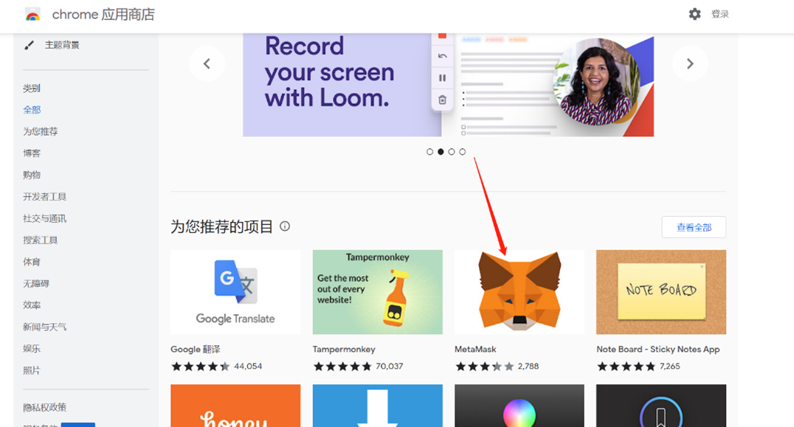
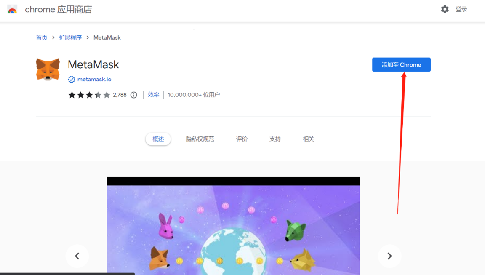
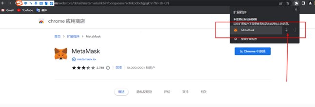
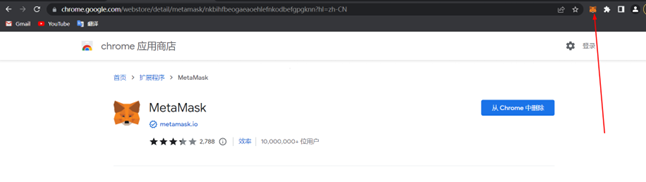
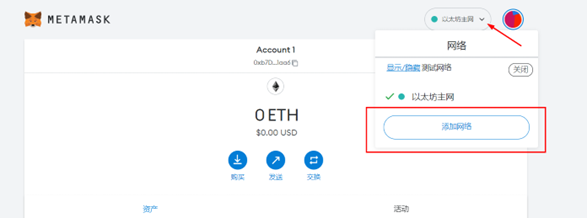
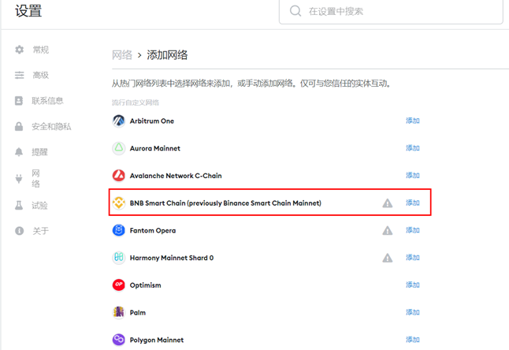
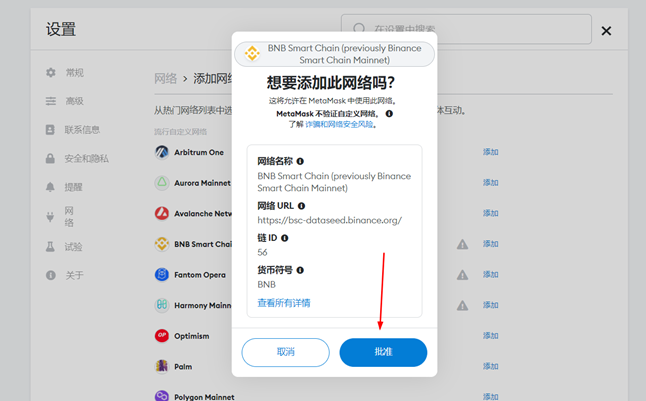
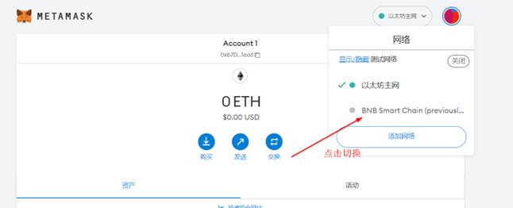
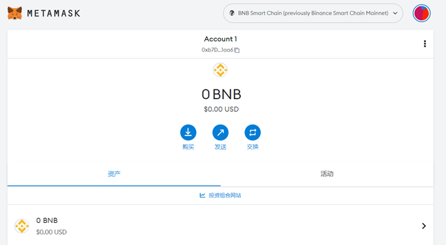
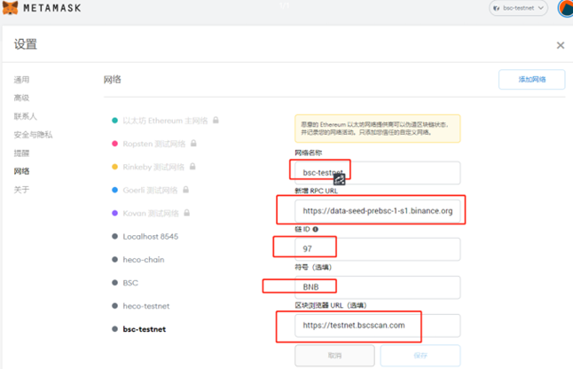

# 小狐狸插件安装教程

\*前置条件：一定要会科学上网，懂得都懂。

## 一、浏览器安装

电脑安装谷歌浏览器，下载链接如下：

* Google Chorme windows 64位：https://www.chromedownloads.net/chrome64win/
* Google Chorme windows 32位：https://www.chromedownloads.net/chrome32win/
* Google Chorme mac版：https://www.chromedownloads.net/chrome64osx/

或者使用360软件管家下载chrome稳定版

* 360软件管家 - 宝库 - 搜索chrome - 点击安装按钮右边的向下箭头 - 下载安装包

## 二、配置MetaMask钱包

## **1.安装小狐狸钱包插件**

打开谷歌应用商店[https://chrome.google.com/webstore?hl=zh-CN](https://chrome.google.com/webstore?hl=zh-CN)，找到MetaMask钱包，进行安装。

<figure><figcaption></figcaption></figure>

<figure><figcaption></figcaption></figure>

添加成功之后，将图标固定在谷歌浏览器上方。

<figure><figcaption></figcaption></figure>

<figure><figcaption></figcaption></figure>

## 三、配置币安链网络

MetaMask是默认以太坊网络的，因此要自己配置一个币安链网络，我们点击“添加网络”

<figure><figcaption></figcaption></figure>

<figure><figcaption></figcaption></figure>

可以看到有默认币安链的选项，直接添加即可

<figure><figcaption></figcaption></figure>

添加成功后，就可以切换到币安链网络

<figure><figcaption></figcaption></figure>

<figure><figcaption></figcaption></figure>

此时你整个网络配置已经全部完成了，但是钱包里还没有BNB，你需要从交易所或者其他钱包地址里转一点BNB进来，才能进行接下来的操作。BNB用来做发币的手续费，是必不可少的

\*如果要用币安测试链，需要配置币安测试链网络，这里将配置的信息一并写出来：

&#x20;网络名称（自定义）：bsc-testnet

&#x20;新增RPC URL：

* https://data-seed-prebsc-1-s3.binance.org:8545/
* (或者) https://data-seed-prebsc-1-s2.binance.org:8545/
* (或者) https://data-seed-prebsc-2-s3.binance.org:8545/
* (或者) https://data-seed-prebsc-2-s1.binance.org:8545/
* (或者) https://data-seed-prebsc-1-s1.binance.org:8545/
* (或者) https://data-seed-prebsc-2-s2.binance.org:8545/

链ID：97

符号（选填）：BNB

测试链浏览器：https://testnet.bscscan.com

<figure><figcaption></figcaption></figure>

注意：生成钱包时请隐藏好自己的助记词和私钥，这是绝对不可以泄露和丢失的，非常重要

