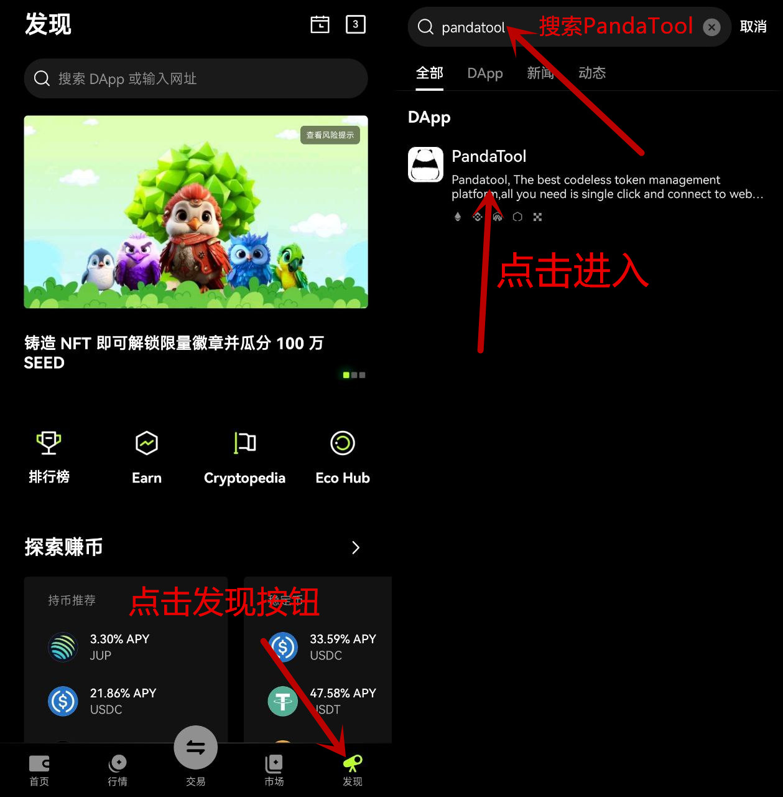
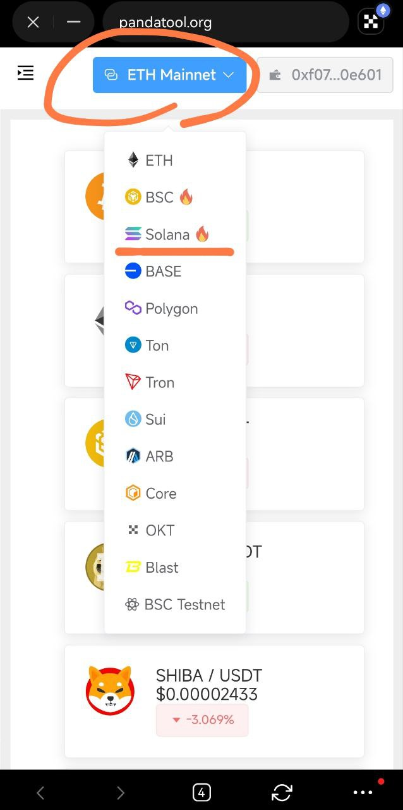
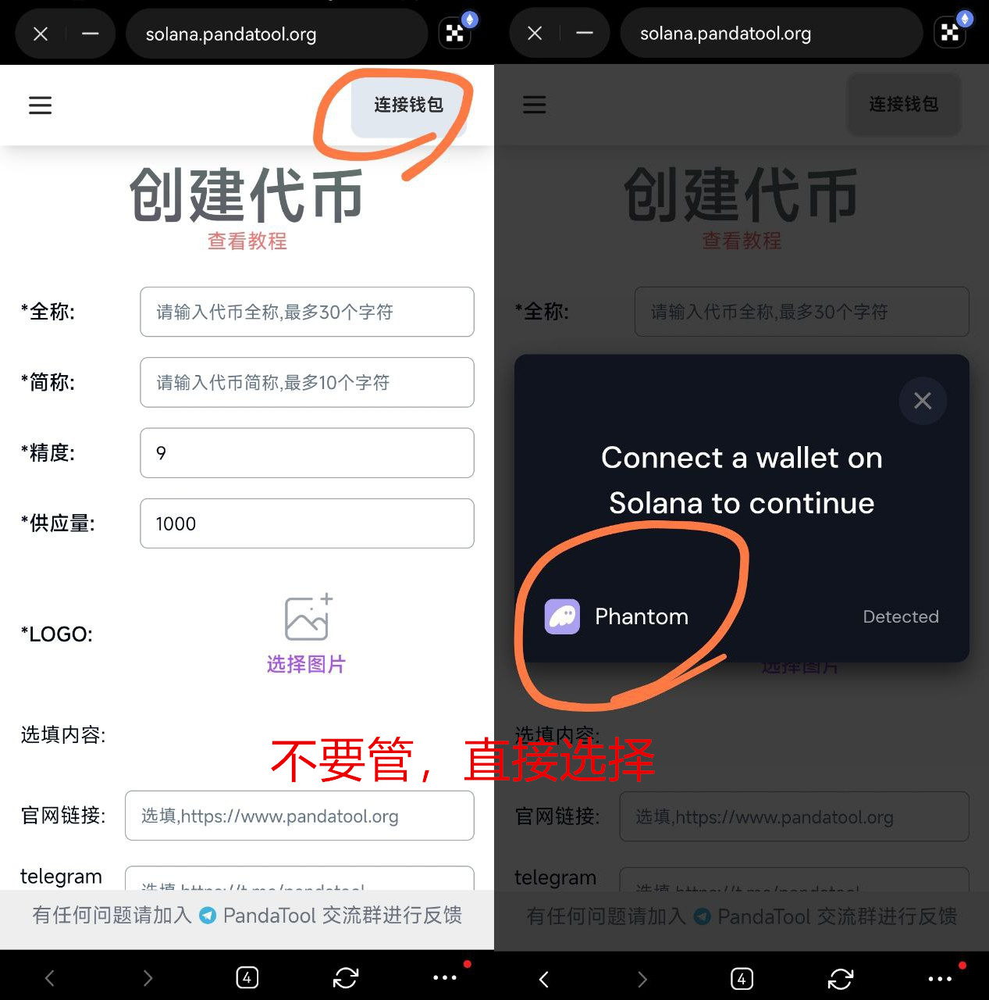
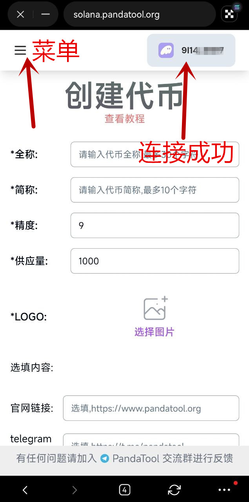
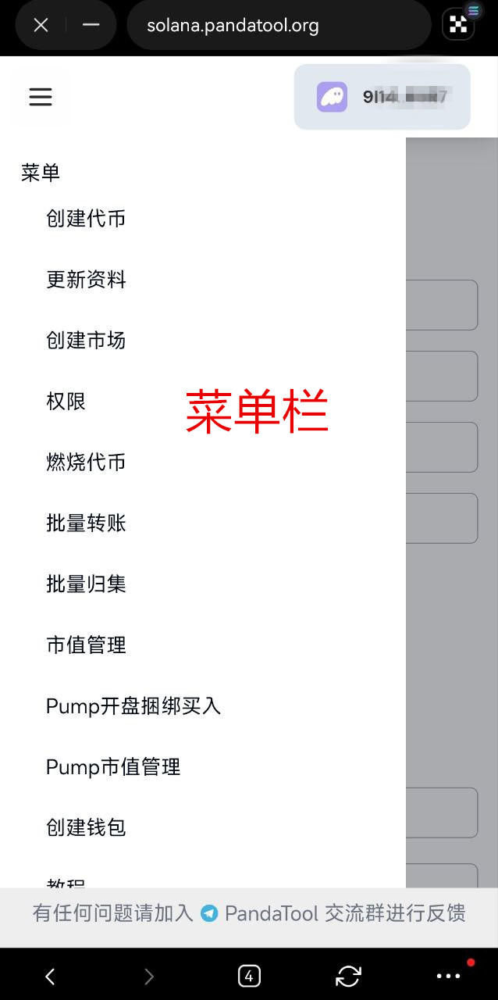

# 欧易OKX Web3钱包发币教程

考虑到很多用户不方便使用电脑，这篇教程主要是教大家如何使用OKX Web3钱包发行代币

### **1、找到PandaTool**

我们需要打开自己的OKX Web3钱包，然后在浏览器的【发现】位置搜索PandaTool，就能看到我们的DAPP了

<figure><figcaption></figcaption></figure>

如果搜索不到，也可以直接输入PandaTool的官网域名进入：pandatool.org

### **2、切换链**

进入pandatool官网之后，我们可以自由切换链。你想在哪条链发币，就选择哪条链

<figure><figcaption></figcaption></figure>

假如我们是要在Solana发币，就切换Solana链，然后进入Solana发币页面

### **3、Solana连接钱包**

进入之后，第一步就是连接钱包。我们点击右上角的连接钱包，之后选择phantom

<figure><figcaption></figcaption></figure>

大家不要担心说，为什么没有OKX钱包选项？或者Phantom能不能连接到OKX？我可以负责任的告诉大家，完全可以兼容。只需要点击Phantom，就会自动匹配欧易，所以不用担心，直接选择就可以。

连接成功后，右上角会出现钱包的地址

<figure><figcaption></figcaption></figure>

这样网站打开默认是发币页面，如果您想进行其他操作，可以点击左上角的菜单栏，就能看到不同的工具选项

<figure><figcaption></figcaption></figure>

以上就是关于适用欧易Web3钱包进行发币的教程了，如果您还有其他问题，可以进入我们的Telegram官网群进行沟通：[https://t.me/pandatool](https://t.me/pandatool)
