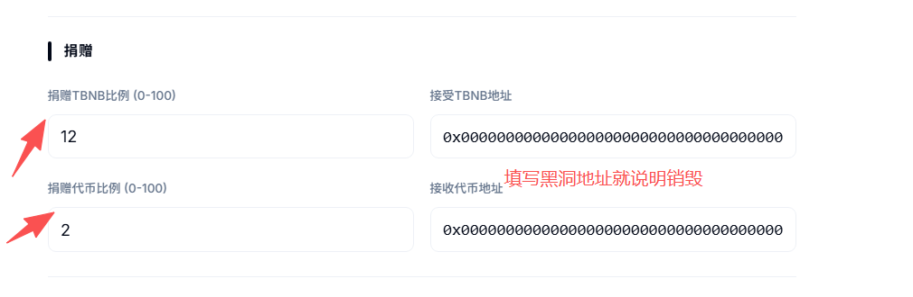
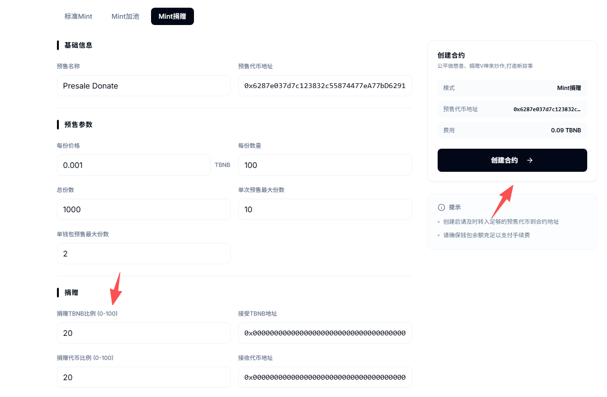
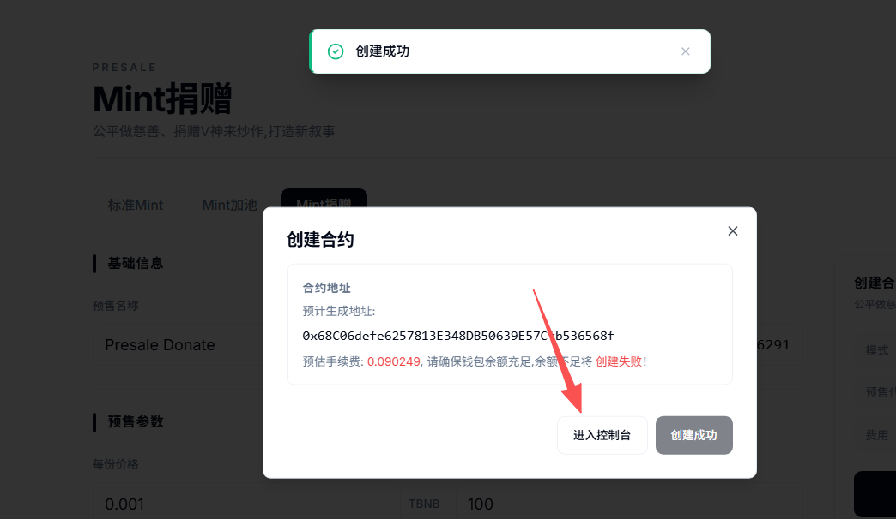
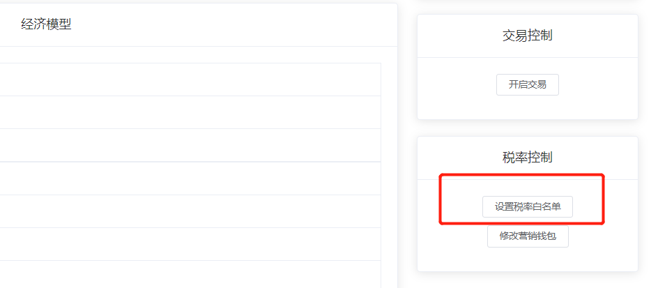
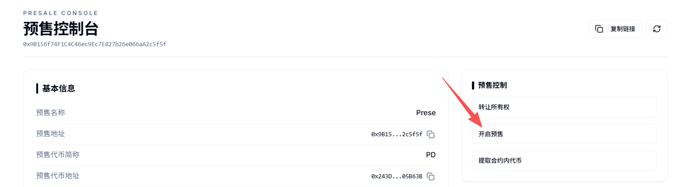
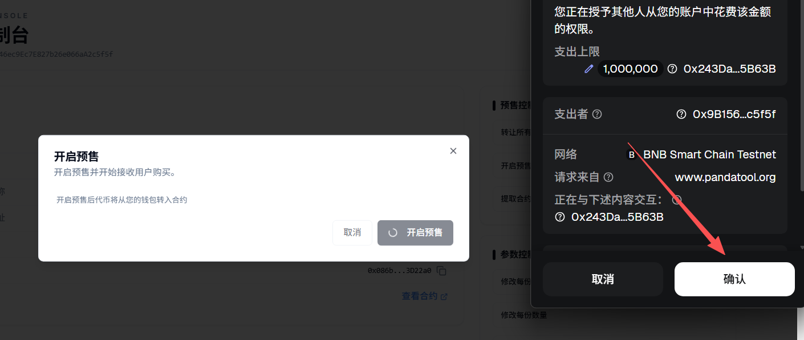
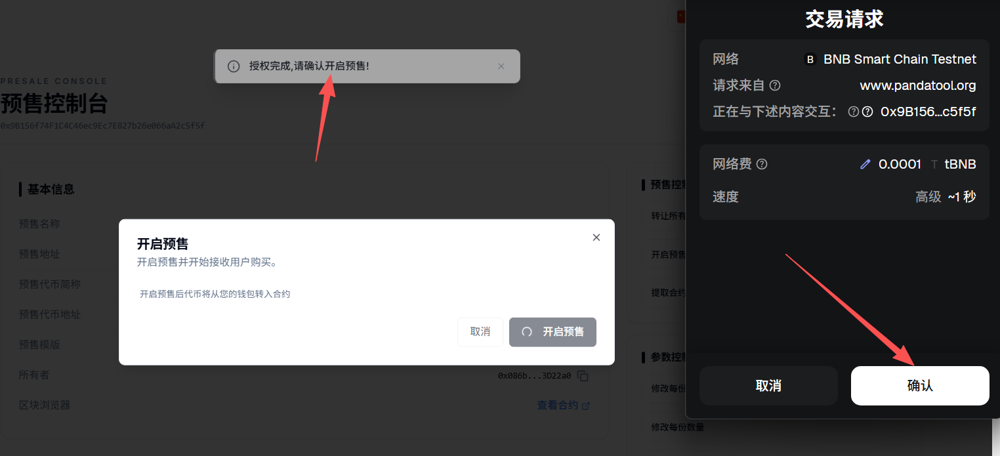
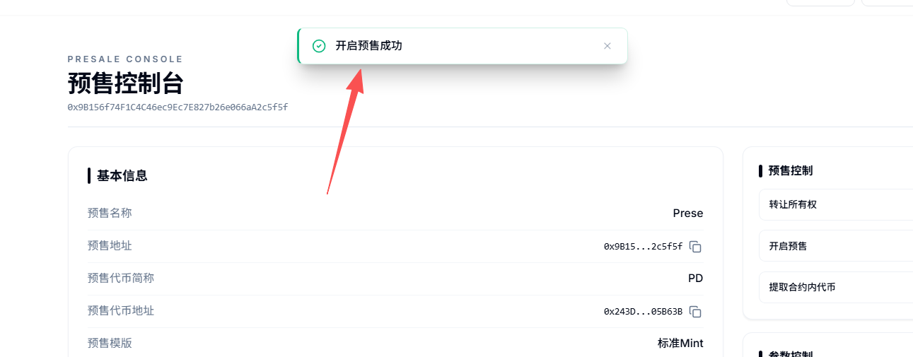
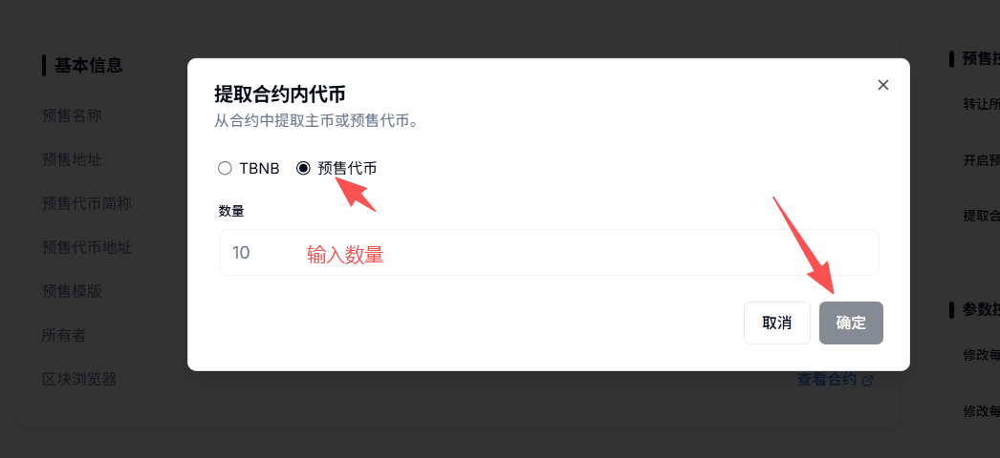

# 创建代币Mint捐赠预售教程

**什么是Mint捐赠预售？**

简单来说，就是通过Mint的方式预售，并将收到的BNB捐赠给名人钱包。j具体来说，项目方将一定数量的代币打入预售合约地址，开启预售后，用户将BNB转入预售合约地址，预售合约会自动按照设定好的比例，将一部分的代币或者BNB给到名人钱包，如V神钱包地址，方便后续的炒作。

和标准预售、加池预售不同，捐赠预售借助了名人营销的方式，主动的将V神等钱包地址加入到项目中来，给项目打造了新的叙事，便于后续的传播。

### 一、Mint捐赠预售功能说明 

* **捐赠预售：**&#x9884;售的同时将BNB或者代币给到名人钱包
* **无前端：**&#x4E0D;需要任何网页，纯合约支持，100%**去中心化**
* **转账即预售：**&#x7528;户将BNB转到`预售合约`，就能**自动**获得代币
* **自定义功能：**&#x9879;目方可以在预售开始后通过控制台**修改**预售价格和每份数量
* **无软顶/硬顶：**&#x6CA1;有软顶或者硬顶的概念，只有一个预售总数量（份数x每份数量）

### 二、注意事项提前说明 

* V神后期有砸盘的风险，注意防范
* 标准代币合约**不建议**开启预售，因为预售期间可能会有人加池
* 其他代币合约请不要开始交易（如有手动开盘功能的话）

## **三、捐赠预售创建教程** 

### **1、连接钱包（老手请忽略）** 

首先，我们打开捐赠预售创建官网：[https://www.pandatool.org/zh-CN/presale](https://www.pandatool.org/zh-CN/presale)，右上角点击连接钱包

<figure><figcaption></figcaption></figure>

之后会弹出小狐狸让你确定要连接的钱包地址，选择一个就行了。然后下一步就是选择公链，如果您要在币安创建预售，就选择BSC。如果要在Base链创建预售，就选择Base

<figure><figcaption></figcaption></figure>

之后就能在右上角看到你的钱包地址和链状态，说明已经链接成功了

### 2、填写预售参数

钱包连接成功后，我们通过PandaTool可视化页面创建预售，还是那个页面：[https://www.pandatool.org/zh-CN/presale](https://www.pandatool.org/zh-CN/presale) 打开，然后选择Mint捐赠模式

<figure><figcaption></figcaption></figure>

填写相应的预售参数：

<figure><figcaption></figcaption></figure>

* [x] **预售名称** : 给你的预售起个名字，仅支持英文
* [x] **预售代币地址** : 你要预售的代币合约地址（前提是有代币）
* [x] **每份价格 :** 每份预售的价格，最小的单位是0.001
* [x] **每份数量** : 每份有多少个代币
* [x] **总份数:：**&#x4E00;共可以预售多少份（每份数量x总份数≤代币发行总量）
* [x] **单次预售最大份数：**&#x4E00;次最多可以预售几份
* [x] **单钱包预售最大份数：**&#x4E00;个钱包最多可以预售几&#x4EFD;_（单钱包最大份数必须小于单次预售最大份数）_

和标准Mint不同的是，**Mint捐赠**模式，还需要选择捐赠的比例和地址

<figure><figcaption></figcaption></figure>

* [x] **捐赠BNB/ETH比例：**&#x5C06;预售的BNB/ETH按照多大的比例（0\~100）捐赠给某个地址
* [x] **接收BNB/ETH的地址：**&#x5C06;BNB/ETH捐赠给哪个地址（一般是名人钱包）
* [x] **捐赠代币的比例：**&#x5C06;预售的代币按照多大的比例（0\~100）捐赠给某个地址
* [x] **接收BNB/ETH的地址：**&#x5C06;代币捐赠给哪个地址（一般是名人钱包）


V神钱包地址：0xd8da6bf26964af9d7eed9e03e53415d37aa96045


例如我下面填写的内容参数

<figure><figcaption></figcaption></figure>


根据上面填写的参数，以0.001BNB的价格可以Mint一份，一份的数量是100个代币，其中捐赠比例都是20%。

什么意思呢，就是说：用户每Mint一次，将会有0.0002的BNB和20个代币给到V神钱包。用户自己只能获得80个代币，项目方只能获得0.0008BNB的预售费用。


参数填写完成后，点击创建合约，此时会弹出钱包进行确认，等待几秒，就会提示你预售创建完成

<figure><figcaption></figcaption></figure>

* [x] **为什么校验参数错误？**
  * 有可能是钱包没连上，核查一下钱包连接情况
  * 有可能是代币合约填错了，核查一下合约地址
  * 有可能是钱包内代币数量不够
  * 有可能是总份数x每份数量大于代币总量

### 3、预售控制台操作

创建成功后，我们进入到控制台：[https://www.pandatool.org/zh-CN/presale/list](https://www.pandatool.org/zh-CN/presale/list)，看下该如何操作这个预售

<figure><figcaption></figcaption></figure>

* [x] **权限控制**
  * **转让所有权** : 将合约权限转让给其他人（转移权限之前，记得复制`控制台链接`。新的权限地址必须通过控制台链接，才能进入控制台操作）
  * **开启交易：**&#x70B9;击按钮后，钱包确认后，即可开始预售
  * **提取合约内代币：**&#x53EF;以将预售合约里面的BNB/ETH和代币提取走
* [x] **参数控制**
  * **修改每份价格 :** 重新修改预售价格，最低0.001
  * **修改每份数量：**&#x91CD;新修改每份数量
  * **修改总份数：**&#x6839;据实际情况重新修改总的预售份数
  * **修改单次Mint最大份数：**&#x6839;据需求修改单次预售上限
  * **修改单钱包最大份数：**&#x6839;据需求修改单个钱包预售上限
* [x] **捐赠控制**
  * **修改接收BNB/ETH的钱包：**&#x91CD;新设置接受捐赠的钱包地址
  * **修改捐赠BNB/ETH的比例：**&#x91CD;新设置捐赠的比例
  * **修改接受代币的钱包：**&#x91CD;新设置接受捐赠的钱包地址
  * **修改捐赠代币的比例：**&#x91CD;新设置捐赠的比例

### 4、预售怎么开始与结束？

**1）加白名单：**&#x5982;果您的代币有税率、持币限制或者交易限制功能，预售创建成功后，将预售合约加入到你本身代币合约的税率白名单或者持仓白名单中，例如

<figure><figcaption></figcaption></figure>

**2）开启预售：**&#x5728;`预售控制台`点击**开始交易**，会进行两次确认。第一次是授权确认，第二次会让你**转入**足够的代币进入预售合约里

<figure><figcaption></figcaption></figure>

现在我们进行第一次授权

<figure><figcaption></figcaption></figure>

第一次授权成功后，紧接着会弹出钱包进行第二次确认

<figure><figcaption></figcaption></figure>

第二次确认成功后，会提示你预售开启成功，同时也能看到代币已经转入到合约里面

<figure><figcaption></figcaption></figure>

**3）结束预售：**&#x5982;果你想提前结束预售，只需要通过“提取合约内代币”的功能，将合约里面的代币全部提出来，就无法预售了，如下图所示

<figure><figcaption></figcaption></figure>

### **四、相关问答**

* [x] **捐赠的比例范围是多少？**
  * 最少捐赠0%，最大捐赠100%
* [x] **捐赠BNB和捐赠代币有什么区别？**
  * **捐赠BNB/ETH：**&#x9879;目方获得的BNB/ETH变少
  * **捐赠代币：**&#x7528;户获得的代币变少
* [x] **为什么开启预售失败？**

<figure><figcaption></figcaption></figure>

* **钱包里没有足够的代币：**&#x5047;设你设置的预售【每份数量x总份数=10000枚代币】，但是你的钱包里只有9000枚代币，那么就会提示预售失败
* **预售合约没有加白名单：**&#x5982;果没有把预售合约地址加入到代币白名单里面，就有可能出现预售开启失败的情况
* **代币合约有持币限制：**&#x5047;如之前的代币合约有最大持仓限制，而你预售的数量超过这个限制，导致代币无法转入到预售地址里，就会造成预售开启失败的情况

- [x] **Mint开启成功后，为什么用户转账预售失败？**
  * **价格问题：**&#x7528;户转账的BNB数量低于每份价格，就会失败，BNB原路返还
  * **Gas问题：**&#x5982;果gas费设置的太低，就有可能会导致预售失败
  * **合约总量问题：**&#x5982;果合约地址内已经没有足够的代币用于预售，那用户自然无法参与
  * **份数填写错误：**&#x5355;钱包最大份数必须大于或等于单次预售最大份数
  * **代币提前交易导致：**&#x8FD9;种情况一般出现在加池模式下，如果你的代币本身已经有池子在交易了，且具有了价格。如果这个价格与预售价格不符，就会出现预售失败的情况
  * **预售已完成：**&#x5047;设你设置的预售总份数是10份，如果已经达到10份，那就代表着预售已经完成，此时将无法继续预售。如果权限还在，可以通过修改预售份数的方式继续预售。如果权限不在了，那就没办法了
- [x] **为什么标准代币不适合做Mint？**
  * 因为选择标准代币，用户预售的同时自动加池子就开始交易了，会导致后续预售无法正常进行。
- [x] **可以用wBNB或者USDT预售吗**？
  * 不支持，目前只支持公链的原生代币进行预售，如BSC链的BNB、Base链的ETH
- [x] **批量Mint预售与实际发放份数问题**
  * **整倍数预售：**&#x5047;设1份100个币，每份价格0.03BNB。用户转账0.06BNB，发放200个；用户转账0.09BNB，发放300个币，以此类推
  * **非整倍数预售：**&#x540C;样是1份100个币，价格0.03BNB。假设用户转账0.04个BNB，则会发放100个币，并退回多余的0.01BNB。如果用户转账0.05BNB，则会发放100个币+退回0.02BNB。假设用户转账0.07BNB，则会发放200个币+退回0.01BNB。合约会自动按照最大倍数发放，多余退还
- [x] **Mint有没有最大/最小限制？**
  * **最小限制：**&#x5355;个地址单次预售，这个最小限制就是你设定的最小价格，低于这个价格无法Mint
  * **最大限制：**&#x5355;次和单个钱包都分别有最大限制

如您在创建Mint预售的过程中，有不明白或者不清楚的地方，请加入官方电报群：[https://t.me/PandaTool](https://t.me/PandaTool)
