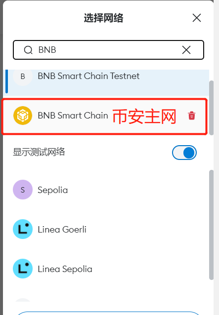
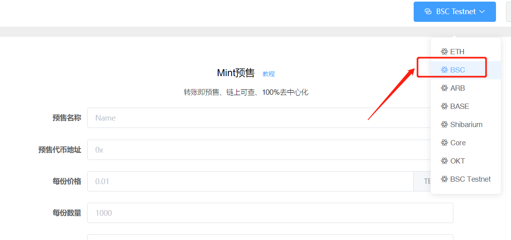
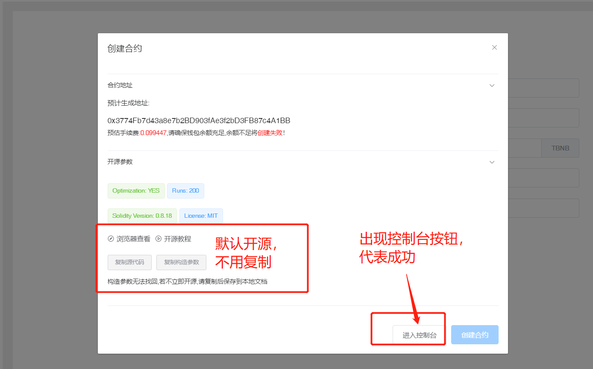
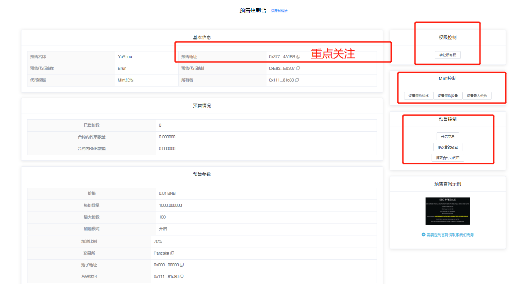
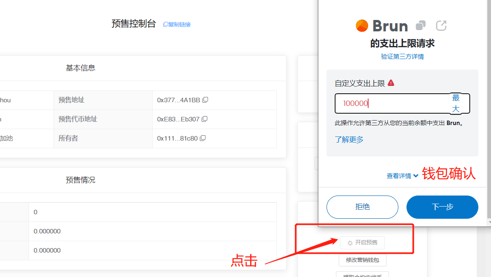
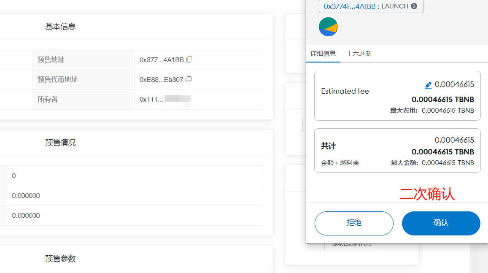
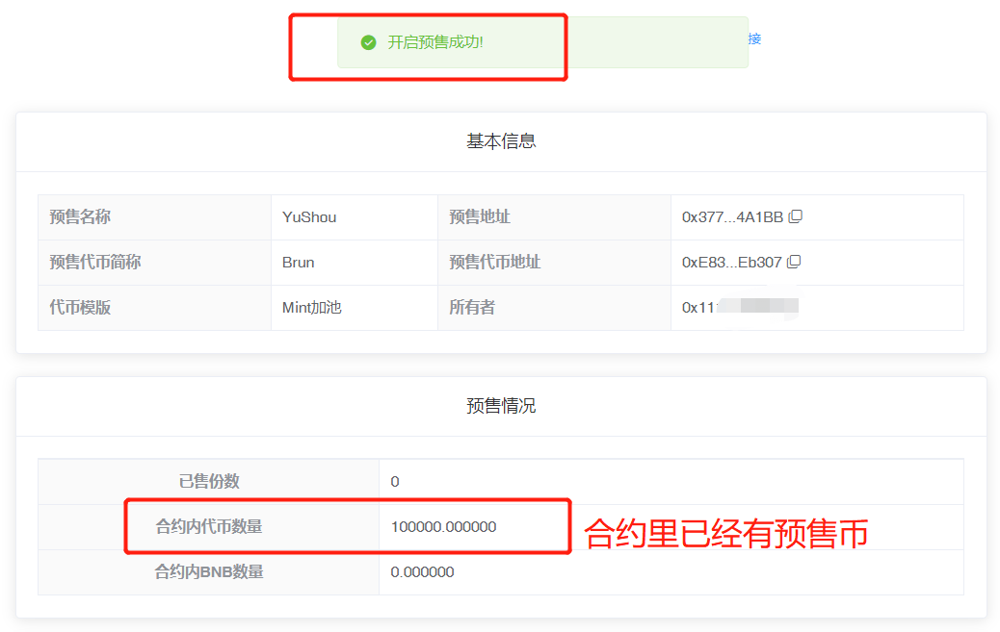
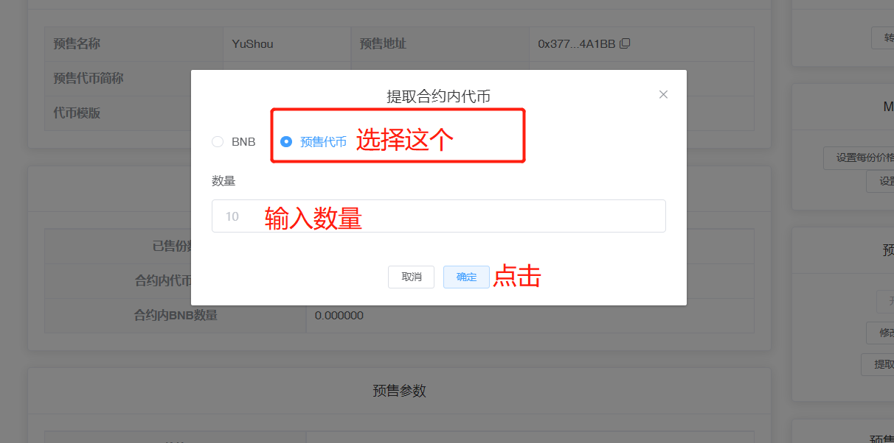

# 创建代币预售教程

### 一、预售功能说明 

* **无前端：**不需要任何网页，纯合约支持，100%**去中心化**
* **转账即预售：**用户将BNB转到`预售合约`，就能**自动**获得代币或者LP
* **不用领取：**参与预售的用户**无需**手动领取代币
* **自定义功能：**项目方可以在预售开始后通过控制台**修改**预售价格和每份数量
* **无软顶/硬顶：**没有软顶或者硬顶的概念，只有一个预售总数量（份数x每份数量）
* **加池模式**：预售的同时**自动添加流动性**，用户只能获得`LP`，不能获得代币

### 二、注意事项提前说明

* 预售开启前请确保代币还没有加池子
* 标准代币合约**不建议**开启加池模式
* 其他代币合约请不要开始交易（如有手动开盘功能的话）
* 预售创建成功后，请将预售地址加入到代币地址的**白名单**中
* 如果你的代币合约有手动开盘功能，但是没有白名单功能，那不要使用**加池模式**
* 用了加池模式后，预售期间**不要撤池子**。一旦撤池子，可能会导致后续预售失败

### **三、Mint预售创建教程**

#### 1、连接钱包（老手请忽略）

首先，在小狐狸钱包里选择好币安链（BNB Smart Chain）

<figure><figcaption>
小狐狸切换到币安链
</figcaption></figure>

然后打开预售创建官网：[https://www.pandatool.org/#/presale/mintAddSale](https://www.pandatool.org/#/presale/mintAddSale) ，点击右上角选择BSC链

<figure><figcaption></figcaption></figure>

然后选择右上角的连接钱包，会弹出小狐狸让你确定要连接的钱包地址，选择一个就行了

<figure><figcaption></figcaption></figure>

钱包连接完成后，能在右上角看到你的钱包地址和链状态，说明已经链接成功了

<figure><figcaption></figcaption></figure>

#### 2、填写预售参数

钱包连接成功后，我们通过PandaTool可视化页面创建预售，还是那个页面[https://www.pandatool.org/#/presale/mintAddSale](https://www.pandatool.org/#/presale/mintAddSale) 打开，填写相应的预售参数：

<figure><figcaption>
预售合约参数
</figcaption></figure>

* [x] **预售名称** : 给你的预售起个名字，仅支持英文
* [x] **预售代币地址** : 你要预售的代币合约地址（前提是有代币）
* [x] **每份价格 :** 每份预售的代币需要多少bnb，最小0.01BNB
* [x] **每份数量** : 每份有多少个代币
* [x] **总份数:：**一共可以预售多少份（每份数量x总份数≤代币发行总量）
* [x] **加池模式**
  * 不开启 : 用户转账BNB后，可以立马获得代币
  * 开启 : 用户转账BNB后，自动添加流动性，用户只能获得LP，无法获得代币
  * 加池比例：按照设定的比例（最小50%，最大100%）添加流动性，多余的BNB给到营销钱包（默认是发币钱包）

参数填写完成后，点击创建合约，此时会弹出钱包进行确认，等待几秒，就会提示你预售创建完成

<figure><figcaption></figcaption></figure>

* [x] **为什么点击创建没有反应？**
  * 有可能是钱包没连上，核查一下钱包连接情况
  * 有可能是代币合约填错了，核查一下合约地址

#### 3、预售控制台操作

创建成功后，我们进入到控制台：[https://www.pandatool.org/#/presale/console](https://www.pandatool.org/#/presale/console)，看下该如何操作这个预售

<figure><figcaption></figcaption></figure>

* [x] **权限控制**
  * **转让所有权** : 将合约权限转让给其他人（转移权限之前，记得复制`控制台链接`。新的权限地址必须通过控制台链接，才能进入控制台操作）
* [x] **Mint控制**
  * 设置每份价格 : 重新修改预售价格
  * 设置每份数量：重新修改每份数量
  * 设置最大份数：根据实际情况修改最大份数
* [x] **预售控制**
  * **开启交易：**点击按钮后，钱包确认后，即可开始预售
  * **修改营销钱包：**营销钱包默认是发币钱包，可以根据需要进行修改
  * **提取合约内代币：**可以将预售合约里面的BNB和代币提取走

#### 4、预售怎么开始与结束？

**1）加白名单：**预售创建成功后，将预售合约加入到你本身代币合约的税率白名单中，例如

<figure><figcaption></figcaption></figure>

**2）开启预售：**在`预售控制台`点击**开始交易**，会进行两次确认。第一次是授权确认，第二次会让你**转入**足够的代币进入预售合约里

<figure><figcaption></figcaption></figure>

第一次授权成功后，紧接着会弹出钱包进行第二次确认

<figure><figcaption></figcaption></figure>

第二次确认成功后，会提示你预售开启成功，同时也能看到代币已经转入到合约里面

<figure><figcaption></figcaption></figure>

**3）结束预售：**如果你想提前结束预售，只需要通过“提取合约内代币”的功能，将合约里面的代币全部提出来，就无法预售了，如下图所示

<figure><figcaption></figcaption></figure>

### **四、相关问答**

* [x] **加池比例怎么理解？**
  * 假设你选择100%，那就意味着用户每次预售的BNB会全部加入到池子里作为流动性；假如你选择50%，那么用户预售的BNB，一半会给到营销钱包，一半会加入到池子里
* [x] **营销钱包有什么用？**
  * 营销钱包默认就是发币钱包，主要是在你选择加池模式的时候，用来接受用户多余的BNB的。如果你没有选择加池模式，那这个钱包没有任何用处
* [x] **为什么开启预售失败？**

<figure><figcaption></figcaption></figure>

* **钱包里没有足够的代币：**假设你设置的预售【每份数量x总份数=10000枚代币】，但是你的钱包里只有9000枚代币，那么就会提示预售失败
* **预售合约没有加白名单：**如果没有把预售合约地址加入到代币白名单里面，就有可能出现预售开启失败的情况
* **代币合约有持币限制：**假如之前的代币合约有最大持仓限制，而你预售的数量超过这个限制，导致代币无法转入到预售地址里，就会造成预售开启失败的情况

<!---->

* [x] **预售开启成功后，为什么用户转账预售失败？**
  * **价格问题：**用户转账的BNB数量低于每份价格，就会失败，BNB原路返还
  * **Gas问题：**如果gas费设置的太低，就有可能会导致预售失败
  * **合约总量问题：**如果合约地址内已经没有足够的代币用于预售，那用户自然无法参与
  * **代币提前交易导致：**这种情况一般出现在加池模式下，如果你的代币本身已经有池子在交易了，且具有了价格。如果这个价格与预售价格不符，就会出现预售失败的情况
  * **预售已完成：**假设你设置的预售总份数是10份，如果已经达到10份，那就代表着预售已经完成，此时将无法继续预售。如果权限还在，可以通过修改预售份数的方式继续预售。如果权限不在了，那就没办法了
* [x] **为什么标准代币不适合做预售？**
  * 标准代币可以做预售，但是不要选择加池模式，只能选择普通模式。因为一旦选择加池模式，用户预售的同时自动加池子就开始交易了，会导致后续预售无法正常进行。
* [x] **可以用wBNB或者USDT预售吗**？
  * 不支持，目前只支持使用BNB预售
* [x] **批量预售与实际发放份数问题**
  * **整倍数预售：**假设1份100个币，每份价格0.03BNB。用户转账0.06BNB，发放200个；用户转账0.09BNB，发放300个币，以此类推
  * **非整倍数预售：**同样是1份100个币，价格0.03BNB。假设用户转账0.04个BNB，则会发放100个币，并退回多余的0.01BNB。如果用户转账0.05BNB，则会发放100个币+退回0.02BNB。假设用户转账0.07BNB，则会发放200个币+退回0.01BNB。合约会自动按照最大倍数发放，多余退还
* [x] **预售有没有最大/最小限制？**
  * 单个地址单次预售，最小限制就是你设定的最小价格，低于这个价格无法预售。至于最大限制，就是预售总量，超过这个数量是无法预售的

如有不明白或者不清楚的地方，请加入官方电报群：[https://t.me/PandaTool](https://t.me/PandaTool)
