# 创建标准代币Mint预售教程

**什么是标准Mint预售？**

简单来说，就是通过Mint的方式进行预售。项目方将一定数量的代币打入预售合约地址，开启预售后，用户将BNB转入预售合约地址，预售合约会自动按照设定好的比例，将代币给到用户。

## 一、预售功能说明 

* **无前端：**&#x4E0D;需要任何网页，纯合约支持，100%**去中心化**
* **转账即预售：**&#x7528;户将BNB转到`预售合约`，就能**自动**获得代币
* **不用领取：**&#x53C2;与预售的用户**无需**手动领取代币
* **自定义功能：**&#x9879;目方可以在预售开始后通过控制台**修改**预售价格和每份数量
* **无软顶/硬顶：**&#x6CA1;有软顶或者硬顶的概念，只有一个预售总数量（份数x每份数量）

## 二、注意事项提前说明 

* 标准代币预售期间，可能会有人提前加池
* 建议使用手动开启交易功能，以防止被加池交易
* 请勿将预售地址加入黑名单，否则无法交易

## **三、标准Mint预售创建教程** 

### **1、连接钱包（老手请忽略）**

首先，我们打开预售创建官网：[https://www.pandatool.org/#/presale/simpleMint](https://www.pandatool.org/#/presale/simpleMint)，右上角点击连接钱包

<figure>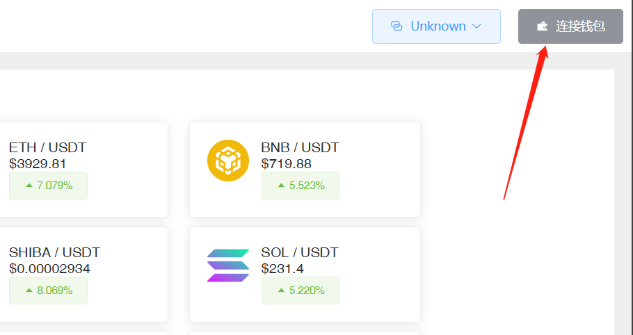<figcaption></figcaption></figure>

之后会弹出小狐狸让你确定要连接的钱包地址，选择一个就行了。然后下一步就是选择公链，如果您要在币安创建预售，就选择BSC。如果要在Base链创建预售，就选择Base

<figure>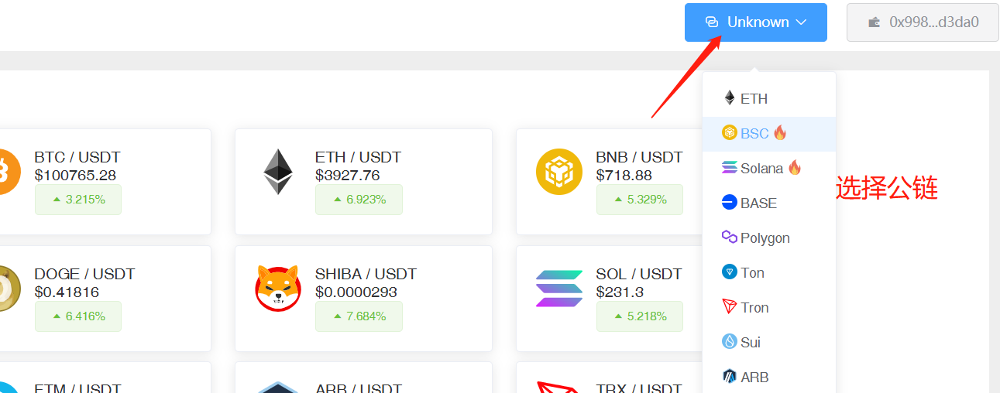<figcaption></figcaption></figure>

之后就能在右上角看到你的钱包地址和链状态，说明已经链接成功了

<figure>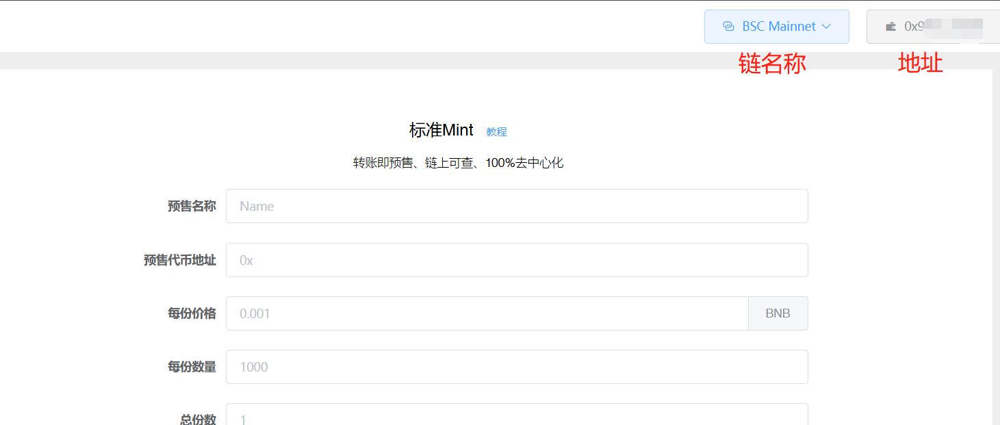<figcaption></figcaption></figure>

### **2、填写预售参数**

钱包连接成功后，我们通过PandaTool可视化页面创建预售，还是那个页面[https://www.pandatool.org/#/presale/simpleMint](https://www.pandatool.org/#/presale/simpleMint) 打开，填写相应的预售参数：

<figure><figcaption></figcaption></figure>

* [x] **预售名称：**&#x968F;便起一个，如：Presale，不支持中文，只能用英文名
* [x] **预售代币地址：**&#x8981;预售的代币合约地址（前提是有代币）
* [x] **每份价格：**&#x6BCF;份预售需要支付多少费用，最小的价格是0.001（BNB或ETH）
* [x] **每份数量：**&#x6BCF;份预售里有多少个代币
* [x] **总份数:：**&#x4E00;共可以预售多少份（每份数量x总份数≤代币发行总量）
* [x] **单次预售最大份数：**&#x4E00;次最多可以买几份
* [x] **单钱包预售最大份数：**&#x4E00;个钱包地址最多可以买几&#x4EFD;_（单钱包最大份数必须小于单次预售最大份数）_

例如我填写的内容如下

<figure>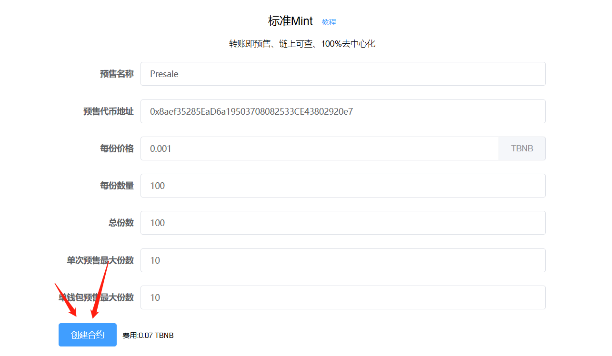<figcaption></figcaption></figure>

参数填写完成后，点击创建合约，此时会弹出提示，让你再次确认

<figure>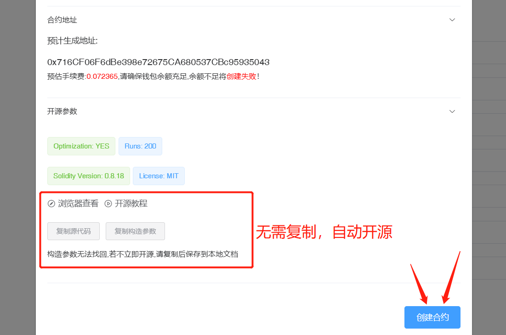<figcaption>
注意，开源参数无需复制，现在是自动开源的了
</figcaption></figure>

然后会弹出小狐狸钱包进行确认

<figure>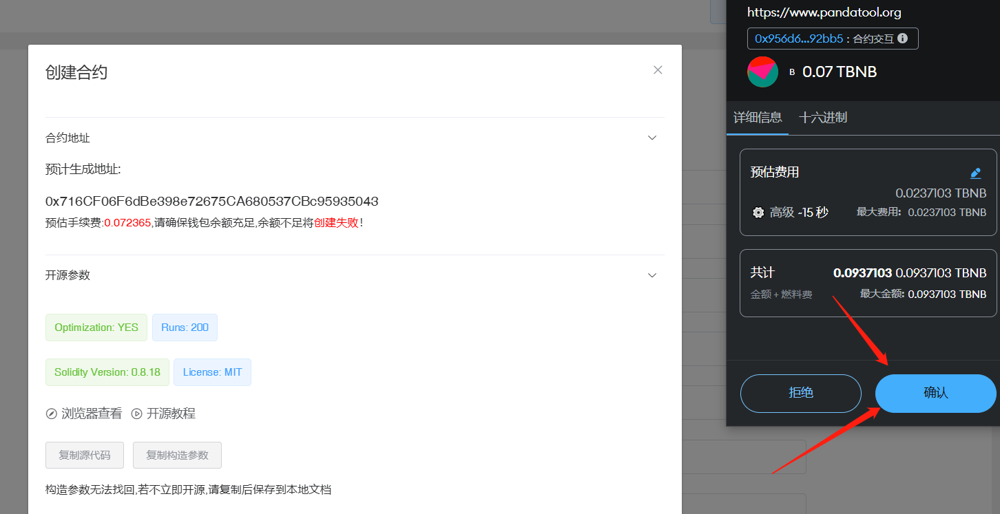<figcaption></figcaption></figure>

点击后等待几秒，就会提示你预售创建完成。如果钱包内BNB/ETH余额不够，可能会导致失败

<figure>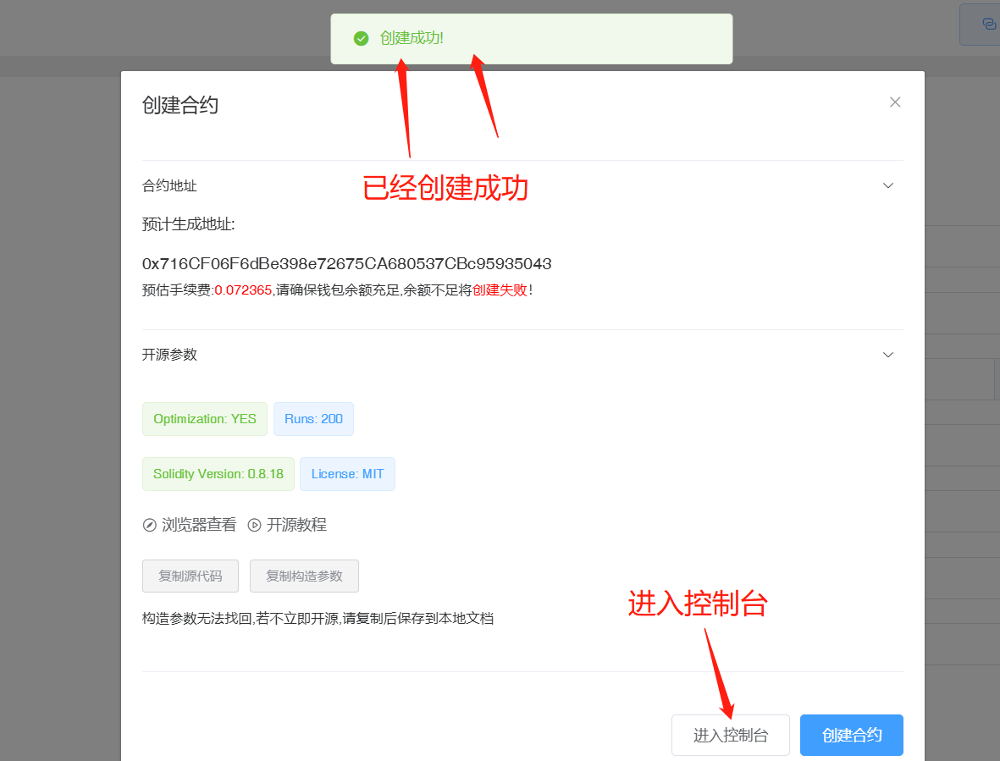<figcaption></figcaption></figure>

**为什么点击创建没有反应？**

* [x] 有可能是钱包没连上，核查一下钱包连接情况
* [x] 有可能是代币合约填错了，核查一下合约地址

### **3、预售控制台操作**

创建成功后，我们进入到控制台：[https://www.pandatool.org/#/presale/console](https://www.pandatool.org/#/presale/console)，看下该如何操作这个预售

<figure>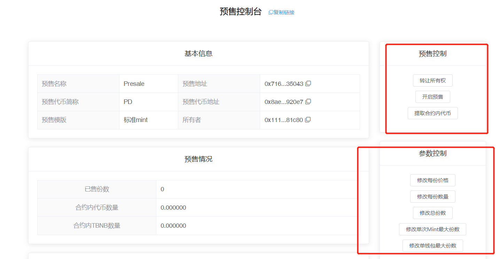<figcaption></figcaption></figure>

* [x] **预售控制**
  * **转让所有权** : 将合约权限转让给其他人（转移权限之前，记得复制`控制台链接`。新的权限地址必须通过控制台链接，才能进入控制台操作）
  * **开启预售：**&#x70B9;击后钱包确认，即可开启预售
  * **提取合约内代币：**&#x53EF;以将预售合约里面的价值币和代币提取走
* [x] **参数控制**
  * **修改每份价格 :** 重新修改预售价格，最低0.001
  * **修改每份数量：**&#x91CD;新修改每份数量
  * **修改总份数：**&#x6839;据实际情况重新修改总的预售份数
  * **修改单次Mint最大份数：**&#x6839;据需求修改单次预售上限
  * **修改单钱包最大份数：**&#x6839;据需求修改单个钱包预售上限

### **4、预售怎么开始与结束？**

**1）开启预售：**&#x5728;`预售控制台`点击**开启预售**，会进行两次确认。第一次是授权确认，第二次会让你**转入**足够的代币进入预售合约里

<figure>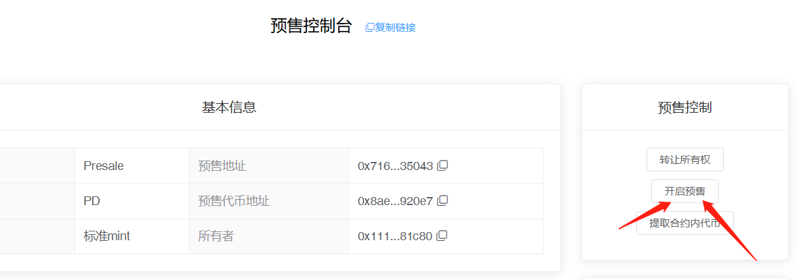<figcaption></figcaption></figure>

首先，点击开启预售按钮后，钱包会弹出让你进行授权

<figure>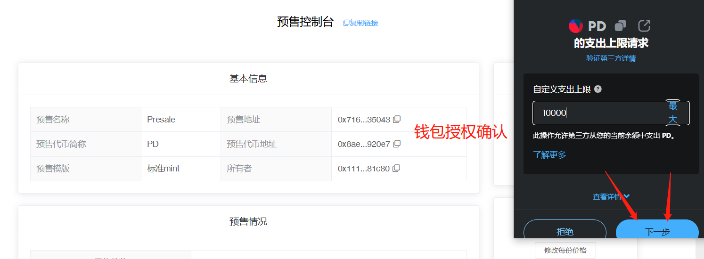<figcaption>
确认授权
</figcaption></figure>

第一次授权成功后，紧接着会弹出钱包进行第二次确认，并将预售的代币转入预售合约地址

<figure>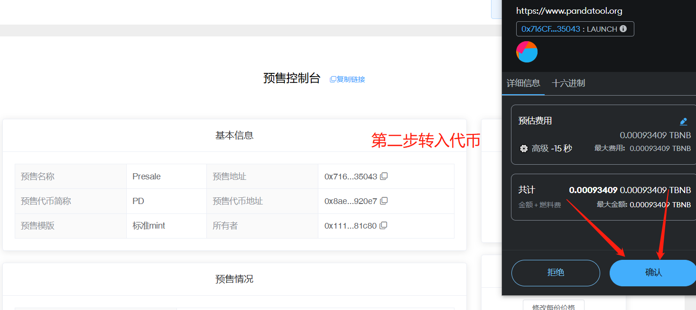<figcaption>
转入代币
</figcaption></figure>

第二次确认成功后，会提示你预售开启成功，同时也能看到代币已经转入到合约里面

<figure>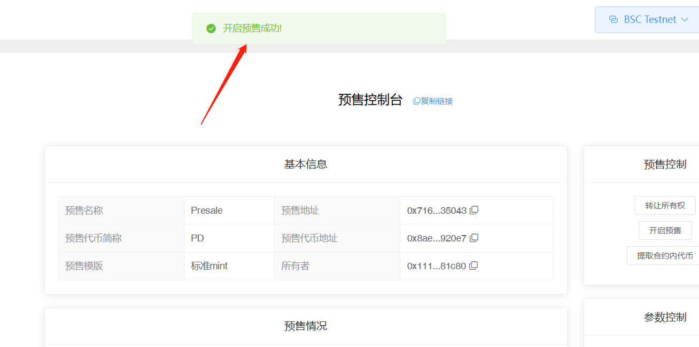<figcaption></figcaption></figure>

**3）结束预售：**&#x5982;果你想提前结束预售，只需要通过“提取合约内代币”的功能，将合约里面的代币全部提出来，就无法预售了，如下图所示

<figure>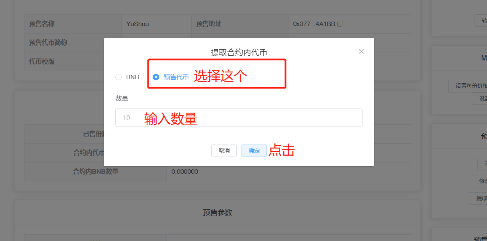<figcaption></figcaption></figure>

## **四、相关问答** 

* [x] **为什么开启预售失败？**
  * **钱包里没有足够的代币：**&#x5047;设你设置的预售【每份数量x总份数=10000枚代币】，但是你的钱包里只有9000枚代币，那么就会提示预售失败
  * **预售合约没有加白名单：**&#x5982;果没有把预售合约地址加入到代币白名单里面，就有可能出现预售开启失败的情况
  * **代币合约有持币限制：**&#x5047;如之前的代币合约有最大持仓限制，而你预售的数量超过这个限制，导致代币无法转入到预售地址里，就会造成预售开启失败的情况

<figure><figcaption></figcaption></figure>

* [x] **预售开启成功后，为什么用户转账预售失败？**
  * **价格问题：**&#x7528;户转账的BNB数量低于每份价格，就会失败，BNB原路返还
  * **Gas问题：**&#x5982;果gas费设置的太低，就有可能会导致预售失败
  * **合约总量问题：**&#x5982;果合约地址内已经没有足够的代币用于预售，那用户自然无法参与
  * **份数填写错误：**&#x5355;钱包最大份数必须大于或等于单次预售最大份数
  * **达到了预售限制：**&#x5982;果达到了单次预售限制或者单钱包预售限制，则无法再购买
  * **预售已完成：**&#x5047;设你设置的预售总份数是10份，如果已经达到10份，那就代表着预售已经完成，此时将无法继续预售。如果权限还在，可以通过修改预售份数的方式继续预售。如果权限不在了，那就没办法了
* [x] **可以用wBNB或者USDT预售吗**？
  * 不支持，目前只支持使用原生代币预售。如BSC链用BNB，Base链用ETH
* [x] **批量预售与实际发放份数问题**
  * **整倍数预售：**&#x5047;设1份100个币，每份价格0.03BNB。用户转账0.06BNB，发放200个；用户转账0.09BNB，发放300个币，以此类推
  * **非整倍数预售：**&#x540C;样是1份100个币，价格0.03BNB。假设用户转账0.04个BNB，则会发放100个币，并退回多余的0.01BNB。如果用户转账0.05BNB，则会发放100个币+退回0.02BNB。假设用户转账0.07BNB，则会发放200个币+退回0.01BNB。合约会自动按照最大倍数发放，多余退还
* [x] **预售有没有最大/最小限制？**
  * **最小限制：**&#x5355;个地址单次预售，这个最小限制就是你设定的最小价格，低于这个价格无法预售。
  * **最大限制：**&#x5355;次和单个钱包都分别有最大限制

如有不明白或者不清楚的地方，请加入官方电报群：[https://t.me/PandaTool](https://t.me/PandaTool)
