# PancakeSwap薄饼加池/撤池教程

PancakeSwap中文名“薄饼”，是币安智能链BSC上领先的去中心化交易所，交易量在市场上遥遥领先。这篇帖子，主要是教大家使用薄饼交易所添加流动性资金池：

* **底池代币：**一般会选择用BNB或者USDT，这取决于你在创建合约时选择的是什么底池
* **V2还是V3：**本篇文章主要是V2的加池教程，PandaTool平台的合约大多也只支持V2

### 1、打开薄饼连钱包

* 注意：如果你是通过手机TP钱包或者欧易钱包，这一步可以省略，手机是默认连接的

首先，我们打开薄饼的官网：[https://pancakeswap.finance/?chain=bsc](https://pancakeswap.finance/?chain=bsc) ,点击右上角连接钱包

<figure><figcaption></figcaption></figure>

此时会跳出提示，让你选择钱包类似，电脑默认都是选择Metamask，之后小狐狸会提示让你确认

<figure>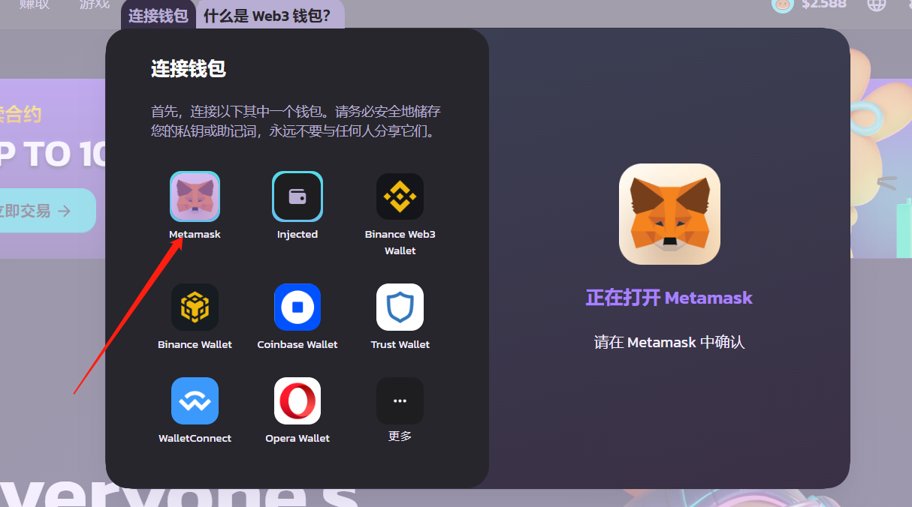<figcaption></figcaption></figure>

连接成功之后，右上角会出现你的钱包地址

<figure>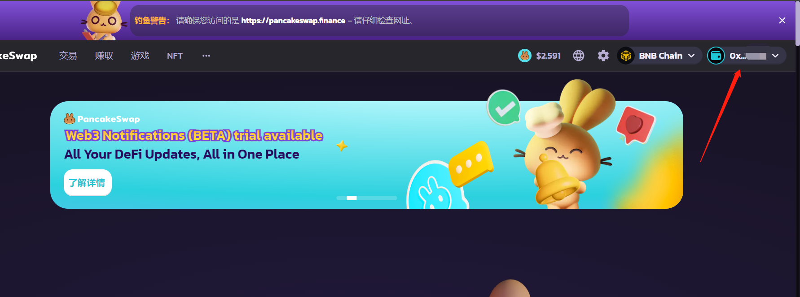<figcaption></figcaption></figure>

### 2、添加流动性（加池子）

钱包链接成功之后，在上方菜单栏找到“赚取”，然后选择“农场/流动性”

<figure>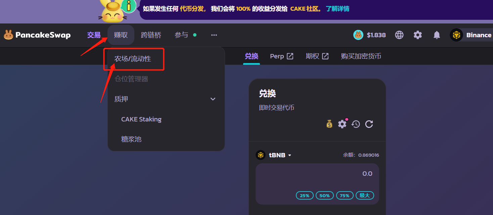<figcaption></figcaption></figure>

在打开的新页面里，选择“我的持仓”（或者直接进入链接：[https://pancakeswap.finance/liquidity/positions](https://pancakeswap.finance/liquidity/positions)）

<figure>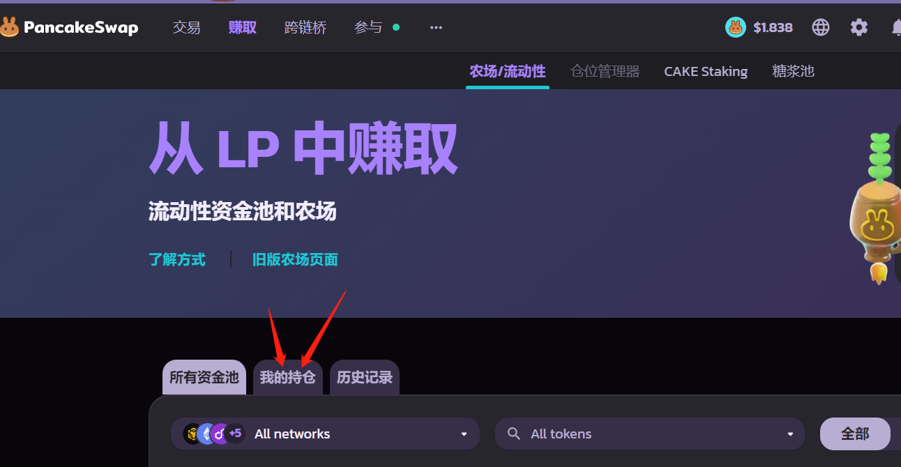<figcaption></figcaption></figure>

之后在右边可以看到添加流动性的按钮

<figure>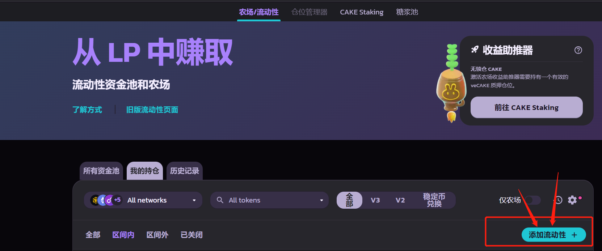<figcaption></figcaption></figure>

然后会看到两个代币对提示框，在两个选择您想要添加流动性的交易对中的两个代币

<figure><figcaption></figcaption></figure>

一般来说，左边选择BNB或者USDT，右边搜索选择你自己的代币

<figure>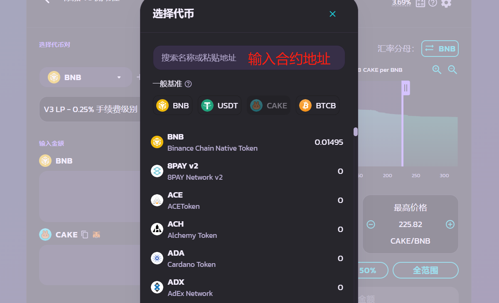<figcaption></figcaption></figure>

例如我选择的交易对：USDT-Panda。选择好交易对之后，记得选择**“添加V2流动性”**，这一步非常重要请谨记。V3流动性只适合标准币，除此之外，必须都加V2的流动性

<figure>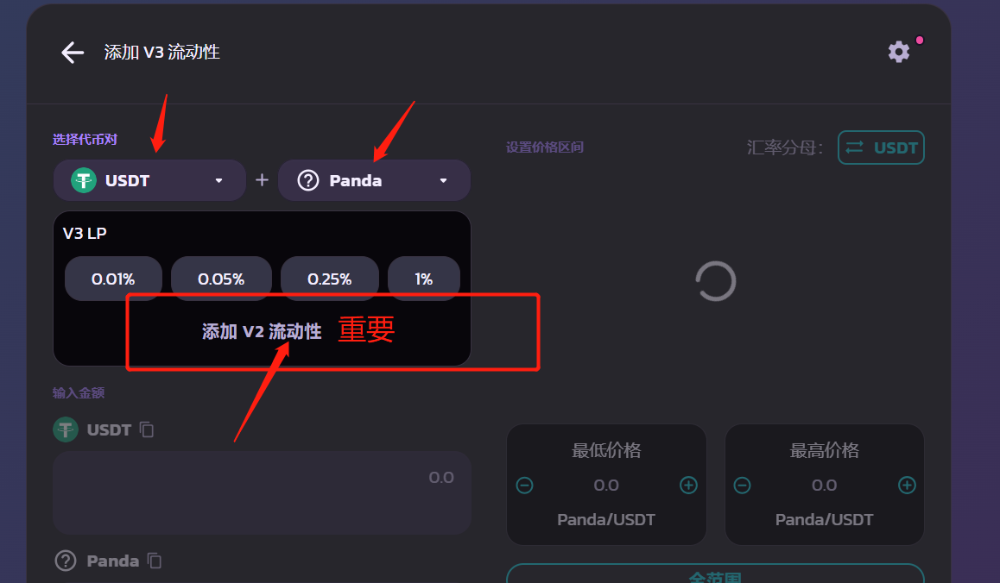<figcaption></figcaption></figure>

之后，我们根据自己的需求，填写注入流动性资金池的代币数量。两个代币数量的比例，决定了代币的初始价格。例如，我添加1000USDT和1000个Panda，说明代币的上线价格是1U

<figure>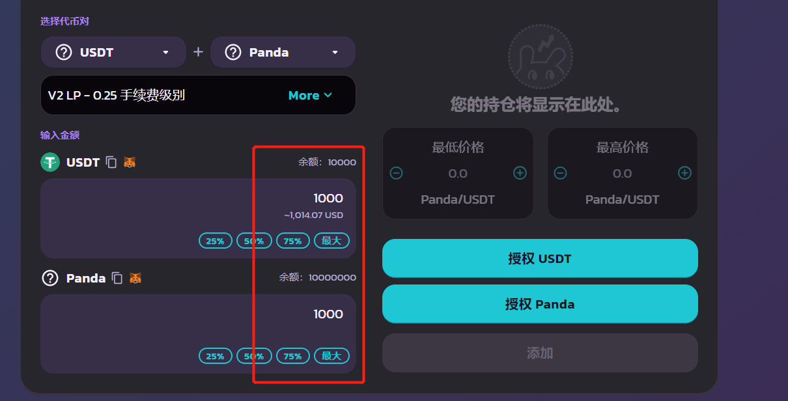<figcaption></figcaption></figure>

然后依次授权USDT和你自己发行的代币

<figure><figcaption></figcaption></figure>

<figure>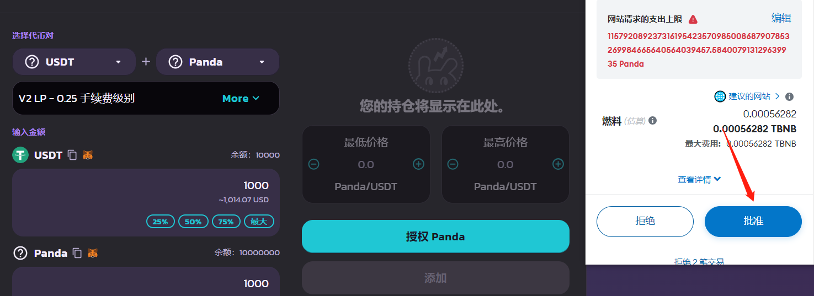<figcaption></figcaption></figure>

授权成功后点击“添加”，metamask钱包进行确认即可

<figure>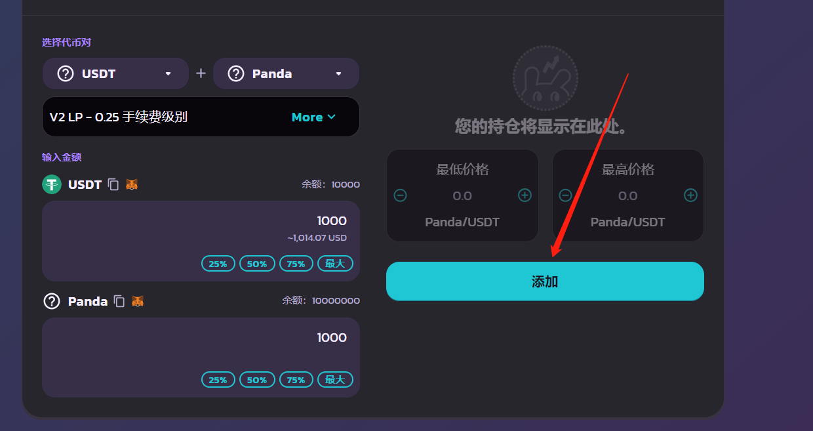<figcaption></figcaption></figure>

添加完成后，我们回到上一页，就能看到自己的池子信息了

<figure>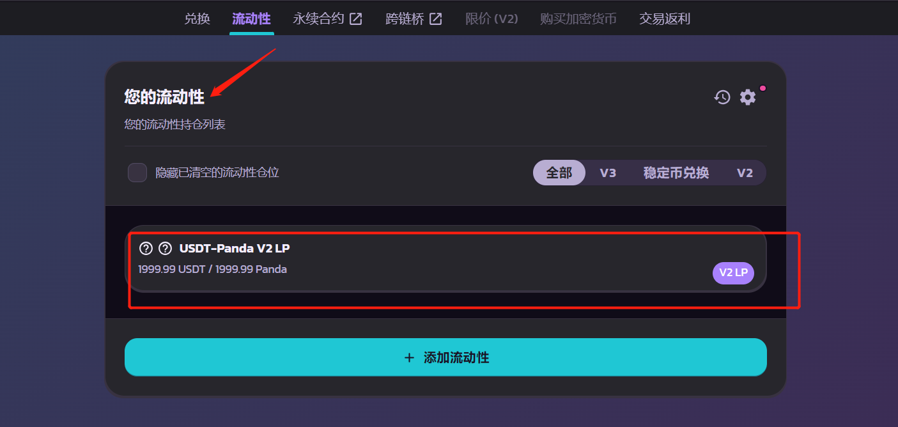<figcaption></figcaption></figure>

### 3、撤出流动性（撤池子）

接着上一步，我们在流动性页面找到自己的流动性，点击V2 LP

<figure>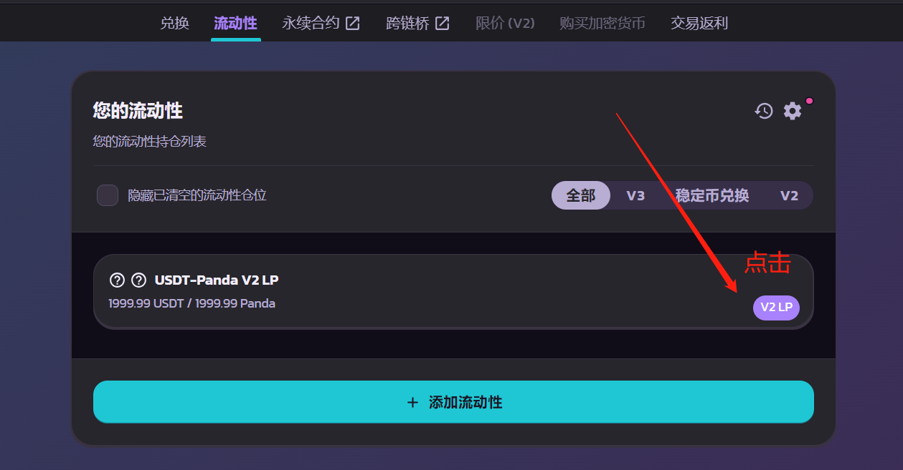<figcaption></figcaption></figure>

之后会跳转到一个新的页面，在该页面点击“移除”

<figure>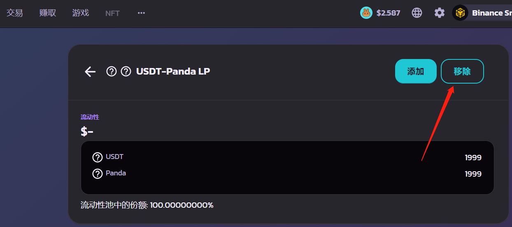<figcaption></figcaption></figure>

然后就可以自己选择要撤出的流动性比例，选择50%就是撤出一半的流动性。选择最大，就是撤出你自己的100%全部流动性（注意：是你自己的流动性）

<figure>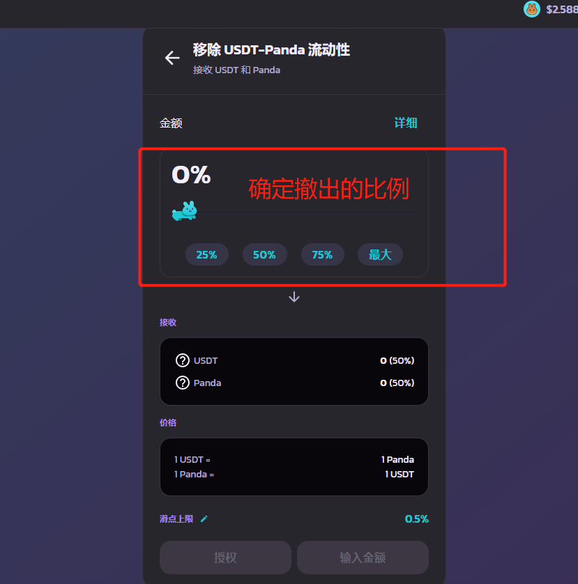<figcaption></figcaption></figure>

选择好要撤出的流动性比例之后，点击授权，小狐狸钱包批准

<figure>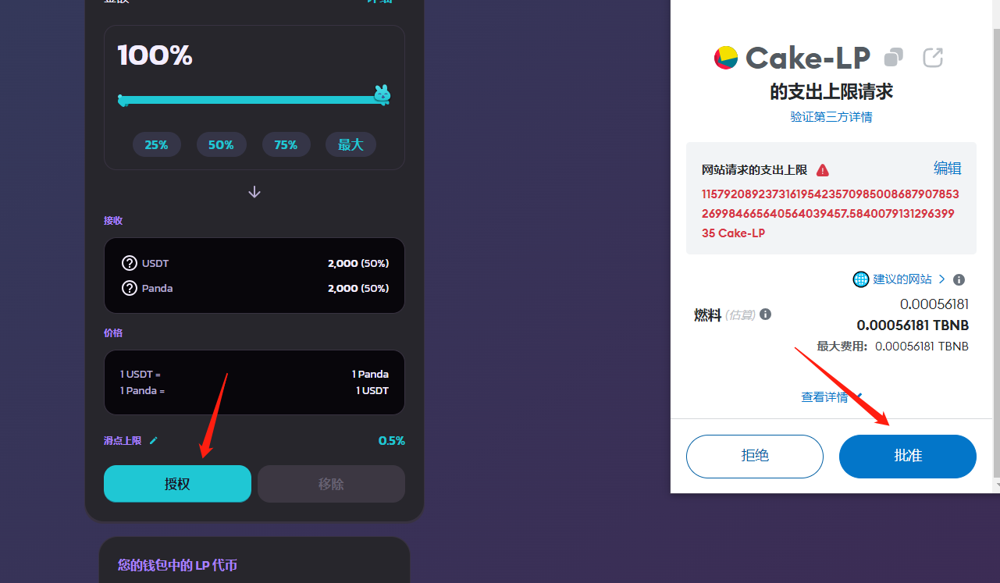<figcaption></figcaption></figure>

再点击移除，小狐狸钱包逐步确认，就可以将流动性全部移除了

<figure>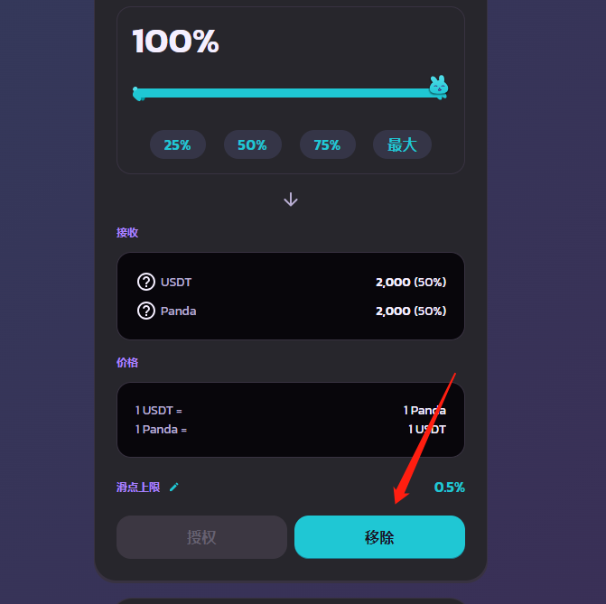<figcaption>
点击移除
</figcaption></figure>

<figure><figcaption>
点击确认
</figcaption></figure>

<figure>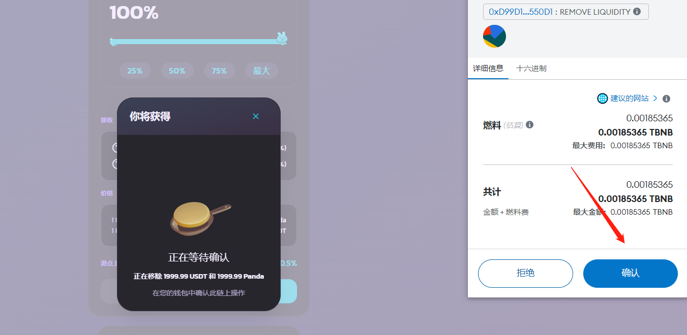<figcaption>
小狐狸确认
</figcaption></figure>

<figure><figcaption>
提交上链
</figcaption></figure>

此时，我们回到流动性页面，也可以发现，自己已经没有流动性信息了

<figure><figcaption></figcaption></figure>

至此，关于加池和撤池的教程基本就结束了

### 4、相关问答

**1）第一次加池要加多少币？加多少钱？**

* 答：没有要求，可以根据你的代币经济学和价格需求，添加适当比例的代币。一般来说，我们要求池子尽量大于300U或1个BNB

**2）初始上线价格是怎么计算的？**

* **答：**代币初始价格由第一次加池的比例决定。如果你加100U和100个币，那么代币的上线价格就是1U。如果你加100U和10000个币，代币的上线价格就是0.01U，以此类推

**3）交易时提示流动性不足，是什么意思？**

* **答：**说明池子里的流动性不够。薄饼有规定，单次交易的数量/金额，一般不能超过池子里的25%。假设你池子里有100U和100个币，如果你买币，不能买超过25个。如果你卖币，也不能卖超过25U。以此类推，池子越大，交易越顺畅

**4）撤池子能把别人加的池子撤走吗？**

* **答：**不能。撤池子，只能撤出自己的流动性比例。假设自始至终只有你一个人加池子，那你撤出100%，就可以把池子全撤走。假设也有其他人在加池子，那他们的流动性你是撤不走的

**5）代币价格与什么有关系？如何操盘？**

* **答：**买入代币，价格上涨。卖出代币，价格下跌

**6）能不能直接往池子里转币？**

* **答：坚决不能。**如果你想让池子变大，只能在薄饼以加流动性的方式增大池子，千万不能直接往池子地址里转币，不然会被套利机器人把池子掏走

**7）V2和V3有什么区别？**

* **答：**带功能/机制的币，只能加V2。目前V3的池子只支持标准币，大家不要加错了
