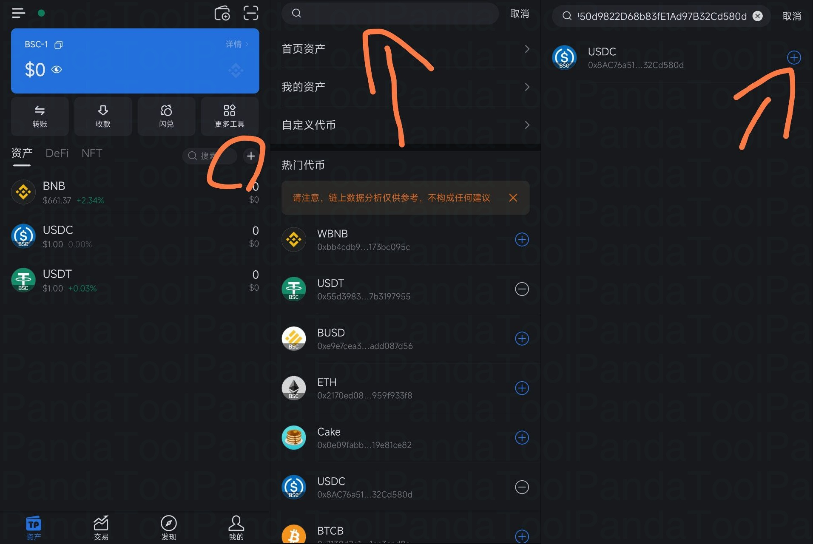
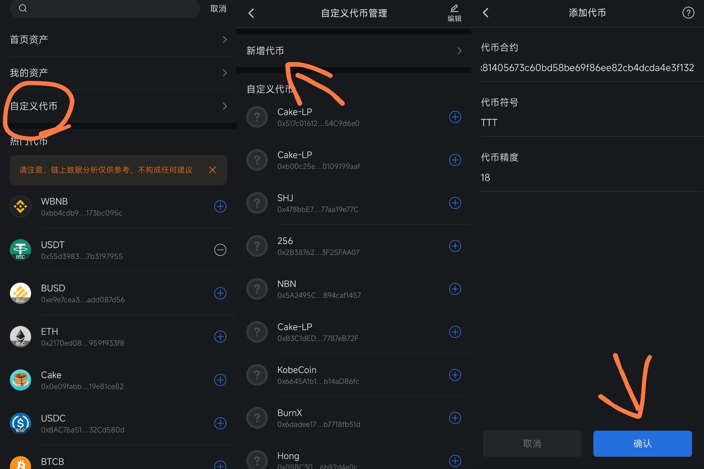
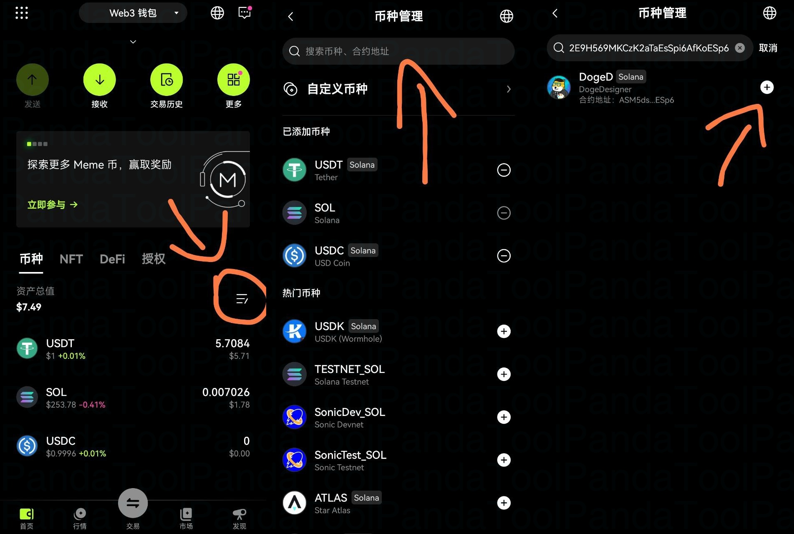
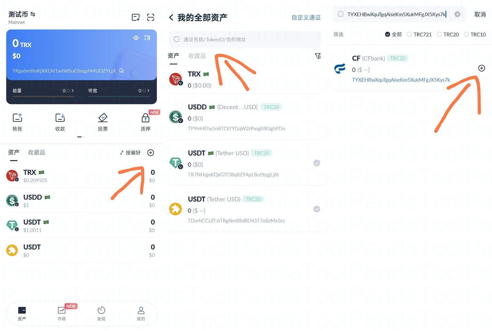
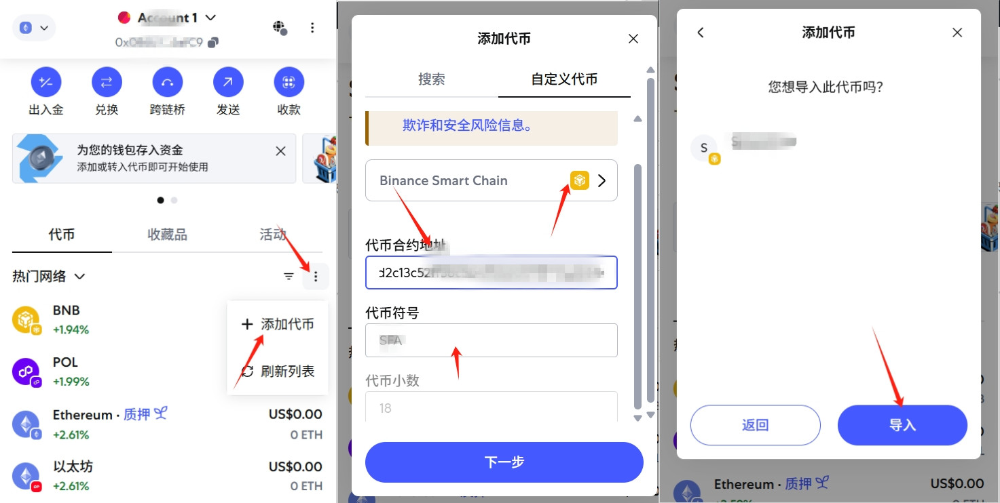
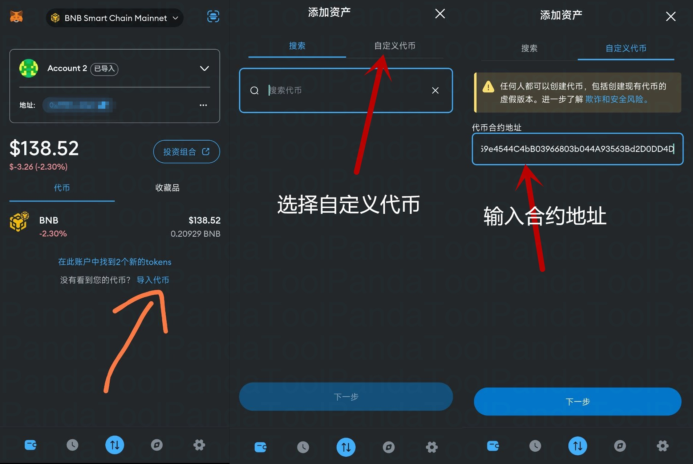
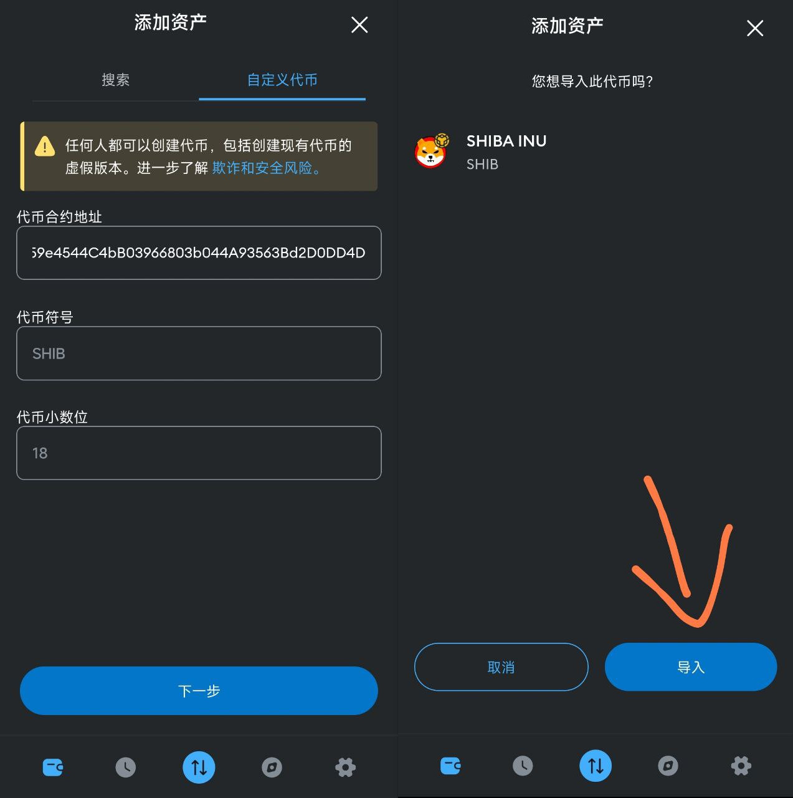
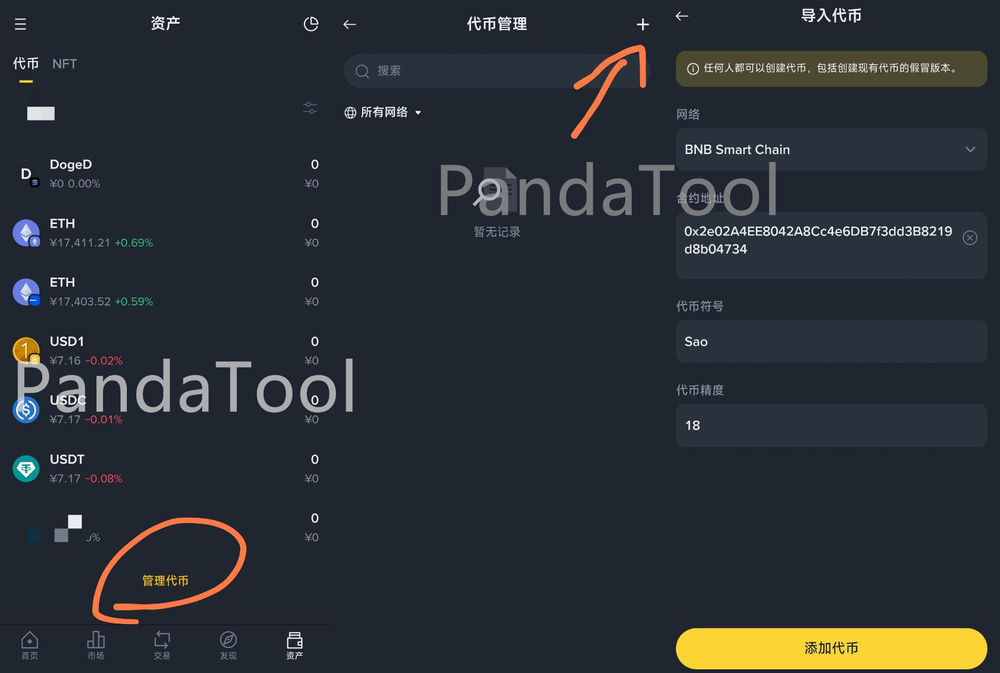

# 钱包怎么添加代币？

很多人在发了币之后，不知道怎么在钱包里找到。其实很简单，用钱包添加一下就可以了。

本篇文章将教大家，如何在钱包里搜索并添加代币

### 1、TokenPocket钱包（TP钱包）

首先，我们需要打开对应的钱包地址和对应的链，然后点&#x51FB;**+**&#x6309;钮，输入**合约地址**，就能看到了

<figure><figcaption></figcaption></figure>

如果输入合约地址找不到，还可以通过自定义代币添加。点击自定义代币，然后点击添加，输入合约地址，就会自动匹配了

<figure><figcaption></figcaption></figure>

### 2、欧易Web3钱包

OKX Web3钱包添加代币的流程与TP差不多，直接在钱包页面点击添加，搜索合约地址就可以了

<figure><figcaption></figcaption></figure>

### 3、波宝钱包TronLink

波宝钱包TronLink是专注于波场链的钱包，其页面UI与TP类似，添加代币的方式主要如下图所示

<figure><figcaption></figcaption></figure>

### 4、小狐狸钱包MetaMask

小狐狸钱包与以上几个钱包不同，需要通过导入代币，来进行添加。

如果您使用的是小狐狸插件，可以点击导入后，输入合约地址来添加

<figure><figcaption></figcaption></figure>

如果您使用的是手机小狐狸App，可以通过**自定义代币**添加，如下图所示

<figure><figcaption></figcaption></figure>

<figure><figcaption></figcaption></figure>

### 5、币安Web3钱包

币安Web3钱包，正常情况下可以通过合约地址搜索到代币。如果搜索不到，可以通过主动添加代币来完成。如下图所示操作：

<figure><figcaption></figcaption></figure>

如果您还有其他问题，可以加入我们的电报群咨询志愿者：[https://t.me/pandatool](https://t.me/pandatool)
