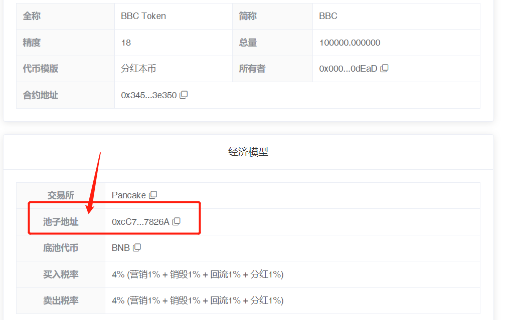
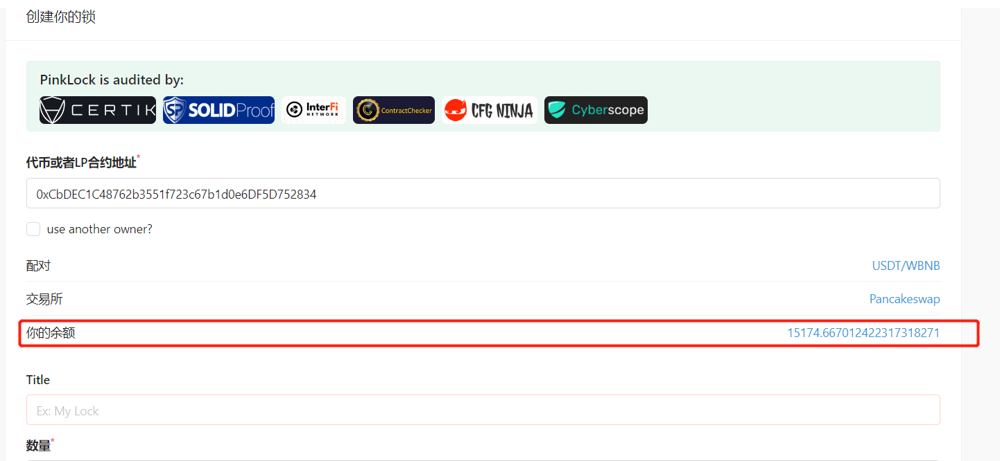
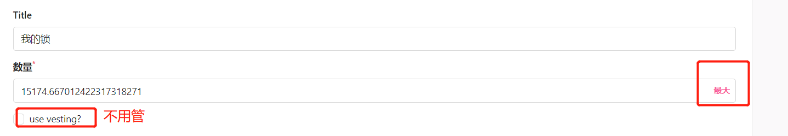
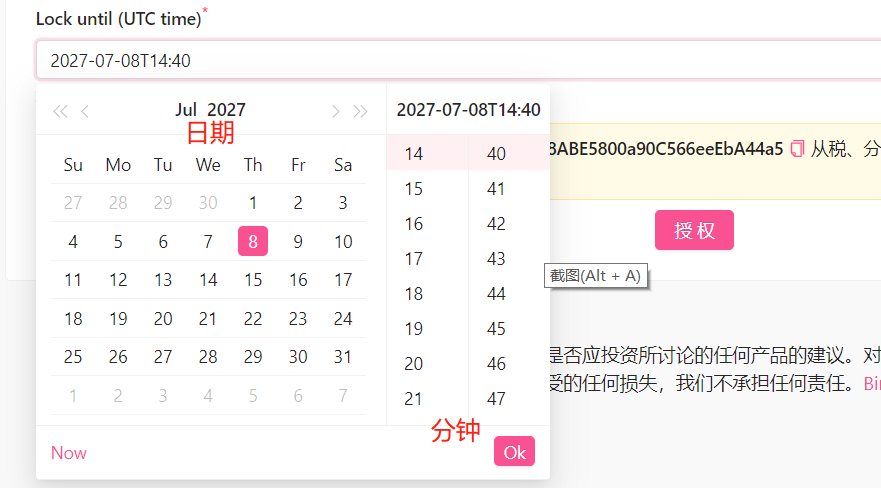
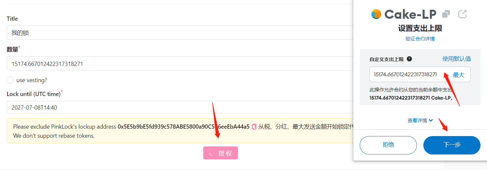
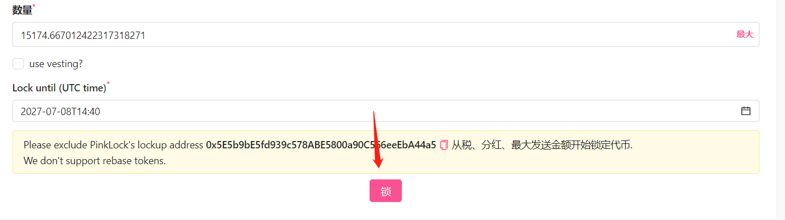
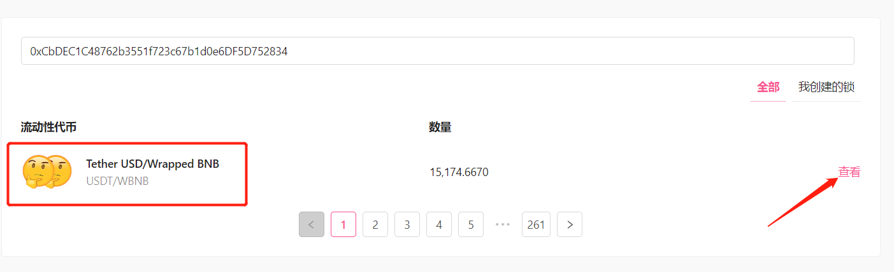

# 如何锁仓与锁池？

**锁仓，**指的是将一定额度的代币锁在某个地方，这些代币将无法流入市场。**锁池，**指的是将LP锁在某个地方，这样项目方将无法撤池，以确保项目的稳定运行。

在教大家锁仓和锁池之前，先简单回答几个问题：

### 1、权限丢了还能撤池子吗？

答：丢权限和撤池子没有关系，池子只有锁了才不能撤出。

### 2、锁池的原理是什么？

答：简单来说，当你在pancakeswap或者uniswap加了V2的池子后，交易所会给一些LP代币。这些LP代币就是你拥有该池子的凭证，所谓撤池，就是将LP代币给回到交易所，然后交易所就把相对应的流动性给你了。所以锁池，就是将LP代币转移到某个地方无法取出，这样就锁住了。

### 3、锁池有几种方式？

答：锁池一般有两种方式：永久锁和带时间锁。

* **永久锁池：**将LP代币转入黑洞地址，这样永远无法取出，池子永久锁住。
* &#x20;黑洞地址：0x000000000000000000000000000000000000dEaD
* **带时间锁：**将LP代币转入某个第三方锁池合约，到时间将LP取回即可。

### 4、什么是LP代币？

答：即流动性资金池 (Liquidity Pool, LP) 代币。当您提供两种代币 (A 和 B) 作为流动性时，您得到是 LP 代币作为收据凭证。

### 5、如何查看LP代币？

答：当你创建好资金池之后，链上会生成一个资金池地址，这个资金池地址就是LP代币的合约地址。你可以在钱包里添加这个地址，就能看到自己的LP代币数量了。

### 6、池子有权限吗？

答：池子是没有权限这个概念的，因为资金池是所有人共有的，任何一个添加流动性的人，都拥有相应比例的份额。例如一个池子只有一个人加流动性，那么他就掌握了所有池子。如果一个池子有100人加流动性，那么每个人按照比例掌握相应的份额。

### 7、具体应该如何锁池？

如果按照时间锁，可以选择PinkSale平台（免费），接下来就给大家演示一下锁池的步骤

#### **第一步：选择锁池平台**

我们选择PinkSale粉红锁池，打开链接：[https://www.pinksale.finance/pinklock/create](https://www.pinksale.finance/pinklock/create)  既可以在手机钱包里打开，也可以在浏览器里打开。网站打开之后，连上钱包，会看到如下页面：

<figure><figcaption>
锁池页面
</figcaption></figure>

#### **第二步：填写代币或者LP合约地址**

如果你填写的是代币合约地址，那么你就是锁仓（锁币）。如果你填写的是LP合约地址，那么你就是锁池。

代币合约地址好理解，LP合约地址怎么获得呢？要么从区块链浏览器里查询，要么从Ave里面查询。在Ave展示的代币行情页面，可以看到池子地址，复制它：

<figure><figcaption>
Ave代币页面
</figcaption></figure>

这个池子地址就是你的LP地址。此外，你还可以通过PandaTool的控制台查看并复制池子地址，如下图所示：

<figure><figcaption></figcaption></figure>

复制之后，输入LP地址，就能看到你当前钱包的LP数量了，如下图所示：

<figure><figcaption></figcaption></figure>

#### **第三步：写个标签Totle**

这个所谓的标签，可填可不填，主要是用来分辨的。假设你锁了很多池子，或者锁了很多代币，有个标签可以帮助你快速找到每个锁。

#### **第四步：确实锁池份额（数量）**

根据上图可知，我现在有15174.667012422317318271个LP代币，我可以选择将这些LP全部锁了，也可以选择锁一部分，每一部分锁不同的时间，都可以。为了方便操作，我选择MAX，全部锁池：

<figure><figcaption></figcaption></figure>

注意，use vesting是一种较为复杂的循环释放方式，搞不懂的话可以不管。

#### **第五步：确定锁池日期**

也就是解锁的时间。注意：该时间为UTC时间，与北京时间相差8个小时。

<figure><figcaption>
锁池时间
</figcaption></figure>

可以看到，我将池子锁到2027年7月8日下午14：40分。这个是UTC时间，换算成北京时间要加8个小时，就是2027年7月8日下午22：40分。

#### **第六步：授权**

在确定好锁池份额和时间后，点击授权。此时钱包会要求你支付一笔gas费，并确认要授权的LP代币数量。

<figure><figcaption>
授权并批准
</figcaption></figure>

#### **第七步：锁池**

很多人以为授权完就结束了，其实不是。授权只是将你的代币授权给合约，还没有开始锁。授权成功后，还需要点击**“锁”**这个步骤，然后支付gas费，才能锁池成功。

<figure><figcaption>
锁池
</figcaption></figure>

#### **第八步：查询锁池信息**

怎么确认自己是否锁池成功呢？我们打开锁池查询页面：[https://www.pinksale.finance/pinklock/liquidity](https://www.pinksale.finance/pinklock/liquidity) 输入LP合约地址，就能查询到你的锁池信息，如下图所示：

<figure><figcaption>
锁池查询
</figcaption></figure>

<figure><figcaption>
锁池详细信息
</figcaption></figure>

### 7、锁仓应该怎么锁？

锁仓的操作和锁池是一样的，只是把LP地址换成代币合约地址即可。查询锁仓信息，可以在该页面查询：[https://www.pinksale.finance/pinklock/token](https://www.pinksale.finance/pinklock/token)

### 8、其他锁池平台

除了粉红PinkSale之外，还有几个其他的锁池平台：

* 绿马锁池：[https://app.uncx.network/](https://app.uncx.network/)
* DxLock锁池：[https://dxsale.app/dxlock](https://dxsale.app/dxlock)

### 9、V3的池子能锁吗？

目前大多数锁池平台，暂时均不支持V3的池子锁池。
