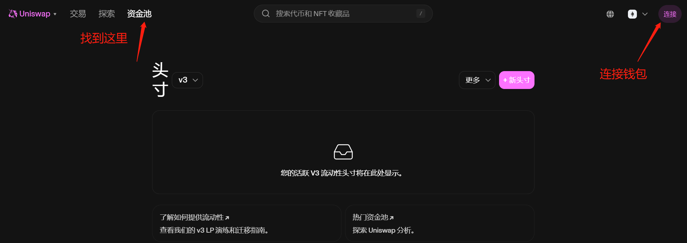
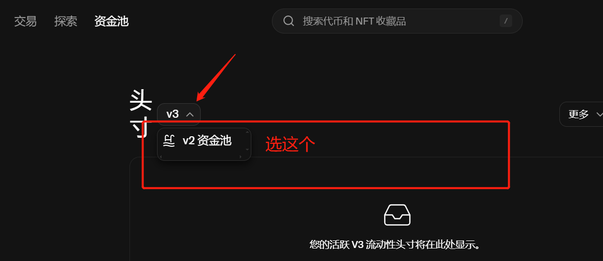
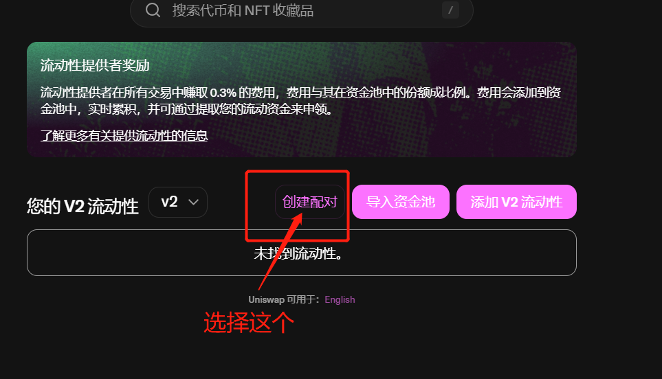
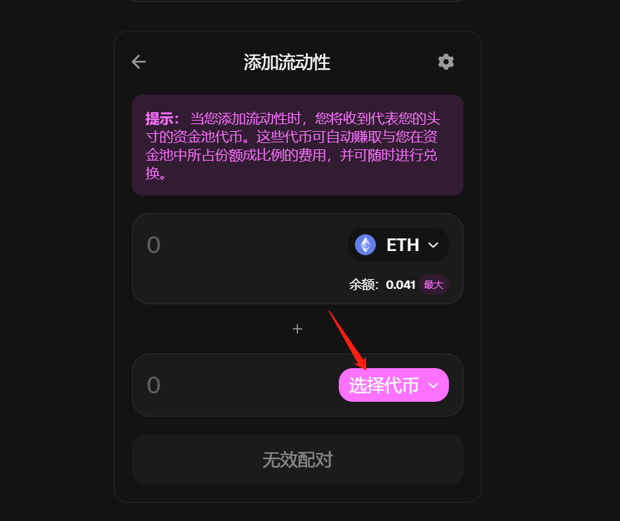
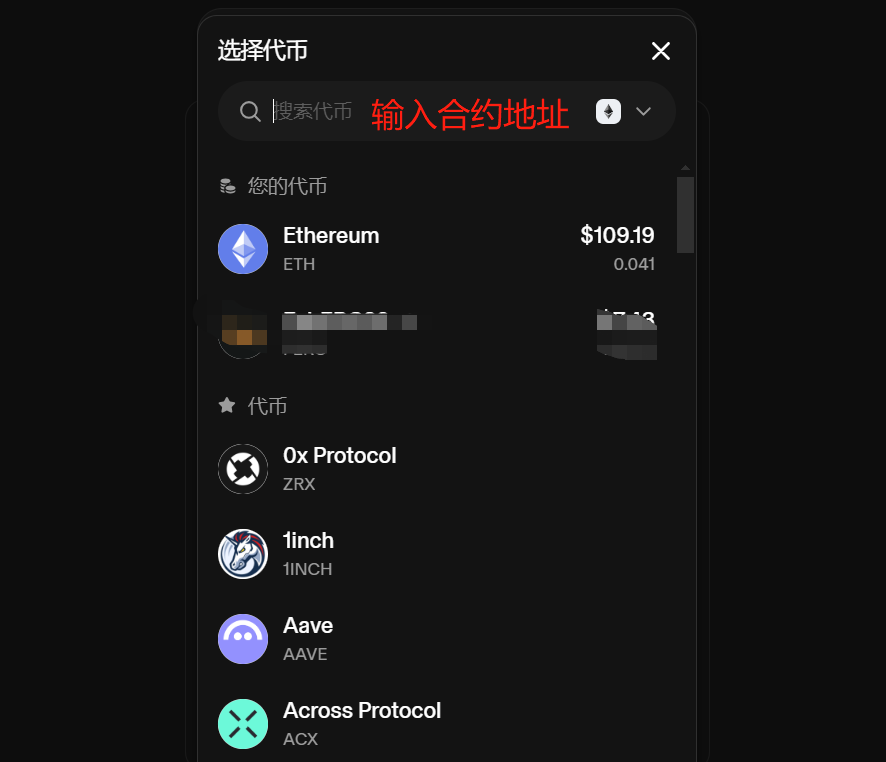
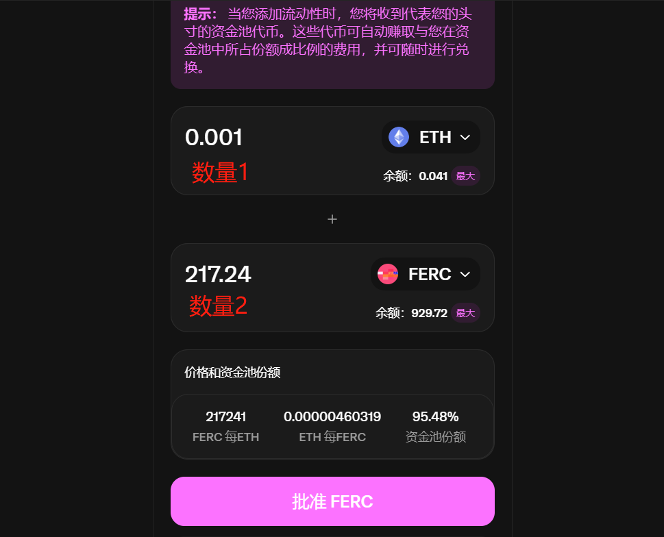

# Uniswap V2创建流动性教程(加池教程)

### Uniswap V2介绍

Uniswap V2是Uniswap项目的第二代产品，也是迄今为止使用频率最高、使用范围最广、最受用户欢迎的产品。相较于第一代产品，V2在性能、功能和用户体验等方面进行了全面优化。V2支持更多的代币交易对，提供了更加丰富的交易功能，同时也增强了系统的安全性和稳定性。

V2采用AMM（自动做市商）机制进行交易。用户可以将自己的代币存入流动性池，获得相应的流动性提供者（LP）代币作为回报。流动性池中的代币按照特定的比例进行配对，形成交易对。当用户进行交易时，Uniswap V2会根据流动性池中的代币比例和交易价格，自动计算交易双方的收益和损失，并完成交易。

### Uniswap V2添加流动性教程

#### 1.找到加池页面

打开Uniswap加池页面：[https://app.uniswap.org/pool](https://app.uniswap.org/pool)  ，并连接钱包

<figure><figcaption>
找到资金池按钮
</figcaption></figure>

#### 2.选择V2资金池

<figure><figcaption>
选择V2资金池
</figcaption></figure>

#### 3.创建资金池

在打开的V2页面中，我们可以看到自己的流动性（如果之前没有加过流动性，就显示：未找到流动性），也可以增加V2流动性或创建配对

<figure><figcaption>
点击“创建配对”
</figcaption></figure>

* 创建配对：创建一个新的流动性资金池（交易对），我们一般是要选这个
* 导入资金池：导入已有的流动性资金池
* 添加V2流动性：即某个代币已经有了资金池的基础上，我们继续增加池子流动性

#### 4.选择代币并设定价格比例

在打开的加池页面里，我们可以通过合约地址查找代币，并使其与ETH配对。（当然，除了ETH，也可以与USDT、USDC等其他代币配对）

<figure><figcaption></figcaption></figure>

<figure><figcaption>
输入合约地址查找代币
</figcaption></figure>

假设我们选择ETH与FERC这个代币配对，上面输入ETH的数量，下面输入FERC的数量

<figure><figcaption></figcaption></figure>

怎么理解价格呢？很简单，根据数量来确定。如上图所示，ETH的数量是0.001，FERC的数量是217.24，那么这个币的初始价格就是：0.001÷217.24=0.0000046ETH。

当然，我们也可以将这个数据换算成USDT的价格，那就用0.0000046x2600U=0.01196U。（这个2600就是ETH的价格，根据其价格实时计算）

如果选择与USDT配对，那么1000USDT与1000代币配对的话，初始价格就是1U。10000USDT与1000代币配对的话，初始价格就是10U，以此类推

#### 5.授权并确认

确定好代币数量与比例之后，我们点击**批准**，然后会跳出钱包让你确认。之后在点击供应，钱包再确认一次，将ETH和代币支付到池子里，就算是完成了。

<figure><figcaption></figcaption></figure>

资金池的创建流程非常简单，也没什么注意事项，如果您有任何问题，都可以进入Telegram电报群找志愿者解答： https://t.me/pandatool
