# Solana批量空投教程

批量转账或称批量空投工具，可以提高代币的持有者数量。相比较一笔笔转账来说，该工具将大大简化操作流程，提高代币空投的效率。

* 转账之前，务必使用安装好幻影钱包插件，安装教程➔ [https://help.pandatool.org/sol/phantom](https://help.pandatool.org/sol/phantom)
* 钱包内最少准备0.1个Sol
* 请打开翻墙软件（VPN/加速器），以防止网络错误

## Solana批量转账/空投教程

### 一、连接幻影钱包Phantom

首先，我们打开批量转账页面[https://solana.pandatool.org/multisend](https://solana.pandatool.org/multisend)：，点击右上角“选择钱包”

<figure><figcaption></figcaption></figure>

之后会跳出钱包选择页面，点击Phantom，即可链接钱包 &#x20;

<figure><figcaption></figcaption></figure>

右上角出现钱包地址，表示你已经完成的钱包

<figure><figcaption></figcaption></figure>

### 二、批量空投Sol

在页面左边空投sol的输入框内，填入要空投的地址以及数量，用英文逗号隔开（最多不能超过20个地址）

<figure>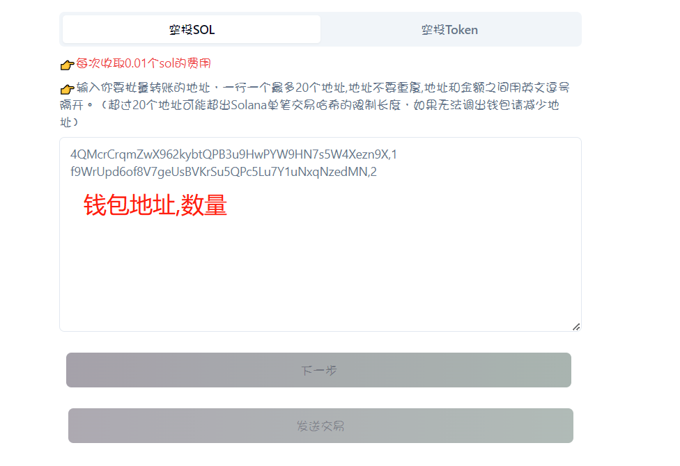<figcaption></figcaption></figure>

输入好之后，点击下一步，即可查询到要空投的地址数、sol余额等信息，如下图所示：

<figure>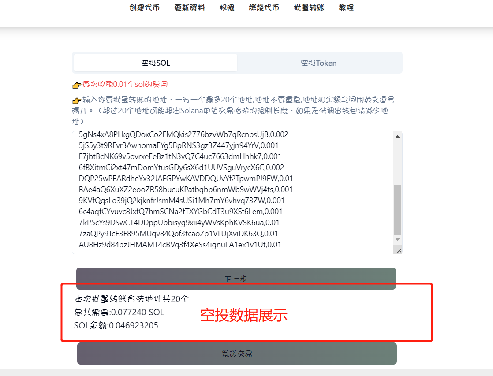<figcaption></figcaption></figure>

此时我们确认一下空投的数据信息是否准确，确认无误后，点击“发送交易”，此时会弹出钱包，点击确认即可。

### 三、批量空投代币

#### 1、选择代币

首先，我们连接钱包后，可以看到自己钱包内的代币情况，选择你要空投的代币，如下：

<figure><figcaption></figcaption></figure>

选择好后，就能拿到代币的数量以及logo等

<figure>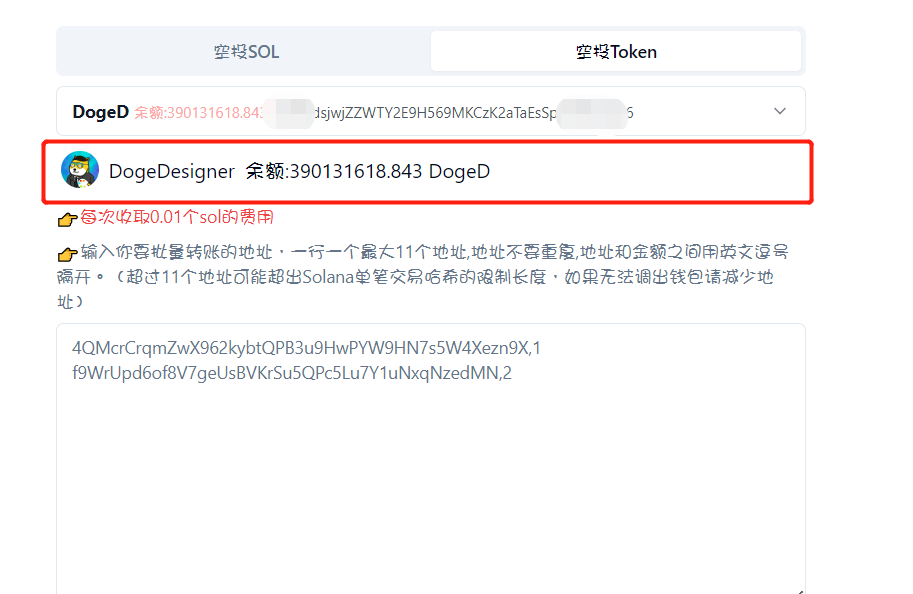<figcaption></figcaption></figure>

当然，有些代币查询不出来结果，这种情况可能是因为代币没有上线交易造成的，没有关系，可以直接转账，不受影响

#### 2、填写收币地址和数量

代币选择好，在下方的输入框填写接收代币的地址以及金额数量，地址和数量之间以英文逗号“,”隔开

<figure>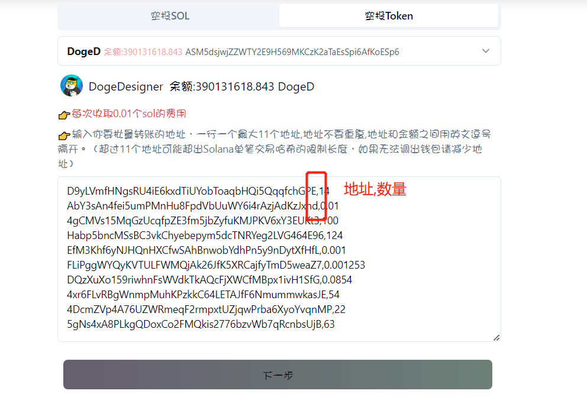<figcaption></figcaption></figure>

每一行为一组，不要串行了。单次支持最大11个地址，建议大家不要多填。地址和数量填写完成之后，点击**下一步**，就能看到你此次要转账的具体金额了

<figure>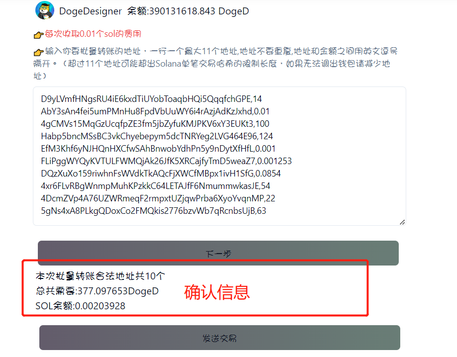<figcaption></figcaption></figure>

此时，我们需要再确认一下接收地址，以及发送的总金额是否有错。

#### 3、确认交易

当你确认好发送的地址以及金额数量都没错后，点击“发送交易”，此时会弹出钱包让你进行交易确认，点击确认即可完成

<figure>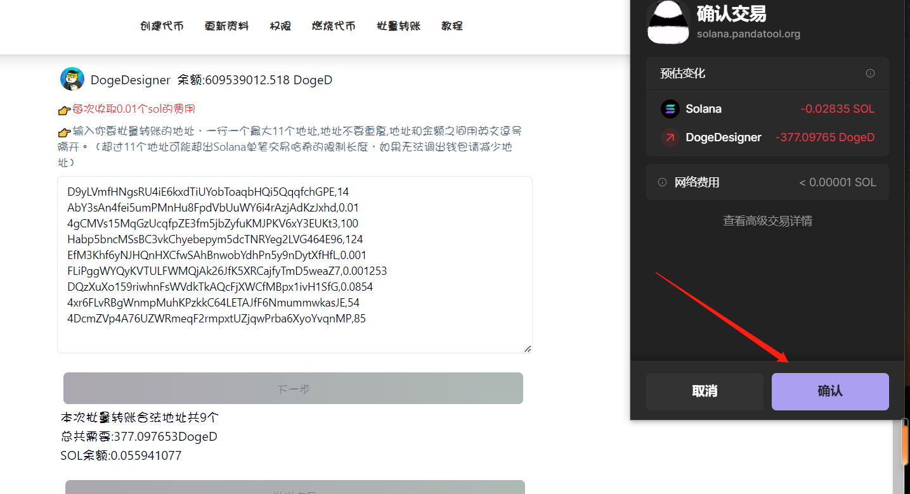<figcaption></figcaption></figure>

如果出现提示为“交易太大请减少地址数”，说明整个交易的信息超过了Solana的哈希最大值，这个时候需要减少地址数量。11个地址并不是最佳地址，正常8\~9个地址就可以

<figure>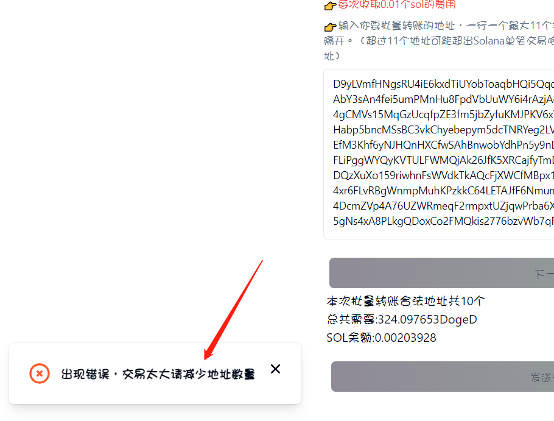<figcaption></figcaption></figure>

### 四、私钥空投

通过导入私钥进行空投，彻底解放双手，不用一次次点击确认，即可空投成千上万个地址。具体该如何进行，接下来给大家解读：

首先，我们导入要进行空投的钱包私钥，并选择要空投的代币，然后选择空投方式、次数、空投数量等

<figure>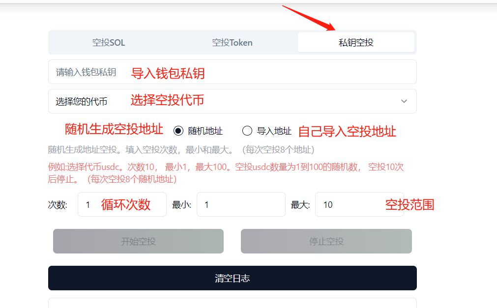<figcaption>
空投参数
</figcaption></figure>

* **随机地址：**工具为你随机生成接受代币的钱包地址，方便快捷
* **导入地址：**自己导入要空投的地址（使用csv文件上传），更为准确
* **次数：**空投循环次数，一次空投8个地址。循环10次，就是空投80个地址
* **最小/最大：**空投代币的数量范围，例如最小1，最大10，则在1\~10之间随机空投代币**（最小数量为1）**

例如我下面填写的参数，是这样的

<figure>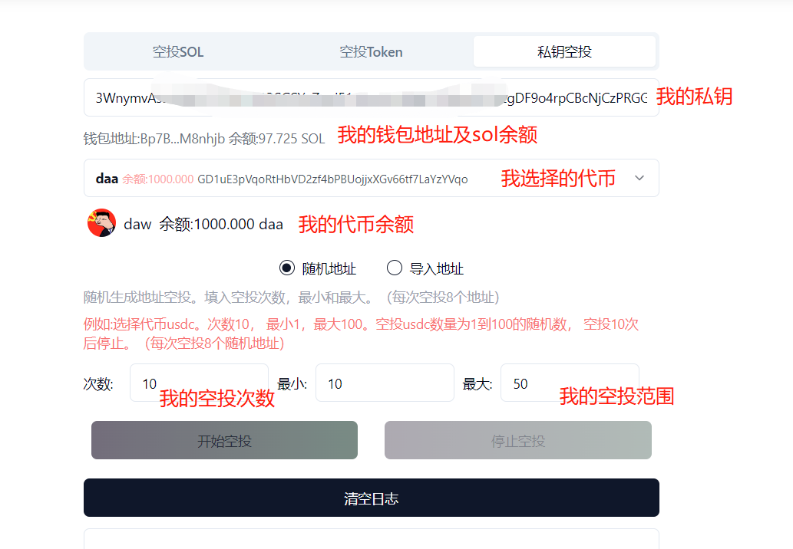<figcaption></figcaption></figure>

我的参数可以这样理解：首先，我钱包里有97个sol，手续费肯定是充足的。其次，我决定空投的代币叫daw，目前我钱包里有1000个币。然后我选择了随机地址，这就意味着，我并不知道（或者说并不在乎）这些币给到谁，反正提高我的持币人数就行。之后，我设置了10次循环，也就是说我大概本次会空投80个地址左右，每个地址空投的数量在10到50之间波动。

确定填写的参数无误后，我就点击开始空投，进行操作

<figure>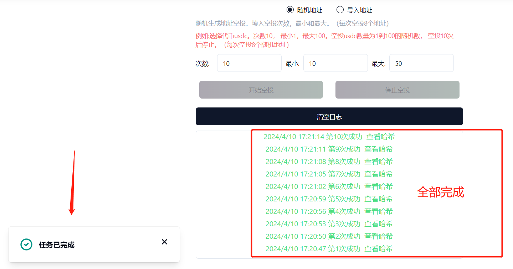<figcaption></figcaption></figure>

可以看到，半分钟内便完成了10次空投，也就是80个地址，还是非常快的，随便打开一个哈希就能看到空投情况

<figure><figcaption></figcaption></figure>

当然，这是在sol和代币都充足的情况下，如果sol余额不够，或者`代币余额`不够，就会自动停止。如果你想要在空投中间停止，点击`停止空投`就可以。

#### 私钥空投注意事项

* **安全性：**平台不会获取你的钱包私钥，但是为了安全防止泄露，建议使用新的钱包，用完即仍
* **收费情况：**空投费用按照`循环次数`收费，循环一次平台收取**0.01sol**。此外，还要支出网络gas费、租金等，循环一次总共大约需要**0.026sol**（含0.01平台使用费），请注意钱包内SOL是否充足
* **防止耗尽：**如果不手动停止，空投会一直循环下去，直到将钱包里面的代币或者sol耗尽为止。所以记得时刻关注空投进展，防止操作失误耗尽钱包内sol
* **导入地址：**如果你选择导入地址，请提前在csv文件中填写好相关的地址及数量，如下图所示

<figure>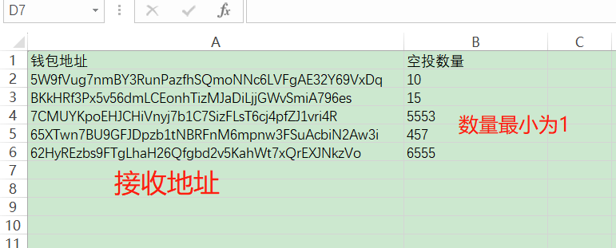<figcaption></figcaption></figure>

## 相关问题

**1、批量转账怎么收费？**

* _**答：**_单次空投收取0.01sol的费用。正常空投代币单次不要超过11个，私钥空投单次8个地址左右

**2、“您没持有该代币或代币不存在!”是什么意思？**

* _**答：**_该提示的意思是：可能是合约地址错了，或者钱包连错了。如果合约地址确认没错，那就需要确认一下钱包里是否有币了

**3、Token address、Token Account和 SPL Token Address，哪个才是合约地址？**

* _**答：**_Token address和SPL Token Address都是合约地址，Token Account不是合约地址，注意别搞错

<figure><figcaption></figcaption></figure>

有任何转账问题，可以在电报群联系志愿者：[https://t.me/pandatool](https://t.me/pandatool)
