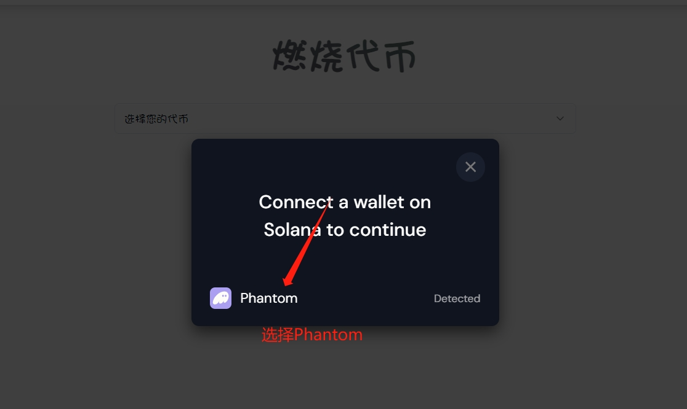
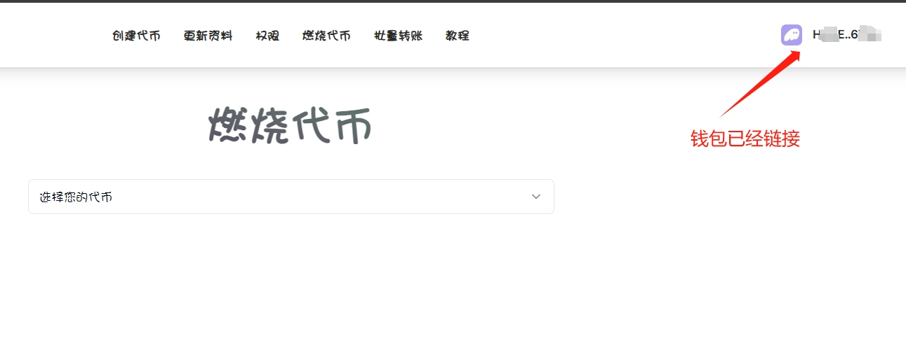
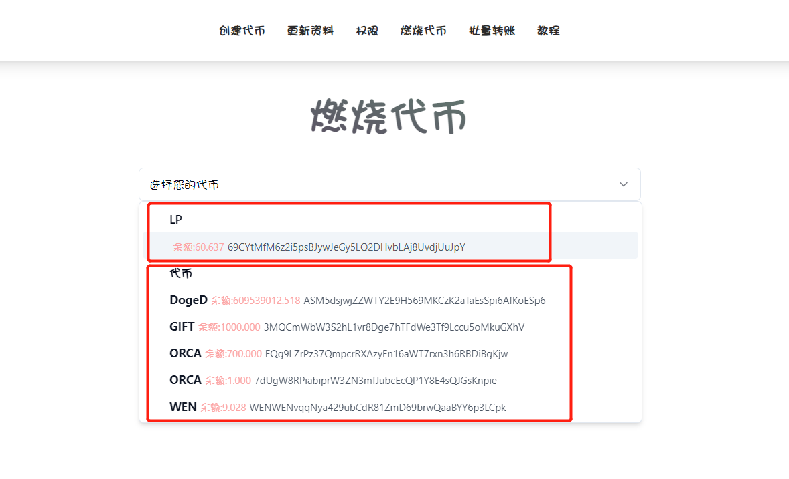
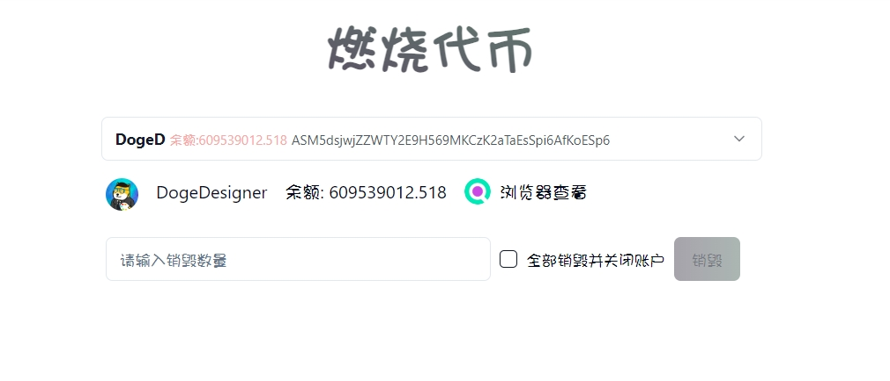
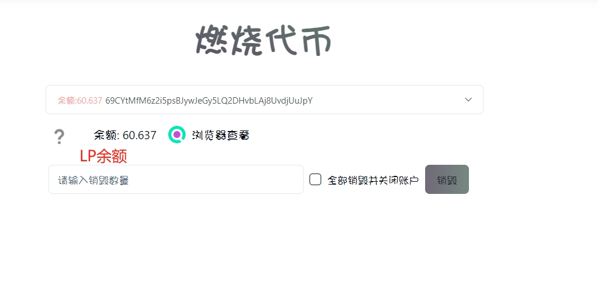
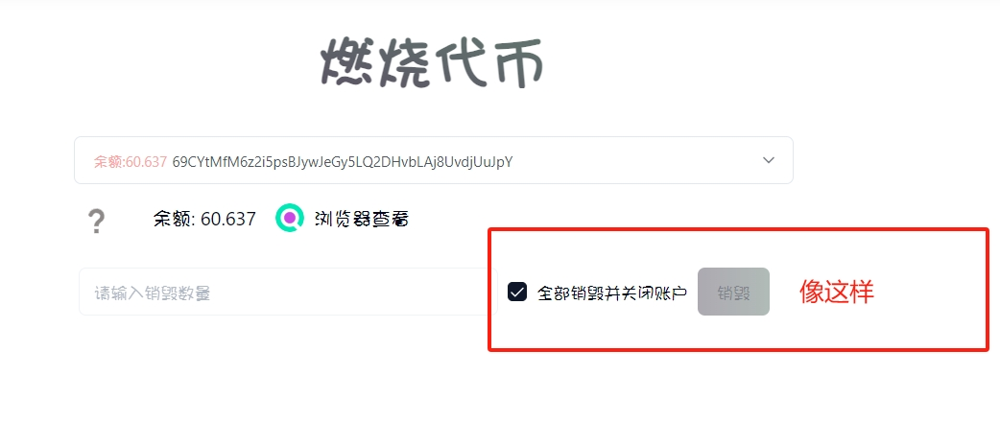

# SOL烧池子/锁池教程

* **烧池子：**将LP代币销毁
* **燃烧代币：**将任何代币销毁

通过我们的工具，大家不仅可以烧池子，也能将代币销毁掉，具体操作的教程如下：

打开链接[https://solana.pandatool.org/burn](https://solana.pandatool.org/burn)，右上角连接你的Phantom钱包（如未安装钱包，可参考→[Phantom安装教程](phantom.md)）

<figure><figcaption></figcaption></figure>

<figure><figcaption></figcaption></figure>

<figure><figcaption></figcaption></figure>

连上钱包后，在选择框能看到你钱包内目前拥有的代币和LP

<figure><figcaption></figcaption></figure>

这个时候，你想烧毁代币，就点击代币，大概页面是这样的：

<figure><figcaption></figcaption></figure>

想烧毁LP，就点击LP。烧毁LP，就是烧池子，大概页面是这样的

<figure><figcaption></figcaption></figure>

当查询到你钱包的LP数量之后，你可以填入销毁LP的数量，然后点击“销毁”就行。当然，你想全部销毁，就把右边那个“全部销毁并关闭账户”给勾选上，然后点击销毁，钱包确认就行了

<figure><figcaption></figcaption></figure>

## 疑问解答

#### 1、关闭账户是什么意思？

* **答：**你每收到一个新的代币，Solana系统会自动在你的地址里开设一个代币存储账户。所谓“关闭账户”，就是把代币全部销毁，账户也关掉的意思。关闭账户并不影响你自己的钱包，因此不用担心。

**2、NFT可以销毁吗？**

* **答：**在Orca加池子获得是NFT，这个暂时是不支持销毁/烧池的。目前可以销毁的是Ryadium和Meteora的LP。

**3、烧池后还能撤回流动性吗？**

* **答：**烧池后，永久无法撤出流动性

有任何烧池子的问题，可以在电报群联系志愿者：https://t.me/pandatool
