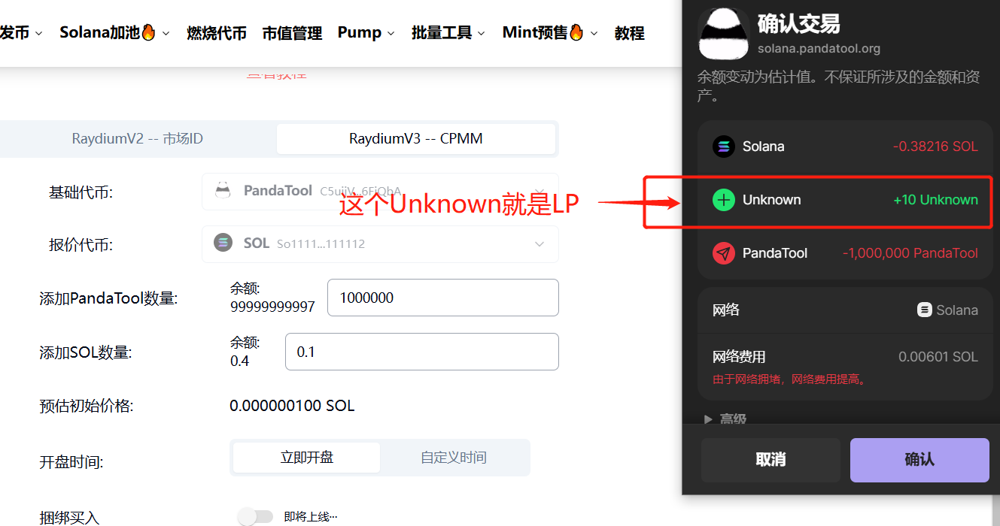
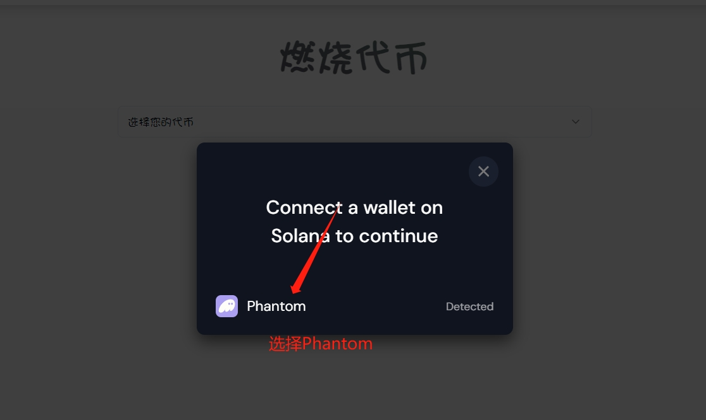
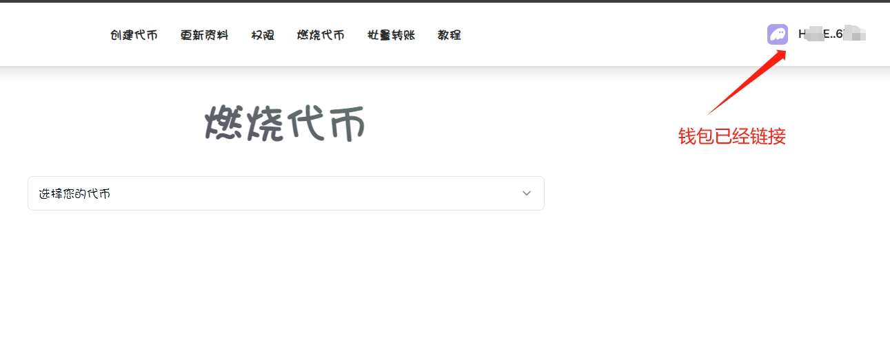
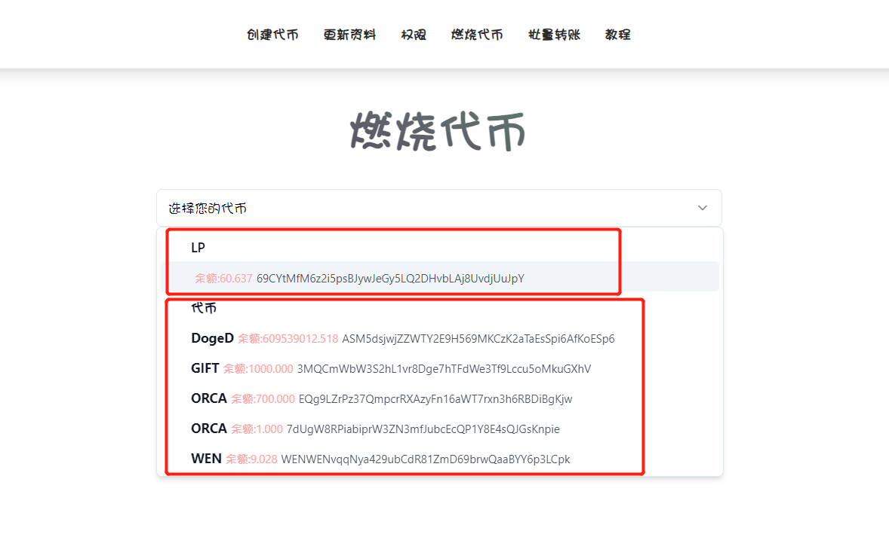
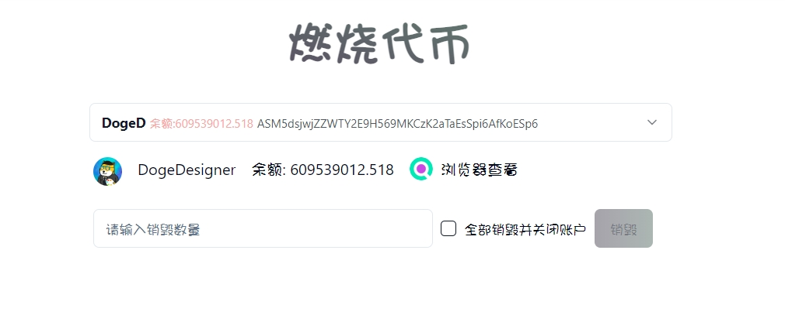
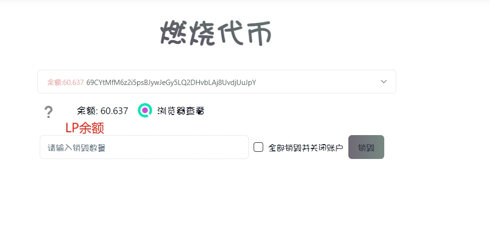
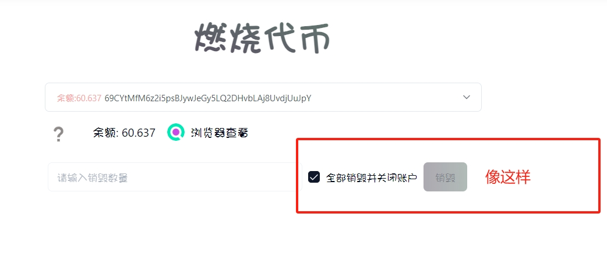

# Solana烧池子/锁池教程

* **烧池子：**&#x5C06;LP代币销毁，无法撤出流动性
* **燃烧代币：**&#x5C06;任何代币销毁，减少代币供应量

### 烧池概念问答

**1、LP是什么东西？**

* 答：LP本身也是一个代币。当您在创建流动性的时候，Raydium会给你发放一些LP代币作为凭证（类似于：银行存单）。以后你去撤池子，钱包就会自动将LP转给Raydium销毁掉，然后Raydium就让你把流动性撤出。所以，它是一个流动性/池子凭证。

<figure><figcaption></figcaption></figure>

**2、销毁LP又是什么意思？**

* 答：前面我们提到，LP是一个流动性凭证。Raydium只认Lp，不认钱包（_银行只认存单，不认人_）。如果将Lp转移给被人，那么别人就可以撤。谁有这个LP，谁能撤池子。如果将LP销毁掉，那就说明这个LP不存在了，无法再撤出流动性了。这个就是我们说的**烧池子**。

**3、烧池子是什么意思？池子烧完还能交易吗？**

* 答：很多人误区，认为池子烧了，池子里面的Sol和代币就不存在了，这是错误的观念。销毁LP=烧池子=无法撤池子。注意，池子依然存在，只是不能撤了而已。所以，**烧完池子后还能交易**，不受影响。
* 如果你自己将银行存单烧了，这个笔钱还是在银行的，只能没人可以取了。

通过我们的工具，大家不仅可以烧池子，也能将代币销毁掉，具体操作的教程如下：

打开链接[https://solana.pandatool.org/burn](https://solana.pandatool.org/burn)，右上角连接你的Phantom钱包（如未安装钱包，可参考→[Phantom安装教程](phantom.md)）

<figure><figcaption></figcaption></figure>

<figure><figcaption></figcaption></figure>

<figure><figcaption></figcaption></figure>

连上钱包后，在选择框能看到你钱包内目前拥有的代币和LP

<figure><figcaption></figcaption></figure>

这个时候，你想烧毁代币，就点击代币，大概页面是这样的：

<figure><figcaption></figcaption></figure>

想烧毁LP，就点击LP。烧毁LP，就是烧池子，大概页面是这样的

<figure><figcaption></figcaption></figure>

当查询到你钱包的LP数量之后，你可以填入销毁LP的数量，然后点击“销毁”就行。当然，你想全部销毁，就把右边那个“全部销毁并关闭账户”给勾选上，然后点击销毁，钱包确认就行了

<figure><figcaption></figcaption></figure>

## 疑问解答

#### 1、关闭账户是什么意思？

* **答：**&#x4F60;每收到一个新的代币，Solana系统会自动在你的地址里开设一个代币存储账户。所谓“关闭账户”，就是把代币全部销毁，账户也关掉的意思。关闭账户并不影响你自己的钱包，因此不用担心。

**2、NFT可以销毁吗？**

* **答：**&#x5728;Orca加池子获得是NFT，这个暂时是不支持销毁/烧池的。目前可以销毁的是Ryadium和Meteora的LP。

**3、烧池后还能撤回流动性吗？**

* **答：**&#x70E7;池后，永久无法撤出流动性

有任何烧池子的问题，可以在电报群联系志愿者：https://t.me/pandatool
