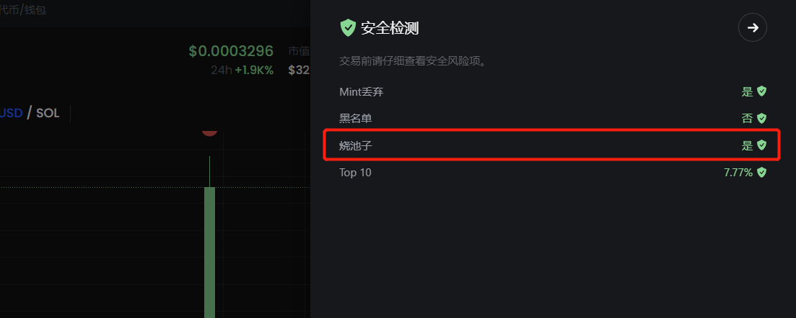
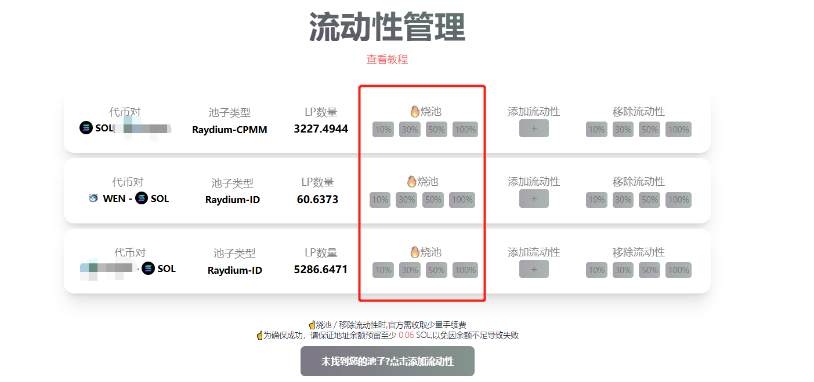
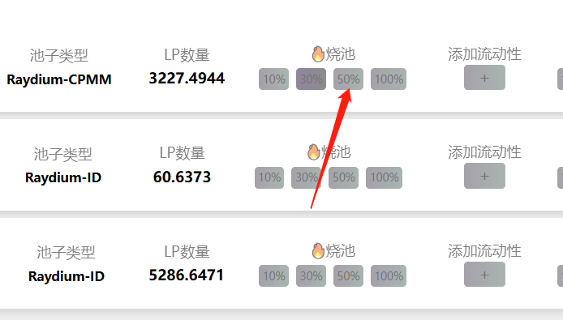

# Solana烧池子教程

### 什么是Solana烧池子？

当我们在Raydium添加流动性的时候，Raydium会给予一些LP代币作为凭证。等到你想撤池子的时候，就把LP给到Raydium，这样流动性就可以撤出。那我们烧池子，事实上就是将LP代币销毁掉，谁也不能再撤池子了。总得来说，**烧池子=不能撤池子！！！烧池子≠销毁池子里面的代币！！！**

### 为什么要烧池子？

从实际意义上来说，项目方烧池子是向用户证明一件事情：我不会撤池子跑路。如果池子不烧，项目方随时有撤池跑路的风险，这样用户不敢进入。

从宣传意义上来说，如果不烧池子，Ave、GMGN、Dexscreener等平台，都会进行标注和风险提醒，非常不利于项目发展。

<figure><figcaption></figcaption></figure>

### 烧池子有哪些影响？

烧池子唯一的影响就是项目方不能撤池子了，除此之外没有负面影响。池子烧了之后，代币依然可以正常交易。池子里面的代币和sol依然存在，并不会有任何影响。

### 怎么才能烧池子？

如果你是在Raydium加的池子，可以通过PandaTool的流动性管理来进行烧池操作。

首先，我们打开PandaTool的流动性管理工具：[https://solana.pandatool.org/managepool](https://solana.pandatool.org/managepool)  右上角连接钱包后，可以看到当前您添加的流动性

<figure><figcaption></figcaption></figure>

这个时候，您可以根据自己的需要，选择燃烧不同的比例，目前支持10%、30%、50%和100%这4个档位。选择燃烧哪个比例，点击就可以了

<figure><figcaption></figcaption></figure>

整个烧池子的流程还是比较简单的，如果您不是想燃烧池子，只是想销毁代币，可以使用我们的销毁工具：[https://solana.pandatool.org/burn](https://solana.pandatool.org/burn)

大家如果有其他的疑问，欢迎进入我们的电报群沟通了解：[https://t.me/pandatool](https://t.me/pandatool)
