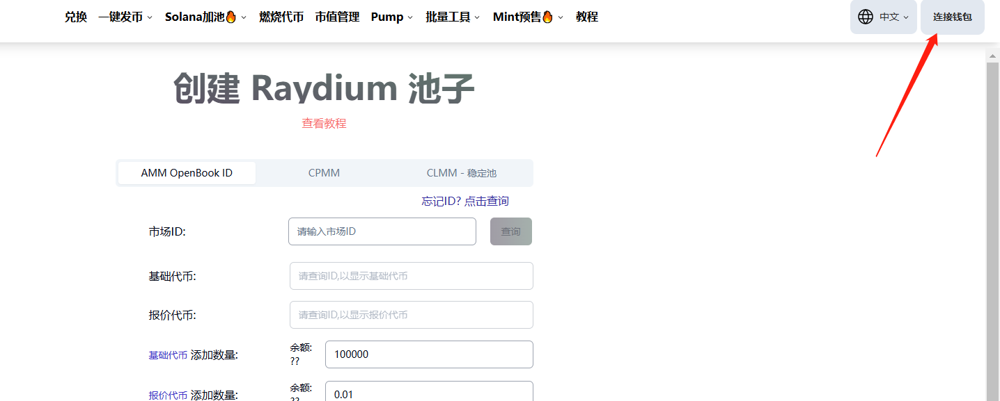
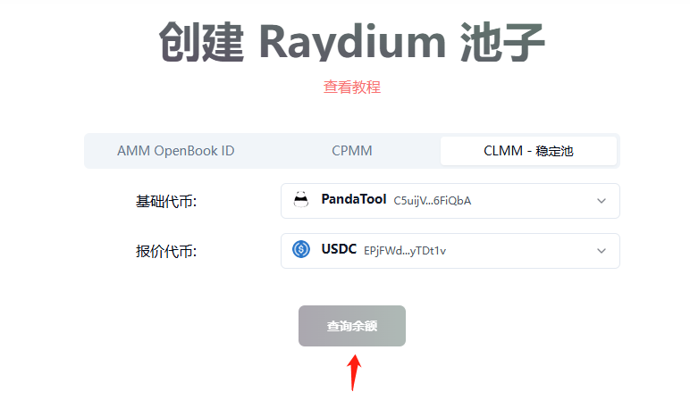
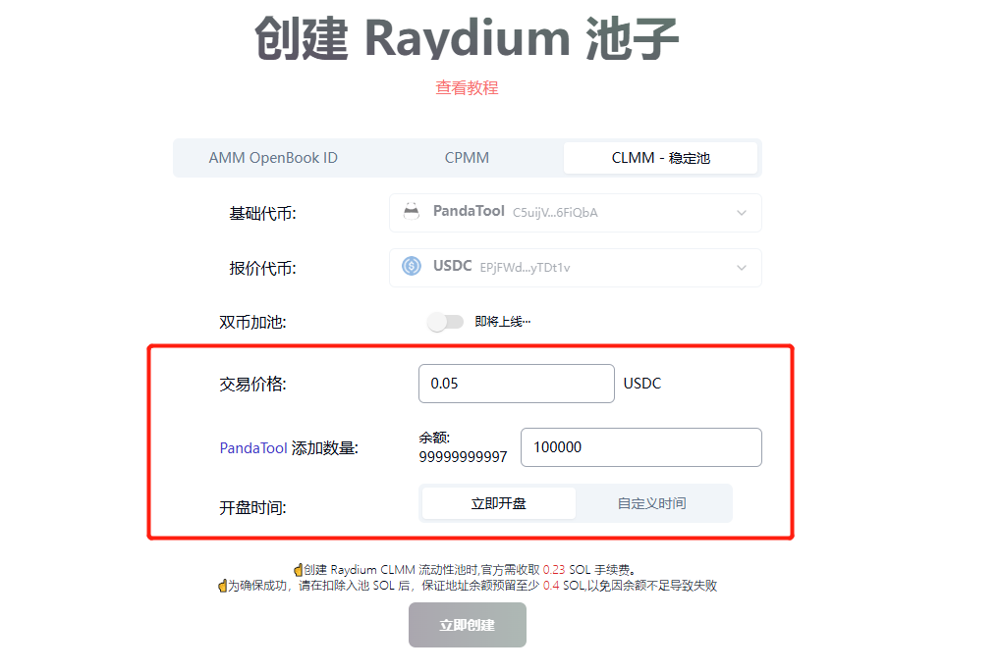

# Solana创建Raydium CLMM稳定池教程

## 什么是稳定池？

所谓稳定池，就是Raydium推出集中流动池，也叫：CLMM池。这种流动性资金池的特点就是，可以让代币的价格稳定在一定范围内，所以日常我们称之为：稳定池。

## 为什么要创建稳定池？

**集中流动性做市商（CLMM）**&#x6C60;允许流动性提供者选择特定的价格范围,在该价格范围内,池内交易的流动性处于活动状态。这与恒定产品自动做市商（AMM）池形成对比,在该池中,所有流动性都在0到∞的价格曲线上分散。对于LP,CLMM设计使资本可以更高效率地部署,并从交易费用中获得更高的收益。对于交易者而言,CLMM可以提高当前价格附近的流动性深度,从而提高价格并降低价格对掉期的影响。

对于很多RAW项目来说，代币价格稳定有助于实体项目的运营。通过创建稳定池，可以确保代币不会受到MEV套利机器人的影响，对于项目的长久发展至关重要。此外，创建稳定池仅需要很少的费用，极大地降低了用户了门槛和成本。

## 创建稳定池的步骤

1.打开PandaTool流动性创建页面

2.右上角连接Phantom钱包

3.选择CLMM池，并确定两种池子代币

4.填写要入池的代币数量

5.钱包确认并支出费用和代币

6.在PandaTool的Solana Swap交易一笔

## 创建Solana稳定池的详细教程

### 1、打开PandanTool并连接钱包

首先，我们需要打开PandaTool的流动性创建工具：[https://solana.pandatool.org/zh/createpool](https://solana.pandatool.org/zh/createpool) ，然后在右上角连接钱包

<figure><figcaption></figcaption></figure>

此时会跳出Phantom钱包进行连接，点击之后会自动识别Phantom钱包插件，并在右上角出现你的钱包地址，这就说明钱包连接成功了

<figure><figcaption></figcaption></figure>

### 2、选择CLMM池子

值得注意的，PandaTool支持用户创建AMM V4池、CPMM池和CLMM池三种，我们在这里选择CLMM池

<figure><figcaption></figcaption></figure>

之后，需要选择基础代币和报价代币

* **基础代币：**&#x5C31;是你创建的代币
* **报价代币：**&#x53E6;一个配对代币，用来确定价格，通常是USDT或USDC

<figure><figcaption></figcaption></figure>

代币确定之后，我们点击查询余额，需要输入一些其他参数

### 3、输入参数

<figure><figcaption></figcaption></figure>

从上图可以看出，我们需要手动设置三个参数

* **交易价格：**&#x60A8;希望自己的代币上线后价格应该稳定在多少，就填多少
* **添加数量：**&#x60A8;希望将多少代币放入流动性池，就输入多少
* **开盘时间：**&#x4EE3;币开始交易的时间，默认是立即开始交易，也可以自定义时间

需要注意的是，PandaTool开发的针对于CLMM加池工具，采用的是单币模式。即，只需要添加基础代币就可以确定价格，无需添加报价代币。

### 4.钱包确认

所有的信息输入完成后，点击立即创建按钮，钱包确认并支付费用，即可完成CLMM加池操作

<figure><figcaption></figcaption></figure>

### 5.Solana Swap交易

当我们创建好CLMM流动性资金池后，这个池子里只有一种代币，即基础代币。这种情况下，代币是无法卖出的，只能买入。如果你希望代币可以卖出，需要往池子里加入报价代币USDC/USDT才行。

具体怎么加进去呢？我们通过Raydium兑换一笔就行

打开Raydium的网页：[https://raydium.io/liquidity](https://raydium.io/liquidity) ，在上方输入USDT/USDC的数量，下面会自动按照你设置的交易价格匹配出代币数量

此时点击兑换，并通过钱包确认完成交易后，即可将USDT/USDC加入到池子里。

至此，整个Raydium CLMM加池教程就到这里了结束了。

## 疑问解答

**1、CLMM稳定池子，加池的时候代币和U需要1:1吗？**

* **答：**&#x4E0D;需要。创建稳定池，只是加单币，USDT的数量的多少都无所谓

**2、我可以创建双币池子吗？**

* **答：**&#x7A33;定池暂时只运行添加单币池，双币池正在开发中

**3、为什么别人的池子里有两种代币呢？**

* **答：**&#x6B63;如教程里所说，您需要通过Solana Swap完成交易后，就可以将另一种报价代币放入池子里

**4、OKX Web3钱包显示的Raydium V3是不是CLMM池子？**

* **答：**&#x662F;的，CLMM就是欧易显示的Raydium V3

如果对于CLMM稳定池，您还有什么不明白的，可以进入我们的电报群，志愿者会给你详细的解答：[https://t.me/pandatool](https://t.me/pandatool)
