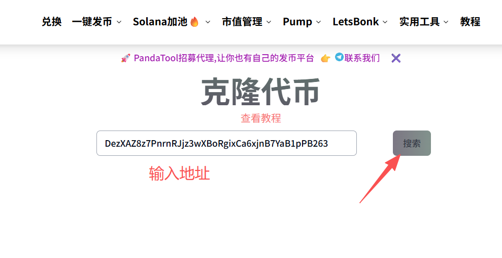
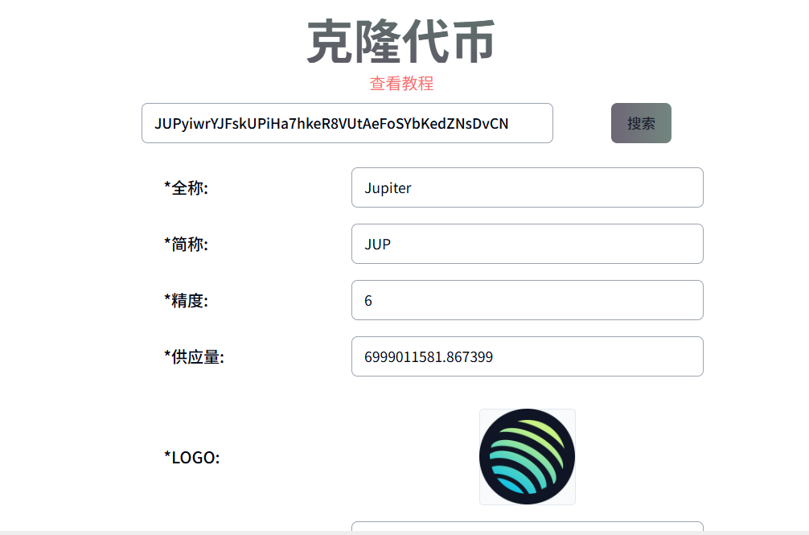
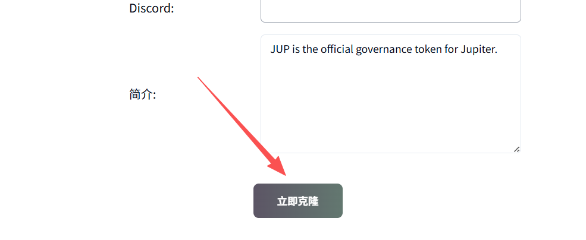

# Solana代币克隆教程

### **什么是代币克隆？**

顾名思义，代币克隆指的是创建一个与目标代币一模一样的代币，两种代币的名称、数量、官网、头像全部一致。因为与克隆技术相似，所以也叫代币克隆。

<figure><figcaption></figcaption></figure>

### **为什么要克隆代币？**

正常我们创建Solana代币，需要手动输入代币的名称、数量、头像等，这个过程相对来说比较麻烦一点。如果你想复制一个别人的币，通过克隆工具，可以一键填写资料，无需手动一个个写，极大的方便了大家的操作，提高了效率。

### **如何克隆代币？**

当前，PandaTool推出了代币克隆工具，本篇教程，就是教大家去通过PandaTool完成代币克隆

#### **1、打开PandaTool并连接钱包**

首先，我们通过链接进去到克隆代币工具：[https://solana.pandatool.org/clonetoken](https://solana.pandatool.org/clonetoken)  或者通过菜单栏找到克隆工具

<figure><figcaption></figcaption></figure>

进入工具页面之后，我们在右上角连接钱包

<figure><figcaption></figcaption></figure>

#### **2、输入代币地址**

接下来，我们需要输入代币的合约地址。您想克隆哪个代币，就输入那个代币的地址。例如，我想克隆JUP这个币，就填入JUP的合约地址：`JUPyiwrYJFskUPiHa7hkeR8VUtAeFoSYbKedZNsDvCN`  然后点击搜索&#x20;

<figure><figcaption></figcaption></figure>

#### **3、确认代币资料**

点击搜索之后，等待几秒钟，系统就会将该代币的所有资料抓取出来

<figure><figcaption></figcaption></figure>

针对当前已有的资料，您可以自己修改、增加、删除。例如修改数量、增加官网链接等等。

#### **4、确定克隆**

确认好资料没有问题之后，点击立即克隆按钮，此时会弹出钱包进行确认。

<figure><figcaption></figcaption></figure>

之后等待几秒钟，一个代币就创建出来了

整个克隆代币的流程到这里就介绍完了，整体还是非常简单的。接下来回答一下大家的问题

### **克隆代币疑问解答**

**1、克隆代币只支持Solana链吗？BSC支持吗？**

* 答：目前不支持Bsc等公链，只支持Solana

**2、克隆代币，可以克隆代币的价格、持仓人数吗？**

* 答：不行的，持仓地址和数量需要通过批量转账/空投来实现。至于价格，也是需要做池子才可以。克隆代币只能克隆代币的基础资料，价格、持仓等属于动态数据，无法克隆。

**3、克隆代币需要收费吗？**

* 答：是的，克隆代币并创建，收费0.1SOL

**4、为什么点击搜索之后没有反应？**

* 答：需要等待几秒钟，区块链抓取资料要花点时间，几秒钟后就能看到信息了

如何您针对代币克隆还有其他问题，可以进入Telegram电报群找志愿者解答： [https://t.me/pandatool](https://t.me/pandatool)
