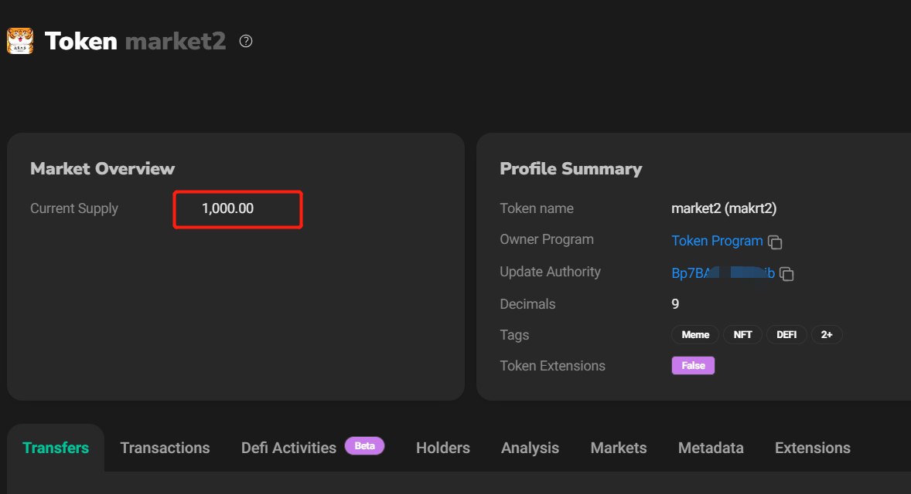
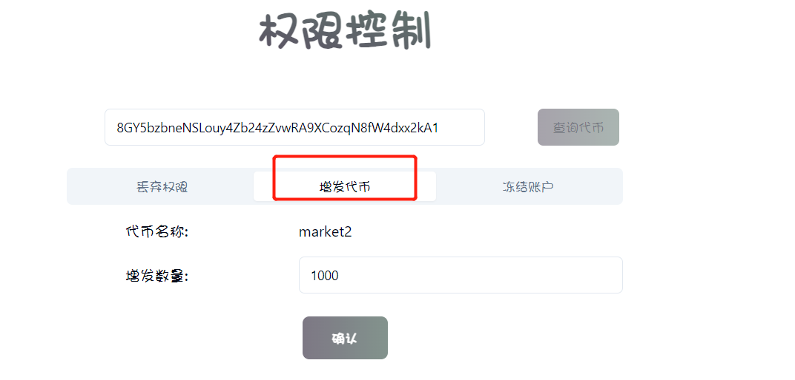
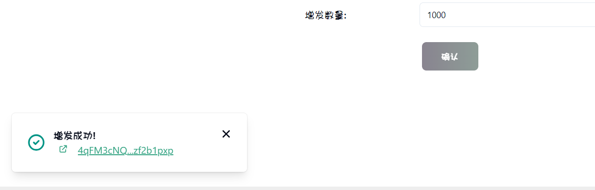
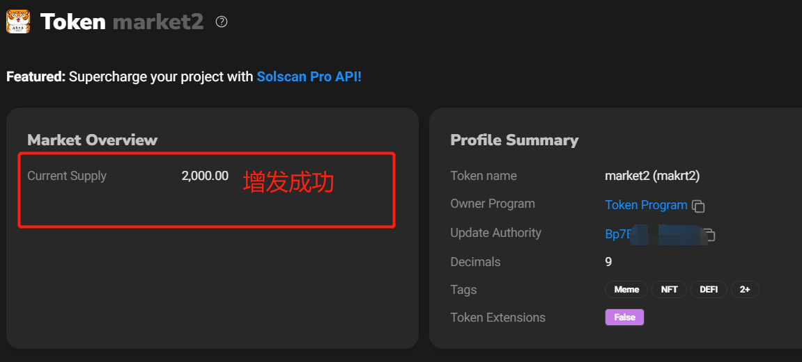
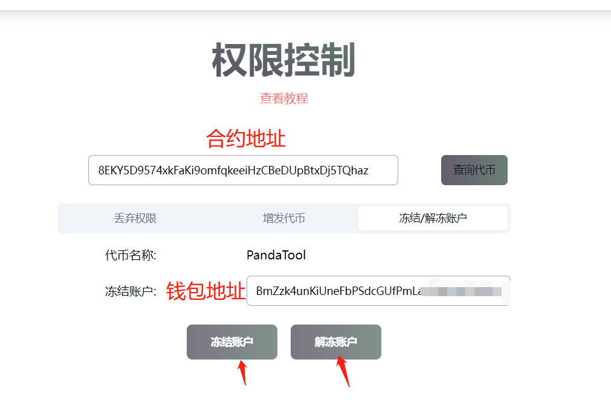
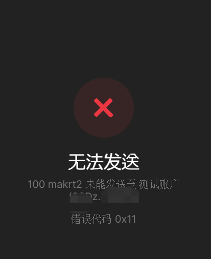

# Solana权限管理(增发、冻结、弃权）

Solana的代币创建出来后，会有3个权限：增发权限（铸币权）、拉黑权限（冻结权）、更新资料权限

* **增发权限：**可以增发、铸造代币，提高代币供给量
* **拉黑权限：**可以冻结任何一个地址，使其不能转账及卖出
* **更新资料权限：**可以修改代币名称、logo等

如果是在PandaTool发行的代币，并已上传了logo，会自带这三个权限。如果是其他平台发行的代币，可能会带有2个权限或者1个权限。

当然，不管你是在哪里创建发行的代币，都可以通过PandaTool的工具放弃权限，或者使用拉黑、冻结功能，以实现代币的权限管理

## 一、放弃权限

我们提倡大家在发币之后，将权限放弃。打开权限管理页面， [https://solana.pandatool.org/control](https://solana.pandatool.org/control) ，然后输入代币的合约地址，可能会给你以下几个提示：

### **1、当前地址无代币权限**

如果你已经丢弃了所有权限，查询代币时会提示你：当前代币已禁止更新资料、当前地址无代币增发权限、当前地址无代币的冻结权限。

出现该情况，说明你的钱包没有该代币的权限，不支持放弃。如果你确认没有放弃权限，那就是你连接的钱包不是发币钱包，可以更换钱包后刷新再试

<figure><figcaption></figcaption></figure>

## 2、没有任何提示

如果点击查询代币，发现没有任何提示，说明你可以正常放弃权限。此时将权限按钮勾选上，然后确认就可以了。需要放弃哪个权限，就勾选哪个。

<figure><figcaption></figcaption></figure>

## 二、使用权限

如果你不愿意放弃权限，那就可以使用权限工具，对代币进行增发或者拉黑操作

### 1、增发代币

很好理解，就是增加代币的总量。我们只需要点击增发按钮，输入增发数量，点击确认即可。

以下面这个代币为了，从浏览器可以看出，该代币的总量是1000

<figure><figcaption></figcaption></figure>

现在我使用增发功能，增发1000个代币，操作如下：

<figure><figcaption></figcaption></figure>

点击确认，钱包确认后，会提示你增发成功

<figure><figcaption></figcaption></figure>

此时我们回到浏览器刷新一下，就可以看到浏览器的代币数量发生了变化，达到了2000枚

<figure><figcaption></figcaption></figure>

### 2、冻结/解冻账户

冻结账户也叫拉黑账户，指的是持有该代币的地址被拉黑后，将无法把代币转出，即无法转账及卖出。我们建议大家谨慎使用该功能，以确保项目的长久运行。如果冻结之后要解冻，直接点击解冻账户就行了

<figure><figcaption></figcaption></figure>

地址被冻结之后，转账出去会提示“无法发送”，这就说明冻结成功了。

<figure><figcaption></figcaption></figure>

* 注意，该地址为钱包地址，不是Account地址

如果使用权限的过程有相关问题，欢迎进群询问解答：[https://t.me/pandatool](https://t.me/pandatool)
