# Solana创建税率代币(Token2022)教程

## **Solana税率代币概念解读**

### 1、什么是Solana税率代币？

简而言之，就是可以进行收税的代币类型。我们正常创建的Solana代币，遵循的是SPL-Token代币标准，这是一种没有任何功能的代币纯MEME币。为了提高代币的可扩展性，Solana官方推出的新的代币标准：`Token2022`。这个代币标准可以支持税率、冻结等功能，所以也叫**税率代币**。

### 2、收税的逻辑和方式是什么？

和BSC链略有不同，Solana税率代币的收税主要是靠：**转账和交易**。设定好税率后，任何地址进行转账或者交易，都会按照设定好的税率产生一笔手续费（发行的本币）。不过需要注意，这笔手续费不是实时到账的，是先存储在一个地方，需要`提税地址`去手动领取才可以。

* 手续费领取页面：[https://solana.pandatool.org/zh/taxClaim](https://solana.pandatool.org/zh/taxClaim)

### 3、Token2022只有税率一种功能吗？

当然不是，Token2022是一种多扩展性功能代币标准，我们目前开发了暂停交易、超级权限、不可转账等多个功能。后续根据市场的需求，还是对其拓展功能进行持续开发



## **创建税率代币(Token2022)教程**

步骤1：打开PandaTool并链接钱包

步骤2：填写代币基本参数

步骤3：填写选填参数

步骤4：启用高级选项

步骤5：创建代币

步骤6：测试税率功能

### **1、连接钱包**

首先，我们进入到PandaTool的工具页面：[https://solana.pandatool.org/zh/create2022](https://solana.pandatool.org/zh/create2022)，然后点击右上角连接钱包

<figure>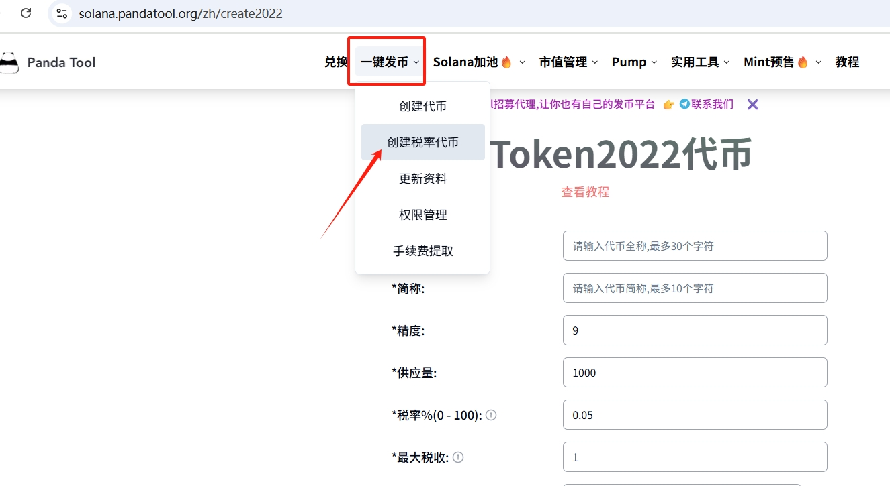<figcaption></figcaption></figure>

一般来说，会直接跳出Phantom进行连接。如果你没有安装Phantom钱包，OKX钱包、TP钱包也是可以的。（我们仍然点击Phantom即可，能直接识别到其他钱包）

<figure>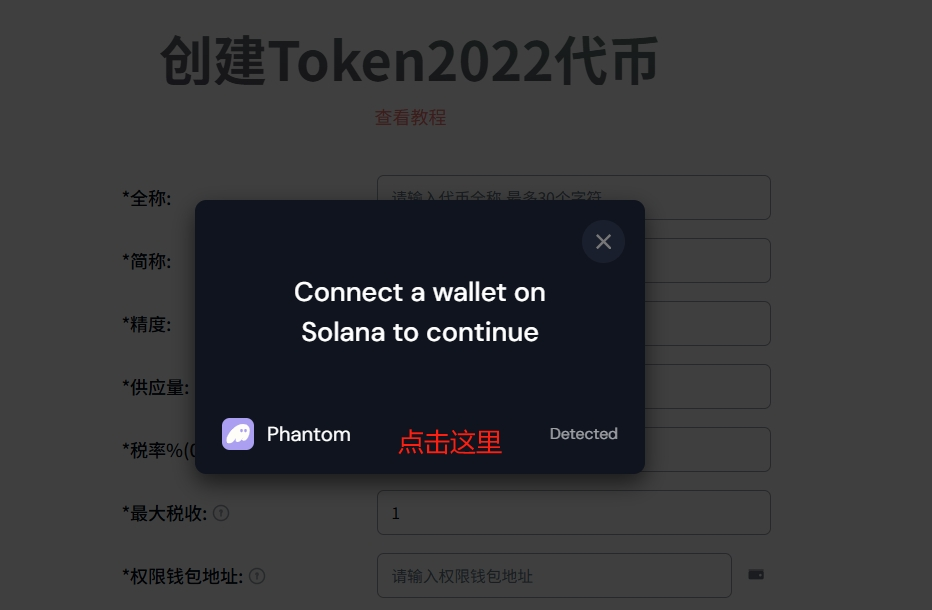<figcaption>
点击Phantom
</figcaption></figure>

<figure>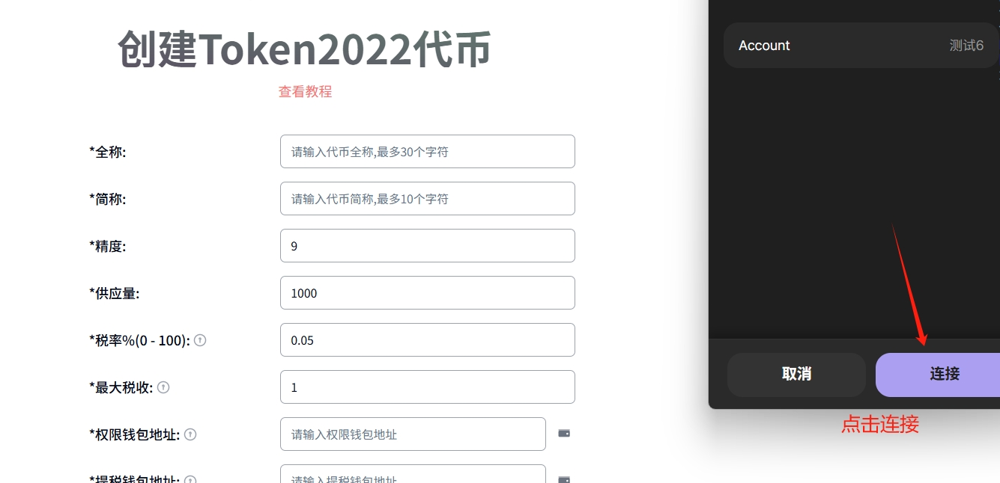<figcaption></figcaption></figure>

钱包连接成功后，右上角可以看到钱包地址。如果您没有安装Phantom钱包，也可以查看安装教程：[https://help.pandatool.org/sol/phantom](https://help.pandatool.org/sol/phantom)

<figure>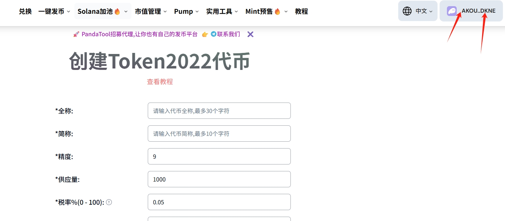<figcaption></figcaption></figure>

### **2、填写代币参数（必填）**

这一步非常重要，有一些关键参数，必须说明，大家先看图

<figure>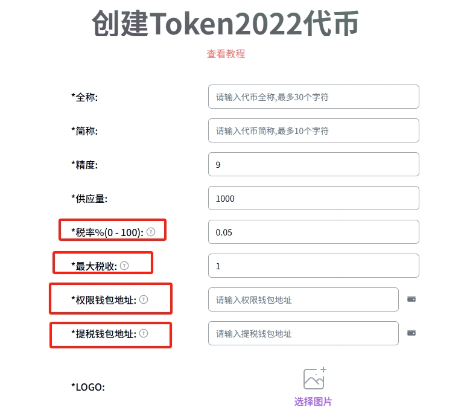<figcaption></figcaption></figure>

* **代币全称：**&#x4EE3;币的名称，如Solana、Ethereum、Bitcoin等，全称支持英文和中文
* **代币简称：**&#x4EE3;币的符号，如SOL、ETH、BTC等，简称支持英文和中文
* **精度：**&#x4EE3;币的最小分割单位，默认是9，与供应量有关
* **供应量：**&#x5F53;精度为9时，供应量最大不能超过100亿。当精度为8时，不能超过1000亿，以此类推
* **税率：**&#x4EE3;币转账和交易时产生时收取的手续费比例，可以填0\~100
* **最大收税：**&#x5355;笔转账或者交易时可以收取的最大手续费。
  * 假设税率是10%，转账1000个代币，手续费为100
  * 假设最大税收设计为50，那么转账1000个，手续费只能是50
* **权限钱包地址：**&#x7528;来进行代币增发、冻结等操作的地址
* **提税钱包地址：**&#x7528;来提取整条链上产生的代币手续费
* **Logo：**&#x4EE3;币的图标，尺寸建议：256x256像素，大小不超过1M


**提税说明：**&#x624B;续费产生后，通常会累计在某个地方，等待提税地址去提取。


以下是我填写的参数，我发行了一个名为PandaToken的代币，数量1亿枚，税率10%，最大税收100

<figure>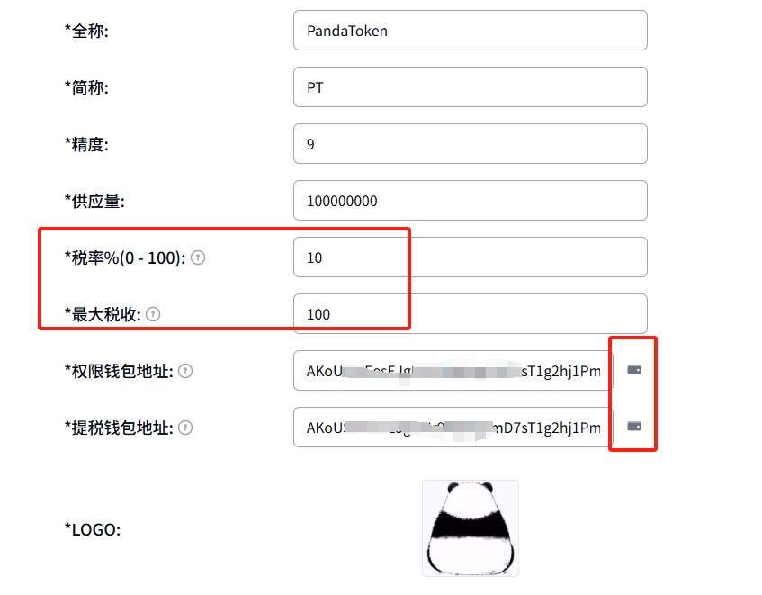<figcaption></figcaption></figure>

### **3、填写代币参数（选填）**

除了上述的必填信息，还有一些选填信息，这些信息可能会被某些平台抓取到而展示出来：

* **官网：**&#x4EE3;币项目的官网，如：[https://pandatool.org/](https://pandatool.org/)
* **Telegram群组：**&#x4EE3;币项目的电报群组，如：[https://t.me/pandatool](https://t.me/pandatool)
* **Twitter链接：**&#x4EE3;币项目的官方推特（X），如：[https://twitter.com/PandaTool](https://twitter.com/PandaTool)
* **Discord链接：**&#x4EE3;币项目的官方讨论组，如：[https://discord.orca.so/](https://discord.orca.so/)
* **简介：**&#x4E0D;能超过200个汉字（或200个英文字母）
* **标签：**&#x6700;多支持5个。默认会给你写5个，觉得哪个不合适，直接删掉自己创建一个就可以

例如我填写的信息如下：

<figure>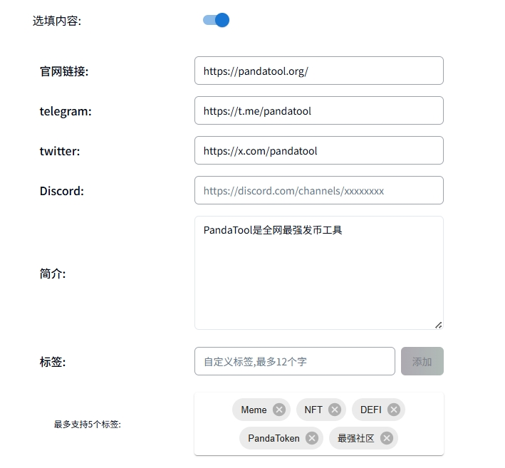<figcaption></figcaption></figure>

### **4、高级选项**

Token2022代币具有极强的拓展功能，其高级选项极为复杂。我们强烈建议新手不要启用高级选项，一旦启用，就需要接受**代币无法创建资金池**的结果。

如果您可以接受这个风险，那么我们继续看这一步该如何操作：

<figure>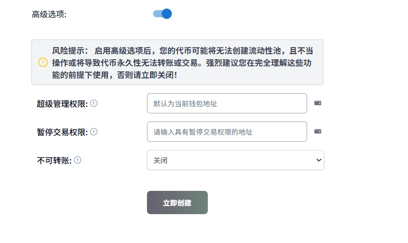<figcaption></figcaption></figure>

* **超级管理权限：**&#x8FD9;个权限，可以将任何持仓钱包里面的代币转移或者销毁掉
* **暂停交易权限：**&#x8BE5;权限可以临时暂停所有代币的交易，使其不能转账
* **不可转账：**&#x5F00;启该功能后，代币将永久无法转账，且不可逆。**高风险，不要轻易尝试**

您可以根据需要输入对应权限的地址，可以默认选择发币的地址，也可以填写其他地址。

如果您启用了高级选项，需要使用权限的话，可以在这里操作：[https://solana.pandatool.org/zh/control](https://solana.pandatool.org/zh/control)

### **5、创建代币**

确定好填写的信息无误之后，点击“立即创建”按钮，这时候会跳出Phantom钱包，确认并支付费用即可，如下所示：

<figure>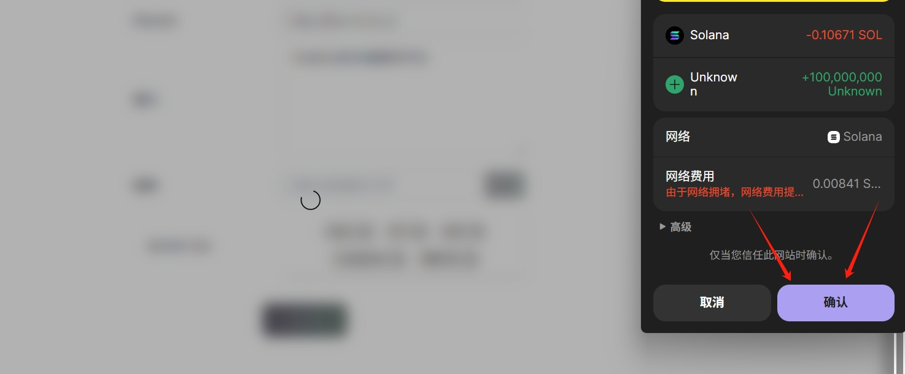<figcaption></figcaption></figure>

等待几秒钟之后，会弹出一个页面提示你代币创建成功。同时会出现代币合约地址，你可以复制。（注意：代币是否创建成功**以扣费为准**，只要扣费了就肯定成功，只要没成功就肯定没扣费）

<figure>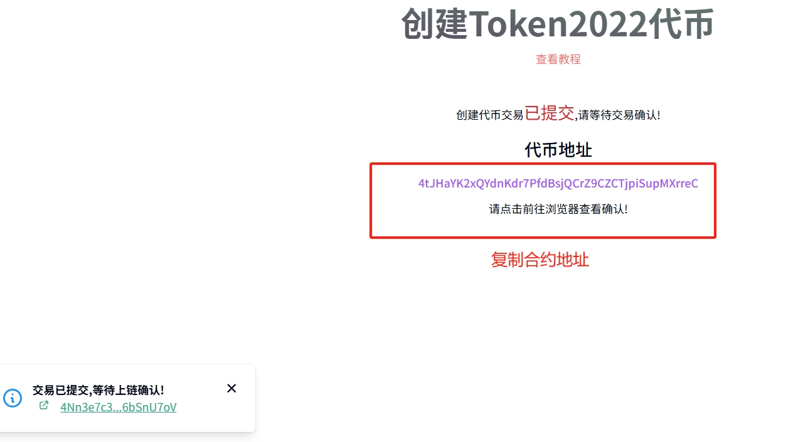<figcaption></figcaption></figure>

之后我们打开自己的Phantom钱包，应该也可以看到代币的logo。（注意，有时候Phantom钱包更新的比较慢，logo可能不显示，这时候你的代币可能会显示为`未知代币`，需要等待一段时间，几个小时\~几天差不多就能更新）

<figure>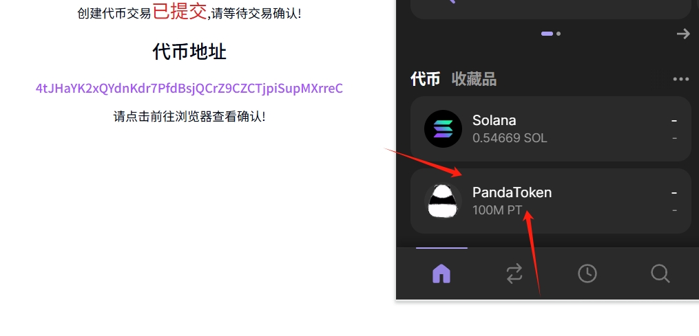<figcaption></figcaption></figure>

此时，代币就算是基本创建完成了，大家可以根据需求去做池子，然后就能交易了。

* Raydium创建资金池教程：[https://help.pandatool.org/sol/createpool](https://help.pandatool.org/sol/createpool)

### **6、税率测试**

代币创建成功后，怎么看出来税率是多少呢？我们转账的时候，钱包会提示您的转账税率，如下图所示

<figure>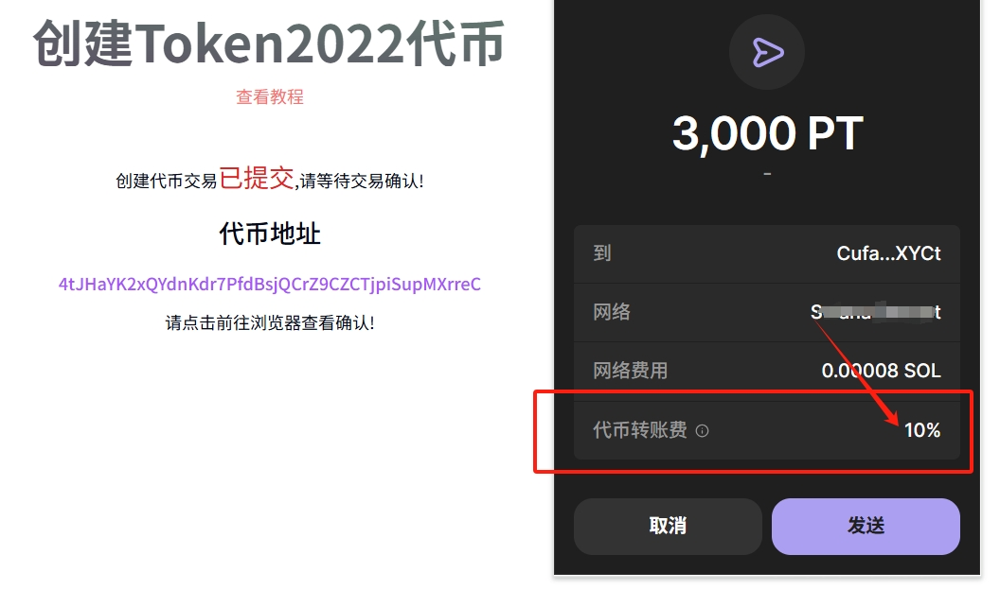<figcaption></figcaption></figure>

可以看到，我转账3000代币，转账费是10%，这就说明税率是创建成功了。

如果您想提前手续费，请前往该页面：[https://solana.pandatool.org/zh/taxClaim](https://solana.pandatool.org/zh/taxClaim)

## **疑问解答**

**1、手续费是交易的时候出，还是转账的时候出？**

* **答：**&#x8F6C;账和交易，都会产生手续费，且无法更改。Solana不像BSC那样，可以设置某些场景。

**2、手续费可以是USDT或者SOL吗？**

* **答：**&#x4E0D;行，Token2022标准的手续费，只能是本币（您创建的代币）

**3、创建代币的地址是白名单吗？转账或交易没有税费吗？**

* **答：**&#x53;olana代币没有白名单功能，所有地址转账与交易都会产生手续费，权限地址也不例外

**4、代币创建完成后，可以修改税率吗？**

* **答：**&#x6280;术上可以修改，但是我们目前还不支持，后续我们会推出更多的功能，包括修改税率功能

**5、我要去哪里使用权限，或者放弃权限呢？**

* **答：**&#x53EF;以在此处操作，输入代币合约地址即可完成：[https://solana.pandatool.org/control](https://solana.pandatool.org/control)

**6、手续费是发起转账的地址出，还是接收地址出？**

* **答：**&#x7528;户发起转账1000枚代币，假设10%的税率，接受者到账是900枚

如果您对Token2022代币还有什么问题，可以进入Telegram电报群找志愿者解答： [https://t.me/pandatool](https://t.me/pandatool)

