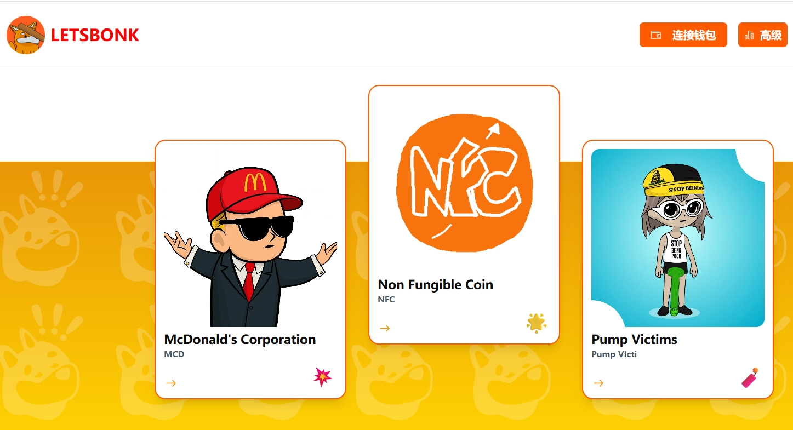
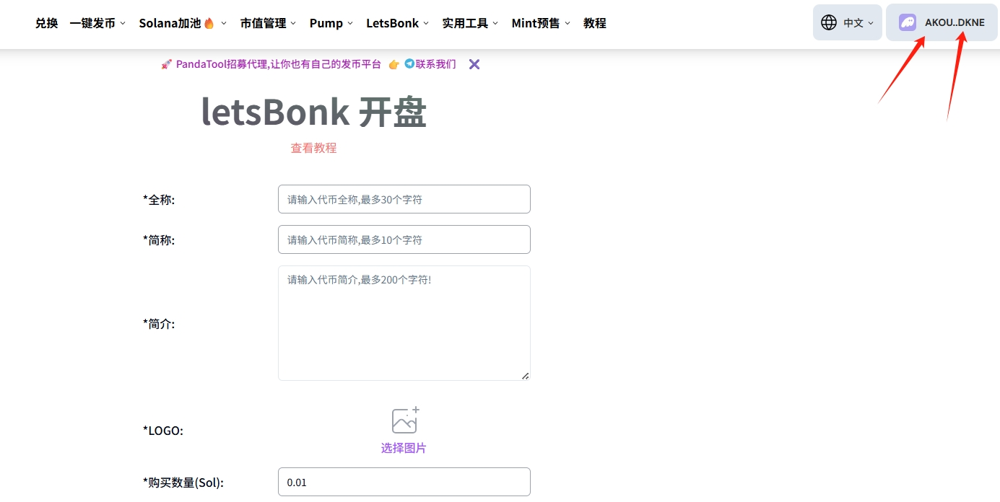
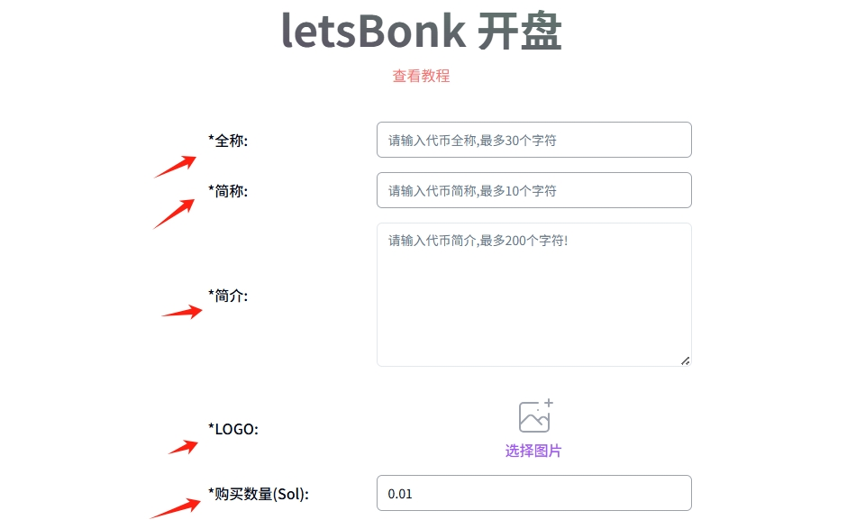
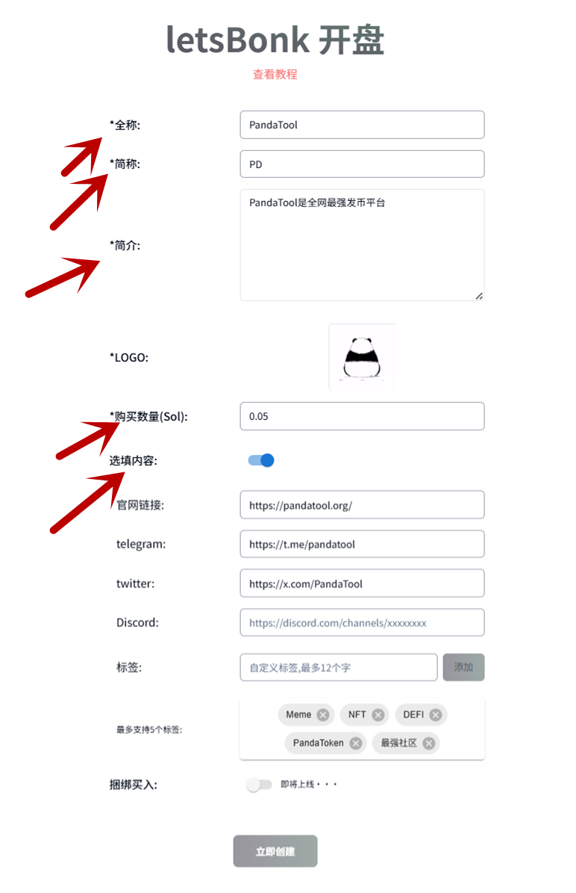

# BonkFun一键发币教程

BonkFun也叫LetsBonk，是继PumpFun之后，快速崛起的新型发射平台，其代币创建数量、交易数量已经远超PumpFun。凭借与 BONK 原生社群的紧密结合，BonkFun日常链上活动中高达 96.5% 属于有机交易，没有刻意操纵数据的痕迹，被认为更贴近社区真实需求

此外，和PumpFun相比，BonkFun的格局更大，会拿出更多的交易费用分配给社区治理，部分收益会回馈给 BONK 持有者和生态建设者，强化「社区即平台」的循环激励机制。

PandaTool开发的**BonkFun一键发币工具**，将帮助你在BonkFun实现代币创建与多地址买入

<figure><figcaption></figcaption></figure>

## BonkFun发币前提条件 

* 电脑发币之前，请先按照好Phantom钱包，安装教程➔ [https://help.pandatool.org/sol/phantom](https://help.pandatool.org/sol/phantom)
* 请打开梯子或加速器，以防止网络错误
* 手机发币也使用Phantom钱包或欧易web3钱包

## BonkFun发币指南 

1、打开PandaTool并连接钱包

2、填写代币的必填参数

3、填写代币的选填参数

4、立即创建

## BonkFun发币教程 

### **1、打开PandaTool并连接钱包**

首先，我们打开PandaTool的BonkFun发币页面：[https://solana.pandatool.org/zh/createbonk](https://solana.pandatool.org/zh/createbonk)  ，然后在右上角连接Phantom钱包插件

<figure><figcaption></figcaption></figure>

如果连接成功，右上角会出现钱包地址。如果连接失败，需要先下载好钱包插件才可以。Phantom钱包插件下载：[https://help.pandatool.org/sol/phantom](https://help.pandatool.org/sol/phantom)

<figure><figcaption></figcaption></figure>


如果您是使用手机发币，可以通过**OKX Web3钱包**或者**Phantom钱包**进行连接并创建代币


### **2、填写代币参数**

接下来，我们填写代币的基本参数信息：

<figure><figcaption></figcaption></figure>

* **全称：**&#x4EE3;币的名字，最多30个字符，支持中文、英文和中英混合
* **简称：**&#x4EE3;币的符号，最多10个字符，支持中文、英文和中英混合（纯汉字不能超过3个）
* **简介：**&#x4EE3;币基本信息介绍，最多200字
* **Logo：**&#x4EE3;币图标，支持jpg、png格式，最大1M
* **购买数量：**&#x53D1;币地址（dev）需要花多少sol购买代币，与发币同步执行，最少买入**0.01SOL，**&#x6700;多可以买入**70SOL**


**数量：**&#x9ED8;认为1000000000，无法修改

**精度：**&#x9ED8;认为6，无法修改


### **3、选填代币参数** 

接下里，可根据需要填写一些社交链接参数，像官网、电报群之类的。该内容可填可不填，且代币创建完成后不可修改

<figure><figcaption></figcaption></figure>

* **官网链接：**&#x60A8;的代币官网
* **Telegram：**&#x60A8;的代币电报群组链接
* **Twitter：**&#x60A8;的推特链接
* **Discord：**&#x60A8;的DC群链接
* **标签：**&#x7ED9;代币打标签，最多5个，最少0个

例如我填写的所有信息如下：

<figure><figcaption></figcaption></figure>

至此，如果您没有其他的需求，就可以点击“立即创建”了。然后等待10秒左右，钱包确认，这个币就可以发出来，在LetsBonk上线交易了。

<figure><figcaption></figcaption></figure>

## BonkFun发币疑问解答 

**1、为什么点击`立即创建`后没有反应？**

* **答：BonkFun**发币需要等待数据上链，大概等10秒钟，就会弹出钱包确认

**2、为什么交易构建失败？**

* **答：**&#x9700;要看一下钱包余额是否足够，钱包内的SOL余额必须大于买入金额

**3、BonkFun发币的数量是多少？精度是多少？**

* **答：**&#x6240;有在LetsBonk发的币，数量都是`10亿`，精度都是`9`

**4、BonkFun发币后，还能修改代币资料吗？**

* **答：BonkFun**发的币是没有任何权限的，不能`增发`、拉黑以及`修改`代币资料

**5、在PandaTool平台进行Bonk发币是怎么`收费`的？**

* **答：BonkFun**发币费用是0.051sol

**6、我发行的代币，合约地址尾号是bonk吗？**

* **答：**&#x662F;的，在PandaTool平台创建的LetsBonk代币，其合约地址尾号均为bonk

**7、BonkFun发币不需要加池子吗？**

* **答：**&#x4E0D;需要的，用户买入后会自动在**LetsBonk**形成一个联合曲线流动性，不需要手动添加

**8、BonkFun发币满足什么条件才能上Raydium？**

* **答：**&#x5F53;池子内打满85个SOL时，代币会自动发射到Raydiun

如果您还有其他任何问题，都可以进入Telegram电报群找志愿者解答： [https://t.me/pandatool](https://t.me/pandatool)
