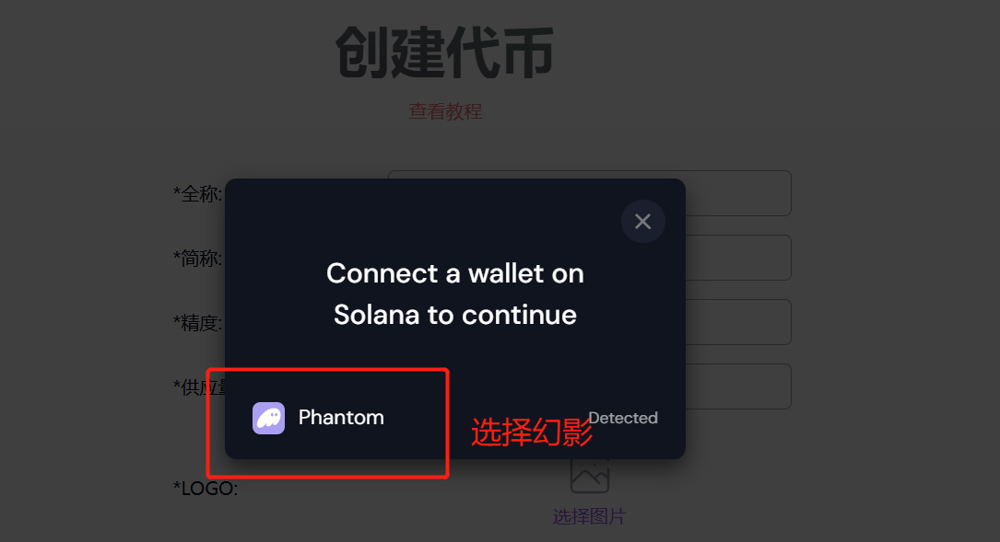
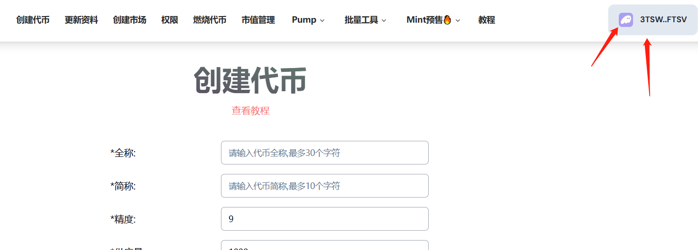
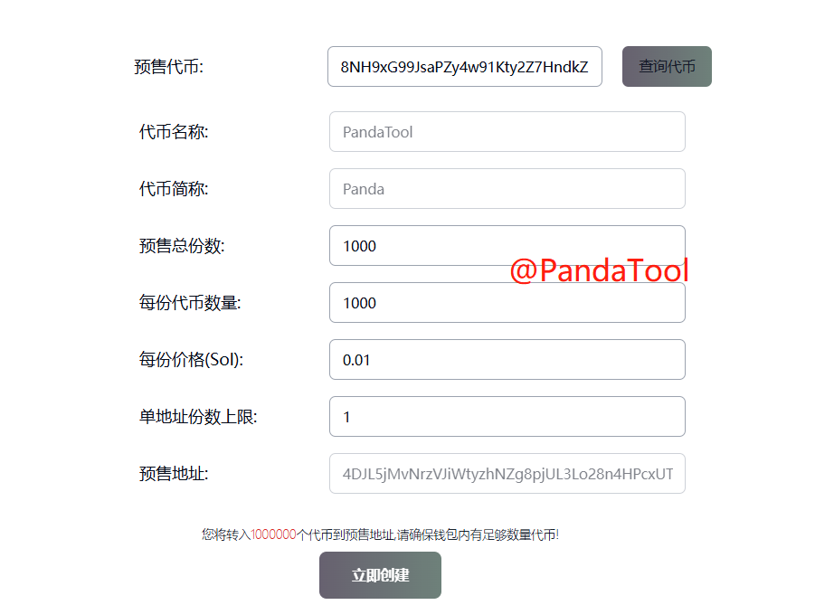
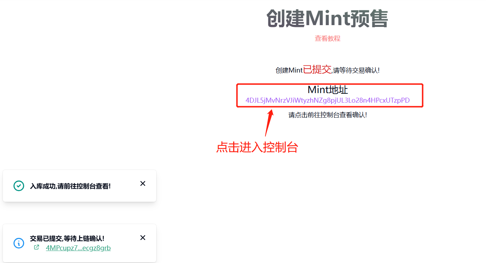
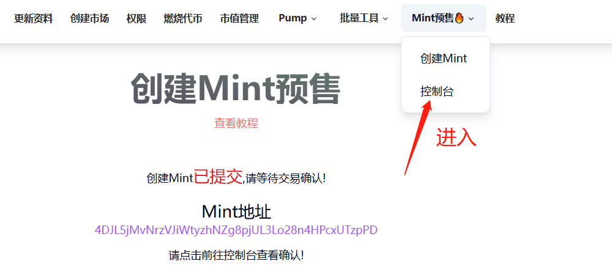
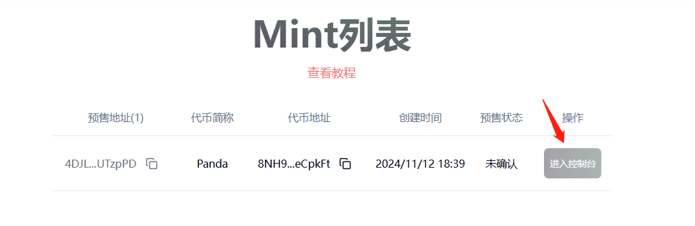
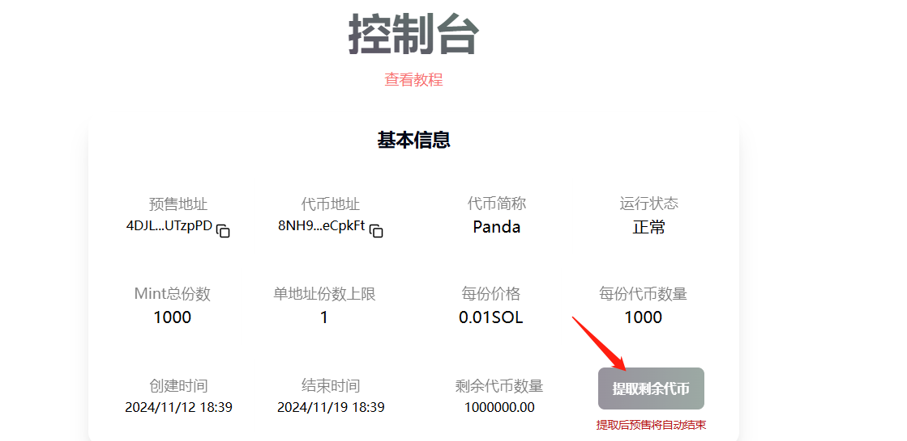

# Solana预售Mint教程

**怎么理解Solana预售Mint功能？**

在PandaTool平台创建一个预售地址后，用户将Sol转入该地址，即可自动获得预售代币。与此同时，创建预售的钱包地址也将自动收获预售的Sol。全程自动化运行，方便快捷

<figure><figcaption></figcaption></figure>

## 一、Solana预售功能说明 

* **无前端Mint：**采用转账Mint形式，不需要任何网页、前端，
* **转账即预售：**用户将Sol转到`预售地址`，就能**自动**获得代币
* **不用领取：**参与预售的用户**无需**手动领取代币
* **Sol即时到账：**用户支付的Sol预售金额也会很快进入创建者钱包地址
* **无软顶/硬顶：**没有软顶或者硬顶的概念，只有一个预售总数量（份数x每份数量）

## 二、注意事项说明(很重要) 

* 默认一次只能**Mint一份**，多了或少了都无效，且**Sol无法退回**
* 预售总份数、每份代币数量**不可修改**
* 请用户严格按照预售价格转账，多了或少了Sol**无法退回**
* 用户Mint超过次数上限后，多转入的Sol**无法退回**
* 如果转账后没有收到代币，可能是链上拥堵到账，请稍等**2分钟**看看


**！！！重要的事情说三遍：**不按照价格转账的，Sol**无法退回**

**！！！重要的事情说三遍：**单次转账超过一份的，Sol**无法退回**

**！！！重要的事情说三遍：**超过份数上限还要转账的，Sol**无法退回**


## **三、Mint预售创建教程** 

### **1、连接钱包（老手请忽略）**

我们打开Solana预售工具：[https://solana.pandatool.org/createMint](https://solana.pandatool.org/createMint)  ，点击右上角连接钱包按钮

<figure><figcaption>
连接钱包
</figcaption></figure>

在跳出来的提示中选择Phantom，然后点击连接

<figure><figcaption>
选择Phantom幻影钱包
</figcaption></figure>

<figure><figcaption>
右边点击连接
</figcaption></figure>

连接成功后，会看到右上角出现自己的钱包地址

<figure><figcaption></figcaption></figure>

接下来，我们进行预售的创建工作

### **2、填写预售参数(创建成功后不可修改)**

我们需要在预售页面按照要求填写相应的地址和参数，如下图所示

<figure><figcaption></figcaption></figure>

* [x] **预售代币：**填写预售代币的合约地址，并点击查询
* [x] **代币名称：**查询后可以显示
* [x] **代币简称：**查询后可以显示
* [x] **预售总份数：**一共可以预售多少份（每份数量x总份数≤代币发行总量）
* [x] **每份代币数量：**每份有多少个代币**（默认一次就是一份）**
* [x] **每份价格：**每份预售的代币需要多少Sol，最小0.01Sol
* [x] **单地址预售上限：** 每个地址可以参与多少次预售
* [x] **预售地址：**用来进行代币转账和Sol中转的地址


1、创建者将预售所需的代币转入预售地址

2、开启预售后，用户将Sol转入预售地址，预售地址会自动回转代币

3、预售地址将收到的Sol在扣除gas费后转入创建者地址


当我们确认自己钱包内的Sol和代币余额足够之后，点击立即创建。此时会弹出钱包进行确认，等待几秒钟，即可看到提示

<figure><figcaption></figcaption></figure>

如果钱包内的**代币数量**不够，创建预售可能失败。注意，此时还不能预售，需要进入控制台才行。

### **3、查看控制台**

当我们确认预售已经创建成功后，可点击紫色的地址，进入控制台，或者从菜单栏点击进入控制台

<figure><figcaption></figcaption></figure>

<figure><figcaption></figcaption></figure>

从上图可以看到，此时的预售状态是**未确认**的，我们需要点击控制台后，预售才会被确认，这一步确认状态是自动的。

进入控制台后，可以看到以下信息

<figure><figcaption></figcaption></figure>

这里面有几个值得注意的信息

* **运行状态：**显示为**正常**，说明此时你就可以开始预售了
* **结束时间：**预售的时间周期**默认是7天**，暂时不可修改
* **提取剩余代币：**如果你觉得预售已经差不多了，可以将预售地址内的剩余代币提走。注意，一次性需将所有预售代币提走，且提走后预售将自动结束

到了这一步，预售就算是创建完成了。接下来回答一些可能出现的问题

## **四、相关问答** 

1. **预售创建为什么失败？**
   * **答：**有三个原因，要么是Sol不够（钱包内sol≥0.4）、要么是预售代币数量超过钱包内的数量、要么是网络原因，需要切换梯子节点后刷新重试
2. **创建预售收费吗？收多少？**
   * **答：**目前创建预售会收取0.3sol的创建费，同时每个用户Mint一次，会从项目方手里扣除0.005sol的费用
3. 扣除的0.005sol具体是怎么收的？谁来收？
   * **答：**这个费用是项目方出的。假设Mint费用是0.1sol，当用户转账0.1sol之后，项目方会收到0.095sol（0.1-0.005）的预售费用。至于这0.005怎么使用了？主要是把币转给用户所支付的gas费与创建账户费用
4. **如何开始预售？如何结束预售？**
   * **答：**当创建完成后进入控制台，即可开始预售。当7天之后，预售立即结束。或者提取预售地址内的剩余代币，预售也会立马结束
5. **为什么用户转了Sol后没有收到代币？**
   * 答：有时候链上拥堵会导致转账延迟，可以等待**2分钟**后再看看
6. **创建者如何拿到预售的Sol？**
   * **答：**预售创建者的钱包会自动获得Sol，无需额外领取。用户每Mint一次，创建者钱包将获得一次Sol（扣除0.005之后的数量）
7. **某地址转错金额了怎么办？**
   * **答：**比较难办。用户必须严格按照预售价格进行转账，不可以多转、错转、少转，否则很难追回
8. **某地址在达到次数/份数上限后，仍然转入Sol，该怎么办？**
   * **答：**比较难办。地址达到上限后再转入，将无法被识别，其转入的Sol也很难追回
9. **预售的周期可以修改吗？**
   * 答：现在默认预售的周期默认是7天，暂时不支持修改。后面我们会优化这一功能，让大家可以创建不同周期的预售，以满足多样化需求
10. **预售价格、份数、数量可以修改吗？**
    * 答：不可以，一旦预售创建成功，将不支持任何形式的修改

如有不明白或者不清楚的地方，请加入官方电报群：[https://t.me/PandaTool](https://t.me/PandaTool)
