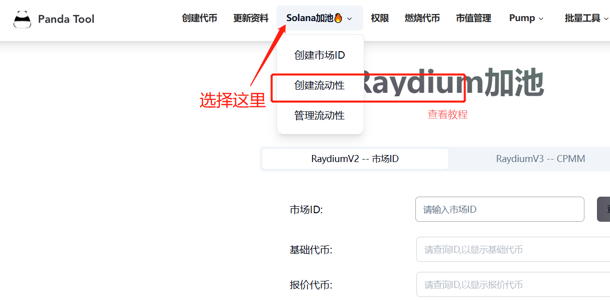
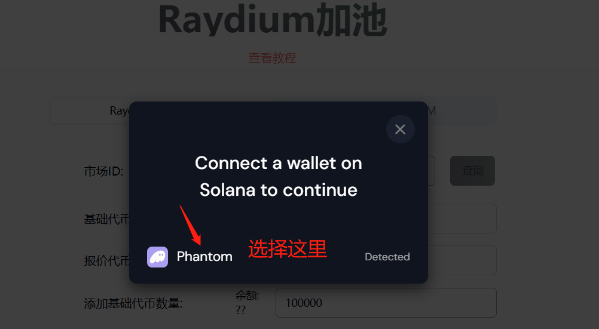
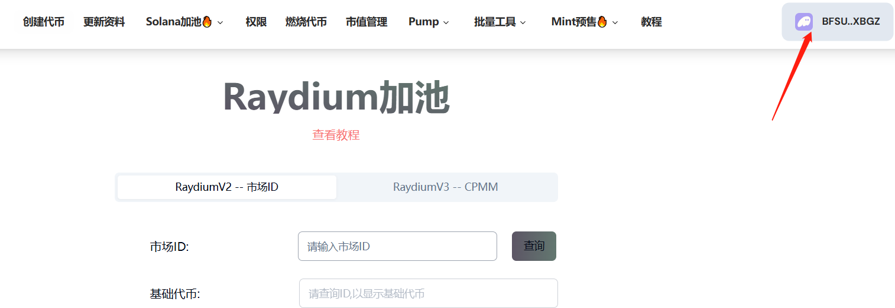
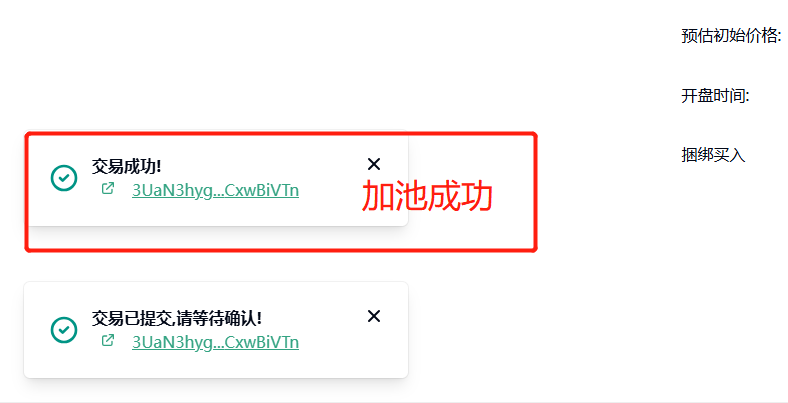
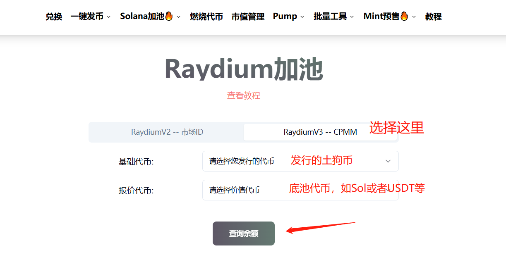
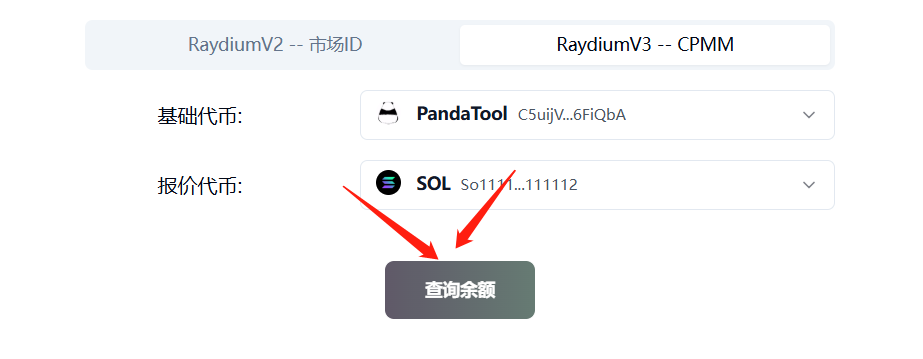
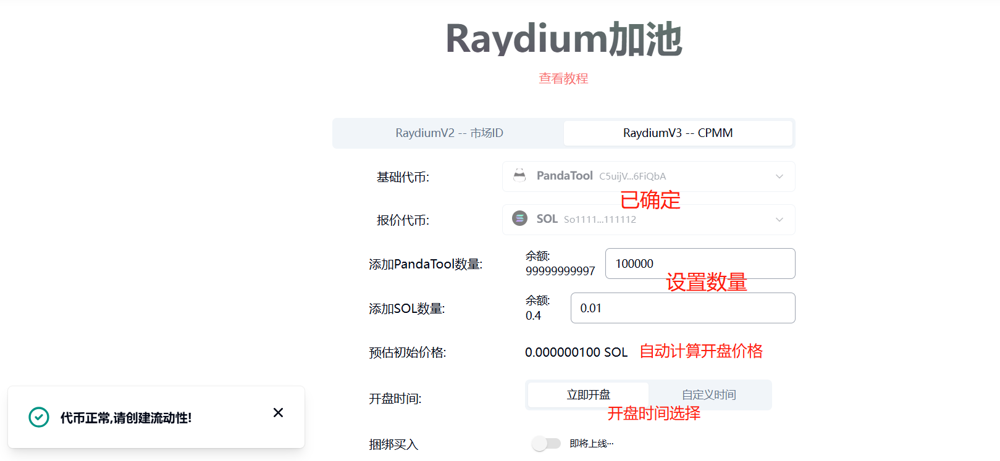
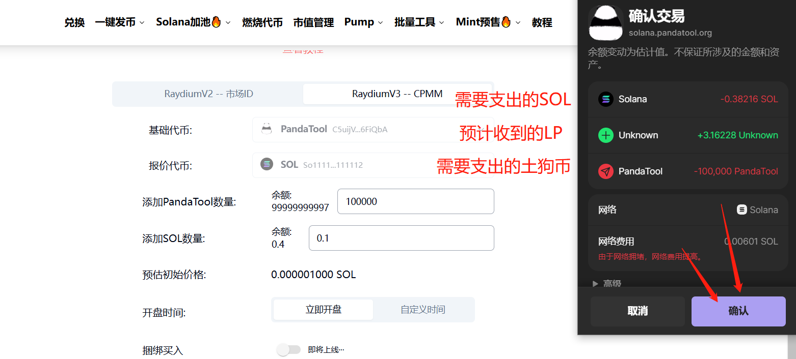
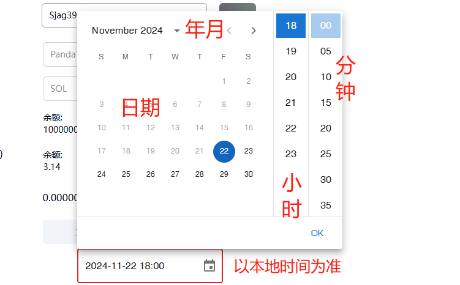

# Solana创建流动池教程

## 什么是Solana加池？

所谓加池，就是为你的Solana代币**创建流动性资金池**，其目的在于让用户可以交易。有了资金池，你创建的Solana代币才有价值，才可以进行兑换。

* **加池后：**&#x4EE3;币可以通过资金池进行兑换交易，不加池就只能转账
* **加池后：**&#x44;exscreener、Ave才能看到K线，不加池搜不到
* **加池后：**&#x4EE3;币才**有可能**显示价格，不加池一定没有

接下来，将详细给大家演示，如果进行Solana加池操作

* **加池前：**&#x5982;果是添加Raydium AMM的池子，请确保已经获得市场ID
* **加池前：**&#x53BB;掉入池的Sol之后，请确保钱包内额外有不少于0.6个sol
* **加池前：**&#x8BF7;确保已经安装了Phantom或OKX Web3钱包插件/软件

## Solana加池教程

### 1、连接钱包（老手忽略）

首先，我们通过链接打开[创建流动性](https://solana.pandatool.org/createpool)的页面：[https://solana.pandatool.org/createpool](https://solana.pandatool.org/createpool)  然后点击右上角连接钱包

<figure><figcaption></figcaption></figure>

或者通过[PandaTool官网](https://solana.pandatool.org/)的导航栏也能找到Solana加池页面：

<figure><figcaption>
创建流动性
</figcaption></figure>

点击连接钱包后，会跳出提示让你选择Phantom。注意，不管你是用OKX Web3钱包还是Phantom钱包，**都要选择Phantom**，它会自动匹配的。

<figure><figcaption>
OKX Web3也选择这个
</figcaption></figure>

钱包连接成功后，会看到自己的钱包地址

<figure><figcaption></figcaption></figure>

之后，我们可以选择创建Raydium AMM的池子或者Raydium CPMM的池子，两者的区别如下


**费用区别：**&#x4F20;统AMM创建池子的费用0.6sol左右，CPMM创建池子的费用0.3sol左右

**要求区别：**&#x41;MM要求有OpenBook市场ID，CPMM不需要

**稳定性区别：**&#x41;MM资金池久经考验，更为稳定。CPMM是新东西，不太稳定

**支持度区别：**&#x41;MM得到所有的交易bot、钱包的支持，但是支持CPMM的可能不多

**Token 2022：**&#x41;MM不支持Token 2022代币，CPMM支持Token 2022


### 2、创建Raydium AMM流动性教程

所谓的Raydium AMM，在合约概念里也叫AMM V4，是Raydium久经考验的流动性协议。除了贵以外，几乎没有缺点。接下来，详细给大家说明一下该如何AMM创建流动性.

首先，我们直接打开Raydium AMM[加池页面](https://solana.pandatool.org/createpool)，可以看到如下所示的参数

<figure><figcaption></figcaption></figure>

* **市场ID：**&#x5982;果您已经创建了市场ID，可以将ID直接填进去，然后点击**查询**。如果还没有创建市场ID，可以在此处创建→[https://solana.pandatool.org/market](https://solana.pandatool.org/market)
* **基础代币：**&#x5C31;是你发行的代币，即土狗币。无需选择，ID自动查询
* **报价代币：**&#x5C31;是价值代币，如Sol、USDT、USDC等。无需选择，ID自动查询
* **添加基础代币数量：**&#x4F60;打算往池子里放多少土狗币（数量没有要求）
* **添加报价代币数量：**&#x4F60;打算往池子里放多少价值币（数量没有要求）
* **预估初始价格：**&#x5047;如放100土狗币+100USDT，那么代币**初始开盘价**就是1U。假如放100土狗币+1SOL，那么初始开盘价就是0.01sol。按照Sol价格260U算，初始开盘价就是2.6U
* **开盘时间：**&#x7ACB;即开盘就是加池即刻开始交易；**自定义时间**就是自己确定一个开盘时间（该时间根据您个人的当地时区来确定。如果您在新加坡，那就是新加坡时区【UTC+8】。如果您在迪拜，那就是迪拜时区【UTC+4】）
* 捆绑买入：该功能支持开盘立即买入（即将上线）

根据以上对各类参数的解释，我填写的信息如下：

<figure><figcaption></figcaption></figure>

确认好信息无误之后，我们点击**立即创建**按钮，此时会跳出钱包进行确认（如果提示您金额太大，可能是因为Sol余额不够导致的）

<figure><figcaption></figcaption></figure>

等待几秒钟后，前端页面会提示你交易成功，这就说明池子加成功了。

<figure><figcaption></figcaption></figure>


如果提示你加池失败了，也不要慌。先看下钱包是不是扣款了，如果扣款了，说明加池已经成功了，是提示错误。如果没有扣款，那就需要刷新页面后重试一下


至此，整个Raydium AMM流动性资金池就创建完成了，接下来可以去[Raydium](https://raydium.io/swap/)进行交易了。

### 3、创建Raydium CPMM流动性教程

正如前面的教程所述，采用CPMM的资金池，更为便利，也更加便宜。接下来，给大家详细阐述一下CPMM资金池的创建流程

首先，我们打开[流动性创建](https://solana.pandatool.org/createpool)工具，选择Raydium CPMM

<figure><figcaption></figcaption></figure>

选择代币后，点击查询余额，如下图所示

<figure><figcaption></figcaption></figure>

之后需要您填写加入池子内的代币数量，以及其他一些参数

<figure><figcaption></figcaption></figure>

* **基础代币：**&#x5C31;是你发行的代币，即土狗币，已自动选择
* **报价代币：**&#x5C31;是价值代币，如Sol、USDT、USDC等，已自动选择
* **添加基础代币数量：**&#x4F60;打算往池子里放多少土狗币（数量没有要求）
* **添加报价代币数量：**&#x4F60;打算往池子里放多少价值币（数量没有要求）
* **预估初始价格：**&#x5047;如放100土狗币+100USDT，那么代币**初始开盘价**就是1U。假如放100土狗币+1SOL，那么初始开盘价就是0.01sol。按照Sol价格260U算，初始开盘价就是2.6U
* **开盘时间：**&#x7ACB;即开盘就是加池即刻开始交易；**自定义时间**就是自己确定一个开盘时间（该时间根据您个人的当地时区来确定。如果您在新加坡，那就是新加坡时区【UTC+8】。如果您在迪拜，那就是迪拜时区【UTC+4】）

确认好信息无误之后，我们点击**立即创建**按钮，此时会跳出钱包进行确认

<figure><figcaption></figcaption></figure>

钱包确认后，即可完成加池操作。


如果点击**立即创建**后不弹出钱包，请检测一下网络是否正确


## Solana加池疑问

**1、自定义开盘时间看不懂怎么办？**

* **答：**&#x81EA;定义开盘时间依次排序为：日期→小时→分钟 （以你操作的当地时间为准）

<figure><figcaption></figcaption></figure>

**2、创建流动性需要收费吗？怎么收的？**

* 答：创建流动性，平台收取0.09sol。此外，Raydium收费标准是：AMM收取0.46sol，CPMM收取0.2sol。

如何您还有其他问题，都可以进入Telegram电报群找志愿者解答： [https://t.me/pandatool](https://t.me/pandatool)
